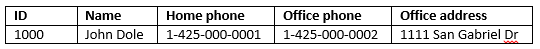

# Quickstart: Query Apache HBase in Azure HDInsight with HBase Shell

In this quickstart, you learn how to use Apache HBase Shell to create an HBase table, insert data, and then query the table.

If you don't have an Azure subscription, create a [free account](https://azure.microsoft.com/free/?WT.mc_id=A261C142F) before you begin.

## Prerequisites

* An Apache HBase cluster. See [Create cluster](../hadoop/apache-hadoop-linux-tutorial-get-started.md#create-cluster) to create an HDInsight cluster.  Ensure you choose the **HBase** cluster type.

* An SSH client. For more information, see [Connect to HDInsight (Apache Hadoop) using SSH](../hdinsight-hadoop-linux-use-ssh-unix.md).

## Create a table and manipulate data

For most people, data appears in the tabular format:



In HBase (an implementation of [Cloud BigTable](https://cloud.google.com/bigtable/)), the same data looks like:


You can use SSH to connect to HBase clusters, and then use Apache HBase Shell to create HBase tables, insert data, and query data.

1. Use `ssh` command to connect to your HBase cluster. Edit the command below by replacing `CLUSTERNAME` with the name of your cluster, and then enter the command:

    ```cmd
    ssh sshuser@CLUSTERNAME-ssh.azurehdinsight.net
    ```

2. Use `hbase shell` command to start the HBase interactive shell. Enter the following command in your SSH connection:

    ```bash
    hbase shell
    ```

3. Use `create` command to create an HBase table with two-column families. Enter the following command:

    ```hbase
    create 'Contacts', 'Personal', 'Office'
    ```

4. Use `list` command to list all tables in HBase. Enter the following command:

    ```hbase
    list
    ```

5. Use `put` command to insert values at a specified column in a specified row in a particular table. Enter the following command:

    ```hbase
    put 'Contacts', '1000', 'Personal:Name', 'John Dole'
    put 'Contacts', '1000', 'Personal:Phone', '1-425-000-0001'
    put 'Contacts', '1000', 'Office:Phone', '1-425-000-0002'
    put 'Contacts', '1000', 'Office:Address', '1111 San Gabriel Dr.'
    ```

6. Use `scan` command to scan and return the `Contacts` table data. Enter the following command:

    ```hbase
    scan 'Contacts'
    ```

7. Use `get` command to fetch contents of a row. Enter the following command:

    ```hbase
    get 'Contacts', '1000'
    ```

    You see similar results as using the `scan` command because there is only one row.

8. Use `delete` command to delete a cell value in a table. Enter the following command:

    ```hbase
    delete 'Contacts', '1000', 'Office:Address'
    ```

9. Use `disable` command to disable the table. Enter the following command:

    ```hbase
    disable 'Contacts'
    ```

10. Use `drop` command to drop a table from HBase. Enter the following command:

    ```hbase
    drop 'Contacts'
    ```

11. Use `exit` command to stop the HBase interactive shell. Enter the following command:

    ```hbase
    exit
    ```

For more information about the HBase table schema, see [Introduction to Apache HBase Schema Design](http://0b4af6cdc2f0c5998459-c0245c5c937c5dedcca3f1764ecc9b2f.r43.cf2.rackcdn.com/9353-login1210_khurana.pdf). For more HBase commands, see [Apache HBase reference guide](https://hbase.apache.org/book.html#quickstart).

## Clean up resources

After you complete the quickstart, you may want to delete the cluster. With HDInsight, your data is stored in Azure Storage, so you can safely delete a cluster when it is not in use. You are also charged for an HDInsight cluster, even when it is not in use. Since the charges for the cluster are many times more than the charges for storage, it makes economic sense to delete clusters when they are not in use.

To delete a cluster, see [Delete an HDInsight cluster using your browser, PowerShell, or the Azure CLI](../hdinsight-delete-cluster.md).

## Next steps

In this quickstart, you learned how to use Apache HBase Shell to create an HBase table, insert data, and then query the table. To learn more about data stored in HBase, the next article will show you how to execute queries with Apache Spark.

> [!div class="nextstepaction"]
> [Use Apache Spark to read and write Apache HBase data](../hdinsight-using-spark-query-hbase.md)