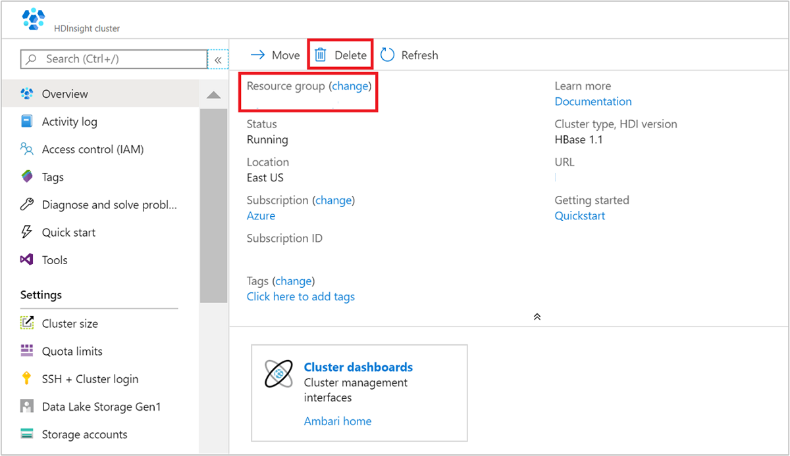

# Quickstart: Create Apache HBase cluster in Azure HDInsight using ARM template

In this quickstart, you use an Azure Resource Manager template (ARM template) to create an [Apache HBase](./apache-hbase-overview.md) cluster in Azure HDInsight. HBase is an open-source, NoSQL database that is built on Apache Hadoop and modeled after [Google BigTable](https://cloud.google.com/bigtable/).

[!INCLUDE [About Azure Resource Manager](../../../includes/resource-manager-quickstart-introduction.md)]

If your environment meets the prerequisites and you're familiar with using ARM templates, select the **Deploy to Azure** button. The template will open in the Azure portal.

[:::image type="icon" source="../../media/template-deployments/deploy-to-azure.svg" alt-text="Deploy to Azure":::](https://portal.azure.com/#create/Microsoft.Template/uri/https%3A%2F%2Fraw.githubusercontent.com%2FAzure%2Fazure-quickstart-templates%2Fmaster%2Fquickstarts%2Fmicrosoft.hdinsight%2Fhdinsight-hbase-linux%2Fazuredeploy.json)

## Prerequisites

If you don't have an Azure subscription, create a [free account](https://azure.microsoft.com/free/?WT.mc_id=A261C142F) before you begin.

## Review the template

The template used in this quickstart is from [Azure Quickstart Templates](https://azure.microsoft.com/resources/templates/hdinsight-hbase-linux/).

:::code language="json" source="~/quickstart-templates/quickstarts/microsoft.hdinsight/hdinsight-hbase-linux/azuredeploy.json":::

Two Azure resources are defined in the template:

* [Microsoft.Storage/storageAccounts](/azure/templates/microsoft.storage/storageaccounts): create an Azure Storage Account.
* [Microsoft.HDInsight/cluster](/azure/templates/microsoft.hdinsight/clusters): create an HDInsight cluster.

## Deploy the template

1. Select the **Deploy to Azure** button below to sign in to Azure and open the ARM template.

    [:::image type="icon" source="../../media/template-deployments/deploy-to-azure.svg" alt-text="Deploy to Azure":::](https://portal.azure.com/#create/Microsoft.Template/uri/https%3A%2F%2Fraw.githubusercontent.com%2FAzure%2Fazure-quickstart-templates%2Fmaster%2Fquickstarts%2Fmicrosoft.hdinsight%2Fhdinsight-hbase-linux%2Fazuredeploy.json)

1. Enter or select the following values:

    |Property |Description |
    |---|---|
    |Subscription|From the drop-down list, select the Azure subscription that's used for the cluster.|
    |Resource group|From the drop-down list, select your existing resource group, or select **Create new**.|
    |Location|The value will autopopulate with the location used for the resource group.|
    |Cluster Name|Enter a globally unique name. For this template, use only lowercase letters, and numbers.|
    |Cluster Login User Name|Provide the username, default is `admin`.|
    |Cluster Login Password|Provide a password. The password must be at least 10 characters in length and must contain at least one digit, one uppercase, and one lower case letter, one non-alphanumeric character (except characters ```' ` "```). |
    |Ssh User Name|Provide the username, default is `sshuser`.|
    |Ssh Password|Provide the password.|

    :::image type="content" source="./media/quickstart-resource-manager-template/resource-manager-template-hbase.png" alt-text="Deploy Resource Manager template HBase" border="true":::

1. Review the **TERMS AND CONDITIONS**. Then select **I agree to the terms and conditions stated above**, then **Purchase**. You'll receive a notification that your deployment is in progress. It takes about 20 minutes to create a cluster.


## Review deployed resources

Once the cluster is created, you'll receive a **Deployment succeeded** notification with a **Go to resource** link. Your Resource group page will list your new HDInsight cluster and the default storage associated with the cluster. Each cluster has an [Azure Blob Storage](../hdinsight-hadoop-use-blob-storage.md) account, an [Azure Data Lake Storage Gen1](../hdinsight-hadoop-use-data-lake-storage-gen1.md), or an  [`Azure Data Lake Storage Gen2`](../hdinsight-hadoop-use-data-lake-storage-gen2.md) dependency. It's referred as the default storage account. The HDInsight cluster and its default storage account must be colocated in the same Azure region. Deleting clusters doesn't delete the storage account.

## Clean up resources

After you complete the quickstart, you may want to delete the cluster. With HDInsight, your data is stored in Azure Storage, so you can safely delete a cluster when it isn't in use. You're also charged for an HDInsight cluster, even when it isn't in use. Since the charges for the cluster are many times more than the charges for storage, it makes economic sense to delete clusters when they aren't in use.

From the Azure portal, navigate to your cluster, and select **Delete**.



You can also select the resource group name to open the resource group page, and then select **Delete resource group**. By deleting the resource group, you delete both the HDInsight cluster, and the default storage account.

## Next steps

In this quickstart, you learned how to create an Apache HBase cluster in HDInsight using an ARM template. In the next article, you learn how to query HBase in HDInsight with HBase Shell.

> [!div class="nextstepaction"]
> [Query Apache HBase in Azure HDInsight with HBase Shell](./query-hbase-with-hbase-shell.md)
