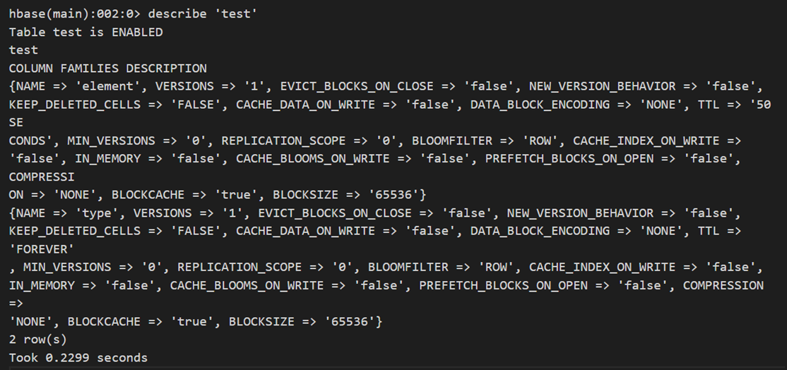
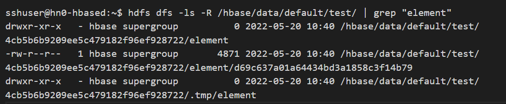
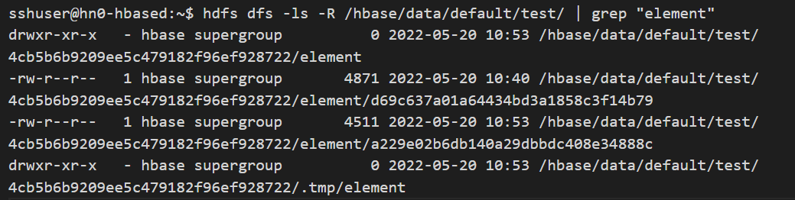
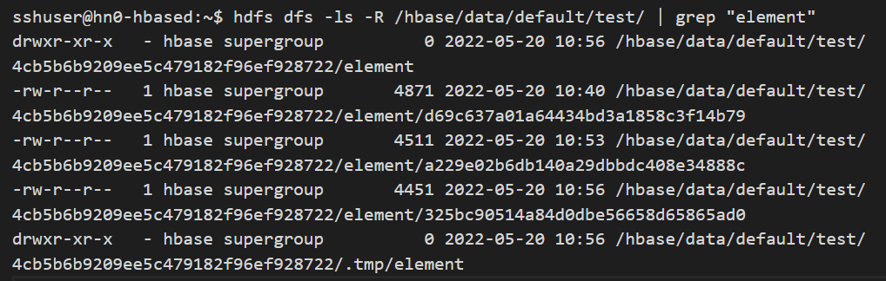
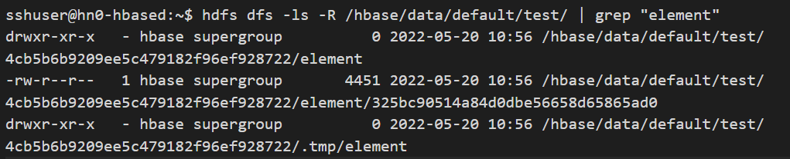

# Troubleshoot data retention (TTL) issues with expired data not being deleted from storage on Azure HDInsight

In HBase cluster, you may decide that you would like to remove data after it ages either to free some storage and save on costs as the older data is no longer needed, either to comply with regulations. When that is needed, you need to set TTL in a table at the ColumnFamily level to expire and automatically delete older data. While TTL can be set as well at cell level, setting it at ColumnFamily level is usually a more convenient option because the ease of administration and because a cell TTL (expressed in ms) can't extend the effective lifetime of a cell beyond a ColumnFamily level TTL setting (expressed in seconds), so only required shorter retention times at cell level could benefit from setting cell level TTL. 

Despite setting TTL, you may notice sometimes that you don't obtain the desired effect, i.e. some data hasn't expired and/or storage size hasn't decreased.

## Prerequisites

Follow the steps and given commands, open two ssh connections to HBase cluster:

* In one of, the ssh sessions keep the default bash shell.

* In the second ssh session launch HBase shell by running, the following command.

  ```
  hbase shell
  ```

### Check if desired TTL is configured and if expired data is removed from query result

Follow the steps given to understand where is the issue. Start by checking if the behavior occurs for a specific table or for all the tables. If you're unsure whether the issue impacts all the tables or a specific table, just consider as example a specific table name for the start. 

1. Check first that TTL has been configured for ColumnFamily for the target tables. Run following command in the ssh session where you launched HBase shell and observe example and output below. One column family has TTL set to 50 seconds, the other ColumnFamily has no value configured for TTL, thus it appears as "FOREVER" (data in this column family isn't configured to expire).

   ```
   describe 'table_name'
   ```

   

1. If not configured, default TTL is set to 'FOREVER.' There are two possibilities why data is not expired as expected and removed from query result.

   1. If TTL has any other value, then 'FOREVER', observe the value for column family and note down the value in seconds(pay special attention to value correlated with the unit measure as cell TTL is in ms, but column family TTL is in seconds) to confirm if it is the expected one. If the observed value isn't correct, fix that first.
   1. If TTL value is 'FOREVER' for all column families, configure TTL as first step and afterwards monitor if data is expired as expected.

1. If you establish that TTL is configured and has the correct value for the ColumnFamily, next step is to confirm that the expired data no longer shows up when doing table scans. When data expires, it should be removed and not show up in the scan table results. Run the below command in HBase shell to check.

   ```	
   scan 'table_name'
   ```

### Check the number and size of StoreFiles per table per region to observe if any changes are visible after the compaction operation

1. Before moving to next step, from ssh session with bash shell, run the following command to check the current number of StoreFiles and size for each StoreFile currently showing up for the ColumnFamily for which the TTL has been configured. Note first the table and ColumnFamily for which you are doing the check, then run the following command in ssh session (bash).

   ```
   hdfs dfs -ls -R /hbase/data/default/table_name/ | grep "column_family_name"
   ```

   

1. Likely, there are more results shown in the output, one result for each region ID that is part of the table and between 0 and more results for StoreFiles present under each region name, for the selected ColumnFamily. To count the overall number of rows in the result output above, run the following command.

   ```
   hdfs dfs -ls -R /hbase/data/default/table_name/ | grep "column_family_name" | wc -l
   ```

### Check the number and size of StoreFiles per table per region after flush

1. Based on the TTL configured for each ColumnFamily and how much data is written in the table for the target ColumnFamily, part of the data may still exist in MemStore and isn't written as StoreFile to storage. Thus, to make sure that the data is written to storage as StoreFile, before the maximum configured MemStore size is reached, you can run the following command in HBase shell to write data from MemStore to StoreFile immediately. 

   ```
   flush 'table_name'
   ```

1. Observe the result by running again in  bash shell the command.

   ```
   hdfs dfs -ls -R /hbase/data/default/table_name/ | grep "column_family_name"
   ```

1. An additional store file is created compared to previous result output for each region where data is modified, the StoreFile includes current content of MemStore for that region.

   

### Check the number and size of StoreFiles per table per region after major compaction

1. At this point, the data from MemStore has been written to StoreFile, in storage, but expired data may still exist in one or more of the current StoreFiles. Although minor compactions can help delete some of the expired entries, it is not guaranteed that it removes all of them as minor compaction. It will not select all the StoreFiles for compaction, while major compaction will select all the StoreFiles for compaction in that region. 

      Also, there's another situation when minor compaction may not remove cells with TTL expired. There's a property named MIN_VERSIONS and it defaults to 0 only (see in the above output from describe 'table_name' the property MIN_VERSIONS=>'0'). If this property is set to 0, the minor compaction will remove the cells with TTL expired. If this value is greater than 0, minor compaction may not remove the cells with TTL expired even if it touches the corresponding file as part of compaction. This property configures the min number of versions of a cell to keep, even if those versions have TTL expired.

1. To make sure expired data is also deleted from storage, we need to run a major compaction operation. The major compaction operation, when completed, will leave behind a single StoreFile per region. In HBase shell, run the command to execute a major compaction operation on the table:

   ```
   major_compact 'table_name'
   ```

1. Depending on the table size, major compaction operation can take some time. Use following command in HBase shell to monitor progress. If the compaction is still running when you execute the following command, you get the output as "MAJOR", but if the compaction is completed, you get the as output "NONE."

   ```
   compaction_state 'table_name'
   ```

1. When the compaction status appears as "NONE" in hbase shell, if you switch quickly to bash and run command.

   ```
   hdfs dfs -ls -R /hbase/data/default/table_name/ | grep "column_family_name"
   ```

1. You will notice that an extra StoreFile has been created in addition to previous ones per region per ColumnFamily and after several moments only the last created StoreFile is kept per region per column family.

   

For the example region above, once the extra moments elapse, we can notice that one single StoreFile remained and the size occupied by this file on the storage is reduced as major compaction occurred and at this point any expired data that has not been deleted before(by another major compaction), will be deleted after running current major compaction operation.



> [!NOTE]
> For this troubleshooting exercise we triggered the major compaction manually. But in practice, doing that manually for many tables might be time consuming. By default, major compaction is disabled on HDInsight cluster. The main reason for keeping major compaction disabled by default is because the performance of the table operations is impacted when a major compaction is in progress. However, you can enable major compaction by configuring the value for the property hbase.hregion.majorcompaction in ms or can use a cron tab job or another external system to schedule compaction at a time convenient for you, with lower workload.

## Next steps

If you didn't see your problem or are unable to solve your issue, visit one of the following channels for more support:

* Get answers from Azure experts through [Azure Community Support](https://azure.microsoft.com/support/community/).

* Connect with [@AzureSupport](https://twitter.com/azuresupport) - the official Microsoft Azure account for improving customer experience. Connecting the Azure community to the right resources: `answers`, `support`, and `experts`.

* If you need more help, you can submit a support request from the [Azure portal](https://portal.azure.com/?#blade/Microsoft_Azure_Support/HelpAndSupportBlade/). Select **Support** from the menu bar or open the **Help + support** hub. For more detailed information, review [How to create an Azure support request](../../azure-portal/supportability/how-to-create-azure-support-request.md). Access to Subscription Management and billing support is included with your Microsoft Azure subscription, and Technical Support is provided through one of the [Azure Support Plans](https://azure.microsoft.com/support/plans/).
