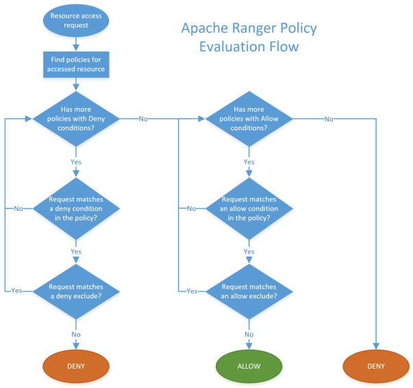
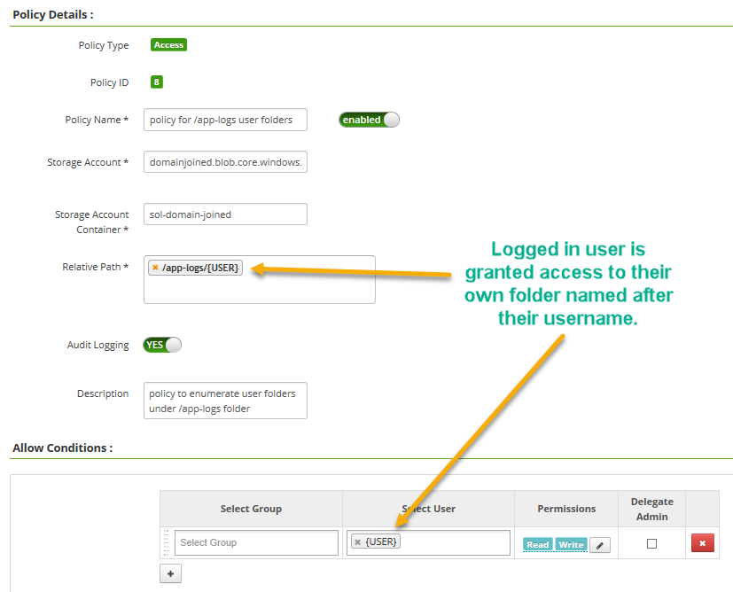
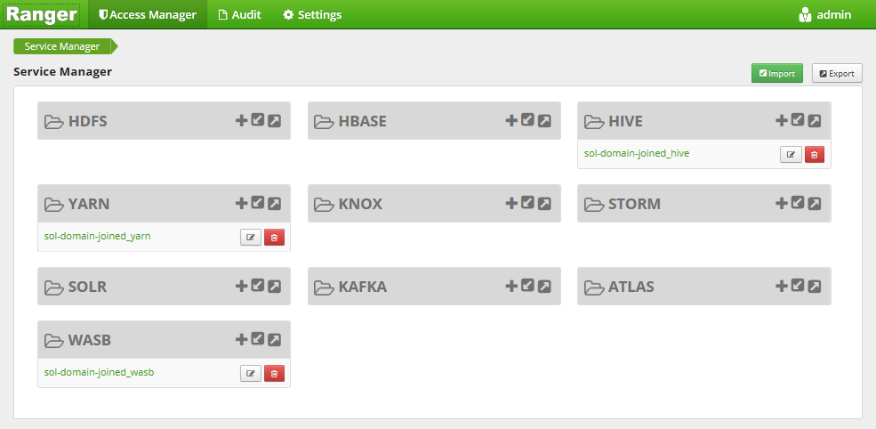
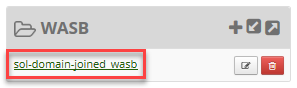
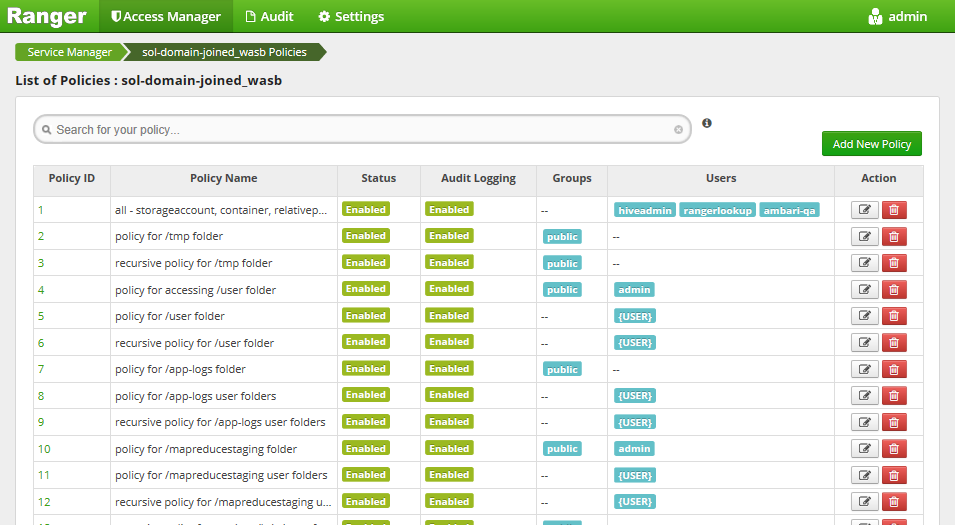
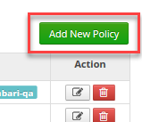
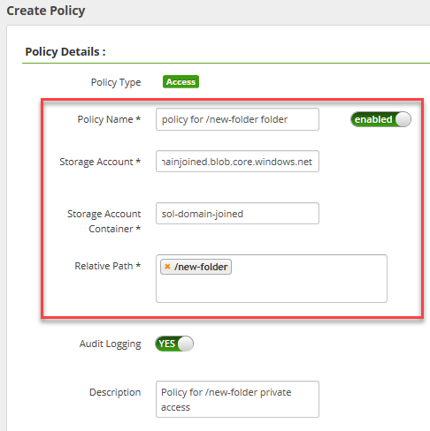
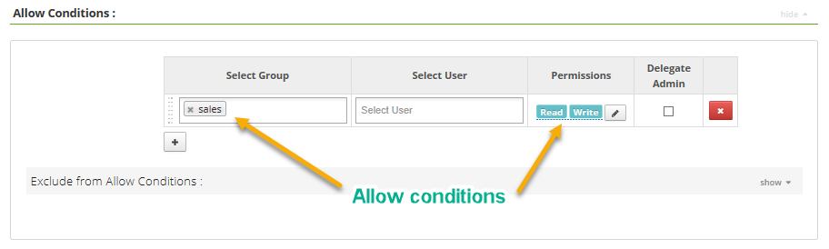
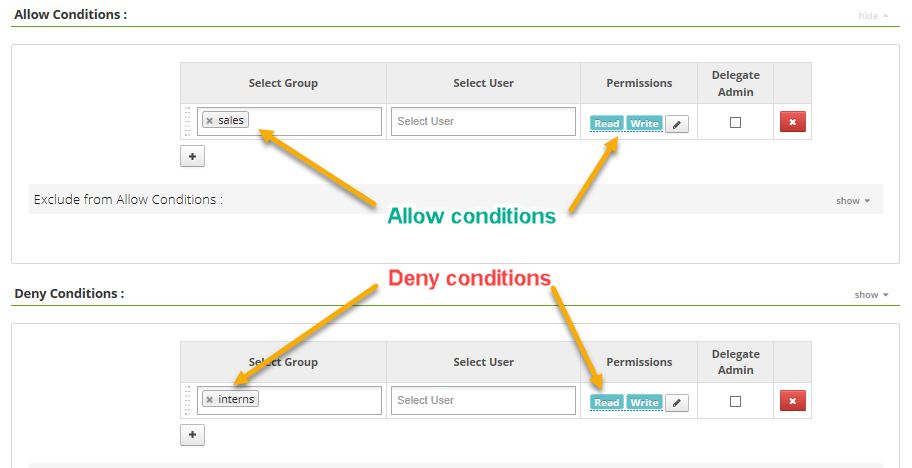
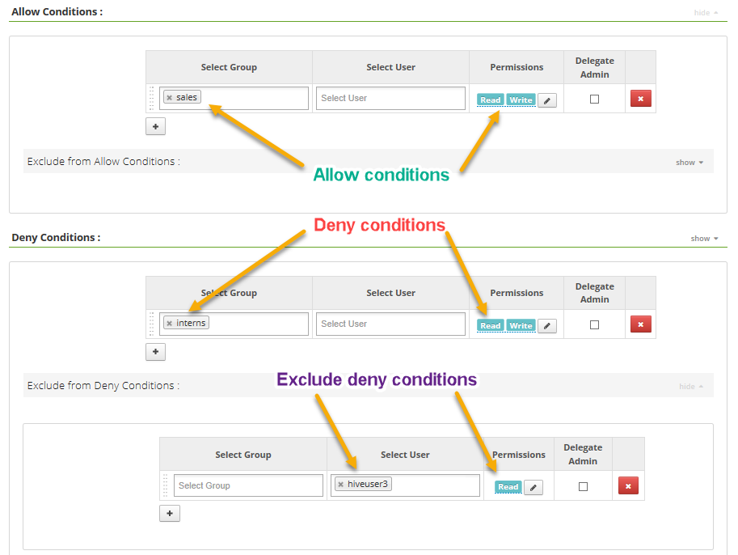

# Manage user permissions at the file and folder levels

[Domain-joined HDInsight clusters](hdinsight-domain-joined-introduction.md) use strong authentication with Azure Active Directory (Azure AD) users, and also *role-based access control* (RBAC) policies for various services, such as YARN and Hive. If your default data store for your cluster is Azure Storage, or Windows Azure Storage Blobs (WASB), you can also enforce file and folder-level permissions. You can use Apache Ranger to control access to the cluster's files for your synchronized Azure AD users and groups.
<!-- [synchronized Azure AD users and groups](hdinsight-sync-aad-users-to-cluster.md). -->

The Apache Ranger instance for HDInsight domain-joined clusters comes preconfigured with the Ranger-WASB service. The Ranger-WASB service is a policy management engine that is similar to Ranger-HDFS, but with a different enforcement of Ranger's access policies. In the Ranger-WASB service, if an incoming resource request does not have a matching Ranger policy, the default response is DENY. The Ranger service does not pass on permission checking to WASB.

## Permission and policy model

Resource access requests are evaluated using the following flow:



DENY rules are evaluated first, followed by ALLOW rules. At the end of matching, if no policies are matched, a DENY is returned.

### USER variable

You can use the `{USER}` variable when assigning policies for a user to access a `/{username}` subdirectory, for example:

```
resource: path=/app-logs/{USER}, user: {USER}, recursive=true, permissions: all, delegateAdmin=true
```

The above policy grants users access to their own subfolder underneath the `/app-logs/` directory. Here is what this policy looks like in the Ranger user interface:



### Policy model examples

The following table lists a few examples of how the policy model works:

| Ranger Policy | Existing File System | User-request | Result |
| -- | -- | -- | -- |
| /data/finance/, bob, WRITE | /data | bob, Create file /data/finance/mydatafile.txt | ALLOW - Intermediate folder ‘finance’ is created, because of ancestor check |
| /data/finance/, bob, WRITE | /data | alice, Create file /data/finance/mydatafile.txt | DENY - No matching policy |
| /data/finance*, bob, WRITE | /data | bob, Create file /data/finance/mydatafile.txt | ALLOW - In this case the optional recursive policy (`*`) is present; see [Wildcards](#wildcards) |
| /data/finance/mydatafile.txt, bob, WRITE | /data | bob, Create file /data/finance/mydatafile.txt | DENY - Ancestor check on '/data' fails because there is no policy |
| /data/finance/mydatafile.txt, bob, WRITE | /data/finance | bob, Create file /data/finance/mydatafile.txt | DENY - No policy for ancestor check on '/data/finance' |

Permissions are required at the folder level or at the file level, based on the type of operation. For example, a "read/open" call requires read access at the file level, while a "create" call requires permissions at the ancestor folder level.

### Wildcards (*)

When a wildcard (`*`) is present in the path for a policy, the wildcard applies to that path and its entire subtree. This recursion is the same as using a `recurse-flag`. In Ranger-WASB, the wildcard indicates both recursion and partial name matching.

## Manage file and folder-level permissions with Apache Ranger

If you have not already done so, follow [these instructions](hdinsight-domain-joined-configure.md) to provision a new domain-joined cluster.

Open Ranger-WASB by browsing to `https://<YOUR CLUSTER NAME>.azurehdinsight.net/ranger/`. Enter the cluster administrator username and password that you defined when creating your cluster.

After signing in, you see the Ranger dashboard:



To view current file and folder permissions for your cluster's associated Azure Storage account, click the ***CLUSTERNAME*_wasb** link in the WASB control box.



The current policy list is displayed. Several typical policies are included as a starting point - check the details of each policy to see example usages.

For each policy, you can see whether the policy is enabled, whether audit logging is configured, and any assigned groups and users. There are two action buttons for each policy: Edit and Delete.



### Adding a new policy

1. On the top right of the WASB policies page, select **Add New Policy**.

    

2. Enter a descriptive **Policy Name**. Specify the Azure **Storage Account** for your cluster (*ACCOUNT_NAME*.blob.core.windows.net), and the **Storage Account Container** specified when you created your cluster. Enter the **Relative Path** (relative to the cluster) for the accessed folder or file.

    

3. Below the form, specify your **Allow Conditions** for this new resource. Select applicable groups and users, and set their permissions. In the following example, we're allowing all users in the `sales` group to have read/write access.

    

4. Select **Save**.

### Example policy conditions

The Apache Ranger [policy evaluation flow](#permission-and-policy-model) lets you specify any combination of allow and deny conditions to meet your needs. Here are a few examples:

1. Allow all sales users, but no interns:

    

2. Allow all sales users and deny all interns, except for an intern named "hiveuser3", who should have Read access:

    

## Next steps

* [Configure Hive policies in Domain-joined HDInsight](hdinsight-domain-joined-run-hive.md)
* [Manage Domain-joined HDInsight clusters](hdinsight-domain-joined-manage.md)
* [Manage Ambari - Authorize Users to Ambari](hdinsight-authorize-users-to-ambari.md)

<!-- * [Synchronize Azure AD users and groups](hdinsight-sync-aad-users-to-cluster.md) -->

