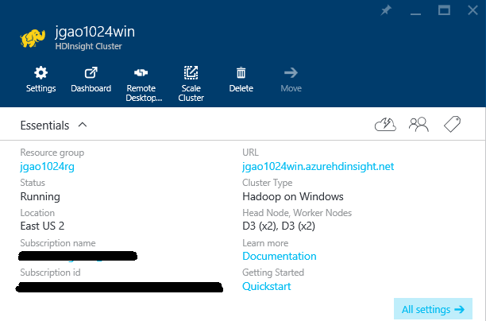
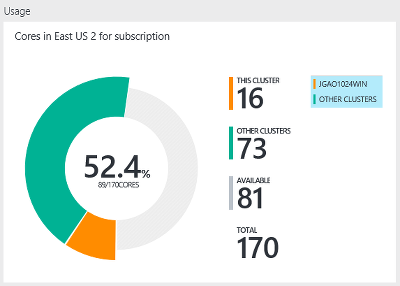
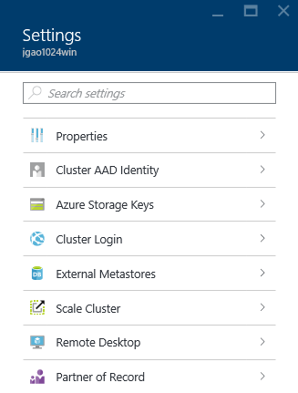
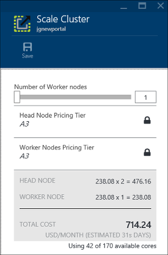
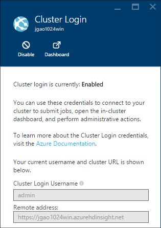
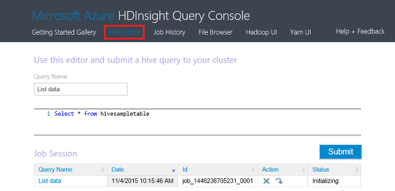
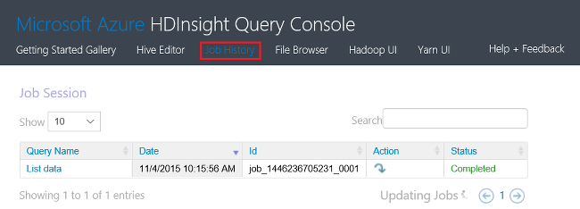
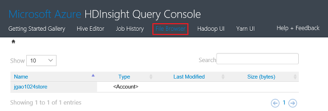
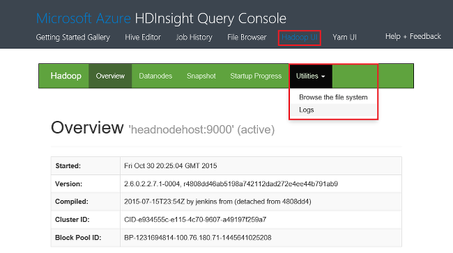
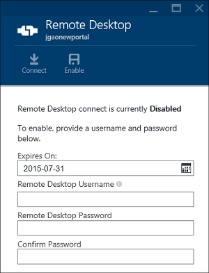

# Manage Windows-based Hadoop clusters in HDInsight by using the Azure portal

Using the [Azure portal][azure-portal], you can create Windows-based Hadoop clusters in Azure HDInsight, change Hadoop user password, and enable Remote Desktop Protocol (RDP) so you can access the Hadoop command console on the cluster.

The information in this article only applies to Window-based HDInsight clusters. For information on managing Linux-based clusters, see [Manage Hadoop clusters in HDInsight by using the Azure portal](hdinsight-administer-use-portal-linux.md).

> [!IMPORTANT]
> Linux is the only operating system used on HDInsight version 3.4 or greater. For more information, see [HDInsight retirement on Windows](hdinsight-component-versioning.md#hdinsight-windows-retirement).

## Prerequisites

Before you begin this article, you must have the following:

* **An Azure subscription**. See [Get Azure free trial](https://azure.microsoft.com/documentation/videos/get-azure-free-trial-for-testing-hadoop-in-hdinsight/).
* **Azure Storage account** - An HDInsight cluster uses an Azure Blob storage container as the default file system. For more information about how Azure Blob storage provides a seamless experience with HDInsight clusters, see [Use Azure Blob Storage with HDInsight](hdinsight-hadoop-use-blob-storage.md). For details on creating an Azure Storage account, see [How to Create a Storage Account](../storage/common/storage-create-storage-account.md).

## Open the Portal
1. Sign in to [https://portal.azure.com](https://portal.azure.com).
2. After you open the portal, you can:

   * Click **Create a resource** from the left menu to create a new cluster:

       
   * Click **HDInsight Clusters** from the left menu.

       

     If **HDInsight** doesn't appear in the left menu, click **Browse**.

     

## Create clusters
For the creation instructions using the Portal, see [Create HDInsight clusters](hdinsight-hadoop-provision-linux-clusters.md).

HDInsight works with a wide range of Hadoop components. For the list of the components that have been verified and supported,
see [What version of Hadoop is in Azure HDInsight](hdinsight-component-versioning.md). You can customize HDInsight by using one of the following options:

* Use Script Action to run custom scripts that can customize a cluster to either change cluster configuration or install custom components such as Giraph or Solr. For more information, see [Customize HDInsight cluster using Script Action](hdinsight-hadoop-customize-cluster.md).
* Use the cluster customization parameters in the HDInsight .NET SDK or Azure PowerShell during cluster creation. These configuration changes are then preserved through the lifetime of the cluster and are not affected by cluster node reimages that Azure platform periodically performs for maintenance. For more information on using the cluster customization parameters, see [Create HDInsight clusters](hdinsight-hadoop-provision-linux-clusters.md).
* Some native Java components, like Mahout and Cascading, can be run on the cluster as JAR files. These JAR files can be distributed to Azure Blob storage, and submitted to HDInsight clusters through Hadoop job submission mechanisms. For more information, see [Submit Hadoop jobs programmatically](hadoop/submit-apache-hadoop-jobs-programmatically.md).

  > [!NOTE]
  > If you have issues deploying JAR files to HDInsight clusters or calling JAR files on HDInsight clusters, contact [Microsoft Support](https://azure.microsoft.com/support/options/).
  >
  > Cascading is not supported by HDInsight, and is not eligible for Microsoft Support. For lists of supported components, see [What's new in the cluster versions provided by HDInsight](hdinsight-component-versioning.md).
  >
  >

Installation of custom software on the cluster by using Remote Desktop Connection is not supported. You should avoid storing any files on the drives of the head node, as they will be lost if you need to re-create the clusters. We recommend storing files on Azure Blob storage. Blob storage is persistent.

## List and show clusters
1. Sign in to [https://portal.azure.com](https://portal.azure.com).
2. Click **HDInsight Clusters** from the left menu.
3. Click the cluster name. If the cluster list is long, you can use filter on the top of the page.
4. Double-click a cluster from the list to show the details.

    **Menu and essentials**:

    

   * To customize the menu, right-click anywhere on the menu, and then click **Customize**.
   * **Settings** and **All Settings**: Displays the **Settings** blade for the cluster, which allows you to access detailed configuration information for the cluster.
   * **Dashboard**, **Cluster Dashboard** and **URL**: These are all ways to access the cluster dashboard, which is Ambari Web for Linux-based clusters.
   * **Secure Shell**: Shows the instructions to connect to the cluster using Secure Shell (SSH) connection.
   * **Scale Cluster**: Allows you to change the number of worker nodes for this cluster.
   * **Delete**: Deletes the cluster.
   * **Quickstart**: Displays information that will help you get started using HDInsight.
   * **Users**: Allows you to set permissions for *portal management* of this cluster for other users on your Azure subscription.

     > [!IMPORTANT]
     > This *only* affects access and permissions to this cluster in the Azure portal, and has no effect on who can connect to or submit jobs to the HDInsight cluster.
     >
     >
   * **Tags**: Tags allow you to set key/value pairs to define a custom taxonomy of your cloud services. For example, you may create a key named **project**, and then use a common value for all services associated with a specific project.
   * **Ambari Views**: Links to Ambari Web.

     > [!IMPORTANT]
     > To manage the services provided by the HDInsight cluster, you must use Ambari Web or the Ambari REST API. For more information on using Ambari, see [Manage HDInsight clusters using Ambari](hdinsight-hadoop-manage-ambari.md).
     >
     >

     **Usage**:

     
5. Click **Settings**.

    

   * **Properties**: View the cluster properties.
   * **Cluster AAD Identity**:
   * **Azure Storage Keys**: View the default storage account and its key. The storage account is configuration during the cluster creation process.
   * **Cluster Login**: Change the cluster HTTP user name and password.
   * **External Metastores**: View the Hive and Oozie metastores. The metastores can only be configured during the cluster creation process.
   * **Scale Cluster**: Increase and decrease the number of cluster worker nodes.
   * **Remote Desktop**: Enable and disable remote desktop (RDP) access, and configure the RDP username.  The RDP user name must be different from the HTTP user name.
   * **Partner of Record**:

     > [!NOTE]
     > This is a generic list of available settings; not all of them will be present for all cluster types.
     >
     >
6. Click **Properties**:

    The properties section lists the following:

   * **Hostname**: Cluster name.
   * **Cluster URL**.
   * **Status**: Include Aborted, Accepted, ClusterStorageProvisioned, AzureVMConfiguration, HDInsightConfiguration, Operational, Running, Error, Deleting, Deleted, Timedout, DeleteQueued, DeleteTimedout, DeleteError, PatchQueued, CertRolloverQueued, ResizeQueued, ClusterCustomization
   * **Region**: Azure location. For a list of supported Azure locations, see the **Region** dropdown list box on [HDInsight pricing](https://azure.microsoft.com/pricing/details/hdinsight/).
   * **Data created**.
   * **Operating system**: Either **Windows** or **Linux**.
   * **Type**: Hadoop, HBase, Storm, Spark.
   * **Version**. See [HDInsight versions](hdinsight-component-versioning.md)
   * **Subscription**: Subscription name.
   * **Subscription ID**.
   * **Primary data source**. The Azure Blob storage account used as the default Hadoop file system.
   * **Worker nodes pricing tier**.
   * **Head node pricing tier**.

## Delete clusters
Delete a cluster will not delete the default storage account or any linked storage accounts. You can re-create the cluster by using the same storage accounts and the same metastores.

1. Sign in to the [Portal][azure-portal].
2. Click **Browse All** from the left menu, click **HDInsight Clusters**, click your cluster name.
3. Click **Delete** from the top menu, and then follow the instructions.

See also [Pause/shut down clusters](#pauseshut-down-clusters).

## Scale clusters
The cluster scaling feature allows you to change the number of worker nodes used by a cluster that is running in Azure HDInsight without having to re-create the cluster.

> [!NOTE]
> Only clusters with HDInsight version 3.1.3 or higher are supported. If you are unsure of the version of your cluster, you can check the Properties page.  See [List and show clusters](#list-and-show-clusters).
>
>

The impact of changing the number of data nodes for each type of cluster supported by HDInsight:

* Hadoop

    You can seamlessly increase the number of worker nodes in a Hadoop cluster that is running without impacting any pending or running jobs. New jobs can also be submitted while the operation is in progress. Failures in a scaling operation are gracefully handled so that the cluster is always left in a functional state.

    When a Hadoop cluster is scaled down by reducing the number of data nodes, some of the services in the cluster are restarted. This causes all running and pending jobs to fail at the completion of the scaling operation. You can, however, resubmit the jobs once the operation is complete.
* HBase

    You can seamlessly add or remove nodes to your HBase cluster while it is running. Regional Servers are automatically balanced within a few minutes of completing the scaling operation. However, you can also manually balance the regional servers by logging into the headnode of cluster and running the following commands from a command prompt window:

        >pushd %HBASE_HOME%\bin
        >hbase shell
        >balancer

    For more information on using the HBase shell, see []
* Storm

    You can seamlessly add or remove data nodes to your Storm cluster while it is running. But after a successful completion of the scaling operation, you will need to rebalance the topology.

    Rebalancing can be accomplished in two ways:

  * Storm web UI
  * Command-line interface (CLI) tool

    Please refer to the [Apache Storm documentation](http://storm.apache.org/documentation/Understanding-the-parallelism-of-a-Storm-topology.html) for more details.

    The Storm web UI is available on the HDInsight cluster:

    

    Here is an example how to use the CLI command to rebalance the Storm topology:

        ## Reconfigure the topology "mytopology" to use 5 worker processes,
        ## the spout "blue-spout" to use 3 executors, and
        ## the bolt "yellow-bolt" to use 10 executors
        $ storm rebalance mytopology -n 5 -e blue-spout=3 -e yellow-bolt=10

**To scale clusters**

1. Sign in to the [Portal][azure-portal].
2. Click **Browse All** from the left menu, click **HDInsight Clusters**, click your cluster name.
3. Click **Settings** from the top menu, and then click **Scale Cluster**.
4. Enter **Number of Worker nodes**. The limit on the number of cluster node varies among Azure subscriptions. You can contact billing support to increase the limit.  The cost information will reflect the changes you have made to the number of nodes.

    

## Pause/shut down clusters
Most of Hadoop jobs are batch jobs that are only ran occasionally. For most Hadoop clusters, there are large periods of time that the cluster is not being used for processing. With HDInsight, your data is stored in Azure Storage, so you can safely delete a cluster when it is not in use.
You are also charged for an HDInsight cluster, even when it is not in use. Since the charges for the cluster are many times more than the charges for storage, it makes economic sense to delete clusters when they are not in use.

There are many ways you can program the process:

* User Azure Data Factory. See [Azure HDInsight Linked Service](../data-factory/compute-linked-services.md) and [Transform and analyze using Azure Data Factory](../data-factory/transform-data.md) for on-demand and self-defined HDInsight linked services.
* Use Azure PowerShell.  See [Analyze flight delay data](hdinsight-analyze-flight-delay-data.md).
* Use Azure Classic CLI. See [Manage HDInsight clusters using Azure Classic CLI](hdinsight-administer-use-command-line.md).
* Use HDInsight .NET SDK. See [Submit Hadoop jobs](hadoop/submit-apache-hadoop-jobs-programmatically.md).

For the pricing information, see [HDInsight pricing](https://azure.microsoft.com/pricing/details/hdinsight/). To delete a cluster from the Portal, see [Delete clusters](#delete-clusters)

## Change cluster username
An HDInsight cluster can have two user accounts. The HDInsight cluster user account is created during the creation process. You can also create an RDP user account for accessing the cluster via RDP. See [Enable remote desktop](#connect-to-hdinsight-clusters-by-using-rdp).

**To change the HDInsight cluster user name and password**

1. Sign in to the [Portal][azure-portal].
2. Click **Browse All** from the left menu, click **HDInsight Clusters**, click your cluster name.
3. Click **Settings** from the top menu, and then click **Cluster Login**.
4. If **Cluster login** has been enabled, you must click **Disable**, and then click **Enable** before you can change the username and password..
5. Change the **Cluster Login Name** and/or the **Cluster Login Password**, and then click **Save**.

    

## Grant/revoke access
HDInsight clusters have the following HTTP web services (all of these services have RESTful endpoints):

* ODBC
* JDBC
* Ambari
* Oozie
* Templeton

By default, these services are granted for access. You can revoke/grant the access from the Azure portal.

> [!NOTE]
> By granting/revoking the access, you will reset the cluster user name and password.
>
>

**To grant/revoke HTTP web services access**

1. Sign in to the [Portal][azure-portal].
2. Click **Browse All** from the left menu, click **HDInsight Clusters**, click your cluster name.
3. Click **Settings** from the top menu, and then click **Cluster Login**.
4. If **Cluster login** has been enabled, you must click **Disable**, and then click **Enable** before you can change the username and password..
5. For **Cluster Login Username** and **Cluster Login Password**, enter the new user name and password (respectively) for the cluster.
6. Click **SAVE**.

    

## Find the default storage account
Each HDInsight cluster has a default storage account. The default storage account and its keys for a cluster appears under **Settings**/**Properties**/**Azure Storage Keys**. See [List and show clusters](#list-and-show-clusters).

## Find the resource group
In the Azure Resource Manager mode, each HDInsight cluster is created with an Azure resource group. The Azure resource group that a cluster belongs to appears in:

* The cluster list has a **Resource Group** column.
* Cluster **Essential** tile.  

See [List and show clusters](#list-and-show-clusters).

## Open HDInsight Query console
The HDInsight Query console includes the following features:

* **Hive Editor**: A GUI web interface for submitting Hive jobs.  See [Run Hive queries using the Query Console](hadoop/apache-hadoop-use-hive-query-console.md).

    
* **Job history**: Monitor Hadoop jobs.  

    

    Click **Query Name** to show the details including Job properties, **Job Query**, and **Job Output. You can also download both the query and the output to your workstation.
* **File Browser**: Browse the default storage account and the linked storage accounts.

    

    On the screenshot, the **<Account>** type indicates the item is an Azure storage account.  Click the account name to browse the files.
* **Hadoop UI**.

    

    From **Hadoop UI*, you can browse files, and check logs.
* **Yarn UI**.

    

## Run Hive queries
To run Hive jobs from the Portal, click **Hive Editor** in the HDInsight Query console. See [Open HDInsight Query console](#open-hdinsight-query-console).

## Monitor jobs
To monitor jobs from the Portal, click **Job History** in the HDInsight Query console. See [Open HDInsight Query console](#open-hdinsight-query-console).

## Browse files
To browse files stored in the default storage account and the linked storage accounts, click **File Browser** in the HDInsight Query console. See [Open HDInsight Query console](#open-hdinsight-query-console).

You can also use the **Browse the file system** utility from the **Hadoop UI** in the HDInsight console.  See [Open HDInsight Query console](#open-hdinsight-query-console).

## Monitor cluster usage
The **Usage** section of the HDInsight cluster blade displays information about the number of cores available to your subscription for use with HDInsight, as well as the number of cores allocated to this cluster and how they are allocated for the nodes within this cluster. See [List and show clusters](#list-and-show-clusters).

> [!IMPORTANT]
> To monitor the services provided by the HDInsight cluster, you must use Ambari Web or the Ambari REST API. For more information on using Ambari, see [Manage HDInsight clusters using Ambari](hdinsight-hadoop-manage-ambari.md)
>
>

## Open Hadoop UI
To monitor the cluster, browse the file system, and check logs, click **Hadoop UI** in the HDInsight Query console. See [Open HDInsight Query console](#open-hdinsight-query-console).

## Open Yarn UI
To use Yarn user interface, click **Yarn UI** in the HDInsight Query console. See [Open HDInsight Query console](#open-hdinsight-query-console).

## Connect to clusters using RDP
The credentials for the cluster that you provided at its creation give access to the services on the cluster, but not to the cluster itself through Remote Desktop. You can turn on Remote Desktop access when you provision a cluster or after a cluster is provisioned. For the instructions about enabling Remote Desktop at creation, see [Create HDInsight cluster](hdinsight-hadoop-provision-linux-clusters.md).

**To enable Remote Desktop**

1. Sign in to the [Portal][azure-portal].
2. Click **Browse All** from the left menu, click **HDInsight Clusters**, click your cluster name.
3. Click **Settings** from the top menu, and then click **Remote Desktop**.
4. Enter **Expires On**, **Remote Desktop Username** and **Remote Desktop Password**, and then click **Enable**.

    

    The default values for Expires On is a week.

   > [!NOTE]
   > You can also use the HDInsight .NET SDK to enable Remote Desktop on a cluster. Use the **EnableRdp** method on the HDInsight client object in the following manner: **client.EnableRdp(clustername, location, "rdpuser", "rdppassword", DateTime.Now.AddDays(6))**. Similarly, to disable Remote Desktop on the cluster, you can use **client.DisableRdp(clustername, location)**. For more information on these methods, see [HDInsight .NET SDK Reference](http://go.microsoft.com/fwlink/?LinkId=529017). This is applicable only for HDInsight clusters running on Windows.
   >
   >

**To connect to a cluster by using RDP**

1. Sign in to the [Portal][azure-portal].
2. Click **Browse All** from the left menu, click **HDInsight Clusters**, click your cluster name.
3. Click **Settings** from the top menu, and then click **Remote Desktop**.
4. Click **Connect** and follow the instructions. If Connect is disable, you must enable it first. Make sure using the Remote Desktop user username and password.  You can't use the Cluster user credentials.

## Open Hadoop command line
To connect to the cluster by using Remote Desktop and use the Hadoop command line, you must first have enabled Remote Desktop access to the cluster as described in the previous section.

**To open a Hadoop command line**

1. Connect to the cluster using Remote Desktop.
2. From the desktop, double-click **Hadoop Command Line**.

    ![HDI.HadoopCommandLine][image-hadoopcommandline]

    For more information on Hadoop commands, see [Hadoop commands reference](http://hadoop.apache.org/docs/current/hadoop-project-dist/hadoop-common/CommandsManual.html).

In the previous screenshot, the folder name has the Hadoop version number embedded. The version number can change based on the version of the Hadoop components installed on the cluster. You can use Hadoop environment variables to refer to those folders. For example:

    cd %hadoop_home%
    cd %hive_home%
    cd %hbase_home%
    cd %pig_home%
    cd %sqoop_home%
    cd %hcatalog_home%

## Next steps
In this article, you have learned how to create an HDInsight cluster by using the Portal, and how to open the Hadoop command-line tool. To learn more, see the following articles:

* [Administer HDInsight Using Azure PowerShell](hdinsight-administer-use-powershell.md)
* [Administer HDInsight Using Azure Classic CLI](hdinsight-administer-use-command-line.md)
* [Create HDInsight clusters](hdinsight-hadoop-provision-linux-clusters.md)
* [Submit Hadoop jobs programmatically](hadoop/submit-apache-hadoop-jobs-programmatically.md)
* [Get Started with Azure HDInsight](hadoop/apache-hadoop-linux-tutorial-get-started.md)
* [What version of Hadoop is in Azure HDInsight?](hdinsight-component-versioning.md)

[azure-portal]: https://portal.azure.com
[image-hadoopcommandline]: ./media/hdinsight-administer-use-management-portal/hdinsight-hadoop-command-line.png "Hadoop command line"
