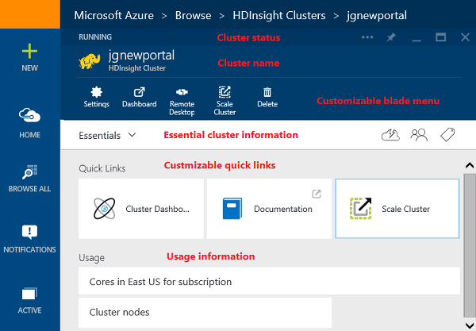

<properties
	pageTitle="Manage Hadoop clusters in HDInsight using the Azure preview portal | Microsoft Azure"
	description="Learn how to administer HDInsight Service. Create an HDInsight cluster, open the interactive JavaScript console, and open the Hadoop command console."
	services="hdinsight"
	documentationCenter=""
	tags="azure-portal"
	authors="mumian"
	manager="paulettm"
	editor="cgronlun"/>

<tags
	ms.service="hdinsight"
	ms.workload="big-data"
	ms.tgt_pltfrm="na"
	ms.devlang="na"
	ms.topic="article"
	ms.date="08/11/2015"
	ms.author="jgao"/>

# Manage Hadoop clusters in HDInsight by using the Azure preview portal

[AZURE.INCLUDE [selector](../../includes/hdinsight-portal-management-selector.md)]

Using the [Azure preview portal][azure-portal], you can provision Hadoop clusters in Azure HDInsight, change Hadoop user password, and enable Remote Desktop Protocol (RDP) so you can access the Hadoop command console on the cluster.

[AZURE.INCLUDE [hdinsight-azure-preview-portal](../../includes/hdinsight-azure-preview-portal.md)]

* [Manage Hadoop clusters in HDInsight by using the Azure portal](hdinsight-administer-use-management-portal-v1.md)

> [AZURE.NOTE] The steps in this document are specific to working with Windows-based Hadoop clusters. For information on working with Linux-based clusters, see [Manage Hadoop clusters in HDInsight by using the Azure preview portal](hdinsight-administer-use-portal-linux.md)

> [AZURE.NOTE] There are also other tools available for administering HDInsight in addition to the preview portal.
>
> - [Administer HDInsight Using Azure PowerShell](hdinsight-administer-use-powershell.md)
> - [Administer HDInsight Using Azure CLI](hdinsight-administer-use-command-line.md)

**Prerequisites**

Before you begin this article, you must have the following:

- **An Azure subscription**. See [Get Azure free trial](http://azure.microsoft.com/documentation/videos/get-azure-free-trial-for-testing-hadoop-in-hdinsight/).
- **Azure Storage account** - An HDInsight cluster uses an Azure Blob storage container as the default file system. For more information about how Azure Blob storage provides a seamless experience with HDInsight clusters, see [Use Azure Blob Storage with HDInsight](../hdinsight-use-blob-storage.md). For details on creating an Azure Storage account, see [How to Create a Storage Account](../storage-create-storage-account.md).

##Provision HDInsight clusters

For the provision instructions using the preview portal, see [Provision HDInsight clusters](hdinsight-provision-clusters.md#portal).

##Customize HDInsight clusters provision

HDInsight works with a wide range of Hadoop components. For the list of the components that have been verified and supported, see [What version of Hadoop is in Azure HDInsight](hdinsight-component-versioning.md). You can customize HDInsight by using one of the following options:

- Use Script Action to run custom scripts that can customize a cluster to either change cluster configuration or install custom components such as Giraph or Solr. For more information, see [Customize HDInsight cluster using Script Action](hdinsight-hadoop-customize-cluster.md).
- Use the cluster customization parameters in the HDInsight .NET SDK or Azure PowerShell during cluster provisioning. These configuration changes are then preserved through the lifetime of the cluster and are not affected by cluster node reimages that Azure platform periodically performs for maintenance. For more information on using the cluster customization parameters, see [Provision HDInsight clusters](hdinsight-provision-clusters.md).
- Some native Java components, like Mahout and Cascading, can be run on the cluster as JAR files. These JAR files can be distributed to Azure Blob storage, and submitted to HDInsight clusters through Hadoop job submission mechanisms. For more information, see [Submit Hadoop jobs programmatically](hdinsight-submit-hadoop-jobs-programmatically.md).

	>[AZURE.NOTE] If you have issues deploying JAR files to HDInsight clusters or calling JAR files on HDInsight clusters, contact [Microsoft Support](http://azure.microsoft.com/support/options/).

	> Cascading is not supported by HDInsight, and is not eligible for Microsoft Support. For lists of supported components, see [What's new in the cluster versions provided by HDInsight?](hdinsight-component-versioning.md).

Installation of custom software on the cluster by using Remote Desktop Connection is not supported. You should avoid storing any files on the drives of the head node, as they will be lost if you need to re-create the clusters. We recommend storing files on Azure Blob storage. Blob storage is persistent.

## Get familiar with the cluster portal interface

**To access the cluster**

1. Sign in to the [preview portal][azure-portal].
2. Click **Browse All** from the left menu to open the **Browse** blade.
3. Click **HDInsight Clusters** to open the **HDInsight Clusters** blade.
4. Click one of the clusters from the list to open the cluster blade:

	

5. Click **Settings** to see the configuration details and to configure the cluster:

	

	|Setting|Description|
	|-----|-----|
	|Properties| Display the cluster properties.|
	|Azure Storage Keys| Display the default Azure storage account information. |
	|Cluster Login| Grant/revoke the HTTP web services access, and configure the cluster login information. |
	|External Metastores| Display the Hive/Oozie metastore information.|
	|Scale cluster| Increase/decrease the number of workers nodes of the cluster.|
	|Remote Desktop| Enable/disable the Remote Desktop connectivity, connect to the cluster via Remote Desktop.|

##Grant/revoke HTTP services access

HDInsight clusters have the following HTTP web services (all of these services have RESTful endpoints):

- ODBC
- JDBC
- Ambari
- Oozie
- Templeton

By default, these services are granted for access. You can revoke/grant the access from the Azure portal.

>[AZURE.NOTE] By granting/revoking the access, you will reset the cluster user name and password.

**To grant/revoke HTTP web services access**

1. Sign in to the [preview portal][azure-portal].
2. Click **Browse All** from the left menu, click **HDInsight Clusters**, click your cluster name.
3. Click **Settings** from the top menu, and then click **Cluster Login**.
5. Click **ON** or **OFF** on **Cluster Login Access**.  
6. For **Cluster Login Username** and **Cluster Login Password**, enter the new user name and password (respectively) for the cluster.
7. Click **SAVE**.

	

This can also be done through the Azure PowerShell cmdlets:

- Grant-AzureHDInsightHttpServicesAccess
- Revoke-AzureHDInsightHttpServicesAccess

See [Administer HDInsight using Azure PowerShell](hdinsight-administer-use-powershell.md).

##Change the HDInsight cluster username and password
An HDInsight cluster can have two user accounts. The HDInsight cluster user account is created during the provisioning process. You can also create an RDP user account for accessing the cluster via RDP. See [Enable remote desktop](#connect-to-hdinsight-clusters-by-using-rdp).

**To change the HDInsight cluster user name and password**

1. Sign in to the [preview portal][azure-portal].
2. Click **Browse All** from the left menu, click **HDInsight Clusters**, click your cluster name.
3. Click **Settings** from the top menu, and then click **Cluster Login**.
4. Change the **Cluster Login Name** and/or the **Cluster Login Password**, and then click **Save**.

	

##Scale clusters
The cluster scaling feature allows you to change the number of worker nodes used by a cluster that is running in Azure HDInsight without having to re-create the cluster.

>[AZURE.NOTE] Only clusters with HDInsight version 3.1.3 or higher are supported. If you are unsure of the version of your cluster, you can check the Properties page.  See [Get familiar with the cluster portal interface](hdinsight-adminster-use-management-portal/#Get-familiar-with-the-cluster-portal-interface).

The impact of changing the number of data nodes for each type of cluster supported by HDInsight:

- Hadoop

	You can seamlessly increase the number of worker nodes in a Hadoop cluster that is running without impacting any pending or running jobs. New jobs can also be submitted while the operation is in progress. Failures in a scaling operation are gracefully handled so that the cluster is always left in a functional state.

	When a Hadoop cluster is scaled down by reducing the number of data nodes, some of the services in the cluster are restarted. This causes all running and pending jobs to fail at the completion of the scaling operation. You can, however, resubmit the jobs once the operation is complete.

- HBase

	You can seamlessly add or remove nodes to your HBase cluster while it is running. Regional Servers are automatically balanced within a few minutes of completing the scaling operation. However, you can also manually balance the regional servers by logging into the headnode of cluster and running the following commands from a command prompt window:

		>pushd %HBASE_HOME%\bin
		>hbase shell
		>balancer

	For more information on using the HBase shell, see []
- Storm

	You can seamlessly add or remove data nodes to your Storm cluster while it is running. But after a successful completion of the scaling operation, you will need to rebalance the topology.

	Rebalancing can be accomplished in two ways:

	* Storm web UI
	* Command-line interface (CLI) tool

	Please refer to the [Apache Storm documentation](http://storm.apache.org/documentation/Understanding-the-parallelism-of-a-Storm-topology.html) for more details.

	The Storm web UI is available on the HDInsight cluster:

	

	Here is an example how to use the CLI command to rebalance the Storm topology:

		## Reconfigure the topology "mytopology" to use 5 worker processes,
		## the spout "blue-spout" to use 3 executors, and
		## the bolt "yellow-bolt" to use 10 executors

		$ storm rebalance mytopology -n 5 -e blue-spout=3 -e yellow-bolt=10

**To scale clusters**

1. Sign in to the [preview portal][azure-portal].
2. Click **Browse All** from the left menu, click **HDInsight Clusters**, click your cluster name.
3. Click **Settings** from the top menu, and then click **Scale Cluster**.
4. Enter **Number of Worker nodes**. The limit on the number of cluster node varies among Azure subscriptions. You can contact billing support to increase the limit.  The cost information will reflect the changes you have made to the number of nodes.

	

##Connect to HDInsight clusters by using RDP

The credentials for the cluster that you provided at its creation give access to the services on the cluster, but not to the cluster itself through Remote Desktop. You can turn on Remote Desktop access when you provision a cluster or after a cluster is provisioned. For the instructions about enabling Remote Desktop at provision, see [Provision HDInsight cluster](hdinsight-provision-clusters.md).

**To enable Remote Desktop**

1. Sign in to the [preview portal][azure-portal].
2. Click **Browse All** from the left menu, click **HDInsight Clusters**, click your cluster name.
3. Click **Settings** from the top menu, and then click **Remote Desktop**.
4. Enter **Expires On**, **Remote Desktop Username** and **Remote Desktop Password**, and then click **Enable**.

	

	The default valus for Expires On is a week.
> [AZURE.NOTE] You can also use the HDInsight .NET SDK to enable Remote Desktop on a cluster. Use the **EnableRdp** method on the HDInsight client object in the following manner: **client.EnableRdp(clustername, location, "rdpuser", "rdppassword", DateTime.Now.AddDays(6))**. Similarly, to disable Remote Desktop on the cluster, you can use **client.DisableRdp(clustername, location)**. For more information on these methods, see [HDInsight .NET SDK Reference](http://go.microsoft.com/fwlink/?LinkId=529017). This is applicable only for HDInsight clusters running on Windows.

**To connect to a cluster by using RDP**

1. Sign in to the [preview portal][azure-portal].
2. Click **Browse All** from the left menu, click **HDInsight Clusters**, click your cluster name.
3. Click **Settings** from the top menu, and then click **Remote Desktop**.
4. Click **Connect** and follow the instructions. If Connect is disable, you must enable it first. Make sure using the Remote Desktop user username and password.  You can't use the Cluster user credentials.

##Open a Hadoop command line

To connect to the cluster by using Remote Desktop and use the Hadoop command line, you must first have enabled Remote Desktop access to the cluster as described in the previous section.

**To open a Hadoop command line**

1. Connect to the cluster using Remote Desktop.
8. From the desktop, double-click **Hadoop Command Line**.

	![HDI.HadoopCommandLine][image-hadoopcommandline]

	For more information on Hadoop commands, see [Hadoop commands reference](http://hadoop.apache.org/docs/current/hadoop-project-dist/hadoop-common/CommandsManual.html).

In the previous screenshot, the folder name has the Hadoop version number embedded. The version number can changed based on the version of the Hadoop components installed on the cluster. You can use Hadoop environment variables to refer to those folders. For example:

	cd %hadoop_home%
	cd %hive_home%
	cd %hbase_home%
	cd %pig_home%
	cd %sqoop_home%
	cd %hcatalog_home%

##Next steps
In this article, you have learned how to create an HDInsight cluster by using the preview portal, and how to open the Hadoop command-line tool. To learn more, see the following articles:

* [Administer HDInsight Using Azure PowerShell](hdinsight-administer-use-powershell.md)
* [Administer HDInsight Using Azure CLI](hdinsight-administer-use-command-line.md)
* [Provision HDInsight clusters](hdinsight-provision-clusters.md)
* [Submit Hadoop jobs programmatically](hdinsight-submit-hadoop-jobs-programmatically.md)
* [Get Started with Azure HDInsight](../hdinsight-get-started.md)
* [What version of Hadoop is in Azure HDInsight?](hdinsight-component-versioning.md)

[azure-portal]: https://portal.azure.com
[image-cluster-quickcreate]: ./media/hdinsight-administer-use-management-portal/HDI.QuickCreateCluster.png
[image-cluster-landing]: ./media/hdinsight-administer-use-management-portal/HDI.ClusterLanding.PNG "Cluster landing page"
[image-hdi-create-rpd-user]: ./media/hdinsight-administer-use-management-portal/HDI.CreateRDPUser.png
[image-hadoopcommandline]: ./media/hdinsight-administer-use-management-portal/HDI.HadoopCommandLine.PNG "Hadoop command line"
[image-hdiclustercreate-uploadcert]: ./media/hdinsight-administer-use-management-portal/HDI.ClusterCreate.UploadCert.png
