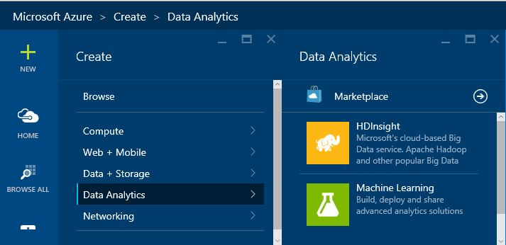
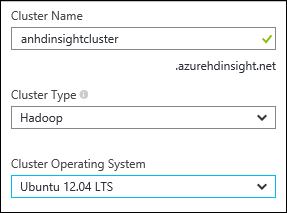
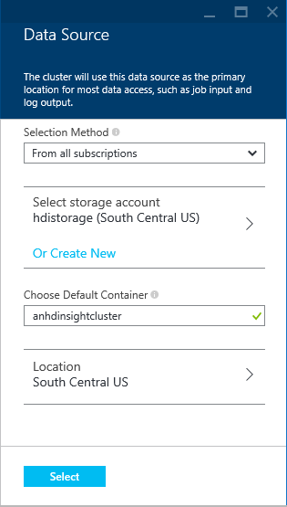
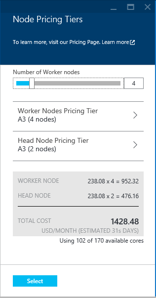
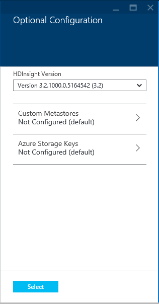
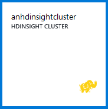

<properties
	pageTitle="Manage Hadoop clusters in HDInsight using Azure portal | Microsoft Azure"
	description="Learn how to administer HDInsight Service. Create an HDInsight cluster, open the interactive JavaScript console, and open the Hadoop command console."
	services="hdinsight"
	documentationCenter=""
	authors="Blackmist"
	manager="paulettm"
	editor="cgronlun"
	tags="azure-portal"/>

<tags
	ms.service="hdinsight"
	ms.workload="big-data"
	ms.tgt_pltfrm="na"
	ms.devlang="na"
	ms.topic="article"
	ms.date="08/03/2015"
	ms.author="larryfr"/>

# Manage Hadoop clusters in HDInsight by using the Azure preview portal

Using the [Azure preview portal][preview-portal], you can provision and manage Linux-based Hadoop clusters in Azure HDInsight.

> [AZURE.NOTE] The steps in this document are specific to working with Linux-based Hadoop clusters. For information on working with Windows-based clusters, see [Manage Hadoop clusters in HDInsight by using the Azure preview portal](hdinsight-administer-use-management-portal.md)
>
> There are also other tools available for administering HDInsight in addition to the Azure portal.
>
> - [Administer HDInsight Using Azure CLI](hdinsight-administer-use-command-line.md)
> - [Administer HDInsight Using Azure PowerShell](hdinsight-administer-use-powershell.md)

## Other tools for administering HDInsight
There are also other tools available for administering HDInsight in addition to the Azure portal.

- [Administer HDInsight Using Azure CLI](hdinsight-administer-use-command-line.md): The Azure CLI is a cross-platform command line tool that allows you to manage Azure services

- [Administer HDInsight Using Azure PowerShell](hdinsight-administer-use-powershell.md): Azure PowerShell provides PowerShell cmdlets for managing Azure services

##Prerequisites

Before you begin this article, you must have the following:

- **An Azure subscription**. See [Get Azure free trial](http://azure.microsoft.com/documentation/videos/get-azure-free-trial-for-testing-hadoop-in-hdinsight/)

##Provision HDInsight clusters

You can provision HDInsight clusters from the Azure portal by using the following steps:

1. Sign in to the [Azure Preview Portal][preview-portal].

2. Select **NEW**, select __Data Analytics__, and then select __HDInsight__

	

3. Enter a __Cluster Name__, then select the __Cluster Type__ you wish to create. A green check will appear beside the __Cluster Name__ if it is available.

	
	
	> [AZURE.NOTE] Only the Hadoop cluster type is available for the Linux-based HDInsight preview.

4. If you have more than one subscription, select the __Subscription__ entry to select the Azure subscription that will be used for the cluster.

5. For __Resource Group__, you can select the entry to see a list of existing resource groups and then select the one to create the cluster in. Or you can select __Create New__ and then enter the name of the new resource group. A green check will appear to indicate if the new group name is available.

	> [AZURE.NOTE] This entry will default to one of your existing resource groups, if any are available.

6. Select __Credentials__, then enter a __Cluster Login Password__ for the __Cluster Login Username__. You must also enter an __SSH Username__ and either a __PASSWORD__ or __PUBLIC KEY__, which will be used to authenticate the SSH user. Finally, use the __Select__ button to set the credentials. Remote desktop will not be used in this document, so you can leave it disabled.

	

	For more information on using SSH with HDInsight, see one of the following articles:

	* [Use SSH with Linux-based Hadoop on HDInsight from Linux, Unix, or OS X](hdinsight-hadoop-linux-use-ssh-unix.md)

	* [Use SSH with Linux-based Hadoop on HDInsight from Windows](hdinsight-hadoop-linux-use-ssh-windows)

6. For __Data Source__, you can select the entry to choose an existing data source, or create a new one.

	
	
	Currently you can select an Azure Storage Account as the data source for an HDInsight cluster. Use the following to understand the entries on the __Data Source__ blade.
	
	- __Selection Method__: Set this to __From all subscriptions__ to enable browsing of storage accounts on your subscriptions. Set to __Access Key__ if you want to enter the __Storage Name__ and __Access Key__ of an existing storage account.
	
	- __Create New__: Use this to create a new storage account. Use the field that appears to enter the name of the storage account. A green check will appear if the name is available.
	
	- __Choose Default Container__: Use this to enter the name of the default container to use for the cluster. While you can enter any name here, we recommend using the same name as the cluster so that you can easily recognize that the container is used for this specific cluster.
	
	- __Location__: The geographic region that the storage account will be is in, or will be created in.
	
		> [AZURE.IMPORTANT] Selecting the location for the default data source will also set the location of the HDInsight cluster. The cluster and default data source must be located in the same region.
		
	- __Select__: Use this to save the data source configuration.
	
7. Select __Node Pricing Tiers__ to display information about the nodes that will be created for this cluster. By default, the number of worker nodes will be set to __4__. Set this to __1__, as this will be sufficient for this tutorial and will reduce the cost of the cluster. The estimated cost of the cluster will be shown at the bottom of this blade.

	
	
	Use the __Select__ button to save the __Node Pricing Tiers__ information.

8. Select __Optional Configuration__. This blade allows you to configure the following items:

	* __HDInsight Version__: The version of HDInsight used for the cluster. For more information on HDInsight versioning, see [HDInsight component versioning](hdinsight-component-versioning.md)
	* __Custom Metastores__: This allows you to select a SQL Database, which will be used to store configuration information for Oozie and Hive. This allows you to reuse the configuration when deleting and recreating a cluster, instead of having to recreate the Hive and Oozie configuration each time.
	*__Azure Storage Keys__: This allows you to associate additional storage accounts with the HDInsight server.
	
		> [AZURE.NOTE] HDInsight can only access Azure Storage accounts used as the default data store, added through this configuration section, or that are publicly accessible.

	

9. Ensure that __Pin to Startboard__ is selected, and then select __Create__. This will create the cluster and add a tile for it to the Startboard of your Azure Portal. The icon will indicate that the cluster is provisioning, and will change to display the HDInsight icon once provisioning has completed.

	| While provisioning | Provisioning complete |
	| ------------------ | --------------------- |
	|  |  |

	> [AZURE.NOTE] It will take some time for the cluster to be created, usually around 15 minutes. Use the tile on the Startboard, or the __Notifications__ entry on the left of the page to check on the provisioning process.

##Manage a cluster

Selecting a cluster from the Azure preview portal will display essential information about the cluster, such as the name, resource group, operating system, and the URL for the cluster dashboard (used to access Ambari Web for Linux clusters.)

Use the following to understand the icons at the top of this blade, and in the __Essentials__ and __Quick Links__ section:

* __Settings__ and __All Settings__: Displays the __Settings__ blade for the cluster, which allows you to access detailed configuration information for the cluster.

* __Dashboard__, __Cluster Dashboard__, and __URL__: These are all ways to access the cluster dashboard, which is Ambari Web for Linux-based clusters.

* __Secure Shell__: Information needed to access the cluster using SSH.

* __Scale Cluster__: Allows you to change the number of worker nodes for this cluster.

* __Delete__: Deletes the HDInsight cluster.

* __Quickstart ()__: Displays information that will help you get started using HDInsight.

* __Users ()__: Allows you to set permissions for _portal management_ of this cluster for other users on your Azure subscription.

	> [AZURE.IMPORTANT] This _only_ affects access and permissions to this cluster in the Azure preview portal, and has no effect on who can connect to or submit jobs to the HDInsight cluster.

* __Tags ()__: Tags allows you to set key/value pairs to define a custom taxonomy of your cloud services. For example, you may create a key named __project__, and then use a common value for all services associated with a specific project.

* __Documentation__: Links to documentation for Azure HDInsight.

> [AZURE.IMPORTANT] To manage the services provided by the HDInsight cluster, you must use Ambari Web or the Ambari REST API. For more information on using Ambari, see [Manage HDInsight clusters using Ambari](hdinsight-hadoop-manage-ambari.md).

##Monitor a cluster

The __Usage__ section of the HDInsight cluster blade dislays information about the number of cores available to your subscription for use with HDInsight, as well as the number of cores allocated to this cluster and how they are allocated for the nodes within this cluster.

> [AZURE.IMPORTANT] To monitor the services provided by the HDInsight cluster, you must use Ambari Web or the Ambari REST API. For more information on using Ambari, see [Manage HDInsight clusters using Ambari](hdinsight-hadoop-manage-ambari.md)

##Next steps
In this article, you have learned how to create an HDInsight cluster by using the Azure portal, and how to open the Hadoop command-line tool. To learn more, see the following articles:

* [Administer HDInsight Using Azure PowerShell](hdinsight-administer-use-powershell.md)
* [Administer HDInsight Using Azure CLI](hdinsight-administer-use-command-line.md)
* [Provision HDInsight clusters](hdinsight-provision-clusters.md)
* [Submit Hadoop jobs programmatically](hdinsight-submit-hadoop-jobs-programmatically.md)
* [Get Started with Azure HDInsight](../hdinsight-get-started.md)
* [What version of Hadoop is in Azure HDInsight?](hdinsight-component-versioning.md)

[preview-portal]: https://portal.azure.com