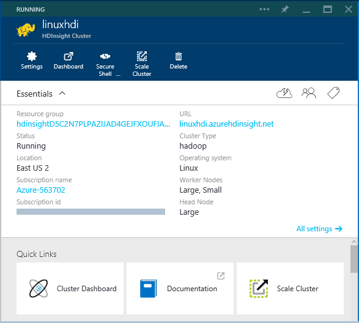
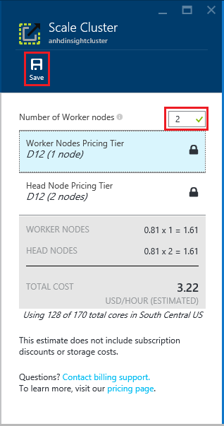
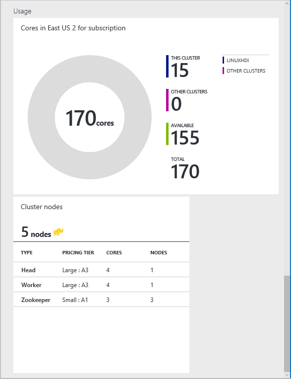

<properties
	pageTitle="Manage Linux-based Hadoop clusters in HDInsight using Azure portal | Microsoft Azure"
	description="Learn how to create and manage Linux-based HDInsight clusters using the Azure portal."
	services="hdinsight"
	documentationCenter=""
	authors="Blackmist"
	manager="paulettm"
	editor="cgronlun"
	tags="azure-portal"/>

<tags
	ms.service="hdinsight"
	ms.workload="big-data"
	ms.tgt_pltfrm="na"
	ms.devlang="na"
	ms.topic="article"
	ms.date="03/30/2016"
	ms.author="larryfr"/>

#Manage Hadoop clusters in HDInsight by using the Azure Portal

[AZURE.INCLUDE [selector](../../includes/hdinsight-portal-management-selector.md)]

Using the [Azure Portal][preview-portal], you can provision and manage Linux-based Hadoop clusters in Azure HDInsight.

> [AZURE.NOTE] The steps in this document are specific to working with Linux-based Hadoop clusters. For information on working with Windows-based clusters, see [Manage Hadoop clusters in HDInsight by using the Azure Portal](hdinsight-administer-use-management-portal.md)

[AZURE.INCLUDE [preview-portal](../../includes/hdinsight-azure-preview-portal-nolink.md)]

## Other tools for administering HDInsight
There are also other tools available for administering HDInsight in addition to the Azure portal.

- [Administer HDInsight Using Azure CLI](hdinsight-administer-use-command-line.md): The Azure CLI is a cross-platform command line tool that allows you to manage Azure services

- [Administer HDInsight Using Azure PowerShell](hdinsight-administer-use-powershell.md): Azure PowerShell provides PowerShell cmdlets for managing Azure services

## Prerequisites

Before you begin this article, you must have the following:

- **An Azure subscription**. See [Get Azure free trial](https://azure.microsoft.com/documentation/videos/get-azure-free-trial-for-testing-hadoop-in-hdinsight/)

## Create HDInsight clusters

You can create HDInsight clusters from the Azure portal. This is discussed in detail in the [Create Linux-based clusters in HDInsight using the Azure portal](hdinsight-hadoop-create-linux-clusters-portal.md) document.

## Manage a cluster

Selecting a cluster from the Azure Portal will display essential information about the cluster, such as the name, resource group, operating system, and the URL for the cluster (used to access Ambari Web for Linux-based clusters.)

Use the following to understand the icons at the top of this blade, and in the __Essentials__ and __Quick Links__ section:

* __Settings__ and __All Settings__: Displays the __Settings__ blade for the cluster, which allows you to access detailed configuration information for the cluster.

* __Dashboard__, __Cluster Dashboard__, and __URL__: These are all ways to access the cluster dashboard. Depending on the cluster type, you may be presented with a list of dashboards on the cluster. For example, the Spark cluster type provides will display a list of dashboards when you select the __Dashboard__ icon, while a Hadoop cluster will open the Ambari Web UI.

* __Secure Shell__: Information needed to access the cluster head node using SSH.

* __Scale Cluster__: Allows you to change the number of worker nodes for this cluster.

* __Delete__: Deletes the HDInsight cluster.

* __Quickstart ()__: Displays information that will help you get started using HDInsight.

* __Users ()__: Allows you to set permissions for _portal management_ of this cluster for other users on your Azure subscription.

	> [AZURE.IMPORTANT] This _only_ affects access and permissions to this cluster in the Azure Portal, and has no effect on who can connect to or submit jobs to the HDInsight cluster.

* __Tags ()__: Tags allows you to set key/value pairs to define a custom taxonomy of your cloud services. For example, you may create a key named __project__, and then use a common value for all services associated with a specific project.

* __Documentation__: Links to documentation for Azure HDInsight.

> [AZURE.IMPORTANT] To manage the services provided by the HDInsight cluster, you must use Ambari Web or the Ambari REST API. For more information on using Ambari, see [Manage HDInsight clusters using Ambari](hdinsight-hadoop-manage-ambari.md).

### Settings

Selecting the __Settings__ icon, or the __All settings__ link, will display the Settings blade. Several of the functions available from the __Essentials__ area discussed previously are also available here, such as Scaling or Secure Shell information. You can also access the following from Settings:

* __Audit logs__: Logged information that is useful for diagnosing problems with the clusters health.

* __Cluster Login__: Displays the __Cluster Login Username__ and the __Remote address__ that can be used to access the cluster using HTTPS.

* __External Metastores__: Displays information on external metastores used by your cluster, if any. If you did not configure a custom metastore during cluster configuration, no information will be displayed.

* __Script Actions__: Displays information on Script Actions that have been ran on this cluster. You can also run new Script Actions, and persist or delete Script Actions that have previously been ran. For more information on Script actions, see [Customize HDInsight clusters using Script Action](hdinsight-hadoop-customize-cluster-linux.md).

* __Apps__: Displays information on Apps that have been installed on the cluster, and allows you to add new applications to the cluster from the Azure marketplace.

* __Azure Storage Keys__: Displays information on the Azure Storage accounts used by the cluster. Selecting a storage account will load the Storage account blade for the selected account.

* __Cluster AAD Identity__: Displays information on the Service Principal for this HDInsight cluster. The Service Principal is used to access Azure Data Lake Store. If you did not associate your cluster with Azure Data Lake Store during cluster creation, the entries on this blade will display __Not Configured__. For more information on using Azure Data Lake Store with HDInsight, see [Create an HDInsight cluster with Data Lake Store](../data-lake-store/data-lake-store-hdinsight-hadoop-use-portal.md).

### Scaling

To scale a cluster using the portal, select your HDInsight cluster and then select __Scale Cluster__. Enter the __Number of worker nodes__ you wish to set for the cluster, and then click __Save__.

For more information on scaling operations, see [Information about using HDInsight on Linux](hdinsight-hadoop-linux-information.md#scaling).

## Monitor a cluster

The __Usage__ section of the HDInsight cluster blade dislays information about the number of cores available to your subscription for use with HDInsight, as well as the number of cores allocated to this cluster and how they are allocated for the nodes within this cluster.

> [AZURE.IMPORTANT] To monitor the services provided by the HDInsight cluster, you must use Ambari Web or the Ambari REST API. For more information on using Ambari, see [Manage HDInsight clusters using Ambari](hdinsight-hadoop-manage-ambari.md)

## Next steps
In this article, you have learned how to create an HDInsight cluster by using the Azure portal, and how to open the Hadoop command-line tool. To learn more, see the following articles:

* [Administer HDInsight Using Azure PowerShell](hdinsight-administer-use-powershell.md)
* [Administer HDInsight Using Azure CLI](hdinsight-administer-use-command-line.md)
* [Provision HDInsight clusters](hdinsight-provision-clusters.md)
* [Submit Hadoop jobs programmatically](hdinsight-submit-hadoop-jobs-programmatically.md)
* [Get Started with Azure HDInsight](hdinsight-hadoop-linux-tutorial-get-started.md)
* [What version of Hadoop is in Azure HDInsight?](hdinsight-component-versioning.md)

[preview-portal]: https://portal.azure.com
