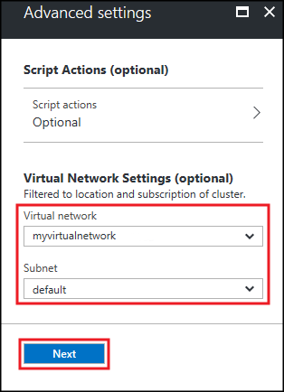
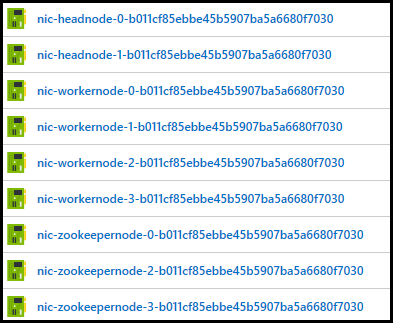
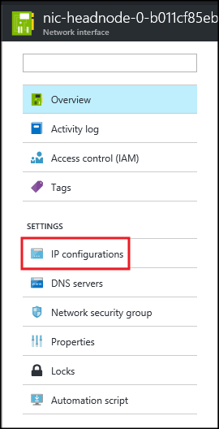
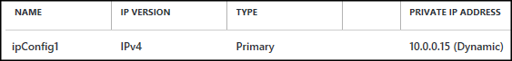
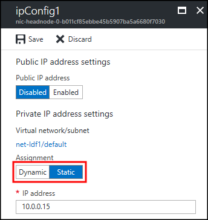

# Connect to Kafka on HDInsight using a VPN gateway

Learn how to connect directly to Kafka on HDInsight by using an Azure Virtual Network configured with a VPN gateway. A VPN gateway allows individual clients to securely connect to the virtual network and communicate directly with the HDInsight cluster.

## Why use VPN

HDInsight clusters are secured inside an Azure Virtual Network, and only allow incoming SSH and HTTPS traffic. You cannot connect to the Kafka brokers directly over the internet. Instead, you must use a VPN gateway into the virtual network that contains HDInsight. This allows remote clients to directly connect to Kafka over the internet.

> [!NOTE]
> Kafka applications that run directly on the cluster are already inside the virtual network.

The information in this document is primarily for the following scenarios:

* __Mirroring between two Kafka clusters__. For example, you may want to mirror Kafka topics between an on-premises Kafka cluster and Kafka on HDInsight.

* __Remote consumer or producers__. For example, you may have on-premises applications that need to directly read or write to Kafka on HDInsight.

## How it works

[TBD diagram]

> [!IMPORTANT]
> HDInsight is secured inside an Azure Virtual Network. If you create an HDInsight cluster and do not specify a virtual network, one is automatically created. However, this auto-created virtual network is hidden and you cannot add a VPN gateway to it.
>
> To use VPN to connect to HDInsight, you must instead create the virtual network first. Then specify the virtual network when creating the HDInsight cluster. This gives you full control over the virtual network, including the ability to configure a VPN gateway.

* __Virtual Network__: Provides a security boundary for HDInsight. Includes a default gateway that provides internet access to SSH and HTTPS services hosted on the cluster head nodes.

* __VPN gateway__: Allows remote clients to join the virtual network and directly communicate with the HDInsight cluster. The VPN gateway created by this template uses an IP address pool of 172.16.201.0/24 to assign IPs to clients. Access to the VPN gateway uses certificate authentication.


### Point-to-site or site-to-site

There are two types of VPN configurations with Azure Virtual Networks:

* __Point-to-site__: Each client machine uses a VPN client to connect to the virtual network.

* __Site-to-site__: A VPN hardware (or software) device connects your local network to the virtual network.

The information in this document uses a point-to-site configuration. For more information on creating and using a site-to-site configuration, see [Create a Virtual Network with a site-to-site connection](../vpn-gateway/vpn-gateway-howto-site-to-site-resource-manager-portal.md).

## Domain name resolution

> [!IMPORTANT]
> One of the limitations of Azure Virtual Networks is that the automatic domain name resolution provided by the virtual network only works for Azure resources. When connecting to the network using the VPN gateway, your client can only use IP addresses to connect to the HDInsight cluster.

It is possible to setup a DNS server in the virtual network and configure forwarding between this DNS server and the one on your local network. This is beyond the scope of this document. If you are familiar with configuring a DNS server, see [Manage DNS servers used by a virtual network](../virtual-network/virtual-networks-manage-dns-in-vnet.md) for more information on how to add the DNS server to your virtual network configuration.

> [!NOTE]
> HDInsight automatically uses the DNS server information from the virtual network configuration.

The information in this document is based on using only IP addresses to access HDInsight over the VPN gateway.

## Create: Using a web browser (Azure portal)

### Create the virtual network and VPN gateway

Follow the steps in the [Configure a Point-to-Site connection using the Azure portal](../vpn-gateway/vpn-gateway-howto-point-to-site-resource-manager-portal.md) document to create a new Azure Virtual Network and VPN gateway.

### Create the Kafka cluster

Use the following steps to create a Kafka cluster in the Azure Virtual Network created in the previous section:

1. From the [Azure portal](https://portal.azure.com), select **+ NEW**, **Intelligence + Analytics**, and then select **HDInsight**.
   
    

2. From the **Basics** blade, enter the following information:

    * **Cluster Name**: The name of the HDInsight cluster.
    * **Subscription**: Select the subscription to use.
    * **Cluster login username** and **Cluster login password**: The login when accessing the cluster over HTTPS. You use these credentials to access services such as the Ambari Web UI or REST API.
    * **Secure Shell (SSH) username**: The login used when accessing the cluster over SSH. By default the password is the same as the cluster login password.
    * **Resource Group**: The resource group to create the cluster in.
    * **Location**: The Azure region to create the cluster in.
   
    

3. Select **Cluster type**, and then set the following values on the **Cluster configuration** blade:
   
    * **Cluster Type**: Kafka

    * **Version**: Kafka 0.10.0 (HDI 3.5)

    * **Cluster Tier**: Standard
     
    Finally, use the **Select** button to save settings.
     
    

    > [!NOTE]
    > If your Azure subscription does not have access to the Kafka preview, instructions on how to gain access to the preview are displayed. The instructions displayed are similar to the following image:
    >
    > 

4. After selecting the cluster type, use the __Select__ button to set the cluster type. Next, use the __Next__ button to finish basic configuration.

5. From the **Storage** blade, select or create a Storage account. For the steps in this document, leave the other fields on this blade at the default values. Use the __Next__ button to save storage configuration.

    

2. From the __Cluster summary__ blade, select the __Edit__ link for the __Advanced settings__ section.

    

3. From the __Advanced settings__ blade, select the virtual network you created perviously. Select the __default__ subnet for the virtual network. Finally, use the __Next__ button to return to the __Cluster summary__.

    

4. From the __Cluster summary__ blade, use the __Create__ button to create the cluster.

    > [!NOTE]
    > It can take up to 20 minutes to create the cluster.

### Configure the cluster for static IP addresses

In the [Azure portal](https://portal.azure.com), find the entries that begin with `nic` and contain `headnode`, `workernode`, or `zookeepernode` as part of the name. These entries represent the network interface for the nodes in the HDInsight cluster. For each entry, perform the following steps:

1. Select the entry.

    

2. Select __IP configurations__.

    

3. Select the __ipConfig__ entry for the private IP address.

    

4. Change the __Assignment__ entry to __Static__. Select __Save__ to save the configuration change.

    


## Create: Using PowerShell

Use the following steps to create an Azure Virtual Network, VPN gateway, storage account, and Kafka on HDInsight cluster:

> [!NOTE]
> The following steps require Azure PowerShell. For more information on installing Azure PowerShell, see [Get started with Azure PowerShell](https://docs.microsoft.com/powershell/azureps-cmdlets-docs/).

1. Follow the steps in the [Working with self-signed certificates for Point-to-site connections](../vpn-gateway/vpn-gateway-certificates-point-to-site.md) document to create the certificates needed for the gateway.

2. Open a PowerShell prompt and use the following code to log in to your Azure subscription:

  ```powershell
  Add-AzureRmAccount
  # If you have multiple subscriptions, uncomment to set the subscription
  #Select-AzureRmSubscription -SubscriptionName "name of your subscription"
  ```

3. Use the following code to create variables that contain data used by the steps in this section:

  ```powershell
  # Prompt for generic information
  $resourceGroupName = Read-Host "What is the resource group name?"
  $baseName = Read-Host "What is the base name? This is used to create names for resources, such as 'net-basename' and 'kafka-basename':"
  $location = Read-Host "What Azure Region do you want to create the resources in?"
  $rootCert = Read-Host "What is the file path to the root certificate? This is used to secure the VPN gateway."

  # Prompt for HDInsight credentials
  $adminCreds = Get-Credential -Message "Enter the HTTPS user name and password for the HDInsight cluster" -UserName "admin"
  $sshCreds = Get-Credential -Message "Enter the SSH user name and password for the HDInsight cluster" -UserName "sshuser"

  # Names for Azure resources
  $networkName = "net-$baseName"
  $clusterName = "kafka-$baseName"
  $storageName = "store$baseName" # Can't use dashes in storage names
  $defaultContainerName = $clusterName
  $defaultSubnetName = "default"
  $gatewaySubnetName = "GatewaySubnet"
  $gatewayPublicIpName = "GatewayIp"
  $gatewayIpConfigName = "GatewayConfig"
  $vpnRootCertName = "rootcert"
  $vpnName = "VPNGateway"

  # Network settings
  $networkAddressPrefix = "10.0.0.0/16"
  $defaultSubnetPrefix = "10.0.0.0/24"
  $gatewaySubnetPrefix = "10.0.1.0/24"
  $vpnClientAddressPool = "172.16.201.0/24"

  # HDInsight settings
  $HdiWorkerNodes = 4
  $hdiVersion = "3.4"
  $hdiType = "Kafka"
  ```

4. Use the following code to create the Azure resource group and virtual network:

  ```powershell
  # Create the resource group that contains everything
  New-AzureRmResourceGroup -Name $resourceGroupName -Location $location

  # Create the subnet configuration
  $defaultSubnetConfig = New-AzureRmVirtualNetworkSubnetConfig -Name $defaultSubnetName `
      -AddressPrefix $defaultSubnetPrefix
  $gatewaySubnetConfig = New-AzureRmVirtualNetworkSubnetConfig -Name $gatewaySubnetName `
      -AddressPrefix $gatewaySubnetPrefix

  # Create the subnet
  New-AzureRmVirtualNetwork -Name $networkName `
      -ResourceGroupName $resourceGroupName `
      -Location $location `
      -AddressPrefix $networkAddressPrefix `
      -Subnet $defaultSubnetConfig, $gatewaySubnetConfig

  # Get the network & subnet that were created
  $network = Get-AzureRmVirtualNetwork -Name $networkName `
      -ResourceGroupName $resourceGroupName
  $gatewaySubnet = Get-AzureRmVirtualNetworkSubnetConfig -Name $gatewaySubnetName `
      -VirtualNetwork $network
  $defaultSubnet = Get-AzureRmVirtualNetworkSubnetConfig -Name $defaultSubnetName `
      -VirtualNetwork $network

  # Set a dynamic public IP address for the gateway subnet
  $gatewayPublicIp = New-AzureRmPublicIpAddress -Name $gatewayPublicIpName `
      -ResourceGroupName $resourceGroupName `
      -Location $location `
      -AllocationMethod Dynamic
  $gatewayIpConfig = New-AzureRmVirtualNetworkGatewayIpConfig -Name $gatewayIpConfigName `
      -Subnet $gatewaySubnet `
      -PublicIpAddress $gatewayPublicIp

  # Get the certificate info
  # Get the full path in case a relative path was passed
  $rootCertFile = Get-ChildItem $rootCert
  $cert = New-Object System.Security.Cryptography.X509Certificates.X509Certificate2($rootCertFile)
  $certBase64 = [System.Convert]::ToBase64String($cert.RawData)
  $p2sRootCert = New-AzureRmVpnClientRootCertificate -Name $vpnRootCertName `
      -PublicCertData $certBase64

  # Create the VPN gateway
  New-AzureRmVirtualNetworkGateway -Name $vpnName `
      -ResourceGroupName $resourceGroupName `
      -Location $location `
      -IpConfigurations $gatewayIpConfig `
      -GatewayType Vpn `
      -VpnType RouteBased `
      -EnableBgp $false `
      -GatewaySku Standard `
      -VpnClientAddressPool $vpnClientAddressPool `
      -VpnClientRootCertificates $p2sRootCert
  ```

    > [!WARNING]
    > It can take several minutes for this process to complete.

5. Use the following code to create the Azure Storage Account and blob container:

  ```powershell
  # Create the storage account
  New-AzureRmStorageAccount `
      -ResourceGroupName $resourceGroupName `
      -Name $storageName `
      -Type Standard_GRS `
      -Location $location

  # Get the storage account keys and create a context
  $defaultStorageKey = (Get-AzureRmStorageAccountKey -ResourceGroupName $resourceGroupName `
      -Name $storageName)[0].Value
  $storageContext = New-AzureStorageContext -StorageAccountName $storageName `
      -StorageAccountKey $defaultStorageKey

  # Create the default storage container
  New-AzureStorageContainer -Name $defaultContainerName `
      -Context $storageContext
  ```

6. Use the following code to create the HDInsight cluster:

  ```powershell
  # Create the HDInsight cluster
  New-AzureRmHDInsightCluster `
      -ResourceGroupName $resourceGroupName `
      -ClusterName $clusterName `
      -Location $location `
      -ClusterSizeInNodes $hdiWorkerNodes `
      -ClusterType $hdiType `
      -OSType Linux `
      -Version $hdiVersion `
      -HttpCredential $adminCreds `
      -SshCredential $sshCreds `
      -DefaultStorageAccountName "$storageName.blob.core.windows.net" `
      -DefaultStorageAccountKey $defaultStorageKey `
      -DefaultStorageContainer $defaultContainerName `
      -VirtualNetworkId $network.Id `
      -SubnetName $defaultSubnet.Id
  ```

  > [!IMPORTANT]
  > This process takes around 20 minutes to complete.

7. Since there is no name resolution between the client and Kafka when using a Point-to-site configuration, you must configure Kafka to use IP addressing. To support this configuration, use the following code to configure the HDInsight cluster nodes to use static IP addresses instead of dynamic:

  ```powershell
  # Get the NICs for the HDInsight nodes (names contain 'node').
  $nodes = Get-AzureRmNetworkInterface `
      -ResourceGroupName $resourceGroupName `
      | where-object {$_.Name -like "*node*"}

  # Loop through each node and set the NIC to static IP
  foreach($node in $nodes) {
      if($node.IpConfigurations[0].PrivateIpAllocationMethod -eq "Dynamic") {
          Write-output "Converting $($node.Name) to static IP..."
          $node.IpConfigurations[0].PrivateIpAllocationMethod="Static"
          # Hiding output, because it's a huge JSON document
          $hideOutput = Set-AzureRmNetworkInterface -NetworkInterface $node
      }
  }
  ```

8. Use the following cmdlet to retrieve the URL for the Windows VPN client for the virtual network:

  ```powershell
  Get-AzureRmVpnClientPackage -ResourceGroupName $resourceGroupName `
      -VirtualNetworkGatewayName $vpnName `
      -ProcessorArchitecture Amd64
  ```

    To download the Windows VPN client, use the returned URI in your web browser.


## Configure Kafka for IP addressing

By default, Zookeeper returns the domain name of the Kafka brokers to clients. Since there is no DNS server to resolve the domain names, use the following steps to configure the cluster to return IP addresses instead.

1. Using a web browser, go to https://CLUSTERNAME.azurehdinsight.net. Replace __CLUSTERNAME__ with the name of the Kafka on HDInsight cluster.

    When prompted, use the HTTPS user name and password for the cluster. The Ambari Web UI for the cluster is displayed.

    

2. To view information on Kafka, select __Kafka__ from the list on the left. 

    

3. To view Kafka configuration, select __Configs__ from the top middle.

    

4. To find the __kafka-env__ configuration, enter `kafka-env` in the __Filter__ field on the upper right.

    

5. To configure Kafka to advertise IP addresses, add the following text to the __kafka-env-template__:

    ```
    # Configure Kafka to advertise IP addresses instead of FQDN
    IP_ADDRESS=$(hostname -i)
    echo advertised.listeners=$IP_ADDRESS
    sed -i.bak -e '/advertised/{/advertised@/!d;}' /usr/hdp/current/kafka-broker/conf/server.properties
    echo "advertised.listeners=PLAINTEXT://$IP_ADDRESS:9092" >> /usr/hdp/current/kafka-broker/conf/server.properties
    ```

6. Enter `listeners` in the __Filter__ field on the upper right.

    

7. To configure Kafka to listen on all network interfaces, change the value in the __listeners__ field to `PLAINTEXT://0.0.0.0:92092`.

8. To save the configuration changes, use the __Save__ button. Enter a text message describing the changes. Select __OK__ once the changes have been saved.

    

9. To prevent errors when restarting Kafka, use the __Service Actions__ button and select __Turn On Maintenance Mode__. Select OK to complete this operation.

    

10. To restart Kafka, use the __Restart__ button and select __Restart All Affected__. Confirm the restart, and then use the __OK__ button after the operation has completed.

    

11. To disable maintenance mode, use the __Service Actions__ button and select __Turn Off Maintenance Mode__. Select **OK** to complete this operation.

    

## Connect

* To connect to the VPN gateway from a __Windows client__, use the __Connect to Azure__ section of the [Configure a Point-to-Site connection](../vpn-gateway/vpn-gateway-howto-point-to-site-rm-ps.md#a-nameconnectapart-7---connect-to-azure) document.

## Additional information

For more information on creating an Azure Virtual Network with Point-to-Site VPN gateway, see the following documents:

* [Configure a Point-to-Site connection using the Azure portal](../vpn-gateway/vpn-gateway-howto-point-to-site-resource-manager-portal.md)

* [Configure a Point-to-Site connection using Azure PowerShell](../vpn-gateway/vpn-gateway-howto-point-to-site-rm-ps.md)

For more information on 
