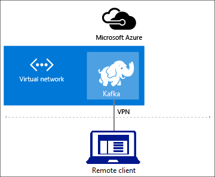

---
title: Connect to Kafka on HDInsight using virtual networks - Azure | Microsoft Docs
description: Learn how to remotely connect to Kafka on HDInsight using the kafka-python client. The configuration in this document uses HDInsight inside an Azure Virtual Network. The remote client connects to the virtual network through a point-to-site VPN gateway.
services: hdinsight
documentationCenter: ''
author: Blackmist
manager: jhubbard
editor: cgronlun
tags: azure-portal

ms.service: hdinsight
ms.devlang: ''
ms.custom: hdinsightactive
ms.topic: article
ms.tgt_pltfrm: 'na'
ms.workload: big-data
ms.date: 04/18/2017
ms.author: larryfr

---

# Connect to Kafka on HDInsight (preview) through an Azure Virtual Network

Learn how to connect to Kafka on HDInsight using Azure Virtual Networks. Kafka clients (producers and consumers) can run either directly on HDInsight or on remote systems. Remote clients must connect to Kafka on HDInsight through an Azure Virtual Network. Use the information in this document to understand how remote clients can connect to HDInsight by using Azure Virtual Networks.

> [!IMPORTANT]
> Several of the configurations discussed in this document can be used with Windows, macOS, or Linux clients. However the included point-to-site example only provides a VPN client for Windows.
>
> The example also uses a Python client ([kafka-python](http://kafka-python.readthedocs.io/en/master/)) to verify communication with Kafka on HDInsight.

## Architecture and planning

HDInsight clusters are secured inside an Azure Virtual Network, and only allow incoming SSH and HTTPS traffic. Traffic arrives through a public gateway, which does not route traffic from Kafka clients. To access Kafka from a remote client, you must create an Azure Virtual Network that provides a virtual private network (VPN) gateway. Once you have configured the virtual network and gateway, install HDInsight into the virtual network and connect to it using the VPN gateway.



The following list contains information on the process of using Kafka on HDInsight with a virtual network:

1. Create a virtual network. For specific information on using HDInsight with Azure Virtual Networks, see the [Extend HDInsight using Azure Virtual Network](hdinsight-extend-hadoop-virtual-network.md) document.

2. (Optional) Create an Azure Virtual Machine inside the virtual network and install a custom DNS server on it. This DNS server is used to enable name resolution for remote clients in a site-to-site or vnet-to-vnet configuration. For more information, see the [Name resolution for VMs and cloud services](../virtual-network/virtual-networks-name-resolution-for-vms-and-role-instances.md) document.

3. Create a VPN Gateway for the virtual network. For more information on VPN gateway configurations, see the [About VPN gateway](../vpn-gateway/vpn-gateway-about-vpngateways.md) document.

4. Create HDInsight inside the virtual network. If you configured a custom DNS server for the network, HDInsight is automatically configured to use it.

5. (Optional) If you did not use a custom DNS server, and do not have name resolution between clients and the virtual network, you must configure Kafka for IP advertising. For more information, see the [Configure Kafka for IP advertising](#configure-kafka-for-ip-advertising) section of this document.

## Create: Using PowerShell

The steps in this section create the following configuration using [Azure PowerShell](/powershell/azure/overview):

* Azure Virtual Network
* Point-to-site VPN gateway
* Azure Storage Account (used by HDInsight)
* Kafka on HDInsight

1. Follow the steps in the [Working with self-signed certificates for Point-to-site connections](../vpn-gateway/vpn-gateway-certificates-point-to-site.md) document to create the certificates needed for the gateway.

2. Open a PowerShell prompt and use the following code to log in to your Azure subscription:

    ```powershell
    Add-AzureRmAccount
    # If you have multiple subscriptions, uncomment to set the subscription
    #Select-AzureRmSubscription -SubscriptionName "name of your subscription"
    ```

3. Use the following code to create variables that contain configuration information:

    ```powershell
    # Prompt for generic information
    $resourceGroupName = Read-Host "What is the resource group name?"
    $baseName = Read-Host "What is the base name? It is used to create names for resources, such as 'net-basename' and 'kafka-basename':"
    $location = Read-Host "What Azure Region do you want to create the resources in?"
    $rootCert = Read-Host "What is the file path to the root certificate? It is used to secure the VPN gateway."

    # Prompt for HDInsight credentials
    $adminCreds = Get-Credential -Message "Enter the HTTPS user name and password for the HDInsight cluster" -UserName "admin"
    $sshCreds = Get-Credential -Message "Enter the SSH user name and password for the HDInsight cluster" -UserName "sshuser"

    # Names for Azure resources
    $networkName = "net-$baseName"
    $clusterName = "kafka-$baseName"
    $storageName = "store$baseName" # Can't use dashes in storage names
    $defaultContainerName = $clusterName
    $defaultSubnetName = "default"
    $gatewaySubnetName = "GatewaySubnet"
    $gatewayPublicIpName = "GatewayIp"
    $gatewayIpConfigName = "GatewayConfig"
    $vpnRootCertName = "rootcert"
    $vpnName = "VPNGateway"

    # Network settings
    $networkAddressPrefix = "10.0.0.0/16"
    $defaultSubnetPrefix = "10.0.0.0/24"
    $gatewaySubnetPrefix = "10.0.1.0/24"
    $vpnClientAddressPool = "172.16.201.0/24"

    # HDInsight settings
    $HdiWorkerNodes = 4
    $hdiVersion = "3.5"
    $hdiType = "Kafka"
    ```

4. Use the following code to create the Azure resource group and virtual network:

    ```powershell
    # Create the resource group that contains everything
    New-AzureRmResourceGroup -Name $resourceGroupName -Location $location

    # Create the subnet configuration
    $defaultSubnetConfig = New-AzureRmVirtualNetworkSubnetConfig -Name $defaultSubnetName `
        -AddressPrefix $defaultSubnetPrefix
    $gatewaySubnetConfig = New-AzureRmVirtualNetworkSubnetConfig -Name $gatewaySubnetName `
        -AddressPrefix $gatewaySubnetPrefix

    # Create the subnet
    New-AzureRmVirtualNetwork -Name $networkName `
        -ResourceGroupName $resourceGroupName `
        -Location $location `
        -AddressPrefix $networkAddressPrefix `
        -Subnet $defaultSubnetConfig, $gatewaySubnetConfig

    # Get the network & subnet that were created
    $network = Get-AzureRmVirtualNetwork -Name $networkName `
        -ResourceGroupName $resourceGroupName
    $gatewaySubnet = Get-AzureRmVirtualNetworkSubnetConfig -Name $gatewaySubnetName `
        -VirtualNetwork $network
    $defaultSubnet = Get-AzureRmVirtualNetworkSubnetConfig -Name $defaultSubnetName `
        -VirtualNetwork $network

    # Set a dynamic public IP address for the gateway subnet
    $gatewayPublicIp = New-AzureRmPublicIpAddress -Name $gatewayPublicIpName `
        -ResourceGroupName $resourceGroupName `
        -Location $location `
        -AllocationMethod Dynamic
    $gatewayIpConfig = New-AzureRmVirtualNetworkGatewayIpConfig -Name $gatewayIpConfigName `
        -Subnet $gatewaySubnet `
        -PublicIpAddress $gatewayPublicIp

    # Get the certificate info
    # Get the full path in case a relative path was passed
    $rootCertFile = Get-ChildItem $rootCert
    $cert = New-Object System.Security.Cryptography.X509Certificates.X509Certificate2($rootCertFile)
    $certBase64 = [System.Convert]::ToBase64String($cert.RawData)
    $p2sRootCert = New-AzureRmVpnClientRootCertificate -Name $vpnRootCertName `
        -PublicCertData $certBase64

    # Create the VPN gateway
    New-AzureRmVirtualNetworkGateway -Name $vpnName `
        -ResourceGroupName $resourceGroupName `
        -Location $location `
        -IpConfigurations $gatewayIpConfig `
        -GatewayType Vpn `
        -VpnType RouteBased `
        -EnableBgp $false `
        -GatewaySku Standard `
        -VpnClientAddressPool $vpnClientAddressPool `
        -VpnClientRootCertificates $p2sRootCert
    ```

    > [!WARNING]
    > It can take several minutes for this process to complete.

5. Use the following code to create the Azure Storage Account and blob container:

    ```powershell
    # Create the storage account
    New-AzureRmStorageAccount `
        -ResourceGroupName $resourceGroupName `
        -Name $storageName `
        -Type Standard_GRS `
        -Location $location

    # Get the storage account keys and create a context
    $defaultStorageKey = (Get-AzureRmStorageAccountKey -ResourceGroupName $resourceGroupName `
        -Name $storageName)[0].Value
    $storageContext = New-AzureStorageContext -StorageAccountName $storageName `
        -StorageAccountKey $defaultStorageKey

    # Create the default storage container
    New-AzureStorageContainer -Name $defaultContainerName `
        -Context $storageContext
    ```

6. Use the following code to create the HDInsight cluster:

    ```powershell
    # Create the HDInsight cluster
    New-AzureRmHDInsightCluster `
        -ResourceGroupName $resourceGroupName `
        -ClusterName $clusterName `
        -Location $location `
        -ClusterSizeInNodes $hdiWorkerNodes `
        -ClusterType $hdiType `
        -OSType Linux `
        -Version $hdiVersion `
        -HttpCredential $adminCreds `
        -SshCredential $sshCreds `
        -DefaultStorageAccountName "$storageName.blob.core.windows.net" `
        -DefaultStorageAccountKey $defaultStorageKey `
        -DefaultStorageContainer $defaultContainerName `
        -VirtualNetworkId $network.Id `
        -SubnetName $defaultSubnet.Id
    ```

  > [!WARNING]
  > This process takes around 20 minutes to complete.

8. Use the following cmdlet to retrieve the URL for the Windows VPN client for the virtual network:

    ```powershell
    Get-AzureRmVpnClientPackage -ResourceGroupName $resourceGroupName `
        -VirtualNetworkGatewayName $vpnName `
        -ProcessorArchitecture Amd64
    ```

    To download the Windows VPN client, use the returned URI in your web browser.

## Configure Kafka for IP advertising

By default, Zookeeper returns the domain name of the Kafka brokers to clients. This configuration does not work for the VPN client, as it cannot use name resolution for entities in the virtual network. Use the following steps to configure Kafka on HDInsight to advertise IP addresses instead of domain names:

1. Using a web browser, go to https://CLUSTERNAME.azurehdinsight.net. Replace __CLUSTERNAME__ with the name of the Kafka on HDInsight cluster.

    When prompted, use the HTTPS user name and password for the cluster. The Ambari Web UI for the cluster is displayed.

2. To view information on Kafka, select __Kafka__ from the list on the left. 

    

3. To view Kafka configuration, select __Configs__ from the top middle.

    

4. To find the __kafka-env__ configuration, enter `kafka-env` in the __Filter__ field on the upper right.

    

5. To configure Kafka to advertise IP addresses, add the following text to the bottom of the __kafka-env-template__ field:

    ```
    # Configure Kafka to advertise IP addresses instead of FQDN
    IP_ADDRESS=$(hostname -i)
    echo advertised.listeners=$IP_ADDRESS
    sed -i.bak -e '/advertised/{/advertised@/!d;}' /usr/hdp/current/kafka-broker/conf/server.properties
    echo "advertised.listeners=PLAINTEXT://$IP_ADDRESS:9092" >> /usr/hdp/current/kafka-broker/conf/server.properties
    ```

6. To configure the interface that Kafka listens on, enter `listeners` in the __Filter__ field on the upper right.

7. To configure Kafka to listen on all network interfaces, change the value in the __listeners__ field to `PLAINTEXT://0.0.0.0:92092`.

8. To save the configuration changes, use the __Save__ button. Enter a text message describing the changes. Select __OK__ once the changes have been saved.

    

9. To prevent errors when restarting Kafka, use the __Service Actions__ button and select __Turn On Maintenance Mode__. Select OK to complete this operation.

    

10. To restart Kafka, use the __Restart__ button and select __Restart All Affected__. Confirm the restart, and then use the __OK__ button after the operation has completed.

    

11. To disable maintenance mode, use the __Service Actions__ button and select __Turn Off Maintenance Mode__. Select **OK** to complete this operation.

## Connect to the VPN gateway

To connect to the VPN gateway from a __Windows client__, use the __Connect to Azure__ section of the [Configure a Point-to-Site connection](../vpn-gateway/vpn-gateway-howto-point-to-site-rm-ps.md#a-nameconnectapart-7---connect-to-azure) document.

## Remote Kafka client

To connect to Kafka from the client machine, you must use the IP address of the Kafka brokers or Zookeeper nodes (whichever your client requires). Use the following steps to retrieve the IP address of the Kafka brokers and then use them from a Python application

1. Use the following script to retrieve the IP addresses of the nodes in the cluster:

    ```powershell
    # Get the NICs for the HDInsight workernodes (names contain 'workernode').
    $nodes = Get-AzureRmNetworkInterface `
        -ResourceGroupName $resourceGroupName `
        | where-object {$_.Name -like "*workernode*"}

    # Loop through each node and get the IP address
    foreach($node in $nodes) {
        $node.IpConfigurations.PrivateIpAddress
    }
    ```

    This script assumes that `$resourceGroupName` is the name of the Azure resource group that contains the virtual network. The output of the script is similar to the following text:

        10.0.0.12
        10.0.0.6
        10.0.0.13
        10.0.0.5

    > [!NOTE]
    > If your Kafka client uses Zookeeper nodes instead of Kafka brokers, replace `*workernode*` with `*zookeepernode*` in the PowerShell script.

    > [!WARNING]
    > If you scale the cluster, or nodes fail and are replaced, the IP addresses may change. There is currently no way to pre-assign specific IP addresses for nodes in an HDInsight cluster.

2. Use the following to install the [kafka-python](http://kafka-python.readthedocs.io/) client:

        pip install kafka-python

3. To send data to Kafka, use the following Python code:

  ```python
  from kafka import KafkaProducer
  # Replace the `ip_address` entries with the IP address of your worker nodes
  producer = KafkaProducer(bootstrap_servers=['ip_address1','ip_address2','ip_adderess3','ip_address4'])
  for _ in range(50):
      producer.send('testtopic', b'test message')
  ```

    Replace the `'ip_address'` entries with the addresses returned from step 1 in this section.
    
    > [!NOTE]
    > This code sends the string `test message` to the topic `testtopic`. The default configuration of Kafka on HDInsight is to create the topic if it does not exist.

4. To retrieve the messages from Kafka, use the following Python code:

   ```python
   from kafka import KafkaConsumer
   # Replace the `ip_address` entries with the IP address of your worker nodes
   # Note: auto_offset_reset='earliest' resets the starting offset to the beginning
   #       of the topic
   consumer = KafkaConsumer(bootstrap_servers=['ip_address1','ip_address2','ip_adderess3','ip_address4'],auto_offset_reset='earliest')
   consumer.subscribe(['testtopic'])
   for msg in consumer:
     print (msg)
   ```

    Replace the `'ip_address'` entries with the addresses returned from step 1 in this section. The output contains the test message sent to the producer in the previous step.

## Troubleshooting

If you have problems connecting to the virtual network, or connecting to HDInsight through the network, see the [Troubleshoot virtual network gateway and connections](../network-watcher/network-watcher-troubleshoot-manage-powershell.md) document for guidance.

## Next steps

For more information on creating an Azure Virtual Network with Point-to-Site VPN gateway, see the following documents:

* [Configure a Point-to-Site connection using the Azure portal](../vpn-gateway/vpn-gateway-howto-point-to-site-resource-manager-portal.md)

* [Configure a Point-to-Site connection using Azure PowerShell](../vpn-gateway/vpn-gateway-howto-point-to-site-rm-ps.md)

For more information on working with Kafka on HDInsight, see the following documents:

* [Get started with Kafka on HDInsight](hdinsight-apache-kafka-get-started.md)
* [Use mirroring with Kafka on HDInsight](hdinsight-apache-kafka-mirroring.md)
