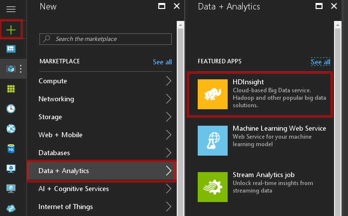
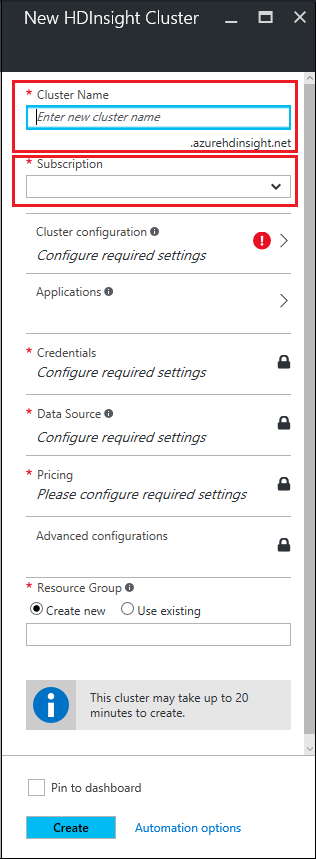
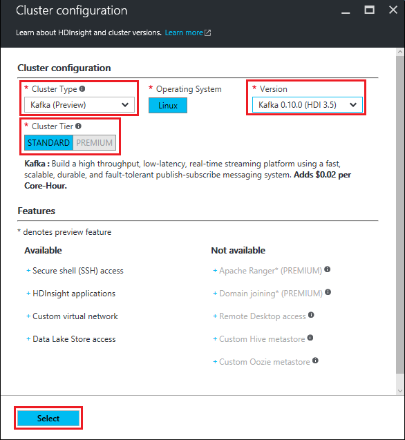
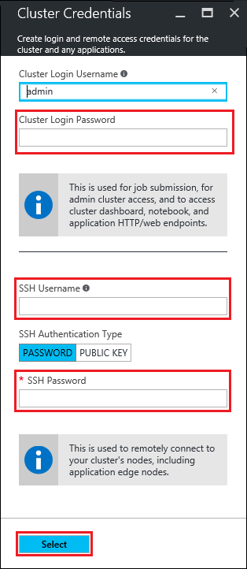
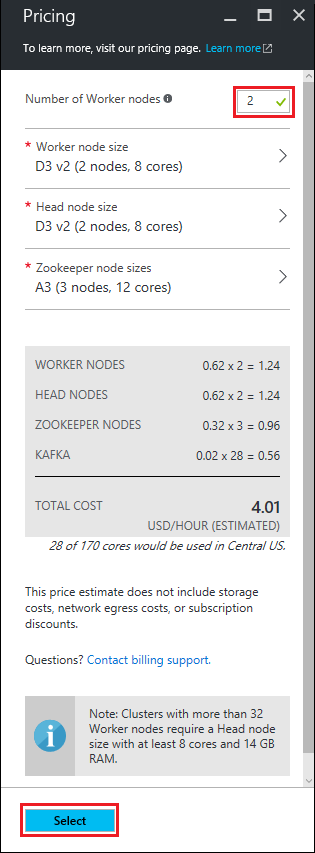
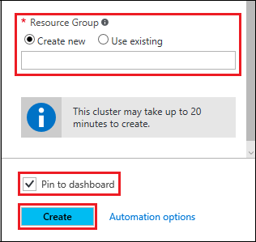

# Get started with Apache Kafka (preview) on HDInsight
[Apache Kafka](https://kafka.apache.org) is an open-source distributed streaming platform that is available with HDInsight. It is often used as a message broker, as it provides functionality similar to a publish-subscribe message queue. In this document, you learn how to create a Kafka on HDInsight cluster and then send and receive data from a Java application.

> [!NOTE]
> There are currently two versions of Kafka available with HDInsight; 0.9.0 (HDInsight 3.4) and 0.10.0 (HDInsight 3.5). The steps in this document assume that you are using Kafka on HDInsight 3.5.
> 
> 

## Prerequisite
[!INCLUDE [delete-cluster-warning](../../includes/hdinsight-delete-cluster-warning.md)]

You must have the following to successfully complete this Apache Storm tutorial:

* **An Azure subscription**. See [Get Azure free trial](https://azure.microsoft.com/documentation/videos/get-azure-free-trial-for-testing-hadoop-in-hdinsight/).
* **Familiarity with SSH and SCP**. For more information on using SSH and SCP with HDInsight, see the following:
  
  * **Linux, Unix or OS X clients**: See [Use SSH with Linux-based Hadoop on HDInsight from Linux, OS X or Unix](hdinsight-hadoop-linux-use-ssh-unix.md)
  * **Windows clients**: See [Use SSH with Linux-based Hadoop on HDInsight from Windows](hdinsight-hadoop-linux-use-ssh-windows.md)
* [Java JDK 8](http://www.oracle.com/technetwork/java/javase/downloads/index.html) or an equivalent, such as OpenJDK.
* [Apache Maven](http://maven.apache.org/) 

### Access control requirements
[!INCLUDE [access-control](../../includes/hdinsight-access-control-requirements.md)]

## Create a Kafka cluster
Use the following steps to create a Kafka on HDInsight cluster:

1. From the [Azure portal](https://portal.azure.com), select **+ NEW**, **Intelligence + Analytics**, and then select **HDInsight**.
   
    
2. From the **New HDInsight Cluster** blade, enter a **Cluster Name** and select the **Subscription** to use with this cluster.
   
    
3. Use **Select Cluster Type** and select the following values on the **Cluster Type configuration** blade:
   
   * **Cluster Type**: Kafka
   * **Version**: Kafka 0.10.0 (HDI 3.5)
   * **Cluster Tier**: Standard
     
     Finally, use the **Select** button to save settings.
     
     
4. Use **Credentials** to configure the cluster login and SSH user credentials.  Use the **Select** button to save settings.
   
   > [!NOTE]
   > The cluster login is used when accessing the cluster over the internet using HTTPS. The SSH user is used to connect to the cluster and interactively run commands.
   > 
   > 
   
    
   
    For more information on using SSH with HDInsight, see the following documents:
   
   * [Use SSH with HDInsight from a Linux, Unix, or MacOS client](hdinsight-hadoop-linux-use-ssh-unix.md)
   * [Use SSH with HDInsight from a Windows client](hdinsight-hadoop-linux-use-ssh-windows.md)
5. Use **Data Source** to configure the primary data store for the cluster. From the **Data Source** blade, use the following information to create a new data store for the cluster:
   
   * Select **Create new** and then enter a name for the storage account.
   * Select **Location** and then select a location that is geographically close to you. This will be the location used to create both the storage account and the HDInsight cluster.
     
     Finally, use the **Select** button to save settings.
     
     
6. Use **Pricing**, and then set the **Number of Worker Nodes** to 2. This is enough worker nodes for the steps in this document, and helps reduce the cost of the cluster. Use the **Select** button to save settings.
   
    
   
   > [!NOTE]
   > The prices displayed in the portal may be different than those in the screenshot above.
   > 
   > 
7. Use **Resource Group** to create a new group, and enter the name in the field. Also select **Pin to dashboard**. When done, select **Create** to create the cluster.
   
    
   
   > [!NOTE]
   > It can take up to 20 minutes to create the cluster.
   > 
   > 

## Connect to the cluster
From your client, use SSH to connect to the cluster. If you are using a Linux, Unix, MacOS, or Bash on Windows 10, you will use the following command:

    ssh USERNAME@CLUSTERNAME-ssh.azurehdinsight.net

Replace **USERNAME** with the SSH username you provided during cluster creation. Replace **CLUSTERNAME** with the name of the cluster.

When prompted, enter the password you used for the SSH account.

For information on using SSH with HDInsight, see the following documents:

* [Use SSH with Linux-based Hadoop on HDInsight from Linux, Unix, or OS X](hdinsight-hadoop-linux-use-ssh-unix.md)
* [Use SSH with Linux-based Hadoop on HDInsight from Windows](hdinsight-hadoop-linux-use-ssh-windows.md)

## Get the Zookeeper and Broker host information
When working with Kafka, you must know two set of host values; the *Zookeeper* hosts and the *Broker* hosts. These are used with the Kafka API and many of the utilities that ship with Kafka.

Use the following steps to create a script that creates environment variables that contain the host information. These environment variables will be used in the steps in this document.

1. From an SSH connectin to the cluster, use the following to install the `jq` utility. This is used to parse JSON documents, and is useful in retrieving the broker host information:
   
        sudo apt-get -y install jq
2. use the following command to create a new file named **.bash\_profile** and open it in the `nano` editor:
   
        nano ~/.bash_profile
3. Use the following as the file contents:
   
        export ZKHOSTS=`grep -R zk /etc/hadoop/conf/yarn-site.xml | grep 2181 | grep -oPm1 "(?<=<value>)[^<]+"`
        export BROKERHOSTS=`sudo bash -c 'ls /var/lib/ambari-agent/data/command-[0-9]*.json' | tail -n 1 | xargs sudo cat | jq -r '["\(.clusterHostInfo.kafka_broker_hosts[]):9092"] | join(",")'`
4. Use **Ctrl + X**, then **Y**, and finally **Enter** to save the file and exit the editor.
5. Use the following to source the file:
   
        source ~/.bash_profile
   
    This executes the commands in the file as if they were typed at the prompt.
   
   > [!NOTE]
   > You only need to source the file since the SSH session was created before the `.bash_profile` file. When you connect to the cluster using SSH in the future, `.bash_profile` is executed as part of the login process.
   > 
   > 
6. Use the following to verify that the `ZKHOSTS` and `BROKERHOSTS` are set correctly:
   
        echo $ZKHOSTS
        echo $BROKERHOSTS
   
    The following is an example of the contents of `ZKHOSTS`:
   
        zk0-kafka.eahjefxxp1netdbyklgqj5y1ud.ex.internal.cloudapp.net:2181,zk2-kafka.eahjefxxp1netdbyklgqj5y1ud.ex.internal.cloudapp.net:2181,zk3-kafka.eahjefxxp1netdbyklgqj5y1ud.ex.internal.cloudapp.net:2181
   
    The following is an example of the contents of `BROKERHOSTS`:
   
        wn1-kafka.eahjefxxp1netdbyklgqj5y1ud.cx.internal.cloudapp.net:9092,wn0-kafka.eahjefxxp1netdbyklgqj5y1ud.cx.internal.cloudapp.net:9092
   
   > [!WARNING]
   > Do not rely on the information returned from this session to always be accurate. If you scale out the cluster, new brokers are added. Similiarly, scale down operations remove brokers. If a failure occurs and a node is replaced, the host name for the node may change. 
   > 
   > You should always retrieve the Zookeeper and broker hosts information shortly before you use it to ensure you have valid information.
   > 
   > 

## Create a topic
Kafka stores streams of data in categories called *topics*. From An SSH connection to a cluster headnode, use a script provided with Kafka to create a topic:

    /usr/hdp/current/kafka-broker/bin/kafka-topics.sh --create --replication-factor 2 --partitions 8 --topic test --zookeeper $ZKHOSTS

This command will connect to Zookeeper using the host information stored in `$ZKHOSTS`, and then create a new Kafka topic named **test**. You can verify that the topic was created by using the following script to list topics:

    /usr/hdp/current/kafka-broker/bin/kafka-topics.sh --list --zookeeper $ZKHOSTS

The output of this command lists Kafka topics, which contains the **test** topic.

## Produce and consume records
Kafka stores *records* in topics. Records are produced by *producers*, and consumed by *consumers*. Producers retrieve records from Kafka *brokers*. Each worker node in your HDInsight cluster is a Kafka broker.

Use the following steps to store records into the test topic you created earlier, and then read them using a consumer:

1. From the SSH session, use a script provided with Kafka to write records to the topic:
   
        /usr/hdp/current/kafka-broker/bin/kafka-console-producer.sh --broker-list $BROKERHOSTS --topic test
   
    You will not return to the prompt after this command. Instead, type a few text messages and then use **Ctrl + C** to stop sending to the topic. Each line will be sent as a separate record.
2. Use a script provided with Kafka to read records from the topic:
   
        /usr/hdp/current/kafka-broker/bin/kafka-console-consumer.sh --zookeeper $ZKHOSTS --topic test --from-beginning
   
    This will retrieve the records from the topic and display them. Using `--from-beginning` tells the consumer to start from the beginning of the stream, so all records are retrieved.

## Producer and consumer API
You can also programmatically produce and consume records using the [Kafka APIs](http://kafka.apache.org/documentation#api). Use the following steps to download, build a Java-based producer and consumer:

1. Download the examples from [TBD]. For the producer/consumer example, use the project in the `producer-consumer` directory. Be sure to look through the code to understand how this example works. It contains the following classes:
   
   * **Run** - starts either the consumer or producer based on command-line arguments.
   * **Producer** - stores 1,000,000 records to the topic.
   * **Consumer** - reads records from the topic.
2. From the command-line in your development environment, change directories to the location of the `producer-consumer` directory of the example and then use the following command to create a jar package:
   
        mvn clean package
   
    This command creates a new directory named `target`, that contains a file named `kafka-example-1.0-SNAPSHOT.jar`.
3. Use the following commands to copy the `kafka-example-1.0-SNAPSHOT.jar` file to your HDInsight cluster:
   
        cd target
        scp kafka-example-1.0-SNAPSHOT.jar SSHUSER@CLUSTERNAME-ssh.azurehdinsight.net:kafka-example.jar
   
    Replace **SSHUSER** with the SSH user for your cluster, and replace **CLUSTERNAME** with the name of your cluster. When prompted enter the password for the SSH user.
4. Once the `scp` command finishes copying the file, connect to the cluster using SSH, and then use the following to write records to the test topic you created earlier.
   
        ./kafka-example.jar producer $BROKERHOSTS
   
    This will start the producer and write records. A counter is displayed so you can see how many records have been written.
5. Once the process has finished, use the following command to read from the topic:
   
        ./kafka-example.jar consumer $BROKERHOSTS
   
    The records read, along with a count of records, is displayed. You may see a few more than 1,000,000 logged as we sent several records to the topic using a script in an earlier step.

### Multiple consumers
An important concept with Kafka is that consumers use a consumer group (defined by a group id) when reading records. This allows multiple consumers that use the same group to load balance reads from a topic. Each consumer will receive a portion of the records. To see this in action, use the following steps:

1. Open a new SSH session to the cluster, so that you have two of them. In each session, use the following to start a consumer with the same consumer group id:
   
        ./kafka-example.jar consumer $BROKERHOSTS mygroup
2. Watch as each session counts the records it receives from the topic. The total of both sessions should be the same as you received previously from one consumer.

Consumption by clients within the same group is handled through the partitions for the topic. For the `test` topic created earlier, it has 8 partitions. If you open 8 SSH sessions and launch a consumer in all sessions, each consumer will read records from a single partition for the topic.

> [!IMPORTANT]
> There cannot be more consumer instances in a consumer group than partitions. In this example, one consumer group can contain up to 8 consumers since that is the number of partitions in the topic. Or you can have multiple consumer groups, each with no more than 8 consumers.
> 
> 

Records stored in Kafka are stored in the order they are received within a partition. To achieve in-ordered delivery for records *within a partition*, create a consumer group where the number of consumer instances matches the number of partitions. To achieve in-ordered delivery for records *within the topic*, create a consumer group with only one consumer instance.

## Streaming API
The streaming API was added to Kafka in version 0.10.0; earlier versions rely on Apache Spark or Storm for stream processing.

1. If you haven't already done so, download the examples from [TBD]. For the streaming example, use the project in the `streaming` directory. Be sure to look through the code to understand how this example works. 
   
    This project contains only one class, `Stream`, which reads records from the `test` topic created previously. It counts the words read, and emits each word and count to a topic named `wordcounts`. The `wordcounts` topic will be created in a later step in this section.
2. From the command-line in your development environment, change directories to the location of the `producer-consumer` directory of the example and then use the following command to create a jar package:
   
        mvn clean package
   
    This command creates a new directory named `target`, that contains a file named `kafka-example-1.0-SNAPSHOT.jar`.
3. Use the following commands to copy the `kafka-example-1.0-SNAPSHOT.jar` file to your HDInsight cluster:
   
        cd target
        scp streaming-example-1.0-SNAPSHOT.jar SSHUSER@CLUSTERNAME-ssh.azurehdinsight.net:streaming-example.jar
   
    Replace **SSHUSER** with the SSH user for your cluster, and replace **CLUSTERNAME** with the name of your cluster. When prompted enter the password for the SSH user.
4. Once the `scp` command finishes copying the file, connect to the cluster using SSH, and then use the following to write records to the test topic you created earlier.
   
        ./streaming-example.jar $BROKERHOSTS $ZKHOSTS
   
    This will start the streaming process. It will remain running until you press **Ctrl + C**.
5. Open another SSH session to the cluster and use the following to send messages to the `test` topic. These will be processed by the streaming example:
   
        ./kafka-example.jar producer $BROKERHOSTS
6. While the producer is running, open another SSH session and use the following to view the output that is written to the `wordcounts` topic:
   
        /usr/hdp/current/kafka-broker/bin/kafka-console-consumer.sh --zookeeper $ZKHOSTS --topic wordcounts --from-beginning --formatter kafka.tools.DefaultMessageFormatter --property print.key=true --property key.deserializer=org.apache.kafka.common.serialization.StringDeserializer --property value.deserializer=org.apache.kafka.common.serialization.LongDeserializer
   
   > [!NOTE]
   > We have to tell the consumer to print the key (which contains the word value) and the deserializer to use for the key and value in order to view the data.
   > 
   > 
   
    The output is similar to the following:
   
        dwarfs  13635
        ago     13664
        snow    13636
        dwarfs  13636
        ago     13665
        a       13803
        ago     13666
        a       13804
        ago     13667
        ago     13668
        jumped  13640
        jumped  13641
        a       13805
        snow    13637
   
    Note that the count increments each time a word is encountered.

## Connect API
The connect API allows you to define sinks or sources for external data sources. Kafka can then use the connector to read from sources or store information to sinks.

Connectors are configured using **properties** files. You can find the files used by built-in connectors at `/etc/kafka/conf` on your HDInsight cluster. For example, `/etc/kafka/conf/connect-file-source.properties` contains the following:

    name=local-file-source
    connector.class=FileStreamSource
    tasks.max=1
    file=test.txt
    topic=connect-test

This configures a file connector with the following settings:

* A **name** of **local-file-Source**.
* The class that contains the connector (**connector.class) is __FileStreamSource**.
* It will create a maximum of one task (**tasks.max**).
* The **file** that is used as the source is **test.txt**.
* The **topic** that information is sent to is named **connect-test**.

The `/etc/kafka/conf/connect-file-sink.properties` contains information used to write data to a file from kafka:

    name=local-file-sink
    connector.class=FileStreamSink
    tasks.max=1
    file=test.sink.txt
    topics=connect-test

The default is to write data from the **connect-test** topic to a file named **test.sink.txt**.

1. create the topic

## Next steps
In this document, you have learned the basics of working with Apache Kafka on HDInsight. Use the following to learn more about working with Kafka:

* [Apache Kafka documentation](http://kafka.apache.org/documentation.html) at kafka.apache.org.
* [Use MirrorMaker to create a replica of Kafka on HDInsight](hdinsight-apache-kafka-mirroring.md)
* [Use Apache Storm with Kafka on HDInsight](hdinsight-apache-storm-with-kafka.md)
* [Use Apache Spark with Kafka on HDInsight](hdinsight-apache-spark-with-kafka.md)

