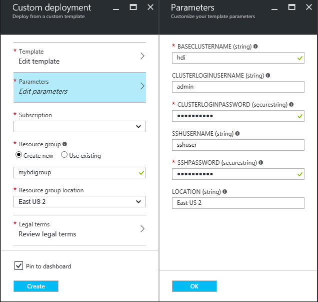

# Use MirrorMaker to create a replica of a Kafka on HDInsight cluster (preview)

Apache Kafka includes a mirroring feature, which allows you to replicate topics from one Kafka cluster to another. For example, replicating records between Kafka cluster in different Azure regions.

Mirroring can be ran as a continuous process, or used intermittently as a method of migrating data from one cluster to another.

> [!WARNING]
> Mirroring should not be considered as a means to achieve fault-tolerance. The offset to items within a topic are different between the source and destination clusters, so clients cannot use the two interchangeably.
> 
> If you are concerned about fault tolerance, you should set replication for the topics within your cluster. For more information, see [Get started with Kafka on HDInsight](hdinsight-apache-kafka-get-started.md).

## Prerequisites

* An Azure Virtual Network: The source and destination Kafka clusters must be able to directly communicate with each other. HDInsight does not expose Kafka APIs publicly on the internet, so both the source and destination clusters must exist in the same Azure Virtual Network.

* Two Kafka clusters: This document uses an Azure Resource Manager template to create two Kafka on HDInsight clusters within an Azure Virtual Network.

## How does mirroring work?

Mirroring works by using the MirrorMaker tool (part of Apache Kafka) to consume records from topics on the source cluster and then create a local copy on the destination cluster. MirrorMaker uses one (or more) *consumers* that read from the source cluster, and a *producer* that writes to the local (destination) cluster.

The following diagram illustrates the Mirroring process:


The source and destination clusters can be different in the number of nodes and partitions, and offsets within the topics are different also. Mirroring maintains the key value that is used for partitioning, so record order is preserved on a per-key basis.

### Mirroring between networks

If you need to mirror between Kafka clusters in different networks, there are the following additional considerations:

* **Gateways**: The networks must be able to communicate at the TCPIP level.

* **Name resolution**: The Kafka clusters in each network must be able to connect to each other by using hostnames. This may require a Domain Name System (DNS) server in each network that is configured to forward requests to the other networks. 
  
    When creating an Azure Virtual Network, instead of using the automatic DNS provided with the network, you must specify a custom DNS server and the IP address for the server. After the Virtual Network has been created, you must then create an Azure Virtual Machine that uses that IP address, then install and configure DNS software on it.
  
    > [!WARNING]
    > Create and configure the custom DNS server before installing HDInsight into the Virtual Network. There is no additional configuration required for HDInsight to use the DNS server configured for the Virtual Network.

For more information on connecting two Azure Virtual Networks, see [Configure a VNet-to-VNet connection](../vpn-gateway/vpn-gateway-vnet-vnet-rm-ps.md).

## Create Kafka clusters

Apache Kafka on HDInsight does not provide access to the Kafka service over the public internet. Anything that talks to Kafka must be in the same Azure virtual network as the nodes in the Kafka cluster. For this example, both the Kafka source and destination clusters are located in an Azure virtual network. The following diagram shows how communication flows between the clusters:


> [!NOTE]
> Though Kafka itself is limited to communication within the virtual network, other services on the cluster such as SSH and Ambari can be accessed over the internet. For more information on the public ports available with HDInsight, see [Ports and URIs used by HDInsight](hdinsight-hadoop-port-settings-for-services.md).

While you can create an Azure virtual network and Kafka clusters manually, it's easier to use an Azure Resource Manager template. Use the following steps to deploy an Azure virtual network and two Kafka clusters to your Azure subscription.

1. Use the following button to sign in to Azure and open the template in the Azure portal.
   
    <a href="https://portal.azure.com/#create/Microsoft.Template/uri/https%3A%2F%2Fhditutorialdata.blob.core.windows.net%2Farmtemplates%2Fcreate-linux-based-kafka-mirror-cluster-in-vnet.json" target="_blank"></a>
   
    The Azure Resource Manager template is located at **https://hditutorialdata.blob.core.windows.net/armtemplates/create-linux-based-kafka-mirror-cluster-in-vnet.json**.

2. Use the following information to populate the entries on the **Custom deployment** blade:
    
    
    
    * **Resource group**: Create a group or select an existing one. This group contains the HDInsight cluster.

    * **Location**: Select a location geographically close to you. This location must match the location in the __SETTINGS__ section.
     
    * **Base Cluster Name**: This value is used as the base name for the Kafka clusters. For example, entering **hdi** creates clusters named **source-hdi** and **dest-hdi**.

    * **Cluster Login User Name**: The admin user name for the source and destination Kafka clusters.

    * **Cluster Login Password**: The admin user password for the source and destination Kafka clusters.

    * **SSH User Name**: The SSH user to create for the source and destination Kafka clusters.

    * **SSH Password**: The password for the SSH user for the source and destination Kafka clusters.

    * **Location**: The region that the clusters are created in.

3. Read the **Terms and Conditions**, and then select **I agree to the terms and conditions stated above**.

4. Finally, check **Pin to dashboard** and then select **Purchase**. It takes about 20 minutes to create the clusters.

Once the resources have been created, you are redirected to a blade for the resource group that contains the clusters and web dashboard.


> [!IMPORTANT]
> Notice that the names of the HDInsight clusters are **source-BASENAME** and **dest-BASENAME**, where BASENAME is the name you provided to the template. You use these names in later steps when connecting to the clusters.

## Create topics

1. Connect to the **source** cluster using SSH:
   
        ssh sshuser@source-BASENAME-ssh.azurehdinsight.net
   
    Replace **sshuser** with the SSH user name used when creating the cluster. Replace **BASENAME** with the base name used when creating the cluster.
   
    For information, see [Use SSH with HDInsight](hdinsight-hadoop-linux-use-ssh-unix.md).

2. Use the following command to find the Zookeeper hosts, set the `SOURCE_ZKHOSTS` variable, and then create several new topics named `testtopic`:
   
    ```bash
    SOURCE_ZKHOSTS=`grep -R zk /etc/hadoop/conf/yarn-site.xml | grep 2181 | grep -oPm1 "(?<=<value>)[^<]+"`
    /usr/hdp/current/kafka-broker/bin/kafka-topics.sh --create --replication-factor 2 --partitions 8 --topic testtopic --zookeeper $SOURCE_ZKHOSTS
    ```

3. Use the following command to verify that the topic was created:
   
    ```bash
    /usr/hdp/current/kafka-broker/bin/kafka-topics.sh --list --zookeeper $SOURCE_ZKHOSTS
    ```
   
    The response contains `testtopic`.

4. Use the following to view the Zookeeper host information for this (the **source**) cluster:
   
    ```bash
    echo $SOURCE_ZKHOSTS
    ```
   
 This returns information similar to the following text:
   
       zk0-source.aazwc2onlofevkbof0cuixrp5h.gx.internal.cloudapp.net:2181,zk1-source.aazwc2onlofevkbof0cuixrp5h.gx.internal.cloudapp.net:2181,zk6-source.aazwc2onlofevkbof0cuixrp5h.gx.internal.cloudapp.net:2181
   
 Save this information. It is used in the next section.

## Configure mirroring

1. Connect to the **destination** cluster using a different SSH session:
   
        ssh sshuser@dest-BASENAME-ssh.azurehdinsight.net
   
    Replace **sshuser** with the SSH user name used when creating the cluster. Replace **BASENAME** with the base name used when creating the cluster.
   
    For information, see [Use SSH with HDInsight](hdinsight-hadoop-linux-use-ssh-unix.md).

2. Use the following command to create a `consumer.properties` file that describes how to communicate with the **source** cluster:
   
    ```bash
    nano consumer.properties
    ```
   
    Use the following text as the contents of the `consumer.properties` file:
   
        zookeeper.connect=SOURCE_ZKHOSTS
        group.id=mirrorgroup
   
    Replace **SOURCE_ZKHOSTS** with the Zookeeper hosts information from the **source** cluster.
   
    This file describes the consumer information to use when reading from the source Kafka cluster. For more information consumer configuration, see [Consumer Configs](https://kafka.apache.org/documentation#consumerconfigs) at kafka.apache.org.
   
    Use **Ctrl + X**, **Y**, and Enter to save the file.

3. Before configuring the producer that communicates with the destination cluster, you must find the broker hosts for the **destination** cluster. Use the following commands to retrieve this information:
   
    ```bash
    sudo apt -y install jq
    DEST_BROKERHOSTS=`sudo bash -c 'ls /var/lib/ambari-agent/data/command-[0-9]*.json' | tail -n 1 | xargs sudo cat | jq -r '["\(.clusterHostInfo.kafka_broker_hosts[]):9092"] | join(",")'`
    echo $DEST_BROKERHOSTS
    ```
   
    These commands return information similar to the following:
   
        wn0-dest.aazwc2onlofevkbof0cuixrp5h.gx.internal.cloudapp.net:9092,wn1-dest.aazwc2onlofevkbof0cuixrp5h.gx.internal.cloudapp.net:9092

4. Use the following to create a `producer.properties` file that describes how to communicate with the **destination** cluster:

    ```bash
    nano producer.properties
    ```

    Use the following text as the contents of the `producer.properties` file:
   
        bootstrap.servers=DEST_BROKERS
        compression.type=none
   
    Replace **DEST_BROKERS** with the broker information from the previous step. 
   
    For more information producer configuration, see [Producer Configs](https://kafka.apache.org/documentation#producerconfigs) at kafka.apache.org.

## Start MirrorMaker

1. From the SSH connection to the **destination** cluster, use the following command to start the MirrorMaker process:
   
    ```bash
    /usr/hdp/current/kafka-broker/bin/kafka-run-class.sh kafka.tools.MirrorMaker --consumer.config consumer.properties --producer.config producer.properties --whitelist testtopic --num.streams 4
    ```
   
    The parameters used in this example are:
   
    * **--consumer.config**: Specifies the file that contains consumer properties. These properties are used to create a consumer that reads from the *source* Kafka cluster.

    * **--producer.config**: Specifies the file that contains producer properties. These properties are used to create a producer that writes to the *destination* Kafka cluster.

    * **--whitelist**: A list of topics that MirrorMaker replicates from the source cluster to the destination.
    
    * **--num.streams**: The number of consumer threads to create.
     
    On startup, MirrorMaker returns information similar to the following text:
        
    ```
    {metadata.broker.list=wn1-source.aazwc2onlofevkbof0cuixrp5h.gx.internal.cloudapp.net:9092,wn0-source.aazwc2onlofevkbof0cuixrp5h.gx.internal.cloudapp.net:9092, request.timeout.ms=30000, client.id=mirror-group-3, security.protocol=PLAINTEXT}{metadata.broker.list=wn1-source.aazwc2onlofevkbof0cuixrp5h.gx.internal.cloudapp.net:9092,wn0-source.aazwc2onlofevkbof0cuixrp5h.gx.internal.cloudapp.net:9092, request.timeout.ms=30000, client.id=mirror-group-0, security.protocol=PLAINTEXT}
    metadata.broker.list=wn1-source.aazwc2onlofevkbof0cuixrp5h.gx.internal.cloudapp.net:9092,wn0-kafka.aazwc2onlofevkbof0cuixrp5h.gx.internal.cloudapp.net:9092, request.timeout.ms=30000, client.id=mirror-group-2, security.protocol=PLAINTEXT}
    metadata.broker.list=wn1-source.aazwc2onlofevkbof0cuixrp5h.gx.internal.cloudapp.net:9092,wn0-source.aazwc2onlofevkbof0cuixrp5h.gx.internal.cloudapp.net:9092, request.timeout.ms=30000, client.id=mirror-group-1, security.protocol=PLAINTEXT}
    ```

2. From the SSH connection to the **source** cluster, use the following command to start a producer and send messages to the topic:
    
    ```bash
    sudo apt -y install jq
    SOURCE_BROKERHOSTS=`sudo bash -c 'ls /var/lib/ambari-agent/data/command-[0-9]*.json' | tail -n 1 | xargs sudo cat | jq -r '["\(.clusterHostInfo.kafka_broker_hosts[]):9092"] | join(",")'`
    /usr/hdp/current/kafka-broker/bin/kafka-console-producer.sh --broker-list $SOURCE_BROKERHOSTS --topic testtopic
    ```

 When you arrive at a blank line with a cursor, type in a few text messages. These are sent to the topic on the **source** cluster. When done, use **Ctrl + C** to end the producer process.

3. From the SSH connection to the **destination** cluster, use **Ctrl + C** to end the MirrorMaker process. Then use the following commands to verify that the `testtopic` topic was created, and that data in the topic was replicated to this mirror:
    
    ```bash
    DEST_ZKHOSTS=`grep -R zk /etc/hadoop/conf/yarn-site.xml | grep 2181 | grep -oPm1 "(?<=<value>)[^<]+"`
    /usr/hdp/current/kafka-broker/bin/kafka-topics.sh --list --zookeeper $DEST_ZKHOSTS
    /usr/hdp/current/kafka-broker/bin/kafka-console-consumer.sh --zookeeper $DEST_ZKHOSTS --topic testtopic --from-beginning
    ```
    
  The list of topics now includes `testtopic`, which is created when MirrorMaster mirrors the topic from the source cluster to the destination. The messages retrieved from the topic are the same as entered on the source cluster.

## Delete the cluster

[!INCLUDE [delete-cluster-warning](../../includes/hdinsight-delete-cluster-warning.md)]

Since the steps in this document create both clusters in the same Azure resource group, you can delete the resource group in the Azure portal. Deleting the resource group removes all resources created by following this document, the Azure Virtual Network, and storage account used by the clusters.

## Next Steps

In this document, you learned how to use MirrorMaker to create a replica of a Kafka cluster. Use the following links to discover other ways to work with Kafka:

* [Apache Kafka MirrorMaker documentation](https://cwiki.apache.org/confluence/pages/viewpage.action?pageId=27846330) at cwiki.apache.org.
* [Get started with Apache Kafka on HDInsight](hdinsight-apache-kafka-get-started.md)
* [Use Apache Spark with Kafka on HDInsight](hdinsight-apache-spark-with-kafka.md)
* [Use Apache Storm with Kafka on HDInsight](hdinsight-apache-storm-with-kafka.md)
* [Connect to Kafka through an Azure Virtual Network](hdinsight-apache-kafka-connect-vpn-gateway.md)
