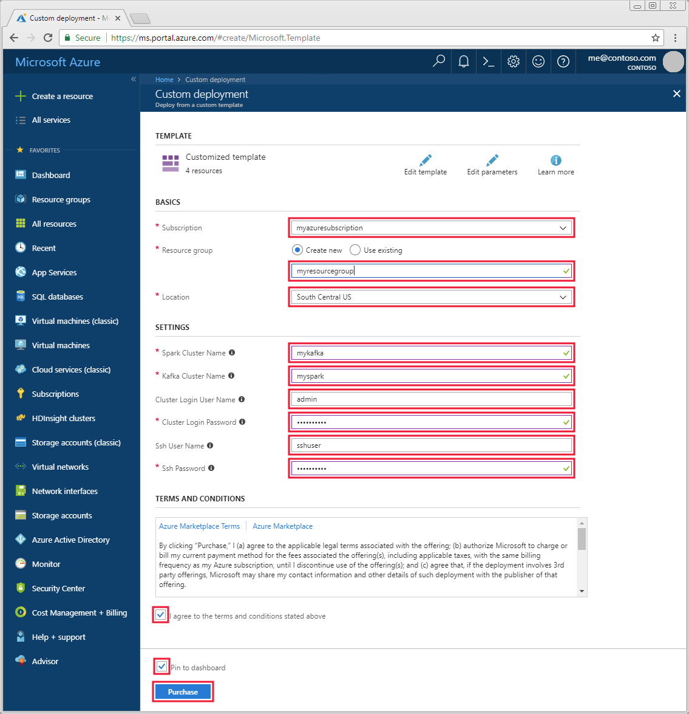

# Tutorial: Use Apache Spark Structured Streaming with Apache Kafka on HDInsight

This tutorial demonstrates how to use [Apache Spark Structured Streaming](https://spark.apache.org/docs/latest/structured-streaming-programming-guide) to read and write data with [Apache Kafka](./kafka/apache-kafka-introduction.md) on Azure HDInsight.

Spark Structured Streaming is a stream processing engine built on Spark SQL. It allows you to express streaming computations the same as batch computation on static data.  

In this tutorial, you learn how to:

> [!div class="checklist"]
> * Use an Azure Resource Manager template to create clusters
> * Use Spark Structured Streaming with Kafka

When you're done with the steps in this document, remember to delete the clusters to avoid excess charges.

## Prerequisites

* jq, a command-line JSON processor.  See [https://stedolan.github.io/jq/](https://stedolan.github.io/jq/).

* Familiarity with using [Jupyter Notebooks](https://jupyter.org/) with Spark on HDInsight. For more information, see the [Load data and run queries with Apache Spark on HDInsight](spark/apache-spark-load-data-run-query.md) document.

* Familiarity with the Scala programming language. The code used in this tutorial is written in Scala.

* Familiarity with creating Kafka topics. For more information, see the [Apache Kafka on HDInsight quickstart](kafka/apache-kafka-get-started.md) document.

> [!IMPORTANT]  
> The steps in this document require an Azure resource group that contains both a Spark on HDInsight and a Kafka on HDInsight cluster. These clusters are both located within an Azure Virtual Network, which allows the Spark cluster to directly communicate with the Kafka cluster.
>
> For your convenience, this document links to a template that can create all the required Azure resources.
>
> For more information on using HDInsight in a virtual network, see the [Plan a virtual network for HDInsight](hdinsight-plan-virtual-network-deployment.md) document.

## Structured Streaming with Apache Kafka

Spark Structured Streaming is a stream processing engine built on the Spark SQL engine. When using Structured Streaming, you can write streaming queries the same way you write batch queries.

The following code snippets demonstrate reading from Kafka and storing to file. The first one is a batch operation, while the second one is a streaming operation:

```scala
// Read a batch from Kafka
val kafkaDF = spark.read.format("kafka")
                .option("kafka.bootstrap.servers", kafkaBrokers)
                .option("subscribe", kafkaTopic)
                .option("startingOffsets", "earliest")
                .load()

// Select data and write to file
kafkaDF.select(from_json(col("value").cast("string"), schema) as "trip")
                .write
                .format("parquet")
                .option("path","/example/batchtripdata")
                .option("checkpointLocation", "/batchcheckpoint")
                .save()
```

```scala
// Stream from Kafka
val kafkaStreamDF = spark.readStream.format("kafka")
                .option("kafka.bootstrap.servers", kafkaBrokers)
                .option("subscribe", kafkaTopic)
                .option("startingOffsets", "earliest")
                .load()

// Select data from the stream and write to file
kafkaStreamDF.select(from_json(col("value").cast("string"), schema) as "trip")
                .writeStream
                .format("parquet")
                .option("path","/example/streamingtripdata")
                .option("checkpointLocation", "/streamcheckpoint")
                .start.awaitTermination(30000)
```

In both snippets, data is read from Kafka and written to file. The differences between the examples are:

| Batch | Streaming |
| --- | --- |
| `read` | `readStream` |
| `write` | `writeStream` |
| `save` | `start` |

The streaming operation also uses `awaitTermination(30000)`, which stops the stream after 30,000 ms.

To use Structured Streaming with Kafka, your project must have a dependency on the `org.apache.spark : spark-sql-kafka-0-10_2.11` package. The version of this package should match the version of Spark on HDInsight. For Spark 2.2.0 (available in HDInsight 3.6), you can find the dependency information for different project types at [https://search.maven.org/#artifactdetails%7Corg.apache.spark%7Cspark-sql-kafka-0-10_2.11%7C2.2.0%7Cjar](https://search.maven.org/#artifactdetails%7Corg.apache.spark%7Cspark-sql-kafka-0-10_2.11%7C2.2.0%7Cjar).

For the Jupyter Notebook used with this tutorial, the following cell loads this package dependency:

```
%%configure -f
{
    "conf": {
        "spark.jars.packages": "org.apache.spark:spark-sql-kafka-0-10_2.11:2.2.0",
        "spark.jars.excludes": "org.scala-lang:scala-reflect,org.apache.spark:spark-tags_2.11"
    }
}
```

## Create the clusters

Apache Kafka on HDInsight doesn't provide access to the Kafka brokers over the public internet. Anything that uses Kafka must be in the same Azure virtual network. In this tutorial, both the Kafka and Spark clusters are located in the same Azure virtual network.

The following diagram shows how communication flows between Spark and Kafka:


> [!NOTE]  
> The Kafka service is limited to communication within the virtual network. Other services on the cluster, such as SSH and Ambari, can be accessed over the internet. For more information on the public ports available with HDInsight, see [Ports and URIs used by HDInsight](hdinsight-hadoop-port-settings-for-services.md).

To create an Azure Virtual Network, and then create the Kafka and Spark clusters within it, use the following steps:

1. Use the following button to sign in to Azure and open the template in the Azure portal.

    <a href="https://portal.azure.com/#create/Microsoft.Template/uri/https%3A%2F%2Fraw.githubusercontent.com%2FAzure-Samples%2Fhdinsight-spark-kafka-structured-streaming%2Fmaster%2Fazuredeploy.json" target="_blank"></a>

    The Azure Resource Manager template is located at **https://raw.githubusercontent.com/Azure-Samples/hdinsight-spark-kafka-structured-streaming/master/azuredeploy.json**.

    This template creates the following resources:

   * A Kafka on HDInsight 3.6 cluster.
   * A Spark 2.2.0 on HDInsight 3.6 cluster.
   * An Azure Virtual Network, which contains the HDInsight clusters.

     > [!IMPORTANT]  
     > The structured streaming notebook used in this tutorial requires Spark 2.2.0 on HDInsight 3.6. If you use an earlier version of Spark on HDInsight, you receive errors when using the notebook.

2. Use the following information to populate the entries on the **Customized template** section:

    | Setting | Value |
    | --- | --- |
    | Subscription | Your Azure subscription |
    | Resource group | The resource group that contains the resources. |
    | Location | The Azure region that the resources are created in. |
    | Spark Cluster Name | The name of the Spark cluster. The first six characters must be different than the Kafka cluster name. |
    | Kafka Cluster Name | The name of the Kafka cluster. The first six characters must be different than the Spark cluster name. |
    | Cluster Login User Name | The admin user name for the clusters. |
    | Cluster Login Password | The admin user password for the clusters. |
    | SSH User Name | The SSH user to create for the clusters. |
    | SSH Password | The password for the SSH user. |

    

3. Read the **Terms and Conditions**, then select **I agree to the terms and conditions stated above**.

4. Select **Purchase**.

> [!NOTE]  
> It can take up to 20 minutes to create the clusters.

## Use Spark Structured Streaming

This example demonstrates how to use Spark Structured Streaming with Kafka on HDInsight. It uses data on taxi trips, which is provided by New York City.  The data set used by this notebook is from [2016 Green Taxi Trip Data](https://data.cityofnewyork.us/Transportation/2016-Green-Taxi-Trip-Data/hvrh-b6nb).

1. Gather host information. Use the curl and [jq](https://stedolan.github.io/jq/) commands below to obtain your Kafka ZooKeeper and broker hosts information. The commands are designed for a Windows command prompt, slight variations will be needed for other environments. Replace `KafkaCluster` with the name of your Kafka cluster, and `KafkaPassword` with the cluster login password. Also, replace `C:\HDI\jq-win64.exe` with the actual path to your jq installation. Enter the commands in a Windows command prompt and save the output for use in later steps.

    ```cmd
    REM Enter cluster name in lowercase

    set CLUSTERNAME=KafkaCluster
    set PASSWORD=KafkaPassword

    curl -u admin:%PASSWORD% -G "https://%CLUSTERNAME%.azurehdinsight.net/api/v1/clusters/%CLUSTERNAME%/services/ZOOKEEPER/components/ZOOKEEPER_SERVER" | C:\HDI\jq-win64.exe -r "["""\(.host_components[].HostRoles.host_name):2181"""] | join(""",""")"

    curl -u admin:%PASSWORD% -G "https://%CLUSTERNAME%.azurehdinsight.net/api/v1/clusters/%CLUSTERNAME%/services/KAFKA/components/KAFKA_BROKER" | C:\HDI\jq-win64.exe -r "["""\(.host_components[].HostRoles.host_name):9092"""] | join(""",""")"
    ```

1. From a web browser, navigate to `https://CLUSTERNAME.azurehdinsight.net/jupyter`, where `CLUSTERNAME` is the name of your cluster. When prompted, enter the cluster login (admin) and password used when you created the cluster.

1. Select **New > Spark** to create a notebook.

1. Spark streaming has microbatching, which means data comes as batches and executers run on the batches of data. If the executor has idle timeout less than the time it takes to process the batch, then the executors would be constantly added and removed. If the executors idle timeout is greater than the batch duration, the executor never gets removed. So **we recommend that you disable dynamic allocation by setting spark.dynamicAllocation.enabled to false when running streaming applications.**

    Load packages used by the Notebook by entering the following information in a Notebook cell. Run the command by using **CTRL + ENTER**.

    ```configuration
    %%configure -f
    {
        "conf": {
            "spark.jars.packages": "org.apache.spark:spark-sql-kafka-0-10_2.11:2.2.0",
            "spark.jars.excludes": "org.scala-lang:scala-reflect,org.apache.spark:spark-tags_2.11",
            "spark.dynamicAllocation.enabled": false
        }
    }
    ```

1. Create the Kafka topic. Edit the command below by replacing `YOUR_ZOOKEEPER_HOSTS` with the Zookeeper host information extracted in the first step. Enter the edited command in your Jupyter Notebook to create the `tripdata` topic.

    ```scala
    %%bash
    export KafkaZookeepers="YOUR_ZOOKEEPER_HOSTS"

    /usr/hdp/current/kafka-broker/bin/kafka-topics.sh --create --replication-factor 3 --partitions 8 --topic tripdata --zookeeper $KafkaZookeepers
    ```

1. Retrieve data on taxi trips. Enter the command in the next cell to load data on taxi trips in New York City. The data is loaded into a dataframe and then the dataframe is displayed as the cell output.

    ```scala
    import spark.implicits._

    // Load the data from the New York City Taxi data REST API for 2016 Green Taxi Trip Data
    val url="https://data.cityofnewyork.us/resource/pqfs-mqru.json"
    val result = scala.io.Source.fromURL(url).mkString

    // Create a dataframe from the JSON data
    val taxiDF = spark.read.json(Seq(result).toDS)

    // Display the dataframe containing trip data
    taxiDF.show()
    ```

1. Set the Kafka broker hosts information. Replace `YOUR_KAFKA_BROKER_HOSTS` with the broker hosts information you extracted in step 1.  Enter the edited command in the next Jupyter Notebook cell.

    ```scala
    // The Kafka broker hosts and topic used to write to Kafka
    val kafkaBrokers="YOUR_KAFKA_BROKER_HOSTS"
    val kafkaTopic="tripdata"

    println("Finished setting Kafka broker and topic configuration.")
    ```

1. Send the data to Kafka. In the following command, the `vendorid` field is used as the key value for the Kafka message. The key is used by Kafka when partitioning data. All of the fields are stored in the Kafka message as a JSON string value. Enter the following command in Jupyter to save the data to Kafka using a batch query.

    ```scala
    // Select the vendorid as the key and save the JSON string as the value.
    val query = taxiDF.selectExpr("CAST(vendorid AS STRING) as key", "to_JSON(struct(*)) AS value").write.format("kafka").option("kafka.bootstrap.servers", kafkaBrokers).option("topic", kafkaTopic).save()

    println("Data sent to Kafka")
    ```

1. Declare a schema. The following command demonstrates how to use a schema when reading JSON data from kafka. Enter the command in your next Jupyter cell.

    ```scala
    // Import bits useed for declaring schemas and working with JSON data
    import org.apache.spark.sql._
    import org.apache.spark.sql.types._
    import org.apache.spark.sql.functions._

    // Define a schema for the data
    val schema = (new StructType).add("dropoff_latitude", StringType).add("dropoff_longitude", StringType).add("extra", StringType).add("fare_amount", StringType).add("improvement_surcharge", StringType).add("lpep_dropoff_datetime", StringType).add("lpep_pickup_datetime", StringType).add("mta_tax", StringType).add("passenger_count", StringType).add("payment_type", StringType).add("pickup_latitude", StringType).add("pickup_longitude", StringType).add("ratecodeid", StringType).add("store_and_fwd_flag", StringType).add("tip_amount", StringType).add("tolls_amount", StringType).add("total_amount", StringType).add("trip_distance", StringType).add("trip_type", StringType).add("vendorid", StringType)
    // Reproduced here for readability
    //val schema = (new StructType)
    //   .add("dropoff_latitude", StringType)
    //   .add("dropoff_longitude", StringType)
    //   .add("extra", StringType)
    //   .add("fare_amount", StringType)
    //   .add("improvement_surcharge", StringType)
    //   .add("lpep_dropoff_datetime", StringType)
    //   .add("lpep_pickup_datetime", StringType)
    //   .add("mta_tax", StringType)
    //   .add("passenger_count", StringType)
    //   .add("payment_type", StringType)
    //   .add("pickup_latitude", StringType)
    //   .add("pickup_longitude", StringType)
    //   .add("ratecodeid", StringType)
    //   .add("store_and_fwd_flag", StringType)
    //   .add("tip_amount", StringType)
    //   .add("tolls_amount", StringType)
    //   .add("total_amount", StringType)
    //   .add("trip_distance", StringType)
    //   .add("trip_type", StringType)
    //   .add("vendorid", StringType)

    println("Schema declared")
    ```

1. Select data and start the stream. The following command demonstrates how to retrieve data from Kafka using a batch query. And then write the results out to HDFS on the Spark cluster. In this example, the `select` retrieves the message (value field) from Kafka and applies the schema to it. The data is then written to HDFS (WASB or ADL) in parquet format. Enter the command in your next Jupyter cell.

    ```scala
    // Read a batch from Kafka
    val kafkaDF = spark.read.format("kafka").option("kafka.bootstrap.servers", kafkaBrokers).option("subscribe", kafkaTopic).option("startingOffsets", "earliest").load()

    // Select data and write to file
    val query = kafkaDF.select(from_json(col("value").cast("string"), schema) as "trip").write.format("parquet").option("path","/example/batchtripdata").option("checkpointLocation", "/batchcheckpoint").save()

    println("Wrote data to file")
    ```

1. You can verify that the files were created by entering the command in your next Jupyter cell. It lists the files in the `/example/batchtripdata` directory.

    ```scala
    %%bash
    hdfs dfs -ls /example/batchtripdata
    ```

1. While the previous example used a batch query, the following command demonstrates how to do the same thing using a streaming query. Enter the command in your next Jupyter cell.

    ```scala
    // Stream from Kafka
    val kafkaStreamDF = spark.readStream.format("kafka").option("kafka.bootstrap.servers", kafkaBrokers).option("subscribe", kafkaTopic).option("startingOffsets", "earliest").load()

    // Select data from the stream and write to file
    kafkaStreamDF.select(from_json(col("value").cast("string"), schema) as "trip").writeStream.format("parquet").option("path","/example/streamingtripdata").option("checkpointLocation", "/streamcheckpoint").start.awaitTermination(30000)
    println("Wrote data to file")
    ```

1. Run the following cell to verify that the files were written by the streaming query.

    ```scala
    %%bash
    hdfs dfs -ls /example/streamingtripdata
    ```

## Clean up resources

To clean up the resources created by this tutorial, you can delete the resource group. Deleting the resource group also deletes the associated HDInsight cluster. And any other resources associated with the resource group.

To remove the resource group using the Azure portal:

1. In the [Azure portal](https://portal.azure.com/), expand the menu on the left side to open the menu of services, and then choose __Resource Groups__ to display the list of your resource groups.
2. Locate the resource group to delete, and then right-click the __More__ button (...) on the right side of the listing.
3. Select __Delete resource group__, and then confirm.

> [!WARNING]  
> HDInsight cluster billing starts once a cluster is created and stops when the cluster is deleted. Billing is pro-rated per minute, so you should always delete your cluster when it is no longer in use.
>
> Deleting a Kafka on HDInsight cluster deletes any data stored in Kafka.

## Next steps

In this tutorial, you learned how to use Apache Spark Structured Streaming. To write and read data from Apache Kafka on HDInsight. Use the following link to learn how to use Apache Storm with Kafka.

> [!div class="nextstepaction"]
> [Use Apache Storm with Apache Kafka](hdinsight-apache-storm-with-kafka.md)
