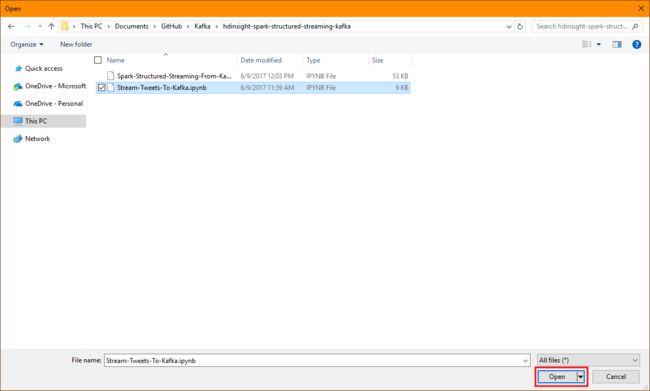
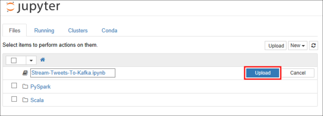

# Tutorial: Use Spark Structured Streaming with Kafka on HDInsight

This tutorial demonstrates how to use Spark Structured Streaming to read and write data with Apache Kafka on Azure HDInsight.

Spark structured streaming is a stream processing engine built on Spark SQL. It allows you to express streaming computations the same as batch computation on static data. 

In this tutorial, you learn how to:

> [!div class="checklist"]
> * Structured Streaming with Kafka
> * Create Kafka and Spark clusters
> * Upload the notebook to Spark
> * Use the notebook
> * Clean up resources

When you are done with the steps in this document, remember to delete the clusters to avoid excess charges.

## Prerequisites

* Familiarity with using Jupyter Notebooks with Spark on HDInsight. For more information, see the [Load data and run queries with Spark on HDInsight](spark/apache-spark-load-data-run-query.md) document.

* Familiarity with the [Scala](https://www.scala-lang.org/) programming language. The code used in this tutorial is written in Scala.

* Familiarity with creating Kafka topics. For more information, see the [Kafka on HDInsight quickstart](kafka/apache-kafka-get-started.md) document.

> [!IMPORTANT]
> The steps in this document require an Azure resource group that contains both a Spark on HDInsight and a Kafka on HDInsight cluster. These clusters are both located within an Azure Virtual Network, which allows the Spark cluster to directly communicate with the Kafka cluster.
> 
> For your convenience, this document links to a template that can create all the required Azure resources. 
>
> For more information on using HDInsight in a virtual network, see the [Extend HDInsight using a virtual network](hdinsight-extend-hadoop-virtual-network.md) document.

## Structured Streaming with Kafka

Spark Structured Streaming is a stream processing engine built on the Spark SQL engine. When using Structured Streaming, you can write streaming queries the same way that you write batch queries.

The following code snippets demonstrate reading from Kafka and storing to file. The first one is a batch operation, while the second one is a streaming operation:

```scala
// Read a batch from Kafka
val kafkaDF = spark.read.format("kafka")
                .option("kafka.bootstrap.servers", kafkaBrokers)
                .option("subscribe", kafkaTopic)
                .option("startingOffsets", "earliest")
                .load()
// Select data and write to file
kafkaDF.select(from_json(col("value").cast("string"), schema) as "trip")
                .write
                .format("parquet")
                .option("path","/example/batchtripdata")
                .option("checkpointLocation", "/batchcheckpoint")
                .save()
```

```scala
// Stream from Kafka
val kafkaStreamDF = spark.readStream.format("kafka")
                .option("kafka.bootstrap.servers", kafkaBrokers)
                .option("subscribe", kafkaTopic)
                .option("startingOffsets", "earliest")
                .load()
// Select data from the stream and write to file
kafkaStreamDF.select(from_json(col("value").cast("string"), schema) as "trip")
                .writeStream
                .format("parquet")
                .option("path","/example/streamingtripdata")
                .option("checkpointLocation", "/streamcheckpoint")
                .start.awaitTermination(30000)
```

In both snippets, data is read from Kafka and written to file. The differences between the examples are:

| Batch | Streaming |
| --- | --- |
| `read` | `readStream` |
| `write` | `writeStream` |
| `save` | `start` |

The streaming operation also uses `awaitTermination(30000)`, which stops the stream after 30000 ms. 

To use Structured Streaming with Kafka, your project must have a dependency on the `org.apache.spark : spark-sql-kafka-0-10_2.11` package. The version of this package should match the version of Spark on HDInsight. For Spark 2.2.0 (available in HDInsight 3.6), you can find the dependency information for different project types at [https://search.maven.org/#artifactdetails%7Corg.apache.spark%7Cspark-sql-kafka-0-10_2.11%7C2.2.0%7Cjar](https://search.maven.org/#artifactdetails%7Corg.apache.spark%7Cspark-sql-kafka-0-10_2.11%7C2.2.0%7Cjar).

For the Jupyter Notebook provided with this tutorial, the following cell loads this package dependency:

```
%%configure -f
{
    "conf": {
        "spark.jars.packages": "org.apache.spark:spark-sql-kafka-0-10_2.11:2.2.0",
        "spark.jars.excludes": "org.scala-lang:scala-reflect,org.apache.spark:spark-tags_2.11"
    }
}
```

## Create the clusters

Apache Kafka on HDInsight does not provide access to the Kafka brokers over the public internet. Anything that uses Kafka must be in the same Azure virtual network. In this tutorial, both the Kafka and Spark clusters are located in the same Azure virtual network. 

The following diagram shows how communication flows between Spark and Kafka:


> [!NOTE]
> The Kafka service is limited to communication within the virtual network. Other services on the cluster, such as SSH and Ambari, can be accessed over the internet. For more information on the public ports available with HDInsight, see [Ports and URIs used by HDInsight](hdinsight-hadoop-port-settings-for-services.md).

To create an Azure Virtual Network, and then create the Kafka and Spark clusters within it, use the following steps:

1. Use the following button to sign in to Azure and open the template in the Azure portal.
    
    <a href="https://portal.azure.com/#create/Microsoft.Template/uri/https%3A%2F%2Fraw.githubusercontent.com%2FAzure-Samples%2Fhdinsight-spark-kafka-structured-streaming%2Fmaster%2Fazuredeploy.json" target="_blank"></a>
    
    The Azure Resource Manager template is located at **https://raw.githubusercontent.com/Azure-Samples/hdinsight-spark-kafka-structured-streaming/master/azuredeploy.json**.

    This template creates the following resources:

    * A Kafka on HDInsight 3.6 cluster.
    * A Spark 2.2.0 on HDInsight 3.6 cluster.
    * An Azure Virtual Network, which contains the HDInsight clusters.

    > [!IMPORTANT]
    > The structured streaming notebook used in this tutorial requires Spark 2.2.0 on HDInsight 3.6. If you use an earlier version of Spark on HDInsight, you receive errors when using the notebook.

2. Use the following information to populate the entries on the **Customized template** section:

    | Setting | Value |
    | --- | --- |
    | Subscription | Your Azure subscription |
    | Resource group | The resource group that contains the resources. |
    | Location | The Azure region that the resources are created in. |
    | Spark Cluster Name | The name of the Spark cluster. The first six characters must be different than the Kafka cluster name. |
    | Kafka Cluster Name | The name of the Kafka cluster. The first six characters must be different than the Spark cluster name. |
    | Cluster Login User Name | The admin user name for the clusters. |
    | Cluster Login Password | The admin user password for the clusters. |
    | SSH User Name | The SSH user to create for the clusters. |
    | SSH Password | The password for the SSH user. |
   
    

3. Read the **Terms and Conditions**, and then select **I agree to the terms and conditions stated above**

4. Finally, check **Pin to dashboard** and then select **Purchase**. 

> [!NOTE]
> It can take up to 20 minutes to create the clusters.

## Upload the notebook

To upload the notebook from the project to your Spark on HDInsight cluster, use the following steps:

1. Download the project from [https://github.com/Azure-Samples/hdinsight-spark-kafka-structured-streaming](https://github.com/Azure-Samples/hdinsight-spark-kafka-structured-streaming).

1. In your web browser, connect to the Jupyter notebook on your Spark cluster. In the following URL, replace `CLUSTERNAME` with the name of your __Spark__ cluster:

        https://CLUSTERNAME.azurehdinsight.net/jupyter

    When prompted, enter the cluster login (admin) and password used when you created the cluster.

2. From the upper right side of the page, use the __Upload__ button to upload the __spark-structured-streaming-kafka.ipynb__ file to the cluster. Select __Open__ to start the upload.

    

    

3. Find the __spark-structured-streaming-kafka.ipynb__ entry in the list of notebooks, and select __Upload__ button beside it.

    


## Use the notebook

Once the files have been uploaded, select the __spark-structured-streaming-kafka.ipynb__ entry to open the notebook. To learn how to use Spark structured streaming with Kafka on HDInsight, follow the instructions in the notebook.

## Clean up resources

To clean up the resources created by this tutorial, you can delete the resource group. Deleting the resource group also deletes the associated HDInsight cluster, and any other resources associated with the resource group.

To remove the resource group using the Azure portal:

1. In the Azure portal, expand the menu on the left side to open the menu of services, and then choose __Resource Groups__ to display the list of your resource groups.
2. Locate the resource group to delete, and then right-click the __More__ button (...) on the right side of the listing.
3. Select __Delete resource group__, and then confirm.

> [!WARNING]
> HDInsight cluster billing starts once a cluster is created and stops when the cluster is deleted. Billing is pro-rated per minute, so you should always delete your cluster when it is no longer in use.
> 
> Deleting a Kafka on HDInsight cluster deletes any data stored in Kafka.

## Next steps

In this tutorial, you learned how to use Spark Structured Streaming to write and read data from Kafka on HDInsight. Use the following link to learn how to use Storm with Kafka.

> [!div class="nextstepaction"]
> [Use Apache Storm with Kafka](hdinsight-apache-storm-with-kafka.md)
