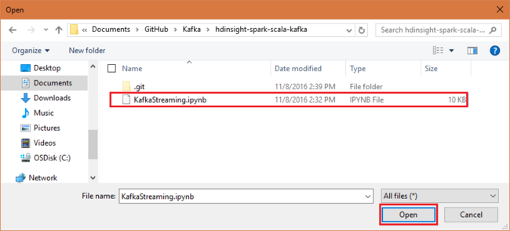
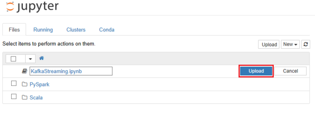

## Introduction

## Create the clusters

Apache Kafka on HDInsight does not provide access to the Kafka brokers over the public internet. Anything that talks to Kafka must be in the same Azure virtual network as the nodes in the Kafka cluster. For this example, both the Kafka and Spark clusters are located in an Azure virtual network. The following diagram shows how communication flows between the clusters:


> [!NOTE]
> Though Kafka itself is limited to communication within the virtual network, other services on the cluster such as SSH and Ambari can be accessed over the internet. For more information on the public ports available with HDInsight, see [Ports and URIs used by HDInsight](hdinsight-hadoop-port-settings-for-services.md).

While you can create an Azure virtual network, Kafka, and Spark clusters manually, it's easier to use an Azure Resource Manager template. Use the following steps to deploy an Azure virtual network, Kafka, and Spark clusters to your Azure subscription.

1. Use the following button to sign in to Azure and open the template in the Azure portal.
    
    <a href="https://portal.azure.com/#create/Microsoft.Template/uri/https%3A%2F%2Fhditutorialdata.blob.core.windows.net%2Farmtemplates%2Fcreate-linux-based-kafka-spark-cluster-in-vnet-v4.json" target="_blank"></a>
    
    The Azure Resource Manager template is located at **https://hditutorialdata.blob.core.windows.net/armtemplates/create-linux-based-kafka-spark-cluster-in-vnet-v2.json**.

2. Use the following information to populate the entries on the **Custom deployment** blade:
   
    
   
    * **Resource group**: Create a group or select an existing one. This group contains the HDInsight cluster.

    * **Location**: Select a location geographically close to you.

    * **Base Cluster Name**: This value is used as the base name for the Spark and Kafka clusters. For example, entering **hdi** creates a Spark cluster named spark-hdi__ and a Kafka cluster named **kafka-hdi**.

    * **Cluster Login User Name**: The admin user name for the Spark and Kafka clusters.

    * **Cluster Login Password**: The admin user password for the Spark and Kafka clusters.

    * **SSH User Name**: The SSH user to create for the Spark and Kafka clusters.

    * **SSH Password**: The password for the SSH user for the Spark and Kafka clusters.

3. Read the **Terms and Conditions**, and then select **I agree to the terms and conditions stated above**.

4. Finally, check **Pin to dashboard** and then select **Purchase**. It takes about 20 minutes to create the clusters.

Once the resources have been created, you are redirected to a blade for the resource group that contains the clusters and web dashboard.


> [!IMPORTANT]
> Notice that the names of the HDInsight clusters are **spark-BASENAME** and **kafka-BASENAME**, where BASENAME is the name you provided to the template. You use these names in later steps when connecting to the clusters.

## Get the Kafka brokers

The code in this example connects to the Kafka broker hosts in the Kafka cluster. To find the Kafka broker hosts, use one of the following commands:

```powershell
$creds = Get-Credential -UserName "admin" -Message "Enter the HDInsight login"
$clusterName = Read-Host -Prompt "Enter the Kafka cluster name"
$resp = Invoke-WebRequest -Uri "https://$clusterName.azurehdinsight.net/api/v1/clusters/$clusterName/services/KAFKA/components/KAFKA_BROKER" `
    -Credential $creds
$respObj = ConvertFrom-Json $resp.Content
$brokerHosts = $respObj.host_components.HostRoles.host_name
($brokerHosts -join ":9092,") + ":9092"
```

```bash
curl -u admin:$PASSWORD -G "https://$CLUSTERNAME.azurehdinsight.net/api/v1/clusters/$CLUSTERNAME/services/KAFKA/components/KAFKA_BROKER" | jq -r '["\(.host_components[].HostRoles.host_name):9092"] | join(",")'
```

> [!NOTE]
> This example expects `$PASSWORD` to contain the password for the cluster login, and `$CLUSTERNAME` to contain the name of the Kafka cluster.
>
> This example uses the [jq](https://stedolan.github.io/jq/) utility to parse data out of the JSON document.

The output is similar to the following text:

`wn0-kafka.0owcbllr5hze3hxdja3mqlrhhe.ex.internal.cloudapp.net:9092,wn1-kafka.0owcbllr5hze3hxdja3mqlrhhe.ex.internal.cloudapp.net:9092,wn2-kafka.0owcbllr5hze3hxdja3mqlrhhe.ex.internal.cloudapp.net:9092,wn3-kafka.0owcbllr5hze3hxdja3mqlrhhe.ex.internal.cloudapp.net:9092`

Save this information, as it is used in the following sections of this document.

## Get the code

The code for the example described in this document is available at [https://github.com/Azure-Samples/hdinsight-spark-scala-kafka](https://github.com/Azure-Samples/hdinsight-spark-scala-kafka).

## Stream tweets into Kafka

1. Open the `producetweets.py` file in a text editor and modify the following sections with your information:

    * Your Twitter app information:

    [TBD]

    * The Kafka broker information:

2. Use the following command to copy the `producetweets.py` file to your Kafka cluster:

    ```bash
    scp producetweets.py sshuser@kafkacluster-ssh.azurehdinsight.net:
    ```

    > [!NOTE]
    > Replace __sshuser__ with your SSH user account. Replace __kafkacluster__ with the Kafka cluster name.

3. Use the following command to connect to the Kafka cluster:

    ```bash
    ssh sshuser@kafkacluster-ssh.azurehdinsight.net
    ```

    > [!NOTE]
    > Replace __sshuser__ with your SSH user account. Replace __kafkacluster__ with the Kafka cluster name.

3. From the SSH session, use the following commands to install packages required by the `producetweets.py` script, and then start the script:

    ```bash
    sudo apt install python-dev libffi-dev libssl-dev
    sudo apt remove python-openssl
    pip install virtualenv
    mkdir gettweets
    mv producetweets.py gettweets
    cd gettweets
    virtualenv gettweets
    source gettweets/bin/activate
    pip install tweepy progressbar pyOpenSSL requests[security]
    python producetweets.py
    ```

    A progress bar appears, indicating how many of the requested 10000 tweets have been ingested.

## Use the Jupyter notebook

To use the example Jupyter notebook, you must upload it to the Jupyter Notebook server on the Spark cluster. Use the following steps to upload the notebook:

1. In your web browser, use the following URL to connect to the Jupyter Notebook server on the Spark cluster. Replace `CLUSTERNAME` with the name of your Spark cluster.

        https://CLUSTERNAME.azurehdinsight.net/jupyter

    When prompted, enter the cluster login (admin) and password used when you created the cluster.

2. From the upper right side of the page, use the __Upload__ button to upload the `KafkaStreaming.ipynb` file. Select the file in the file browser dialog and select __Open__.

    

    

3. Find the __KafkaStreaming.ipynb__ entry in the list of notebooks, and select __Upload__ button beside it.

    

4. Once the file has uploaded, select the __KafkaStreaming.ipynb__ entry to open the notebook. To complete this example, follow the instructions in the notebook.
