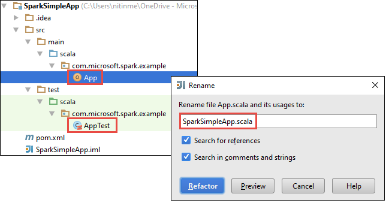
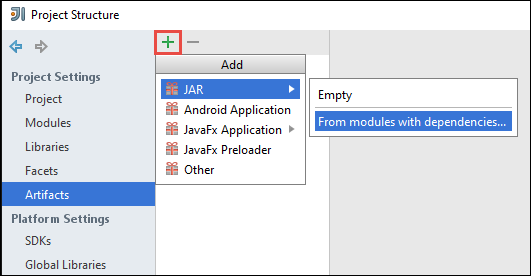
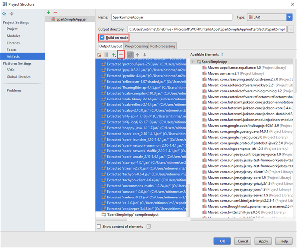

<properties
	pageTitle="Create standalone scala applications to run on HDInsight Spark clusters | Microsoft Azure"
	description="Learn how to create a standalone Spark application to run on HDInsight Spark clusters."
	services="hdinsight"
	documentationCenter=""
	authors="nitinme"
	manager="paulettm"
	editor="cgronlun"
	tags="azure-portal"/>

<tags
	ms.service="hdinsight"
	ms.workload="big-data"
	ms.tgt_pltfrm="na"
	ms.devlang="na"
	ms.topic="article"
	ms.date="07/25/2016"
	ms.author="nitinme"/>

# Create a standalone Scala application to run on Apache Spark cluster on HDInsight Linux

This article provides step-by-step guidance on developing standalone Spark applications written in Scala using Maven with IntelliJ IDEA. The article uses Apache Maven as the build system and starts with an existing Maven archetype for Scala provided by IntelliJ IDEA.  At a high-level, creating a Scala application in IntelliJ IDEA will involve the following steps:

* Use Maven as the build system.
* Update Project Object Model (POM) file to resolve Spark module dependencies.
* Write your application in Scala.
* Generate a jar file that can be submitted to HDInsight Spark clusters.
* Run the application on Spark cluster using Livy.

>[AZURE.NOTE] HDInsight also provides an IntelliJ IDEA plugin tool to ease the process of creating and submitting applications to an HDInsight Spark cluster on Linux. For more information, see [Use HDInsight Tools Plugin for IntelliJ IDEA to create and submit Spark applications](hdinsight-apache-spark-intellij-tool-plugin.md).

**Prerequisites**

* An Azure subscription. See [Get Azure free trial](https://azure.microsoft.com/documentation/videos/get-azure-free-trial-for-testing-hadoop-in-hdinsight/).
* An Apache Spark cluster on HDInsight Linux. For instructions, see [Create Apache Spark clusters in Azure HDInsight](hdinsight-apache-spark-jupyter-spark-sql.md).
* Oracle Java Development kit. You can install it from [here](http://www.oracle.com/technetwork/java/javase/downloads/jdk8-downloads-2133151.html).
* A Java IDE. This article uses IntelliJ IDEA 15.0.1. You can install it from [here](https://www.jetbrains.com/idea/download/).

## Install Scala plugin for IntelliJ IDEA

If IntelliJ IDEA installation did not not prompt for enabling Scala plugin, launch IntelliJ IDEA and go through the following steps to install the plugin:

1. Start IntelliJ IDEA and from welcome screen click **Configure** and then click **Plugins**.

	

2. In the next screen, click **Install JetBrains plugin** from the lower left corner. In the **Browse JetBrains Plugins** dialog box that opens, search for Scala and then click **Install**.

	

3. After the plugin installs successfully, click the **Restart IntelliJ IDEA button** to restart the IDE.

## Create a standalone Scala project

1. Launch IntelliJ IDEA and create a new project. In the new project dialog box, make the following choices, and then click **Next**.

	

	* Select **Maven** as the project type.
	* Specify a **Project SDK**. Click New and navigate to the Java installation directory, typically `C:\Program Files\Java\jdk1.8.0_66`.
	* Select the **Create from archetype** option.
	* From the list of archetypes, select **org.scala-tools.archetypes:scala-archetype-simple**. This will create the right directory structure and download the required default dependencies to write Scala program.

2. Provide relevant values for **GroupId**, **ArtifactId**, and **Version**. Click **Next**.

3. In the next dialog box, where you specify Maven home directory and other user settings, accept the defaults and click **Next**.

4. In the last dialog box, specify a project name and location and then click **Finish**.

5. Delete the **MySpec.Scala** file at **src\test\scala\com\microsoft\spark\example**. You do not need this for the application.

6. If required, rename the default source and test files. From the left pane in the IntelliJ IDEA, navigate to **src\main\scala\com.microsoft.spark.example**. Right-click **App.scala**, click **Refactor**, click Rename file, and in the dialog box, provide the new name for the application and then click **Refactor**.

	  

7. In the subsequent steps, you will update the pom.xml to define the dependencies for the Spark Scala application. For those dependencies to be downloaded and resolved automatically, you must configure Maven accordingly.

	

	1. From the **File** menu, click **Settings**.
	2. In the **Settings** dialog box, navigate to **Build, Execution, Deployment** > **Build Tools** > **Maven** > **Importing**.
	3. Select the option to **Import Maven projects automatically**.
	4. Click **Apply**, and then click **OK**.

8. Update the Scala source file to include your application code. Open and replace the existing sample code with the following code and save the changes. This code reads the data from the HVAC.csv (available on all HDInsight Spark clusters), retrieves the rows that only have one digit in the sixth column, and writes the output to **/HVACOut** under the default storage container for the cluster.

		package com.microsoft.spark.example

		import org.apache.spark.SparkConf
		import org.apache.spark.SparkContext

		/**
		  * Test IO to wasb
		  */
		object WasbIOTest {
		  def main (arg: Array[String]): Unit = {
		    val conf = new SparkConf().setAppName("WASBIOTest")
		    val sc = new SparkContext(conf)

		    val rdd = sc.textFile("wasbs:///HdiSamples/HdiSamples/SensorSampleData/hvac/HVAC.csv")

		    //find the rows which have only one digit in the 7th column in the CSV
		    val rdd1 = rdd.filter(s => s.split(",")(6).length() == 1)

		    rdd1.saveAsTextFile("wasbs:///HVACout")
		  }
		}

9. Update the pom.xml.

	1.  Within `<project>\<properties>` add the following:

			<scala.version>2.10.4</scala.version>
    		<scala.compat.version>2.10.4</scala.compat.version>
			<scala.binary.version>2.10</scala.binary.version>

	2. Within `<project>\<dependencies>` add the following:

			<dependency>
		      <groupId>org.apache.spark</groupId>
		      <artifactId>spark-core_${scala.binary.version}</artifactId>
		      <version>1.4.1</version>
		    </dependency>

	Save changes to pom.xml.

10. Create the .jar file. IntelliJ IDEA enables creation of JAR as an artifact of a project. Perform the following steps.

	1. From the **File** menu, click **Project Structure**.
	2. In the **Project Structure** dialog box, click **Artifacts** and then click the plus symbol. From the pop-up dialog box, click **JAR**, and then click **From modules with dependencies**.

		

	3. In the **Create JAR from Modules** dialog box, click the ellipsis ( ) against the **Main Class**.

	4. In the **Select Main Class** dialog box, select the class that appears by default and then click **OK**.

		

	5. In the **Create JAR from Modules** dialog box, make sure that the option to **extract to the target JAR** is selected, and then click **OK**. This creates a single JAR with all dependencies.

		

	6. The output layout tab lists all the jars that are included as part of the Maven project. You can select and delete the ones on which the Scala application has no direct dependency. For the application we are creating here, you can remove all but the last one (**SparkSimpleApp compile output**). Select the jars to delete and then click the **Delete** icon.

		

		Make sure **Build on make** box is selected, which ensures that the jar is created every time the project is built or updated. Click **Apply** and then **OK**.

	7. From the menu bar, click **Build**, and then click **Make Project**. You can also click **Build Artifacts** to create the jar. The output jar is created under **\out\artifacts**.

		

## Run the application on the Spark cluster

To run the application on the cluster, you must do the following:

* **Copy the application jar to the Azure storage blob** associated with the cluster. You can use [**AzCopy**](../storage/storage-use-azcopy.md), a command line utility, to do so. There are a lot of other clients as well that you can use to upload data. You can find more about them at [Upload data for Hadoop jobs in HDInsight](hdinsight-upload-data.md).

* **Use Livy to submit an application job remotely** to the Spark cluster. Spark clusters on HDInsight includes Livy that exposes REST endpoints to remotely submit Spark jobs. For more information, see [Submit Spark jobs remotely using Livy with Spark clusters on HDInsight](hdinsight-apache-spark-livy-rest-interface.md).

## See also

* [Overview: Apache Spark on Azure HDInsight](hdinsight-apache-spark-overview.md)

### Scenarios

* [Spark with BI: Perform interactive data analysis using Spark in HDInsight with BI tools](hdinsight-apache-spark-use-bi-tools.md)

* [Spark with Machine Learning: Use Spark in HDInsight for analyzing building temperature using HVAC data](hdinsight-apache-spark-ipython-notebook-machine-learning.md)

* [Spark with Machine Learning: Use Spark in HDInsight to predict food inspection results](hdinsight-apache-spark-machine-learning-mllib-ipython.md)

* [Spark Streaming: Use Spark in HDInsight for building real-time streaming applications](hdinsight-apache-spark-eventhub-streaming.md)

* [Website log analysis using Spark in HDInsight](hdinsight-apache-spark-custom-library-website-log-analysis.md)

### Create and run applications

* [Run jobs remotely on a Spark cluster using Livy](hdinsight-apache-spark-livy-rest-interface.md)

### Tools and extensions

* [Use HDInsight Tools Plugin for IntelliJ IDEA to create and submit Spark Scala applicatons](hdinsight-apache-spark-intellij-tool-plugin.md)

* [Use HDInsight Tools Plugin for IntelliJ IDEA to debug Spark applications remotely](hdinsight-apache-spark-intellij-tool-plugin-debug-jobs-remotely.md)

* [Use Zeppelin notebooks with a Spark cluster on HDInsight](hdinsight-apache-spark-use-zeppelin-notebook.md)

* [Kernels available for Jupyter notebook in Spark cluster for HDInsight](hdinsight-apache-spark-jupyter-notebook-kernels.md)

* [Use external packages with Jupyter notebooks](hdinsight-apache-spark-jupyter-notebook-use-external-packages.md)

* [Install Jupyter on your computer and connect to an HDInsight Spark cluster](hdinsight-apache-spark-jupyter-notebook-install-locally.md)

### Manage resources

* [Manage resources for the Apache Spark cluster in Azure HDInsight](hdinsight-apache-spark-resource-manager.md)

* [Track and debug jobs running on an Apache Spark cluster in HDInsight](hdinsight-apache-spark-job-debugging.md)
