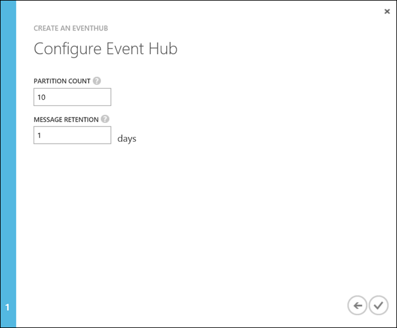
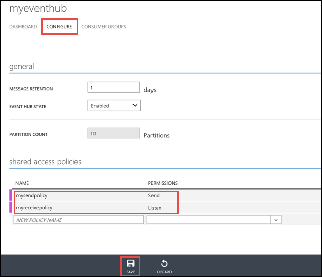
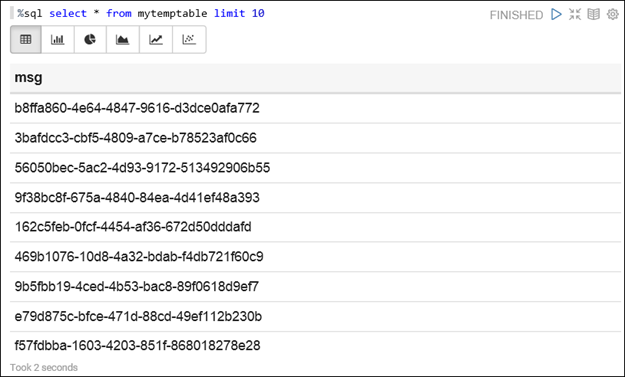

<properties 
	pageTitle="Use Azure Event Hubs with Apache Spark in HDInsight to process streaming data | Microsoft Azure" 
	description="Step-by-step instructions on how to send a data stream to Azure Event Hub and then receive those events in Spark using a Zeppelin notebook" 
	services="hdinsight" 
	documentationCenter="" 
	authors="nitinme" 
	manager="paulettm" 
	editor="cgronlun"
	tags="azure-portal"/>

<tags 
	ms.service="hdinsight" 
	ms.workload="big-data" 
	ms.tgt_pltfrm="na" 
	ms.devlang="na" 
	ms.topic="article" 
	ms.date="09/30/2015" 
	ms.author="nitinme"/>

# Spark Streaming: Process events from Azure Event Hubs with Apache Spark on HDInsight

Spark Streaming extends the core Spark API to build scalable, high-throughput, fault-tolerant stream processing applications. Data can be ingested from many sources. In this article we use Event Hubs to ingest data. Event Hubs is a highly scalable ingestion system that can intake millions of events per second. 

In this tutorial, you will learn how to create an Azure Event Hub, how to ingest messages into an Event Hub using a console application in C#, and to retrieve them in parallel using a Zeppelin notebook configured for Apache Spark in HDInsight.

> [AZURE.NOTE] To follow the instructions in this article, you will have to use both versions of the Azure portal. To create an Event Hub you will use the [Azure portal](https://manage.windowsazure.com). To work with the HDInsight Spark cluster, you will use the [Azure Preview Portal](https://ms.portal.azure.com/).  

**Prerequisites:**

You must have the following:

- An Azure subscription. See [Get Azure free trial](http://azure.microsoft.com/documentation/videos/get-azure-free-trial-for-testing-hadoop-in-hdinsight/).
- An Apache Spark cluster. For instructions, see [Provision Apache Spark clusters in Azure HDInsight](hdinsight-apache-spark-provision-clusters.md).
- An [Azure Event Hub](service-bus-event-hubs-csharp-ephcs-getstarted.md).
- A workstation with Microsoft Visual Studio 2013. For instructions, see [Install Visual Studio](https://msdn.microsoft.com/library/e2h7fzkw.aspx).

##Create Azure Event Hub

1. From the [Azure portal](https://manage.windowsazure.com), select **NEW** > **Service Bus** > **Event Hub** > **Custom Create**.

2. On the **Add a new Event Hub** screen, enter an **Event Hub Name**, select the **Region** to create the hub in, and create a new namespace or select an existing one. Click the **Arrow** to continue.

	

	> [AZURE.NOTE] You should select the same **Location** as your Apache Spark cluster in HDInsight to reduce latency and costs.

3. On the **Configure Event Hub** screen, enter the **Partition count** and **Message Retention** values, and then click the check mark. For this example, use a partition count of 10 and a message retention of 1. Note the partition count because you will need this value later.

	

4. Click the Event Hub that you created, click **Configure**, and then create two access policies for the event hub.

	<table>
	<tr><th>Name</th><th>Permissions</th></tr>
	<tr><td>mysendpolicy</td><td>Send</td></tr>
	<tr><td>myreceivepolicy</td><td>Listen</td></tr>
	</table>

	After You create the permissions, select the **Save** icon at the bottom of the page. This creates the shared access policies that will be used to send (**mysendpolicy**) and listen (**myreceivepolicy**) to this Event Hub.

	

	
5. On the same page, take a note of the policy keys generated for the two policies. Save these keys because they will be used later.

	

6. On the **Dashboard** page, click **Connection Information** from the bottom to retrieve and save the connection strings for the Event Hub using the two policies.

	

[AZURE.INCLUDE [service-bus-event-hubs-get-started-send-csharp](../../includes/service-bus-event-hubs-get-started-send-csharp.md)]

##Receive messages in Spark on HDInsight using Zeppelin

In this section, you create a [Zeppelin](https://zeppelin.incubator.apache.org) notebook to receive messages from the Event Hub into the Spark cluster in HDInsight.

### Allocating resources to Zeppelin for streaming application

You must make the following considerations while creating a streaming application using Zeppelin:

* **Event hub partitions and cores allocated to Zeppelin**. In the previous steps, you created an Event Hub with some partitions. In the Zeppelin streaming application you create below, you will specify the same number of partitions again. To successfully stream the data from Event Hub using Zeppelin, the number of cores you allocate to Zeppelin must be twice the number of partitions in Event Hub.
* **Minimum number of cores to be allocated to Zeppelin**. In your streaming application that you create below, you create a temporary table where you store the messages that are streamed by your application. You then use a Spark SQL statement to read messages from this temporary table. To successfully run the Spark SQL statement, you must make sure that you at least have two cores allocated to Zeppelin.

If you combine the two requirements above, this is what you get:

* The minimum number of cores you must allocate to Zeppelin is 2.
* The number of allocated cores must always be twice the number of partitions in Event Hub. 

For instructions on how to allocate resources in a Spark cluster, see [Manage resources for the Apache Spark cluster in HDInsight](hdinsight-apache-spark-resource-manager.md).

### Create a streaming application using Zeppelin

1. From the [Azure Preview Portal](https://portal.azure.com/), from the startboard, click the tile for your Spark cluster (if you pinned it to the startboard). You can also navigate to your cluster under **Browse All** > **HDInsight Clusters**.   

2. From the Spark cluster blade, click **Quick Links**, and then from the **Cluster Dashboard** blade, click **Zeppelin Notebook**. If prompted, enter the admin credentials for the cluster.

	> [AZURE.NOTE] You may also reach the Zeppelin Notebook for your cluster by opening the following URL in your browser. Replace __CLUSTERNAME__ with the name of your cluster:
	>
	> `https://CLUSTERNAME.azurehdinsight.net/zeppelin`

2. Create a new notebook. From the header pane, click **Notebook**, and from the drop-down, click **Create New Note**.

	

	On the same page, under the **Notebook** heading, you should see a new notebook with the name starting with **Note XXXXXXXXX**. Click the new notebook.

3. On the web page for the new notebook, click the heading, and change the name of the notebook if you want to. Press ENTER to save the name change. Also, make sure the notebook header shows a **Connected** status in the top-right corner.

	

4. In the empty paragraph that is created by default in the new notebook, paste the following snippet and replace the placeholders to use your event hub configuration. In this snippet, you receive the stream from Event Hub and register the stream into a temporary table, called **mytemptable**. In the next section, we will start the sender application. You can then read the data directly from the table.

	> [AZURE.NOTE] In the snippet below, **eventhubs.checkpoint.dir** must be set to a directory in your default storage container. If the directory does not exist, the streamig application creates it. You can either specify the full path to the directory like "**wasb://container@storageaccount.blob.core.windows.net/mycheckpointdir/**" or just the relative path to the directory, such as "**/mycheckpointdir**".

		import org.apache.spark.streaming.{Seconds, StreamingContext}
		import org.apache.spark.streaming.eventhubs.EventHubsUtils
		import sqlContext.implicits._
		
		val ehParams = Map[String, String](
		  "eventhubs.policyname" -> "<name of policy with listen permissions>",
		  "eventhubs.policykey" -> "<key of policy with listen permissions>",
		  "eventhubs.namespace" -> "<service bus namespace>",
		  "eventhubs.name" -> "<event hub in the service bus namespace>",
		  "eventhubs.partition.count" -> "1",
		  "eventhubs.consumergroup" -> "$default",
		  "eventhubs.checkpoint.dir" -> "/<check point directory in your storage account>",
		  "eventhubs.checkpoint.interval" -> "10"
		)
		
		val ssc =  new StreamingContext(sc, Seconds(10))
		val stream = EventHubsUtils.createUnionStream(ssc, ehParams)
		
		case class Message(msg: String)
		stream.map(msg=>Message(new String(msg))).foreachRDD(rdd=>rdd.toDF().registerTempTable("mytemptable"))

		stream.print
		ssc.start

##Run the applications

1. From the Zeppelin notebook, run the paragraph with the snippet. Press **SHIFT + ENTER** or the **Play** button at the top-right corner.

	The status on the right-corner of the paragraph should progress from READY, PENDING, RUNNING to FINISHED. The output will show up in the bottom of the same paragraph. The screenshot looks like the following:

	

2. Run the **Sender** project and press **Enter** in the console window to start sending messages to the Event Hub.

3. From the Zeppelin notebook, in a new paragraph, enter the following snippet to read the messages received in Spark.

		%sql 
		select * from mytemptable limit 10

	The following screen capture shows the messages received in the **mytemptable**.

	

4. Restart the Spark SQL interpreter to exit the application. Click the **Interpreter** tab at the top, and for the Spark interpreter, click **Restart**.

	

##Run the streaming application with high availability

Using Zeppelin to receive streaming data into Spark cluster on HDInsight is a good approach to prototype your application. However, to run your streaming application in a production setup with high-availability and resilience, you need to do the following:

1. Copy over the dependency jar to the storage account associated with the cluster.
2. Build a streaming application.
3. RDP into the cluster and copy over the application jar to the headnode of the cluster.
3. RDP into the cluster and run the application on the cluster node.

Instructions on how to perform these steps and a sample streaming application can be downloaded from GitHub at [https://github.com/hdinsight/hdinsight-spark-examples](https://github.com/hdinsight/hdinsight-spark-examples). 

##See also

* [Overview: Apache Spark on Azure HDInsight](hdinsight-apache-spark-overview.md)
* [Quick Start: Provision Apache Spark on HDInsight and run interactive queries using Spark SQL](hdinsight-apache-spark-zeppelin-notebook-jupyter-spark-sql.md)
* [Use Spark in HDInsight for building machine learning applications](hdinsight-apache-spark-ipython-notebook-machine-learning.md)
* [Perform interactive data analysis using Spark in HDInsight with BI tools](hdinsight-apache-spark-use-bi-tools.md)
* [Manage resources for the Apache Spark cluster in Azure HDInsight](hdinsight-apache-spark-resource-manager.md)

[hdinsight-versions]: ../hdinsight-component-versioning/
[hdinsight-upload-data]: ../hdinsight-upload-data/
[hdinsight-storage]: ../hdinsight-use-blob-storage/

[azure-purchase-options]: http://azure.microsoft.com/pricing/purchase-options/
[azure-member-offers]: http://azure.microsoft.com/pricing/member-offers/
[azure-free-trial]: http://azure.microsoft.com/pricing/free-trial/
[azure-management-portal]: https://manage.windowsazure.com/
[azure-create-storageaccount]: ../storage-create-storage-account/ 
