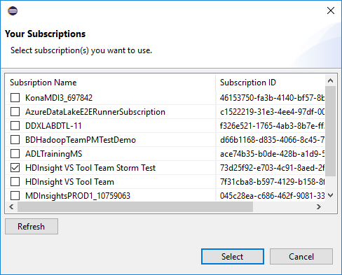
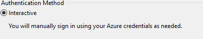

# Use Azure Toolkit for Eclipse to create Spark applications for an HDInsight cluster

Use HDInsight Tools in Azure Toolkit for Eclipse to develop Spark applications written in Scala and submit them to an Azure HDInsight Spark cluster, directly from the Eclipse IDE. You can use the HDInsight Tools plug-in in a few different ways:

* To develop and submit a Scala Spark application on an HDInsight Spark cluster
* To access your Azure HDInsight Spark cluster resources
* To develop and run a Scala Spark application locally

> [!IMPORTANT]
> This tool can be used to create and submit applications only for an HDInsight Spark cluster on Linux.
> 
> 

## Prerequisites

* An Apache Spark cluster on HDInsight. For instructions, see [Create Apache Spark clusters in Azure HDInsight](hdinsight-apache-spark-jupyter-spark-sql.md).
* Oracle Java Development Kit version 8, which is used for the Eclipse IDE runtime. You can download it from the [Oracle website](http://www.oracle.com/technetwork/java/javase/downloads/jdk8-downloads-2133151.html).
* Eclipse IDE. This article uses Eclipse Neon. You can install it from the [Eclipse website](https://www.eclipse.org/downloads/).
* Scala IDE for Eclipse. 
  
  * **If you have the Eclipse IDE installed**, you can add the Scala IDE plug-in by going to **Help** > **Install New SoftWare**, and add [http://download.scala-ide.org/sdk/lithium/e46/scala211/stable/site](http://download.scala-ide.org/sdk/lithium/e46/scala211/stable/site) as the source to download the Scala plug-in for Eclipse. 
  * **If you do not have the Eclipse IDE installed**, you can install the Scala IDE directly from the [Scala website](http://scala-ide.org/download/sdk.html). Download the .zip file, extract it, browse to the **/eclipse** folder, and then run **eclipse.exe** file from there.
    
    > [!NOTE]
    > The steps in this article are based on using the Eclipse IDE with the Scala plug-in installed.
    > 
    > 
* Spark SDK. You can download it from [GitHub](http://go.microsoft.com/fwlink/?LinkID=723585&clcid=0x409).
* e(fx)clipse. You can install it from the [download page on the Eclipse website](https://www.eclipse.org/efxclipse/install.html).

## Install HDInsight Tools in Azure Toolkit for Eclipse
HDInsight Tools for Eclipse is available as part of Azure Toolkit for Eclipse. For installation instructions, see [Installing Azure Toolkit for Eclipse](../azure-toolkit-for-eclipse-installation.md).

## Sign in to your Azure subscription
1. Start the Eclipse IDE and open Azure Explorer. On the **Window** menu, click **Show View**, and then click **Other**. In the dialog box that opens, expand **Azure**, click **Azure Explorer**, and then click **OK**.

    
2. Right-click the **Azure** node, and then click **Sign in**.
3. In the **Azure Sign In** dialog box, choose the authentication method, click **Sign in**, and enter your Azure credentials.
   
    
4. After you're signed in, the **Select Subscriptions** dialog box lists all the Azure subscriptions associated with the credentials. Click **Select** to close the dialog box.

    
5. On the **Azure Explorer** tab, expand **HDInsight** to see the HDInsight Spark clusters under your subscription.
   
    
6. You can further expand a cluster name node to see the resources (for example, storage accounts) associated with the cluster.
   
    

## Set up a Spark Scala project for an HDInsight Spark cluster

1. In the Eclipse IDE workspace, click **File**, click **New**, and then click **Project**. 
2. In the New Project wizard, expand **HDInsight**, select **Spark on HDInsight (Scala)**, and then click **Next**.

    
3. In the **New HDInsight Scala Project** dialog box, provide the following values, and then click **Next**:
   * Enter a name for the project.
   * In the **JRE** area, make sure that **Use an execution environment JRE** is set to **JavaSE-1.7**.
   * Make sure that Spark SDK is set to the location where you downloaded the SDK. The link to the download location is included in the [prerequisites](#prerequisites) earlier in this article. You can also download the SDK from the link included in the dialog box.

    
4.	In the next dialog box, click the **Libraries** tab and keep the defaults, and then click **Finish**. 
   
    

## Run a Spark Scala application on an Azure Data Lake Store cluster
If you want to submit an application to Azure Data Lake Store, you must choose **Interactive** mode during the Azure sign-in process. 

   

## Create a Scala application for an HDInsight Spark cluster

1. In the Eclipse IDE, from Package Explorer, expand the project that you created earlier, right-click **src**, point to **New**, and then click **Other**.
2. In the **Select a wizard** dialog box, expand **Scala Wizards**, click **Scala Object**, and then click **Next**.
   
    
3. In the **Create New File** dialog box, enter a name for the object, and then click **Finish**.
   
    
4. Paste the following code in the text editor:
   
        import org.apache.spark.SparkConf
        import org.apache.spark.SparkContext
   
        object MyClusterApp{
          def main (arg: Array[String]): Unit = {
            val conf = new SparkConf().setAppName("MyClusterApp")
            val sc = new SparkContext(conf)
   
            val rdd = sc.textFile("wasbs:///HdiSamples/HdiSamples/SensorSampleData/hvac/HVAC.csv")
   
            //find the rows that have only one digit in the seventh column in the CSV
            val rdd1 =  rdd.filter(s => s.split(",")(6).length() == 1)
   
            rdd1.saveAsTextFile("wasbs:///HVACOut")
          }        
        }
5. Run the application on an HDInsight Spark cluster:
   
   1. From Package Explorer, right-click the project name, and then select **Submit Spark Application to HDInsight**.        
   2. In the **Spark Submission** dialog box, provide the following values, and then click **Submit**:
      
      * For **Cluster Name**, select the HDInsight Spark cluster on which you want to run your application.
      * Select an artifact from the Eclipse project, or select one from a hard drive.
      * In the **Main class name** text box, enter the name of the object that you specified in the code.
      * Because the application code in this example does not require any command-line arguments or reference JARs or files, you can leave the remaining text boxes empty.
        
       
   3. The **Spark Submission** tab should start displaying the progress. You can stop the application by clicking the red button in the **Spark Submission** window. You can also view the logs for this specific application run by clicking the globe icon (denoted by the blue box in the image).
      
       
      
## Access and manage HDInsight Spark clusters by using HDInsight Tools in Azure Toolkit for Eclipse
You can perform various operations by using HDInsight Tools, including accessing the job output.

### Access the storage container for the cluster
1. In Azure Explorer, expand the **HDInsight** root node to see a list of HDInsight Spark clusters that are available.
2. Expand the cluster name to see the storage account and the default storage container for the cluster.
   
    
3. Click the storage container name associated with the cluster. In the right pane, double-click the **HVACOut** folder. Open one of the **part-** files to see the output of the application.

### Access the Spark history server
1. In Azure Explorer, right-click your Spark cluster name, and then select **Open Spark History UI**. When you're prompted, enter the admin credentials for the cluster. You must have specified these while provisioning the cluster.
2. In the Spark history server dashboard, you use the application name to look for the application that you just finished running. In the preceding code, you set the application name by using `val conf = new SparkConf().setAppName("MyClusterApp")`. Hence, your Spark application name was **MyClusterApp**.

### Start the Ambari portal
1. In Azure Explorer, right-click your Spark cluster name, and then select **Open Cluster Management Portal (Ambari)**. 
2. When you're prompted, enter the admin credentials for the cluster. You must have specified these while provisioning the cluster.

### Manage Azure subscriptions
By default, HDInsight Tools in Azure Toolkit for Eclipse lists the Spark clusters from all your Azure subscriptions. If necessary, you can specify the subscriptions for which you want to access the cluster. 

1. In Azure Explorer, right-click the **Azure** root node, and then click **Manage Subscriptions**. 
2. In the dialog box, clear the check boxes for the subscription that you don't want to access, and then click **Close**. You can also click **Sign Out** if you want to sign out of your Azure subscription.

## Run a Spark Scala application locally
You can use HDInsight Tools in Azure Toolkit for Eclipse to run Spark Scala applications locally on your workstation. Typically, these applications don't need access to cluster resources such as a storage container, and you can run and test them locally.

### Prerequisite
While you're running the local Spark Scala application on a Windows computer, you might get an exception as explained in [SPARK-2356](https://issues.apache.org/jira/browse/SPARK-2356). This exception occurs because **WinUtils.exe** is missing in Windows. 

To resolve this error, you must [download the executable](http://public-repo-1.hortonworks.com/hdp-win-alpha/winutils.exe) to a location like **C:\WinUtils\bin**. You must then add the environment variable **HADOOP_HOME** and set the value of the variable to **C\WinUtils**.

### Run a local Spark Scala application
1. Start Eclipse and create a project. In the **New Project** dialog box, make the following choices, and then click **Next**.
   
   * In the left pane, select **HDInsight**.
   * In the right pane, select **Spark on HDInsight Local Run Sample (Scala)**.

    
2. To provide the project details, follow steps 3 through 6 from the earlier section [Set up a Spark Scala project for an HDInsight Spark cluster](#set-up-a-spark-scala-project-for-an-hdinsight-spark cluster).
3. The template adds a sample code (**LogQuery**) under the **src** folder that you can run locally on your computer.
   
    
4. Right-click the **LogQuery** application, point to **Run As**, and then click **1 Scala Application**. You will see an output like this in the **Console** tab at the bottom:
   
   

## Feedback and known issues
Currently, viewing Spark outputs directly is not supported.

If you have any suggestions or feedback, or if you encounter any problems when using this tool, feel free to send us an email at hdivstool@microsoft.com.

## See also
* [Overview: Apache Spark on Azure HDInsight](hdinsight-apache-spark-overview.md)

### Scenarios
* [Spark with BI: Perform interactive data analysis using Spark in HDInsight with BI tools](hdinsight-apache-spark-use-bi-tools.md)
* [Spark with Machine Learning: Use Spark in HDInsight for analyzing building temperature using HVAC data](hdinsight-apache-spark-ipython-notebook-machine-learning.md)
* [Spark with Machine Learning: Use Spark in HDInsight to predict food inspection results](hdinsight-apache-spark-machine-learning-mllib-ipython.md)
* [Spark Streaming: Use Spark in HDInsight for building real-time streaming applications](hdinsight-apache-spark-eventhub-streaming.md)
* [Website log analysis using Spark in HDInsight](hdinsight-apache-spark-custom-library-website-log-analysis.md)

### Creating and running applications
* [Create a standalone application using Scala](hdinsight-apache-spark-create-standalone-application.md)
* [Run jobs remotely on a Spark cluster using Livy](hdinsight-apache-spark-livy-rest-interface.md)

### Tools and extensions
* [Use Azure Toolkit for IntelliJ to create and submit Spark Scala applications](hdinsight-apache-spark-intellij-tool-plugin.md)
* [Use Azure Toolkit for IntelliJ to debug Spark applications remotely](hdinsight-apache-spark-intellij-tool-plugin-debug-jobs-remotely.md)
* [Use Zeppelin notebooks with a Spark cluster on HDInsight](hdinsight-apache-spark-zeppelin-notebook.md)
* [Kernels available for Jupyter notebook in Spark cluster for HDInsight](hdinsight-apache-spark-jupyter-notebook-kernels.md)
* [Use external packages with Jupyter notebooks](hdinsight-apache-spark-jupyter-notebook-use-external-packages.md)
* [Install Jupyter on your computer and connect to an HDInsight Spark cluster](hdinsight-apache-spark-jupyter-notebook-install-locally.md)

### Managing resources
* [Manage resources for the Apache Spark cluster in Azure HDInsight](hdinsight-apache-spark-resource-manager.md)
* [Track and debug jobs running on an Apache Spark cluster in HDInsight](hdinsight-apache-spark-job-debugging.md)

