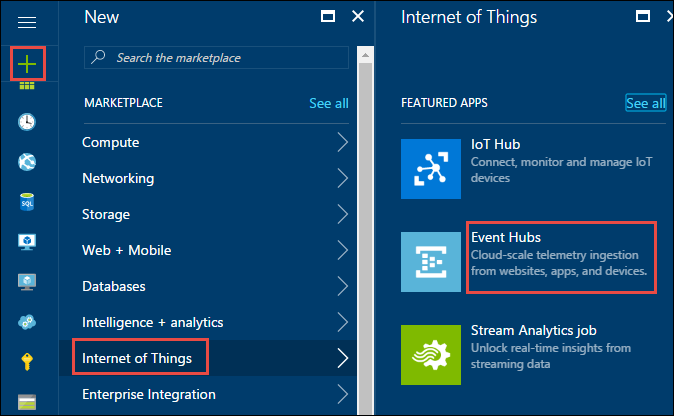
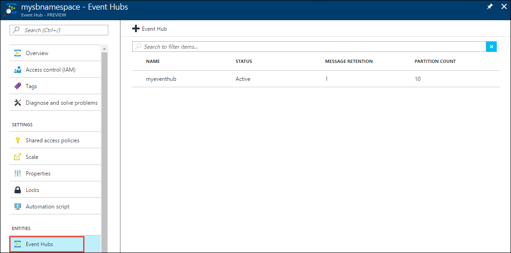
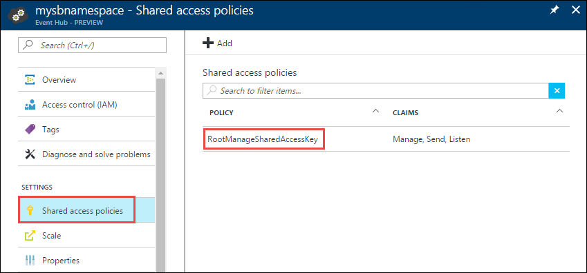
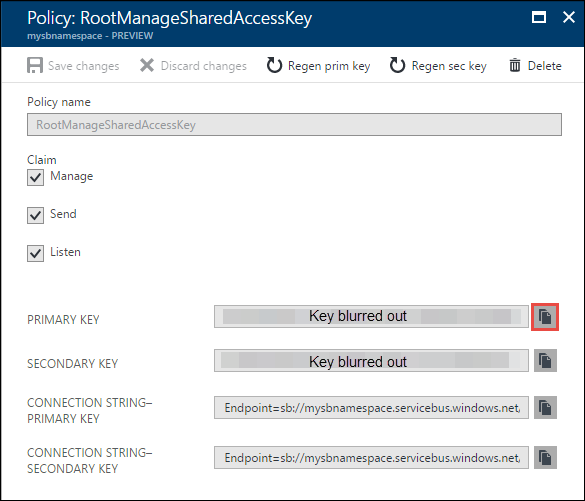
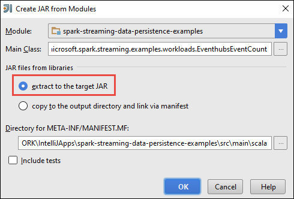
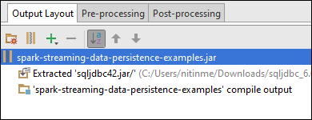
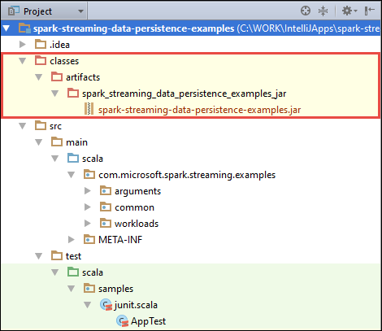

# Apache Spark streaming: Process data from Azure Event Hubs with Spark cluster on HDInsight

In this article, you create an Apache Spark streaming sample that involves the following steps:

1. You use a standalone application to ingest messages into an Azure Event Hub.

2. With two different approaches, you retrieve the messages from Event Hub in real-time using an application running in Spark cluster on Azure HDInsight.

3. You build streaming analytic pipelines to persist data to different storage systems, or get insights from data on the fly.

## Prerequisites

* An Azure subscription. See [Get Azure free trial](https://azure.microsoft.com/documentation/videos/get-azure-free-trial-for-testing-hadoop-in-hdinsight/).

* An Apache Spark cluster on HDInsight. For instructions, see [Create Apache Spark clusters in Azure HDInsight](hdinsight-apache-spark-jupyter-spark-sql.md).

## Spark Streaming concepts

For a detailed explanation of Spark streaming, see [Apache Spark streaming overview](http://spark.apache.org/docs/latest/streaming-programming-guide.html#overview). HDInsight brings the same streaming features to a Spark cluster on Azure.  

## What does this solution do?

In this article, to create a Spark streaming example, perform the following steps:

1. Create an Azure Event Hub that will receive a stream of events.

2. Run a local standalone application that generates events and pushes it to the Azure Event Hub. The sample application that does this is published at [https://github.com/hdinsight/spark-streaming-data-persistence-examples](https://github.com/hdinsight/spark-streaming-data-persistence-examples).

3. Run a streaming application remotely on a Spark cluster that reads streaming events from Azure Event Hub and perform various data processing/analysis.

## Create an Azure Event Hub

1. Log on to the [Azure Portal](https://ms.portal.azure.com), and click **New** at the top left of the screen.

2. Click **Internet of Things**, then click **Event Hubs**.

    

3. In the **Create namespace** blade, enter a namespace name. choose the pricing tier (Basic or Standard). Also, choose an Azure subscription, resource group, and location in which to create the resource. Click **Create** to create the namespace.

      

	> [!NOTE]
   	> You should select the same **Location** as your Apache Spark cluster in HDInsight to reduce latency and costs.
   	>
   	>

4. In the Event Hubs namespace list, click the newly-created namespace.      


5. In the namespace blade, click **Event Hubs**, and then click **+ Event Hub** to create a new Event Hub.
   
    

6. Type a name for your Event Hub, set the partition count to 10, and message retention to 1. We are not archiving the messages in this solution so you can leave the rest as default, and then click **Create**.
   
    

7. The newly created Event Hub is listed in the Event Hub blade.
    
     

8. Back in the namespace blade (not the specific Event Hub blade), click **Shared access policies**, and then click **RootManageSharedAccessKey**.
    
     

9. Click the copy button to copy the **RootManageSharedAccessKey** primary key and connection string to the clipboard. Save these to use later in the tutorial.
    
     

## Send messages to Azure Event Hub using a sample Scala application

In this section you use a standalone local Scala application that generates a stream of events and sends it to Azure Event Hub that you created earlier. This application is available on GitHub at [https://github.com/hdinsight/eventhubs-sample-event-producer](https://github.com/hdinsight/eventhubs-sample-event-producer). The steps here assume that you have already forked this GitHub repository.

1. Make sure you have the following installed on the computer where you run this application.

	* Oracle Java Development kit. You can install it from [here](http://www.oracle.com/technetwork/java/javase/downloads/jdk8-downloads-2133151.html).
	* Apache Maven. You can download it from [here](https://maven.apache.org/download.cgi). Instructions to install Maven are available [here](https://maven.apache.org/install.html).

2. Open a command prompt and navigate to the location you cloned the GitHub repo for the sample Scala application and run the following command to build the application.

        mvn package

3. The output jar for the application, **com-microsoft-azure-eventhubs-client-example-0.2.0.jar**, is created under **/target** directory. You use this JAR later in this article to test the complete solution.

## Create application to receive messages from Event Hub into a Spark cluster 

We have two approaches to connect Spark Streaming and Azure Event Hubs, Receiver-based connection and Direct-DStream-based connection. Direct-DStream-based is introduced on Jan of 2017, in the 2.0.3 release. It is supposed to replace the original receiver-based connection as it is more performant and resource-efficient. More details found in [https://github.com/hdinsight/spark-eventhubs](https://github.com/hdinsight/spark-eventhubs). Direct DStream only supports Spark 2.0+.

### Build applications with the dependency to spark-eventhubs connector

We will also publish the staging version of Spark-EventHubs in GitHub. To use the staging version of Spark-EventHubs, the first step is to indicate GitHub as the source repo by adding the following entry to pom.xml:

```xml
<repository>
      <id>spark-eventhubs</id>
      <url>https://raw.github.com/hdinsight/spark-eventhubs/maven-repo/</url>
      <snapshots>
        <enabled>true</enabled>
        <updatePolicy>always</updatePolicy>
      </snapshots>
</repository>
```

You can then add the following dependency to your project to take the pre-released version.

Maven Dependency

```xml
<!-- https://mvnrepository.com/artifact/com.microsoft.azure/spark-streaming-eventhubs_2.11 -->
<dependency>
    <groupId>com.microsoft.azure</groupId>
    <artifactId>spark-streaming-eventhubs_2.11</artifactId>
    <version>2.0.4</version>
</dependency>
```

SBT Dependency

```
// https://mvnrepository.com/artifact/com.microsoft.azure/spark-streaming-eventhubs_2.11
libraryDependencies += "com.microsoft.azure" % "spark-streaming-eventhubs_2.11" % "2.0.4"
```

### Direct DStream Connection

A pre-built jar file containing examples using Direct DStream can be downloaded in [http://central.maven.org/maven2/com/microsoft/azure/spark-streaming-eventhubs_2.11/2.0.4/spark-streaming-eventhubs_2.11-2.0.4.jar](http://central.maven.org/maven2/com/microsoft/azure/spark-streaming-eventhubs_2.11/2.0.4/spark-streaming-eventhubs_2.11-2.0.4.jar).

The jar file contains three examples whose source code are available at [https://github.com/hdinsight/spark-eventhubs/tree/master/examples/src/main/scala/com/microsoft/spark/streaming/examples/directdstream](https://github.com/hdinsight/spark-eventhubs/tree/master/examples/src/main/scala/com/microsoft/spark/streaming/examples/directdstream).

Taking [WindowingWordCount](https://github.com/hdinsight/spark-eventhubs/blob/master/examples/src/main/scala/com/microsoft/spark/streaming/examples/directdstream/WindowingWordCount.scala) as an example:

```scala
private def createStreamingContext(
  sparkCheckpointDir: String,
  batchDuration: Int,
  namespace: String,
  eventHunName: String,
  eventhubParams: Map[String, String],
  progressDir: String) = {
val ssc = new StreamingContext(new SparkContext(), Seconds(batchDuration))
ssc.checkpoint(sparkCheckpointDir)
val inputDirectStream = EventHubsUtils.createDirectStreams(
  ssc,
  namespace,
  progressDir,
  Map(eventHunName -> eventhubParams))

inputDirectStream.map(receivedRecord => (new String(receivedRecord.getBody), 1)).
  reduceByKeyAndWindow((v1, v2) => v1 + v2, (v1, v2) => v1 - v2, Seconds(batchDuration * 3),
    Seconds(batchDuration)).print()

ssc
}

def main(args: Array[String]): Unit = {

if (args.length != 8) {
  println("Usage: program progressDir PolicyName PolicyKey EventHubNamespace EventHubName" +
    " BatchDuration(seconds) Spark_Checkpoint_Directory maxRate")
  sys.exit(1)
}

val progressDir = args(0)
val policyName = args(1)
val policykey = args(2)
val namespace = args(3)
val name = args(4)
val batchDuration = args(5).toInt
val sparkCheckpointDir = args(6)
val maxRate = args(7)

val eventhubParameters = Map[String, String] (
  "eventhubs.policyname" -> policyName,
  "eventhubs.policykey" -> policykey,
  "eventhubs.namespace" -> namespace,
  "eventhubs.name" -> name,
  "eventhubs.partition.count" -> "32",
  "eventhubs.consumergroup" -> "$Default",
  "eventhubs.maxRate" -> s"$maxRate"
)

val ssc = StreamingContext.getOrCreate(sparkCheckpointDir,
  () => createStreamingContext(sparkCheckpointDir, batchDuration, namespace, name,
    eventhubParameters, progressDir))

ssc.start()
ssc.awaitTermination()
}
```

In the above example, `eventhubParameters` are the parameters specific to a single EventHubs instance and you have to pass it to the `createDirectStreams` API which constructs a Direct DStream object mapping to a Event Hubs namespace. Over the Direct DStream object, you can call any DStream API provided by Spark Streaming API framework. In this example, we calculate the frequency of each word within the last 3 micro batch intervals.

### Receiver-based Connection

A Spark streaming example application written in Scala, which receives events and route the to different destinations, is available at [https://github.com/hdinsight/spark-streaming-data-persistence-examples](https://github.com/hdinsight/spark-streaming-data-persistence-examples). Follow the steps below to update the application for your Event Hub configuration and create the output jar.

1. Launch IntelliJ IDEA and from the launch screen select **Check out from Version Control** and then click **Git**.
   
    

2. In the **Clone Repository** dialog box, provide the URL to the Git repository to clone from, specify the directory to clone to, and then click **Clone**.
   
    
3. Follow the prompts till the project is completely cloned. Press **Alt + 1** to open the **Project View**. It should resemble the following.
   
    
4. Make sure the application code is compiled with Java8. To ensure this, click **File**, click **Project Structure**, and on the **Project** tab, make sure Project language level is set to **8 - Lambdas, type annotations, etc.**.
   
    
5. Open the **pom.xml** and make sure the Spark version is correct. Under `<properties>` node, look for the following snippet and verify the Spark version.

        <scala.version>2.11.8</scala.version>
        <scala.compat.version>2.11.8</scala.compat.version>
        <scala.binary.version>2.11</scala.binary.version>
        <spark.version>2.0.0</spark.version>

6. The application requires a dependency jar called **JDBC driver jar**. This is required to write the messages received from Event Hub into an Azure SQL database. You can download this jar (v4.1 or later) from [here](https://msdn.microsoft.com/sqlserver/aa937724.aspx). Add reference to this jar in the project library. Perform the following steps:
     
     1. From IntelliJ IDEA window where you have the application open, click **File**, click **Project Structure**, and then click **Libraries**. 
     2. Click the add icon (), click **Java**, and then navigate to the location where you downloaded the JDBC driver jar. Follow the prompts to add the jar file to the project library.

         
     3. Click **Apply**.

7. Create the output jar file. Perform the following steps.

   1. In the **Project Structure** dialog box, click **Artifacts** and then click the plus symbol. From the pop-up dialog box, click **JAR**, and then click **From modules with dependencies**.      
       
       
   2. In the **Create JAR from Modules** dialog box, click the ellipsis () against the **Main Class**.
   3. In the **Select Main Class** dialog box, select any of the available classes and then click **OK**.
      
       
   4. In the **Create JAR from Modules** dialog box, make sure that the option to **extract to the target JAR** is selected, and then click **OK**. This creates a single JAR with all dependencies.
      
       
   5. The **Output Layout** tab lists all the jars that are included as part of the Maven project. You can select and delete the ones on which the Scala application has no direct dependency. For the application we are creating here, you can remove all but the last one (**spark-streaming-data-persistence-examples compile output**). Select the jars to delete and then click the **Delete** icon ().
      
       
      
       Make sure **Build on make** box is selected, which ensures that the jar is created every time the project is built or updated. Click **Apply**.
   6. In the **Output Layout** tab, right at the bottom of the **Available Elements** box, you have the SQL JDBC jar that you added earlier to the project library. You must add this to the **Output Layout** tab. Right-click the jar file, and then click **Extract Into Output Root**.
      
         
      
       The **Output Layout** tab should now look like this.
      
               
      
       In the **Project Structure** dialog box, click **Apply** and then click **OK**.    
   7. From the menu bar, click **Build**, and then click **Make Project**. You can also click **Build Artifacts** to create the jar. The output jar is created under **\classes\artifacts**.
      
       

## Run the application remotely on a Spark cluster using Livy

In this article you use Livy to run the Apache Spark streaming application remotely on a Spark cluster. For detailed discussion on how to use Livy with HDInsight Spark cluster, see [Submit jobs remotely to an Apache Spark cluster on Azure HDInsight](hdinsight-apache-spark-livy-rest-interface.md). Before you can start running the Spark streaming application, there are a couple of things you should do:

1. Start the local standalone application to generate events and sent to Event Hub. Use the following command to do so:

        java -cp com-microsoft-azure-eventhubs-client-example-0.2.0.jar com.microsoft.eventhubs.client.example.EventhubsClientDriver --eventhubs-namespace "mysbnamespace" --eventhubs-name "myeventhub" --policy-name "mysendpolicy" --policy-key "<policy key>" --message-length 32 --thread-count 32 --message-count -1

2. Copy the streaming jar (**spark-streaming-data-persistence-examples.jar**) to the Azure Blob storage associated with the cluster. This makes the jar accessible to Livy. You can use [**AzCopy**](../storage/storage-use-azcopy.md), a command line utility, to do so. There are a lot of other clients you can use to upload data. You can find more about them at [Upload data for Hadoop jobs in HDInsight](hdinsight-upload-data.md).
3. Install CURL on the computer where you are running these applications from. We use CURL to invoke the Livy endpoints to run the jobs remotely.

### Run the Spark streaming application to receive the events into an Azure Storage Blob as text

Open a command prompt, navigate to the directory where you installed CURL, and run the following command (replace username/password and cluster name):

    curl -k --user "admin:mypassword1!" -v -H "Content-Type: application/json" -X POST --data @C:\Temp\inputBlob.txt "https://mysparkcluster.azurehdinsight.net/livy/batches"

The parameters in the file **inputBlob.txt** are defined as follows:

    { "file":"wasb:///example/jars/spark-streaming-data-persistence-examples.jar", "className":"com.microsoft.spark.streaming.examples.workloads.EventhubsEventCount", "args":["--eventhubs-namespace", "mysbnamespace", "--eventhubs-name", "myeventhub", "--policy-name", "myreceivepolicy", "--policy-key", "<put-your-key-here>", "--consumer-group", "$default", "--partition-count", 10, "--batch-interval-in-seconds", 20, "--checkpoint-directory", "/EventCheckpoint", "--event-count-folder", "/EventCount/EventCount10"], "numExecutors":20, "executorMemory":"1G", "executorCores":1, "driverMemory":"2G" }

Let us understand what the parameters in the input file are:

* **file** is the path to the application jar file on the Azure storage account associated with the cluster.
* **className** is the name of the class in the jar.
* **args** is the list of arguments required by the class
* **numExecutors** is the number of cores used by Spark to run the streaming application. This should always be at least twice the number of Event Hub partitions.
* **executorMemory**, **executorCores**, **driverMemory** are parameters used to assign required resources to the streaming application.

> [!NOTE]
> You do not need to create the output folders (EventCheckpoint, EventCount/EventCount10) that are used as parameters. The streaming application creates them for you.
>
>

When you run the command, you should see an output like the following:

    < HTTP/1.1 201 Created
    < Content-Type: application/json; charset=UTF-8
    < Location: /18
    < Server: Microsoft-IIS/8.5
    < X-Powered-By: ARR/2.5
    < X-Powered-By: ASP.NET
    < Date: Tue, 01 Dec 2015 05:39:10 GMT
    < Content-Length: 37
    <
    {"id":1,"state":"starting","log":[]}* Connection #0 to host mysparkcluster.azurehdinsight.net left intact

Make a note of the batch ID in the last line of the output (in this example it is '1'). To verify that the application runs successfully, you can look at your Azure storage account associated with the cluster and you should see the **/EventCount/EventCount10** folder created there. This folder should contain blobs that captures the number of events processed within the time period specified for the parameter **batch-interval-in-seconds**.

The Spark streaming application will continue to run until you kill it. To do so, use the following command:

    curl -k --user "admin:mypassword1!" -v -X DELETE "https://mysparkcluster.azurehdinsight.net/livy/batches/1"

### Run the applications to receive the events into an Azure Storage Blob as JSON
Open a command prompt, navigate to the directory where you installed CURL, and run the following command (replace username/password and cluster name):

    curl -k --user "admin:mypassword1!" -v -H "Content-Type: application/json" -X POST --data @C:\Temp\inputJSON.txt "https://mysparkcluster.azurehdinsight.net/livy/batches"

The parameters in the file **inputJSON.txt** are defined as follows:

    { "file":"wasb:///example/jars/spark-streaming-data-persistence-examples.jar", "className":"com.microsoft.spark.streaming.examples.workloads.EventhubsToAzureBlobAsJSON", "args":["--eventhubs-namespace", "mysbnamespace", "--eventhubs-name", "myeventhub", "--policy-name", "myreceivepolicy", "--policy-key", "<put-your-key-here>", "--consumer-group", "$default", "--partition-count", 10, "--batch-interval-in-seconds", 20, "--checkpoint-directory", "/EventCheckpoint", "--event-count-folder", "/EventCount/EventCount10", "--event-store-folder", "/EventStore10"], "numExecutors":20, "executorMemory":"1G", "executorCores":1, "driverMemory":"2G" }

The parameters are similar to what you specified for the text output, in the previous step. Again, you do not need to create the output folders (EventCheckpoint, EventCount/EventCount10) that are used as parameters. The streaming application creates them for you.

 After you run the command, you can look at your Azure storage account associated with the cluster and you should see the **/EventStore10** folder created there. Open any file prefixed with **part-** and you should see the events processed in a JSON format.

### Run the applications to receive the events into a Hive table
To run the Spark streaming application that streams events into a Hive table you need some additional components. These are:

* datanucleus-api-jdo-3.2.6.jar
* datanucleus-rdbms-3.2.9.jar
* datanucleus-core-3.2.10.jar
* hive-site.xml

The **.jar** files are available on your HDInsight Spark cluster at `/usr/hdp/current/spark-client/lib`. The **hive-site.xml** is available at `/usr/hdp/current/spark-client/conf`.

You can use [WinScp](http://winscp.net/eng/download.php) to copy over these files from the cluster to your local computer. You can then use tools to copy these files over to your storage account associated with the cluster. For more information on how to upload files to the storage account, see [Upload data for Hadoop jobs in HDInsight](hdinsight-upload-data.md).

Once you have copied over the files to your Azure storage account, open a command prompt, navigate to the directory where you installed CURL, and run the following command (replace username/password and cluster name):

    curl -k --user "admin:mypassword1!" -v -H "Content-Type: application/json" -X POST --data @C:\Temp\inputHive.txt "https://mysparkcluster.azurehdinsight.net/livy/batches"

The parameters in the file **inputHive.txt** are defined as follows:

    { "file":"wasb:///example/jars/spark-streaming-data-persistence-examples.jar", "className":"com.microsoft.spark.streaming.examples.workloads.EventhubsToHiveTable", "args":["--eventhubs-namespace", "mysbnamespace", "--eventhubs-name", "myeventhub", "--policy-name", "myreceivepolicy", "--policy-key", "<put-your-key-here>", "--consumer-group", "$default", "--partition-count", 10, "--batch-interval-in-seconds", 20, "--checkpoint-directory", "/EventCheckpoint", "--event-count-folder", "/EventCount/EventCount10", "--event-hive-table", "EventHiveTable10" ], "jars":["wasb:///example/jars/datanucleus-api-jdo-3.2.6.jar", "wasb:///example/jars/datanucleus-rdbms-3.2.9.jar", "wasb:///example/jars/datanucleus-core-3.2.10.jar"], "files":["wasb:///example/jars/hive-site.xml"], "numExecutors":20, "executorMemory":"1G", "executorCores":1, "driverMemory":"2G" }

The parameters are similar to what you specified for the text output, in the previous steps. Again, you do not need to create the output folders (EventCheckpoint, EventCount/EventCount10) or the output Hive table (EventHiveTable10) that are used as parameters. The streaming application creates them for you. Note that the **jars** and **files** option includes paths to the .jar files and the hive-site.xml that you copied over to the storage account.

To verify that the hive table was successfully created, you can SSH into the cluster and run Hive queries. For instructions, see [Use Hive with Hadoop in HDInsight with SSH](hdinsight-hadoop-use-hive-ssh.md). Once you are connected using SSH, you can run the following command to verify that the Hive table, **EventHiveTable10**, is created.

    show tables;

You should see an output similar to the following:

    OK
    eventhivetable10
    hivesampletable

You can also run a SELECT query to view the contents of the table.

    SELECT * FROM eventhivetable10 LIMIT 10;

You should see an output like the following:

    ZN90apUSQODDTx7n6Toh6jDbuPngqT4c
    sor2M7xsFwmaRW8W8NDwMneFNMrOVkW1
    o2HcsU735ejSi2bGEcbUSB4btCFmI1lW
    TLuibq4rbj0T9st9eEzIWJwNGtMWYoYS
    HKCpPlWFWAJILwR69MAq863nCWYzDEw6
    Mvx0GQOPYvPR7ezBEpIHYKTKiEhYammQ
    85dRppSBSbZgThLr1s0GMgKqynDUqudr
    5LAWkNqorLj3ZN9a2mfWr9rZqeXKN4pF
    ulf9wSFNjD7BZXCyunozecov9QpEIYmJ
    vWzM3nvOja8DhYcwn0n5eTfOItZ966pa
    Time taken: 4.434 seconds, Fetched: 10 row(s)


### Run the applications to receive the events into an Azure SQL database table
Before running this step, make sure you have an Azure SQL database created. For instructions, see [Create a SQL database in minutes](../sql-database/sql-database-get-started.md). To complete this section, you need values for database name, database server name, and the database administrator credentials as parameters. You do not need to create the database table though. The Spark streaming application creates that for you.

Open a command prompt, navigate to the directory where you installed CURL, and run the following command:

    curl -k --user "admin:mypassword1!" -v -H "Content-Type: application/json" -X POST --data @C:\Temp\inputSQL.txt "https://mysparkcluster.azurehdinsight.net/livy/batches"

The parameters in the file **inputSQL.txt** are defined as follows:

    { "file":"wasb:///example/jars/spark-streaming-data-persistence-examples.jar", "className":"com.microsoft.spark.streaming.examples.workloads.EventhubsToAzureSQLTable", "args":["--eventhubs-namespace", "mysbnamespace", "--eventhubs-name", "myeventhub", "--policy-name", "myreceivepolicy", "--policy-key", "<put-your-key-here>", "--consumer-group", "$default", "--partition-count", 10, "--batch-interval-in-seconds", 20, "--checkpoint-directory", "/EventCheckpoint", "--event-count-folder", "/EventCount/EventCount10", "--sql-server-fqdn", "<database-server-name>.database.windows.net", "--sql-database-name", "mysparkdatabase", "--database-username", "sparkdbadmin", "--database-password", "<put-password-here>", "--event-sql-table", "EventContent" ], "numExecutors":20, "executorMemory":"1G", "executorCores":1, "driverMemory":"2G" }

To verify that the application runs successfully, you can connect to the Azure SQL database using SQL Server Management Studio. For instructions on how to do that, see [Connect to SQL Database with SQL Server Management Studio](../sql-database/sql-database-connect-query-ssms.md). Once you are connected to the database, you can navigate to the **EventContent** table that was created by the streaming application. You can run a quick query to get the data from the table. Run the following query:

    SELECT * FROM EventCount

You should see output similar to the following:

    00046b0f-2552-4980-9c3f-8bba5647c8ee
    000b7530-12f9-4081-8e19-90acd26f9c0c
    000bc521-9c1b-4a42-ab08-dc1893b83f3b
    00123a2a-e00d-496a-9104-108920955718
    0017c68f-7a4e-452d-97ad-5cb1fe5ba81b
    001KsmqL2gfu5ZcuQuTqTxQvVyGCqPp9
    001vIZgOStka4DXtud0e3tX7XbfMnZrN
    00220586-3e1a-4d2d-a89b-05c5892e541a
    0029e309-9e54-4e1b-84be-cd04e6fce5ec
    003333cf-874f-4045-9da3-9f98c2b4ea49
    0043c07e-8d73-420a-9af7-1fcb94575356
    004a11a9-0c2c-4bc0-a7d5-2e0ebd947ab9


## <a name="seealso"></a>See also
* [Overview: Apache Spark on Azure HDInsight](hdinsight-apache-spark-overview.md)
* [Design of Receiver-based Connection and Direct DStream](https://www.slideshare.net/NanZhu/seattle-sparkmeetup032317)

### Scenarios
* [Spark with BI: Perform interactive data analysis using Spark in HDInsight with BI tools](hdinsight-apache-spark-use-bi-tools.md)
* [Spark with Machine Learning: Use Spark in HDInsight for analyzing building temperature using HVAC data](hdinsight-apache-spark-ipython-notebook-machine-learning.md)
* [Spark with Machine Learning: Use Spark in HDInsight to predict food inspection results](hdinsight-apache-spark-machine-learning-mllib-ipython.md)
* [Website log analysis using Spark in HDInsight](hdinsight-apache-spark-custom-library-website-log-analysis.md)

### Create and run applications
* [Create a standalone application using Scala](hdinsight-apache-spark-create-standalone-application.md)
* [Run jobs remotely on a Spark cluster using Livy](hdinsight-apache-spark-livy-rest-interface.md)

### Tools and extensions
* [Use HDInsight Tools Plugin for IntelliJ IDEA to create and submit Spark Scala applicatons](hdinsight-apache-spark-intellij-tool-plugin.md)
* [Use HDInsight Tools Plugin for IntelliJ IDEA to debug Spark applications remotely](hdinsight-apache-spark-intellij-tool-plugin-debug-jobs-remotely.md)
* [Use Zeppelin notebooks with a Spark cluster on HDInsight](hdinsight-apache-spark-zeppelin-notebook.md)
* [Kernels available for Jupyter notebook in Spark cluster for HDInsight](hdinsight-apache-spark-jupyter-notebook-kernels.md)
* [Use external packages with Jupyter notebooks](hdinsight-apache-spark-jupyter-notebook-use-external-packages.md)
* [Install Jupyter on your computer and connect to an HDInsight Spark cluster](hdinsight-apache-spark-jupyter-notebook-install-locally.md)

### Manage resources
* [Manage resources for the Apache Spark cluster in Azure HDInsight](hdinsight-apache-spark-resource-manager.md)
* [Track and debug jobs running on an Apache Spark cluster in HDInsight](hdinsight-apache-spark-job-debugging.md)

[hdinsight-versions]: hdinsight-component-versioning.md
[hdinsight-upload-data]: hdinsight-upload-data.md
[hdinsight-storage]: hdinsight-hadoop-use-blob-storage.md

[azure-purchase-options]: http://azure.microsoft.com/pricing/purchase-options/
[azure-member-offers]: http://azure.microsoft.com/pricing/member-offers/
[azure-free-trial]: http://azure.microsoft.com/pricing/free-trial/
[azure-create-storageaccount]: ../storage-create-storage-account/
