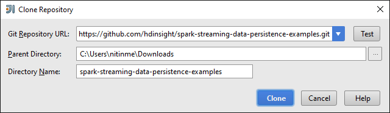
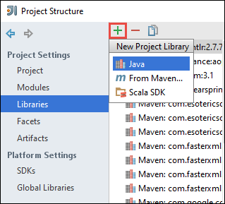
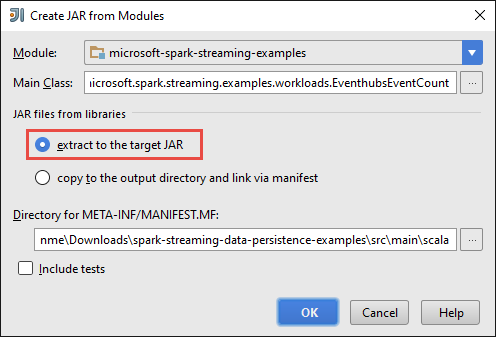
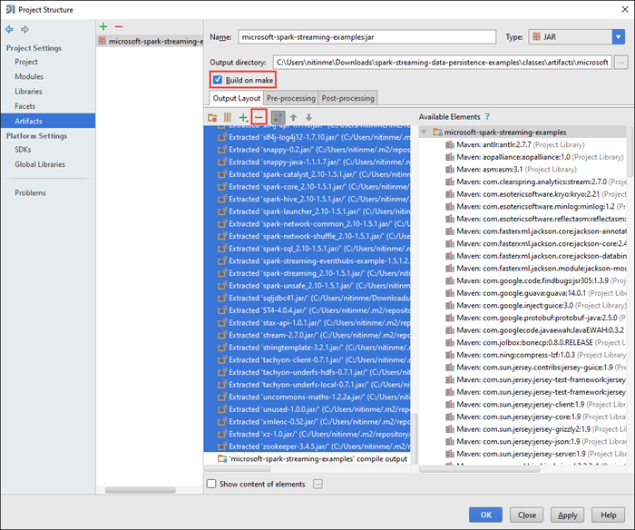
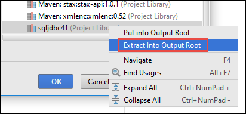
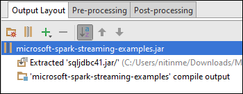
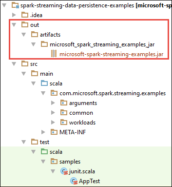

<properties 
	pageTitle="Use Azure Event Hubs with Apache Spark in HDInsight to process streaming data | Microsoft Azure" 
	description="Step-by-step instructions on how to send a data stream to Azure Event Hub and then receive those events in Spark using a scala application" 
	services="hdinsight" 
	documentationCenter="" 
	authors="nitinme" 
	manager="paulettm" 
	editor="cgronlun"
	tags="azure-portal"/>

<tags 
	ms.service="hdinsight" 
	ms.workload="big-data" 
	ms.tgt_pltfrm="na" 
	ms.devlang="na" 
	ms.topic="article" 
	ms.date="07/25/2016" 
	ms.author="nitinme"/>

# Spark Streaming: Process events from Azure Event Hubs with Apache Spark cluster on HDInsight Linux

Spark Streaming extends the core Spark API to build scalable, high-throughput, fault-tolerant stream processing applications. Data can be ingested from many sources. In this article we use Azure Event Hubs to ingest data. Event Hubs is a highly scalable ingestion system that can intake millions of events per second. 

In this tutorial, you will learn how to create an Azure Event Hub, how to ingest messages into an Event Hub using a console application in Java, and to retrieve them in parallel using a Spark application written in Scala. This application consumes the data streamed through Event Hubs and routes it to different outputs (Azure Storage Blob, Hive table, and SQL table).

> [AZURE.NOTE] To follow the instructions in this article, you will have to use both versions of the Azure portal. To create an Event Hub you will use the [Azure Classic portal](https://manage.windowsazure.com). To work with the HDInsight Spark cluster, you will use the [Azure Portal](https://portal.azure.com/).  

**Prerequisites:**

You must have the following:

- An Azure subscription. See [Get Azure free trial](https://azure.microsoft.com/documentation/videos/get-azure-free-trial-for-testing-hadoop-in-hdinsight/).
- An Apache Spark cluster. For instructions, see [Create Apache Spark clusters in Azure HDInsight](hdinsight-apache-spark-jupyter-spark-sql.md).
- Oracle Java Development kit. You can install it from [here](http://www.oracle.com/technetwork/java/javase/downloads/jdk8-downloads-2133151.html).
- A Java IDE. This article uses IntelliJ IDEA 15.0.1. You can install it from [here](https://www.jetbrains.com/idea/download/).
- Microsoft JDBC driver for SQL Server, v4.1 or later. This is required to write the event data into a SQL Server database. You can install it from [here](https://msdn.microsoft.com/sqlserver/aa937724.aspx).
- An Azure SQL database. For instructions, see [Create a SQL database in minutes](../sql-database/sql-database-get-started.md)

## What does this solution do?

This is how the streaming solution flows:

1. Create an Azure Event Hub that will receive a stream of events.

2. Run a local standalone application that generates events and pushes it the Azure Event Hub. The sample application that does this is published at [https://github.com/hdinsight/spark-streaming-data-persistence-examples](https://github.com/hdinsight/spark-streaming-data-persistence-examples).

2. Run a streaming application remotely on a Spark cluster that reads streaming events from Azure Event Hub and pushes it out to different locations (Azure Blob, Hive table, and SQL database table). 

## Create Azure Event Hub

1. From the [Azure Portal](https://manage.windowsazure.com), select **NEW** > **Service Bus** > **Event Hub** > **Custom Create**.

2. On the **Add a new Event Hub** screen, enter an **Event Hub Name**, select the **Region** to create the hub in, and create a new namespace or select an existing one. Click the **Arrow** to continue.

	

	> [AZURE.NOTE] You should select the same **Location** as your Apache Spark cluster in HDInsight to reduce latency and costs.

3. On the **Configure Event Hub** screen, enter the **Partition count** and **Message Retention** values, and then click the check mark. For this example, use a partition count of 10 and a message retention of 1. Note the partition count because you will need this value later.

	

4. Click the Event Hub that you created, click **Configure**, and then create two access policies for the event hub.

	<table>
	<tr><th>Name</th><th>Permissions</th></tr>
	<tr><td>mysendpolicy</td><td>Send</td></tr>
	<tr><td>myreceivepolicy</td><td>Listen</td></tr>
	</table>

	After You create the permissions, select the **Save** icon at the bottom of the page. This creates the shared access policies that will be used to send (**mysendpolicy**) and listen (**myreceivepolicy**) to this Event Hub.

	

	
5. On the same page, take a note of the policy keys generated for the two policies. Save these keys because they will be used later.

	

6. On the **Dashboard** page, click **Connection Information** from the bottom to retrieve and save the connection strings for the Event Hub using the two policies.

	

## Use a Scala application to send messages to Event Hub

In this section you use a standalone local Scala application to send a stream of events to Azure Event Hub that you created in the previous step. This application is available on GitHub at [https://github.com/hdinsight/eventhubs-sample-event-producer](https://github.com/hdinsight/eventhubs-sample-event-producer). The steps here assume that you have already forked this GitHub repository.

1. Open the application, **EventhubsSampleEventProducer**, in IntelliJ IDEA.
	
2. Build the project. From the **Build** menu, click **Make Project**. The output jar is created under **\out\artifacts**.

>[AZURE.TIP] You can also use an option available in IntelliJ IDEA to directly create the project from a GitHub repository. To understand how to use that approach, use the instructions in the next section for guidance. Note that a lot of steps that are described in the next section will not be applicable for the Scala application that you create in this step. For example:

> * You will not have to update the POM to include the Spark version. That's because there is no dependency on Spark for creating this application
> * You will not have to add some dependency jars to the project library. That's because those jars are not required for this project.

## Update the Scala streaming application for receiving the events

A sample Scala application to receive the event and route it to different destinations is available at [https://github.com/hdinsight/spark-streaming-data-persistence-examples](https://github.com/hdinsight/spark-streaming-data-persistence-examples). Follow the steps below to update the application and create the output jar.

1. Launch IntelliJ IDEA and from the launch screen select **Check out from Version Control** and then click **Git**.
		
	

2. In the **Clone Repository** dialog box, provide the URL to the Git repository to clone from, specify the directory to clone to, and then click **Clone**.

	

	
3. Follow the prompts till the project is completely cloned. Press **Alt + 1** to open the **Project View**. It should resemble the following.

	
	
4. Open the **pom.xml** and make sure the Spark version is correct. Under <properties> node, look for the following snippet and verify the Spark version.

		<scala.version>2.10.4</scala.version>
    	<scala.compat.version>2.10.4</scala.compat.version>
    	<scala.binary.version>2.10</scala.binary.version>
    	<spark.version>1.6.1</spark.version>

	Make sure the value for **spark.version** is set to **1.5.1**.

5. The application requires two dependency jars:

	* **EventHub receiver jar**. This is required for Spark to receive the messages from Event Hub. To include this jar, update the **pom.xml** to include the following under between `<repositories>..</repositories>` element. If the `<repositories>` element does not exist, create it at the same level as `<properties>`:

			  <repository>
			  	<id>spark-eventhubs</id>
			  	<url>https://raw.github.com/hdinsight/spark-eventhubs/maven-repo/</url>
			  	<snapshots>
					<enabled>true</enabled>
					<updatePolicy>always</updatePolicy>
			  	</snapshots>
			  </repository>
			

		Also, add the following under `<dependencies>`.

			<dependency>
			  <groupId>com.microsoft.azure</groupId>
			  <artifactId>spark-streaming-eventhubs_2.10</artifactId>
			  <version>1.0.0</version>
			</dependency> 

	* **JDBC driver jar**. This is required to write the messages received from Event Hub into an Azure SQL database. You can download v4.1 or later of this jar file from [here](https://msdn.microsoft.com/sqlserver/aa937724.aspx). Add reference to this jar in the project library. Perform the following steps:

		1. From IntelliJ IDEA window where you have the application open, click **File**, click **Project Structure**, and then click **Libraries**. 
		
		2. Click the add icon (), click **Java**, and then navigate to the location where you downloaded the JDBC driver jar. Follow the prompts to add the jar file to the project library.

			

		3. Click **Apply**.

6. Create the output jar file. Perform the following steps.
	1. In the **Project Structure** dialog box, click **Artifacts** and then click the plus symbol. From the pop-up dialog box, click **JAR**, and then click **From modules with dependencies**.

		

	1. In the **Create JAR from Modules** dialog box, click the ellipsis () against the **Main Class**.

	1. In the **Select Main Class** dialog box, select any of the available classes and then click **OK**.

		

	1. In the **Create JAR from Modules** dialog box, make sure that the option to **extract to the target JAR** is selected, and then click **OK**. This creates a single JAR with all dependencies.

		

	1. The **Output Layout** tab lists all the jars that are included as part of the Maven project. You can select and delete the ones on which the Scala application has no direct dependency. For the application we are creating here, you can remove all but the last one (**microsoft-spark-streaming-examples compile output**). Select the jars to delete and then click the **Delete** icon ().

		

		Make sure **Build on make** box is selected, which ensures that the jar is created every time the project is built or updated. Click **Apply** and then **OK**.

	1. In the **Output Layout** tab, right at the bottom of the **Available Elements** box, you have the SQL JDBC jar that you added earlier to the project library. You must add this to the **Output Layout** tab. Right-click the jar file, and then click **Extract Into Output Root**.

		  

		The **Output Layout** tab should now look like this.

				

		In the **Project Structure** dialog box, click **Apply** and then click **OK**.	

	1. From the menu bar, click **Build**, and then click **Make Project**. You can also click **Build Artifacts** to create the jar. The output jar is created under **\out\artifacts**.

		

## Run the applications remotely on a Spark cluster using Livy

We will use Livy to run the streaming application remotely on a Spark cluster. For detailed discussion on how to use Livy with HDInsight Spark cluster, see [Submit jobs remotely to an Apache Spark cluster on Azure HDInsight](hdinsight-apache-spark-livy-rest-interface.md). Before you can start running the remote jobs to stream events using Spark there are a couple of things you should do:

1. Start the local standalone application to generate events and sent to Event Hub. Use the following command to do so:

		java -cp EventhubsSampleEventProducer.jar com.microsoft.eventhubs.client.example.EventhubsClientDriver --eventhubs-namespace "mysbnamespace" --eventhubs-name "myeventhub" --policy-name "mysendpolicy" --policy-key "<policy key>" --message-length 32 --thread-count 32 --message-count -1

2. Copy the streaming jar (**microsoft-spark-streaming-examples.jar**) to the Azure Blob storage associated with the cluster. This makes the jar accessible to Livy. You can use [**AzCopy**](../storage/storage-use-azcopy.md), a command line utility, to do so. There are a lot of other clients you can use to upload data. You can find more about them at [Upload data for Hadoop jobs in HDInsight](hdinsight-upload-data.md).

3. Install CURL on the computer where you are running these applications from. We use CURL to invoke the Livy endpoints to run the jobs remotely.

### Run the applications to receive the events into an Azure Storage Blob as text

Open a command prompt, navigate to the directory where you installed CURL, and run the following command (replace username/password and cluster name):

	curl -k --user "admin:mypassword1!" -v -H "Content-Type: application/json" -X POST --data @C:\Temp\inputBlob.txt "https://mysparkcluster.azurehdinsight.net/livy/batches"

The parameters in the file **inputBlob.txt** are defined as follows:

	{ "file":"wasbs:///example/jars/microsoft-spark-streaming-examples.jar", "className":"com.microsoft.spark.streaming.examples.workloads.EventhubsEventCount", "args":["--eventhubs-namespace", "mysbnamespace", "--eventhubs-name", "myeventhub", "--policy-name", "myreceivepolicy", "--policy-key", "<put-your-key-here>", "--consumer-group", "$default", "--partition-count", 10, "--batch-interval-in-seconds", 20, "--checkpoint-directory", "/EventCheckpoint", "--event-count-folder", "/EventCount/EventCount10"], "numExecutors":20, "executorMemory":"1G", "executorCores":1, "driverMemory":"2G" }

Let us understand what the parameters in the input file are:

* **file** is the path to the application jar file on the Azure storage account associated with the cluster.
* **className** is the name of the class in the jar.
* **args** is the list of arguments required by the class
* **numExecutors** is the number of cores used by Spark to run the streaming application. This should always be at least twice the number of Event Hub partitions.
* **executorMemory**, **executorCores**, **driverMemory** are parameters used to assign required resources to the streaming application.

>[AZURE.NOTE] You do not need to create the output folders (EventCheckpoint, EventCount/EventCount10) that are used as parameters. The streaming application creates them for you.
	
When you run the command, you should see an output like the following:

	< HTTP/1.1 201 Created
	< Content-Type: application/json; charset=UTF-8
	< Location: /18
	< Server: Microsoft-IIS/8.5
	< X-Powered-By: ARR/2.5
	< X-Powered-By: ASP.NET
	< Date: Tue, 01 Dec 2015 05:39:10 GMT
	< Content-Length: 37
	<
	{"id":1,"state":"starting","log":[]}* Connection #0 to host mysparkcluster.azurehdinsight.net left intact

Make a note of the batch ID in the last line of the output (in this example it is '1'). To verify that the application runs successfully, you can look at your Azure storage account associated with the cluster and you should see the **/EventCount/EventCount10** folder created there. This folder should contain blobs that captures the number of events processed within the time period specified for the parameter **batch-interval-in-seconds**.

The application will continue to run until you kill it. To do so, use the following command:

	curl -k --user "admin:mypassword1!" -v -X DELETE "https://mysparkcluster.azurehdinsight.net/livy/batches/1"

### Run the applications to receive the events into an Azure Storage Blob as JSON

Open a command prompt, navigate to the directory where you installed CURL, and run the following command (replace username/password and cluster name):

	curl -k --user "admin:mypassword1!" -v -H "Content-Type: application/json" -X POST --data @C:\Temp\inputJSON.txt "https://mysparkcluster.azurehdinsight.net/livy/batches"

The parameters in the file **inputJSON.txt** are defined as follows:

	{ "file":"wasbs:///example/jars/microsoft-spark-streaming-examples.jar", "className":"com.microsoft.spark.streaming.examples.workloads.EventhubsToAzureBlobAsJSON", "args":["--eventhubs-namespace", "mysbnamespace", "--eventhubs-name", "myeventhub", "--policy-name", "myreceivepolicy", "--policy-key", "<put-your-key-here>", "--consumer-group", "$default", "--partition-count", 10, "--batch-interval-in-seconds", 20, "--checkpoint-directory", "/EventCheckpoint", "--event-count-folder", "/EventCount/EventCount10", "--event-store-folder", "/EventStore10"], "numExecutors":20, "executorMemory":"1G", "executorCores":1, "driverMemory":"2G" }

The parameters are similar to what you specified for the text output, in the previous step. Again, you do not need to create the output folders (EventCheckpoint, EventCount/EventCount10) that are used as parameters. The streaming application creates them for you.

 After you run the command, you can look at your Azure storage account associated with the cluster and you should see the **/EventStore10** folder created there. Open any file prefixed with **part-** and you should see the events processed in a JSON format.

### Run the applications to receive the events into a Hive table

To run the application that streams events into a Hive table you need some additional components. These are:

* datanucleus-api-jdo-3.2.6.jar
* datanucleus-rdbms-3.2.9.jar
* datanucleus-core-3.2.10.jar
* hive-site.xml

The **.jar** files are available on your HDInsight Spark cluster at `/usr/hdp/current/spark-client/lib`. The **hive-site.xml** is available at `/usr/hdp/current/spark-client/conf`.

You can use [WinScp](http://winscp.net/eng/download.php) to copy over these files from the cluster to your local computer. You can then use tools to copy these files over to your storage account associated with the cluster. For more information on how to upload files to the storage account, see [Upload data for Hadoop jobs in HDInsight](hdinsight-upload-data.md).

Once you have copied over the files to your Azure storage account, open a command prompt, navigate to the directory where you installed CURL, and run the following command (replace username/password and cluster name):

	curl -k --user "admin:mypassword1!" -v -H "Content-Type: application/json" -X POST --data @C:\Temp\inputHive.txt "https://mysparkcluster.azurehdinsight.net/livy/batches"

The parameters in the file **inputHive.txt** are defined as follows:

	{ "file":"wasbs:///example/jars/microsoft-spark-streaming-examples.jar", "className":"com.microsoft.spark.streaming.examples.workloads.EventhubsToHiveTable", "args":["--eventhubs-namespace", "mysbnamespace", "--eventhubs-name", "myeventhub", "--policy-name", "myreceivepolicy", "--policy-key", "<put-your-key-here>", "--consumer-group", "$default", "--partition-count", 10, "--batch-interval-in-seconds", 20, "--checkpoint-directory", "/EventCheckpoint", "--event-count-folder", "/EventCount/EventCount10", "--event-hive-table", "EventHiveTable10" ], "jars":["wasbs:///example/jars/datanucleus-api-jdo-3.2.6.jar", "wasbs:///example/jars/datanucleus-rdbms-3.2.9.jar", "wasbs:///example/jars/datanucleus-core-3.2.10.jar"], "files":["wasbs:///example/jars/hive-site.xml"], "numExecutors":20, "executorMemory":"1G", "executorCores":1, "driverMemory":"2G" }

The parameters are similar to what you specified for the text output, in the previous steps. Again, you do not need to create the output folders (EventCheckpoint, EventCount/EventCount10) or the output Hive table (EventHiveTable10) that are used as parameters. The streaming application creates them for you. Note that the **jars** and **files** option includes paths to the .jar files and the hive-site.xml that you copied over to the storage account.

To verify that the hive table was successfully created, you can SSH into the cluster and run Hive queries. For instructions, see [Use Hive with Hadoop in HDInsight with SSH](hdinsight-hadoop-use-hive-ssh.md). Once you are connected using SSH, you can run the following command to verify that the Hive table, **EventHiveTable10**, is created.

	show tables;

You should see an output similar to the following:

	OK
	eventhivetable10
	hivesampletable

You can also run a SELECT query to view the contents of the table.

	SELECT * FROM eventhivetable10 LIMIT 10;

You should see an output like the following:

	ZN90apUSQODDTx7n6Toh6jDbuPngqT4c
	sor2M7xsFwmaRW8W8NDwMneFNMrOVkW1
	o2HcsU735ejSi2bGEcbUSB4btCFmI1lW
	TLuibq4rbj0T9st9eEzIWJwNGtMWYoYS
	HKCpPlWFWAJILwR69MAq863nCWYzDEw6
	Mvx0GQOPYvPR7ezBEpIHYKTKiEhYammQ
	85dRppSBSbZgThLr1s0GMgKqynDUqudr
	5LAWkNqorLj3ZN9a2mfWr9rZqeXKN4pF
	ulf9wSFNjD7BZXCyunozecov9QpEIYmJ
	vWzM3nvOja8DhYcwn0n5eTfOItZ966pa
	Time taken: 4.434 seconds, Fetched: 10 row(s)

### Run the applications to receive the events into an Azure SQL database table

Before running this step, make sure you have an Azure SQL database created. You will need values for database name, database server name, and the database administrator credentials as parameters. You do not need to create the database table though. The streaming application creates that for you.

Open a command prompt, navigate to the directory where you installed CURL, and run the following command:

	curl -k --user "admin:mypassword1!" -v -H "Content-Type: application/json" -X POST --data @C:\Temp\inputSQL.txt "https://mysparkcluster.azurehdinsight.net/livy/batches"

The parameters in the file **inputSQL.txt** are defined as follows:

	{ "file":"wasbs:///example/jars/microsoft-spark-streaming-examples.jar", "className":"com.microsoft.spark.streaming.examples.workloads.EventhubsToAzureSQLTable", "args":["--eventhubs-namespace", "mysbnamespace", "--eventhubs-name", "myeventhub", "--policy-name", "myreceivepolicy", "--policy-key", "<put-your-key-here>", "--consumer-group", "$default", "--partition-count", 10, "--batch-interval-in-seconds", 20, "--checkpoint-directory", "/EventCheckpoint", "--event-count-folder", "/EventCount/EventCount10", "--sql-server-fqdn", "<database-server-name>.database.windows.net", "--sql-database-name", "mysparkdatabase", "--database-username", "sparkdbadmin", "--database-password", "<put-password-here>", "--event-sql-table", "EventContent" ], "numExecutors":20, "executorMemory":"1G", "executorCores":1, "driverMemory":"2G" }

To verify that the application runs successfully, you can connect to the Azure SQL database using SQL Server Management Studio. For instructions on how to do that, see [Connect to SQL Database with SQL Server Management Studio](../sql-database/sql-database-connect-query-ssms.md). Once you are connected to the database, you can navigate to the **EventContent** table that was created by the streaming application. You can run a quick query to get the data from the table. Run the following query:

	SELECT * FROM EventCount

You should see output similar to the following:

	00046b0f-2552-4980-9c3f-8bba5647c8ee
	000b7530-12f9-4081-8e19-90acd26f9c0c
	000bc521-9c1b-4a42-ab08-dc1893b83f3b
	00123a2a-e00d-496a-9104-108920955718
	0017c68f-7a4e-452d-97ad-5cb1fe5ba81b
	001KsmqL2gfu5ZcuQuTqTxQvVyGCqPp9
	001vIZgOStka4DXtud0e3tX7XbfMnZrN
	00220586-3e1a-4d2d-a89b-05c5892e541a
	0029e309-9e54-4e1b-84be-cd04e6fce5ec
	003333cf-874f-4045-9da3-9f98c2b4ea49
	0043c07e-8d73-420a-9af7-1fcb94575356
	004a11a9-0c2c-4bc0-a7d5-2e0ebd947ab9

	
## See also

* [Overview: Apache Spark on Azure HDInsight](hdinsight-apache-spark-overview.md)

### Scenarios

* [Spark with BI: Perform interactive data analysis using Spark in HDInsight with BI tools](hdinsight-apache-spark-use-bi-tools.md)

* [Spark with Machine Learning: Use Spark in HDInsight for analyzing building temperature using HVAC data](hdinsight-apache-spark-ipython-notebook-machine-learning.md)

* [Spark with Machine Learning: Use Spark in HDInsight to predict food inspection results](hdinsight-apache-spark-machine-learning-mllib-ipython.md)

* [Website log analysis using Spark in HDInsight](hdinsight-apache-spark-custom-library-website-log-analysis.md)

### Create and run applications

* [Create a standalone application using Scala](hdinsight-apache-spark-create-standalone-application.md)

* [Run jobs remotely on a Spark cluster using Livy](hdinsight-apache-spark-livy-rest-interface.md)

### Tools and extensions

* [Use HDInsight Tools Plugin for IntelliJ IDEA to create and submit Spark Scala applicatons](hdinsight-apache-spark-intellij-tool-plugin.md)

* [Use HDInsight Tools Plugin for IntelliJ IDEA to debug Spark applications remotely](hdinsight-apache-spark-intellij-tool-plugin-debug-jobs-remotely.md)

* [Use Zeppelin notebooks with a Spark cluster on HDInsight](hdinsight-apache-spark-use-zeppelin-notebook.md)

* [Kernels available for Jupyter notebook in Spark cluster for HDInsight](hdinsight-apache-spark-jupyter-notebook-kernels.md)

* [Use external packages with Jupyter notebooks](hdinsight-apache-spark-jupyter-notebook-use-external-packages.md)

* [Install Jupyter on your computer and connect to an HDInsight Spark cluster](hdinsight-apache-spark-jupyter-notebook-install-locally.md)

### Manage resources

* [Manage resources for the Apache Spark cluster in Azure HDInsight](hdinsight-apache-spark-resource-manager.md)

* [Track and debug jobs running on an Apache Spark cluster in HDInsight](hdinsight-apache-spark-job-debugging.md)

[hdinsight-versions]: hdinsight-component-versioning.md
[hdinsight-upload-data]: hdinsight-upload-data.md
[hdinsight-storage]: hdinsight-hadoop-use-blob-storage.md

[azure-purchase-options]: http://azure.microsoft.com/pricing/purchase-options/
[azure-member-offers]: http://azure.microsoft.com/pricing/member-offers/
[azure-free-trial]: http://azure.microsoft.com/pricing/free-trial/
[azure-management-portal]: https://manage.windowsazure.com/
[azure-create-storageaccount]: ../storage-create-storage-account/ 
