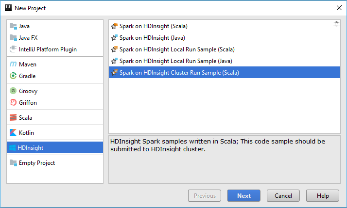
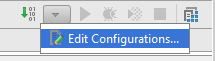
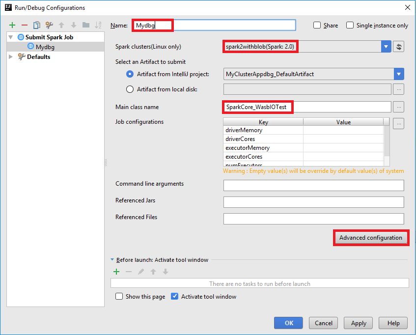
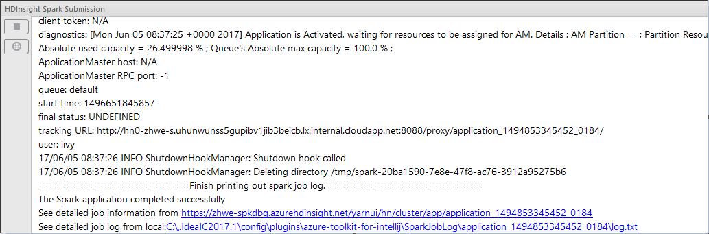
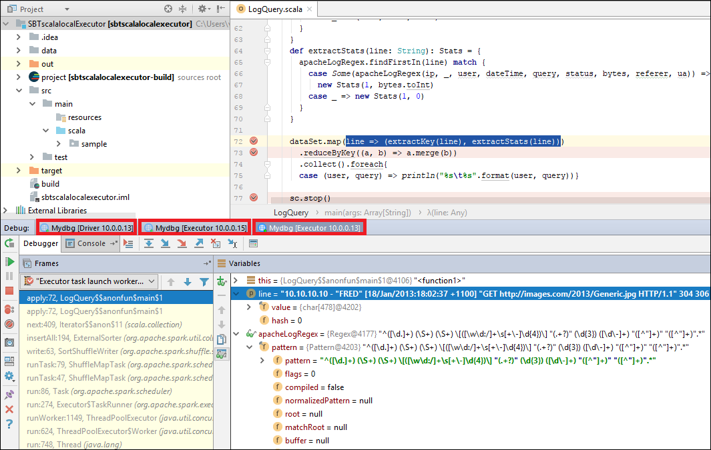
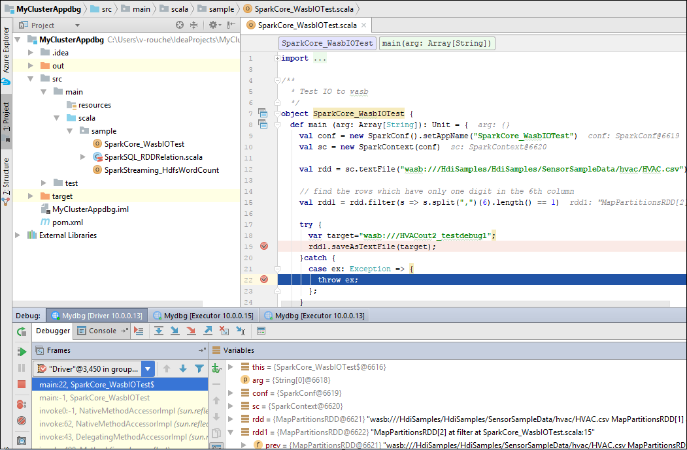
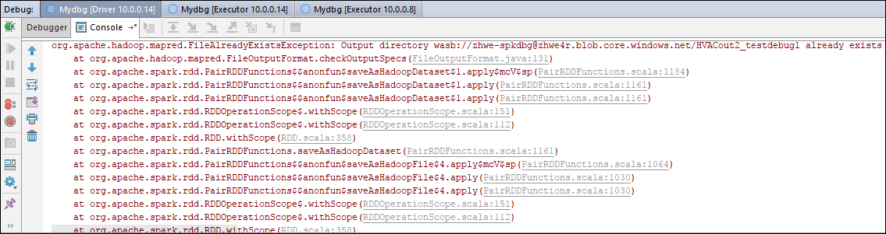
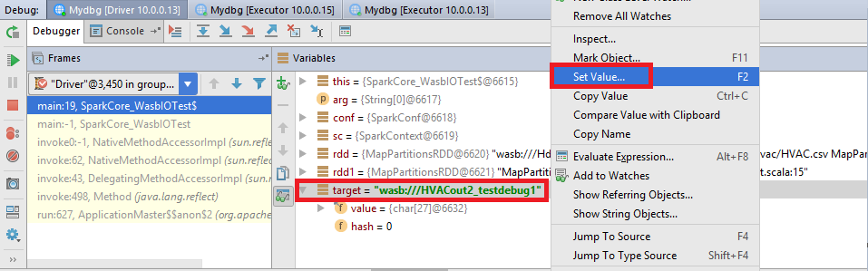
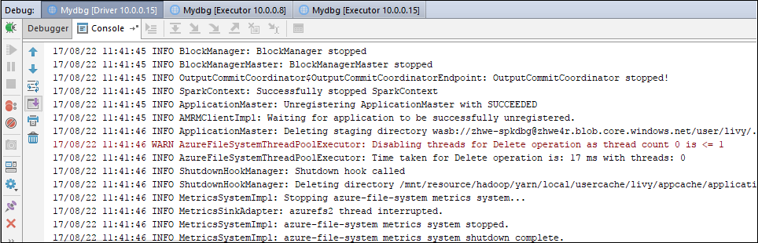

# Remotely debug Spark applications on an HDInsight cluster with Azure Toolkit for IntelliJ 

This article provides step-by-step guidance on how to use the HDInsight Tools in Azure Toolkit for IntelliJ to debug applications remotely on an HDInsight cluster.

**Prerequisites:**

* HDInsight Tools in Azure Toolkit for IntelliJ that is part of the Azure Toolkit for IntelliJ. You can refer to [Installing the Azure Toolkit for IntelliJ](https://docs.microsoft.com/en-us/azure/azure-toolkit-for-intellij-installation).
* Use Azure Toolkit for IntelliJ to create Spark applications for HDInsight cluster. Follow the instructions [here](https://docs.microsoft.com/en-us/azure/hdinsight/hdinsight-apache-spark-intellij-tool-plugin).
* HDInsight SSH service with username and password management. You can prefer to [Connect to HDInsight (Hadoop) using SSH](https://docs.microsoft.com/en-us/azure/hdinsight/hdinsight-hadoop-linux-use-ssh-unix) and [Use SSH Tunneling to access Ambari web UI](https://docs.microsoft.com/en-us/azure/hdinsight/hdinsight-linux-ambari-ssh-tunnel). 
 

## Create a Spark Scala application and configure it for remote debugging
1. Launch IntelliJ IDEA and create a project. In the new project dialog box, make the following choices, and then click Next. This article uses Spark on HDInsight Cluster Run Sample (Scala) as an example.

     
   - From the left pane, select **HDInsight**.
   - From the right pane, select Java or Scala template based on your preference: **Spark on HDInsight (Scala), Spark on HDInsight (Java), or Spark on HDInsight Cluster Run Sample (Scala)**.
2. In the next window, provide the project details.

   
   - Provide a project name and project location.
   - For **Project SDK**, Use Java 1.8 for spark 2.x cluster, Java 1.7 for spark 1.x cluster.
   - For **Spark Version**, Scala project creation wizard integrates proper version for Spark SDK and Scala IDE. If the spark cluster version is lower 2.0, choose spark 1.x. Otherwise, you should select spark2.x. This article uses Spark2.0.2(Scala 2.11.8) as an example.
3. Click **src** -> **main** -> **scala** folder to open your code in project. This article uses SparkCore_wasbloTest script as an example.
4. Click the icon at the top right to **Edit Configurations** menu to create or edit the configurations for the remote debugging.

    
5. Click **+** in the Run/Debug Configurations window. Choose **Submit Spark Job** option.

   
6. Enter Name, Spark cluster, and Main class name. Then click **Advanced configuration**. 

   
7. In the **Spark Submission Advanced Configuration** dialog window. 
**Enable Spark remote debug** for SSH authentication. Enter SSH user name, password, or use private key file. Click **OK** to save it.

   
8. Click **OK** to save it in Run/Debug configurations dialog, when all have done. The configuration is now saved with the name you provided. You can click the configuration name to view the configurations details or click **Edit Configurations** to make changes. 
9. After completing the configurations settings, you can run the project against the remote cluster or perform remote debugging.

## Scenarios of Remote Debugging and Remote Run
### Scenario 1: Perform Remote Run
1. Click the run icon to execute the project remotely.

   

2. The **HDInsight Spark Submission** window displays the application execution status. You can monitor the progress of the Scala job based on information here.

   

### Scenario 2: Perform Remote Debugging
1. Set up a breaking point and click **Debug** icon.

    
2. When the program execution reaches the breakpoint, you should see a Debugger tab in the bottom pane and view parameter and variable information in the Variable window. Click **Step Over** icon to proceed to next line of code, you can further step through the code. Click **Resume Program** icon to continue running. You can review the execution status in the HDInsight Spark Submission window. 

   

### Scenario 3: Perform Remote Debugging and bug fixing
In this section, we show you how to dynamically update the variable value using IntelliJ debugging capability for a simple fix. For the code example below, an exception is thrown because the target file already exists.
  
        import org.apache.spark.SparkConf
        import org.apache.spark.SparkContext

        object SparkCore_WasbIOTest {
          def main(arg: Array[String]): Unit = {
            val conf = new SparkConf().setAppName("SparkCore_WasbIOTest")
            val sc = new SparkContext(conf)
            val rdd = sc.textFile("wasb:///HdiSamples/HdiSamples/SensorSampleData/hvac/HVAC.csv")

            // find the rows which have only one digit in the 6th column
            val rdd1 = rdd.filter(s => s.split(",")(6).length() == 1)

            try {
              var target = "wasb:///HVACout2_testdebug1";
              rdd1.saveAsTextFile(target);
            } catch {
              case ex: Exception => {
                throw ex;
              }
            }
          }
        }

1. Set up two breaking points and click **Debug** icon to start remote debug.
2. The code stops at the first breaking point, the parameter and variable information are shown in the Variable window. 
3. Click **Resume Program** icon to continue and stops at the second point. The exception is being caught as expected.
 
4. Click **Resume Program** icon again, the HDInsight Spark Submission window displays a job run failed error.
 
5. Click **Debug** again and dynamically update the variable value using IntelliJ debugging capability. The variable windows shows up again. 
6. Right click target on debug tab and click **Set Value**, then input a new value of the variable and click enter to save the value. 
 
7. Click **Resume Program** icon to continue running. This time, the exception is not being caught. You can see the project is executed successfully without any exceptions.

## See also
* [Overview: Apache Spark on Azure HDInsight](hdinsight-apache-spark-overview.md)

### Demo
* Remote Debug (Video): [Use Azure Toolkit for IntelliJ to debug Spark applications remotely on HDInsight Cluster](https://www.youtube.com/watch?v=wQtj_wjn1Ac)

### Scenarios
* [Spark with BI: Perform interactive data analysis using Spark in HDInsight with BI tools](hdinsight-apache-spark-use-bi-tools.md)
* [Spark with Machine Learning: Use Spark in HDInsight for analyzing building temperature using HVAC data](hdinsight-apache-spark-ipython-notebook-machine-learning.md)
* [Spark with Machine Learning: Use Spark in HDInsight to predict food inspection results](hdinsight-apache-spark-machine-learning-mllib-ipython.md)
* [Spark Streaming: Use Spark in HDInsight for building real-time streaming applications](hdinsight-apache-spark-eventhub-streaming.md)
* [Website log analysis using Spark in HDInsight](hdinsight-apache-spark-custom-library-website-log-analysis.md)

### Create and run applications
* [Create a standalone application using Scala](hdinsight-apache-spark-create-standalone-application.md)
* [Run jobs remotely on a Spark cluster using Livy](hdinsight-apache-spark-livy-rest-interface.md)

### Tools and extensions
* [Use HDInsight Tools in Azure Toolkit for IntelliJ to create and submit Spark Scala applicatons](hdinsight-apache-spark-intellij-tool-plugin.md)
* [Use Azure Toolkit for IntelliJ to debug applications remotely on HDInsight Spark through VPN](hdinsight-apache-spark-intellij-tool-plugin-debug-jobs-remotely.md)
* [Use HDInsight Tools in Azure Toolkit for Eclipse to create Spark applications](hdinsight-apache-spark-eclipse-tool-plugin.md)
* [Use Zeppelin notebooks with a Spark cluster on HDInsight](hdinsight-apache-spark-zeppelin-notebook.md)
* [Kernels available for Jupyter notebook in Spark cluster for HDInsight](hdinsight-apache-spark-jupyter-notebook-kernels.md)
* [Use external packages with Jupyter notebooks](hdinsight-apache-spark-jupyter-notebook-use-external-packages.md)
* [Install Jupyter on your computer and connect to an HDInsight Spark cluster](hdinsight-apache-spark-jupyter-notebook-install-locally.md)

### Manage resources
* [Manage resources for the Apache Spark cluster in Azure HDInsight](hdinsight-apache-spark-resource-manager.md)
* [Track and debug jobs running on an Apache Spark cluster in HDInsight](hdinsight-apache-spark-job-debugging.md)
 