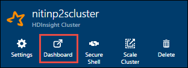
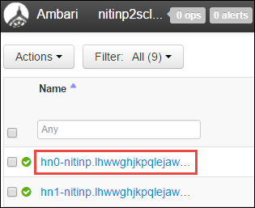
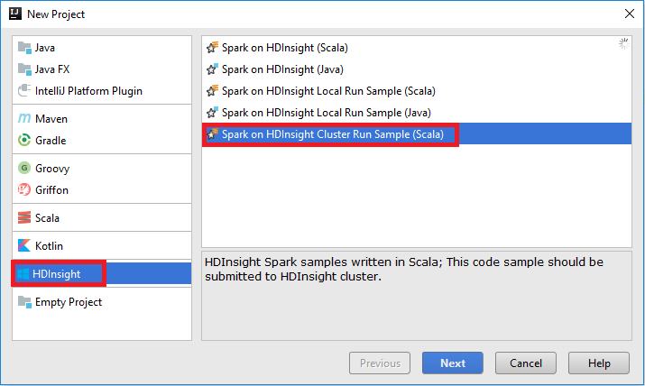
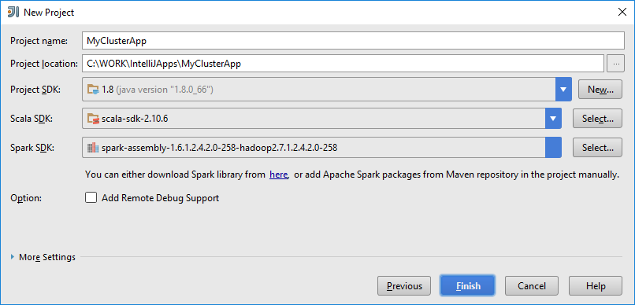
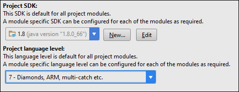
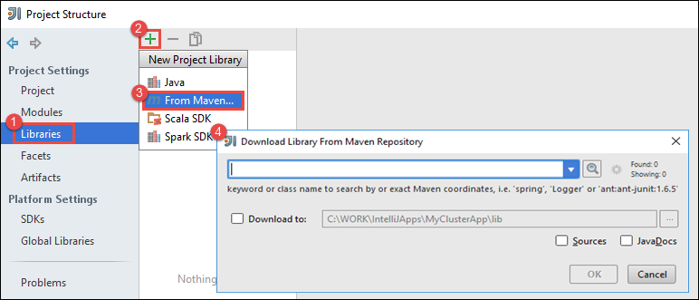
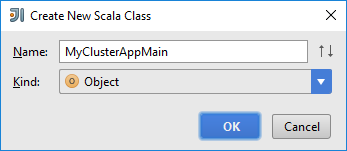
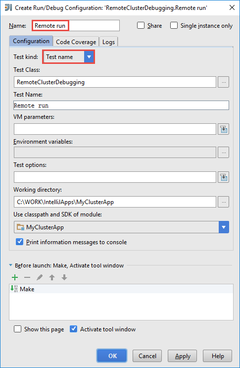
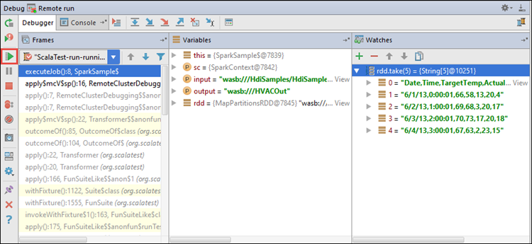

 <properties
	pageTitle="Use HDInsight plugin for IntelliJ IDEA to remotely debug applications running on HDInsight Spark clusters| Microsoft Azure"
	description="Learn how use HDInsight plugin for IntelliJ IDEA to remotely debug applications running on HDInsight Spark clusters."
	services="hdinsight"
	documentationCenter=""
	authors="nitinme"
	manager="paulettm"
	editor="cgronlun"
	tags="azure-portal"/>

<tags
	ms.service="hdinsight"
	ms.workload="big-data"
	ms.tgt_pltfrm="na"
	ms.devlang="na"
	ms.topic="article"
	ms.date="07/25/2016"
	ms.author="nitinme"/>

# Use HDInsight Tools Plugin for IntelliJ IDEA to debug Spark applications remotely on HDInsight Spark Linux cluster

This article provides step-by-step guidance on how to use the HDInsight tools plugin for IntelliJ IDEA to submit a Spark job on HDInsight Spark cluster and then debug it remotely from your desktop computer. To do so, you must perform the following high-level steps:

1. Create a site-to-site or point-to-site Azure Virtual Network. The steps in this document assume that you use a site-to-site network.

2. Create a Spark cluster in Azure HDInsight that is part of the site-to-site Azure Virtual Network.

3. Verify the connectivity between the cluster headnode and your desktop.

4. Create a Scala application in IntelliJ IDEA and configure it for remote debugging.

5. Run and debug the application.

##Prerequisites

* An Azure subscription. See [Get Azure free trial](https://azure.microsoft.com/documentation/videos/get-azure-free-trial-for-testing-hadoop-in-hdinsight/).

* An Apache Spark cluster on HDInsight Linux. For instructions, see [Create Apache Spark clusters in Azure HDInsight](hdinsight-apache-spark-jupyter-spark-sql.md).
 
* Oracle Java Development kit. You can install it from [here](http://www.oracle.com/technetwork/java/javase/downloads/jdk8-downloads-2133151.html).
 
* IntelliJ IDEA. This article uses version 15.0.1. You can install it from [here](https://www.jetbrains.com/idea/download/).
 
* HDInsight Tools plugin for IntelliJ IDEA. HDInsight tools plugin for IntelliJ IDEA is available as part of the Azure Toolkit for IntelliJ. For instructions on how to install the Azure Toolkit, see [Installing the Azure Toolkit for IntelliJ](../azure-toolkit-for-intellij-installation.md).
 
* While running Spark Scala application for remote debugging on a Windows computer, you might get an exception as explained in [SPARK-2356](https://issues.apache.org/jira/browse/SPARK-2356) that occurs due to a missing WinUtils.exe on Windows. To work around this error, you must [download the executable from here](http://public-repo-1.hortonworks.com/hdp-win-alpha/winutils.exe) to a location like **C:\WinUtils\bin**. You must then add an environment variable **HADOOP_HOME** and set the value of the variable to **C\WinUtils**.

## Step 1: Create an Azure Virtual Network

Follow the instructions from the below links to create an Azure Virtual Network and then verify the connectivity between the desktop and Azure Virtual Network.

* [Create a VNet with a site-to-site VPN connection using Azure Portal](../vpn-gateway/vpn-gateway-howto-site-to-site-resource-manager-portal.md)
* [Create a VNet with a site-to-site VPN connection using PowerShell](../vpn-gateway/vpn-gateway-create-site-to-site-rm-powershell.md)
* [Configure a point-to-site connection to a virtual network using PowerShell](../vpn-gateway/vpn-gateway-howto-point-to-site-rm-ps.md)

## Step 2: Create an HDInsight Spark cluster

You should also create an Apache Spark cluster on Azure HDInsight that is part of the Azure Virtual Network that you created. Use the information available at [Create Linux-based clusters in HDInsight](hdinsight-hadoop-provision-linux-clusters.md). As part of optional configuration, select the Azure Virtual Network that you created in the previous step.

## Step 3: Verify the connectivity between the cluster headnode and your desktop

1. Get the IP address of the headnode. Open Ambari UI for the cluster. From the cluster blade, click **Dashboard**.

	

2. From the Ambari UI, from the top-right corner, click **Hosts**.

	

3. You should see a list of headnodes, worker nodes, and zookeeper nodes. The headnodes have the **hn*** prefix. Click the first headnode.

	

4. At the bottom of the page that opens, from the **Summary** box, copy the IP address of the headnode and the host name.

	

5. Include the IP address and the host name of the headnode to the **hosts** file on the computer from where you want to run and remotely debug the Spark jobs. This will enable you to communicate with the headnode using the IP address as well as the hostname.

	1. Open a notepad with elevated permissions. From the file menu, click **Open** and then navigate to the location of the hosts file. On a Windows computer, it is `C:\Windows\System32\Drivers\etc\hosts`.

	2. Add the following to the **hosts** file.

			# For headnode0
			192.xxx.xx.xx hn0-nitinp
			192.xxx.xx.xx hn0-nitinp.lhwwghjkpqejawpqbwcdyp3.gx.internal.cloudapp.net

			# For headnode1
			192.xxx.xx.xx hn1-nitinp
			192.xxx.xx.xx hn1-nitinp.lhwwghjkpqejawpqbwcdyp3.gx.internal.cloudapp.net

5. From the computer that you connected to the Azure Virtual Network that is used by the HDInsight cluster, verify that you can ping both the headnodes using the IP address as well as the hostname.

6. SSH into the cluster headnode using the instructions at [Connect to an HDInsight cluster using SSH](hdinsight-hadoop-linux-use-ssh-windows.md#connect-to-a-linux-based-hdinsight-cluster). From the cluster headnode, ping the IP address of the desktop computer. You should test connectivity to both the IP addresses assigned to the computer, one for the network connection and the other for the Azure Virtual Network that the computer is connected to.

7. Repeat the steps for the other headnode as well. 

## Step 4: Create a Spark Scala application using the HDInsight IntelliJ IDEA plugin and configure it for remote debugging

1. Launch IntelliJ IDEA and create a new project. In the new project dialog box, make the following choices, and then click **Next**.

	

	* From the left pane, select **HDInsight**.
	* From the right pane, select **Spark on HDInsight (Scala)**.
	* Click **Next**.

2. In the next window, provide the project details.

	* Provide a project name and project location.
	* For **Project SDK**, make sure you provide a Java version greater than 7.
	* For **Scala SDK**, click **Create**, click **Download**, and then select the version of Scala to use. **Make sure you do not use version 2.11.x**. This sample uses version **2.10.6**.

		

	* For **Spark SDK**, download and use the SDK from [here](http://go.microsoft.com/fwlink/?LinkID=723585&clcid=0x409). You can also ignore this and use the [Spark Maven repository](http://mvnrepository.com/search?q=spark) instead, however please make sure you have the right maven repository installed to develop your Spark applications. (For example, you need to make sure you have the Spark Streaming part installed if you are using Spark Streaming; Also please make sure you are using the repository marked as Scala 2.10 - do not use the repository marked as Scala 2.11.)

		

	* Click **Finish**.

3. The Spark project will automatically create an artifact for you. To see the artifact, follow these steps.

	1. From the **File** menu, click **Project Structure**.
	2. In the **Project Structure** dialog box, click **Artifacts** to see the default artifact that is created.

		

	You can also create your own artifact bly clicking on the **+** icon, highlighted in the image above.

4. In the **Project Structure** dialog box, click **Project**. If the **Project SDK** is set to 1.8, make sure the **Project language level** is set to **7 - Diamonds, ARM, multi-catch, etc**.

	

4. Add libraries to your project. To add a library, right-click the project name in the project tree, and then click **Open Module Settings**. In the **Project Structure** dialog box, from the left pane, click **Libraries**, click the (+) symbol, and then click **From Maven**. 

	 

	In the **Download Library from Maven Repository** dialog box, search and add the following libraries.

	* `org.scalatest:scalatest_2.10:2.2.1`
	* `org.apache.hadoop:hadoop-azure:2.7.1`

5. Copy `yarn-site.xml` and `core-site.xml` from the cluster headnode and add it to the project. Use the following commands to copy the files. You can use [Cygwin](https://cygwin.com/install.html) to run the following `scp` commands to copy the files from the cluster headnodes.

		scp <ssh user name>@<headnode IP address or host name>://etc/hadoop/conf/core-site.xml .

	Because we already added the cluster headnode IP address and hostnames fo the hosts file on the desktop, we can use the **scp** commands in the following manner.

		scp sshuser@hn0-nitinp:/etc/hadoop/conf/core-site.xml .
		scp sshuser@hn0-nitinp:/etc/hadoop/conf/yarn-site.xml .

	Add these files to your project by copying them under the **/src** folder in your project tree, for example `<your project directory>\src`.

6. Update the `core-site.xml` to make the following changes.

	1. `core-site.xml` includes the encrypted key to the storage account associated with the cluster. In the `core-site.xml` that you added to the project, replace the encrypted key with the actual storage key associated with the default storage account. See [Manage your storage access keys](../storage/storage-create-storage-account.md#manage-your-storage-account).

			<property>
	      		<name>fs.azure.account.key.hdistoragecentral.blob.core.windows.net</name>
	      		<value>access-key-associated-with-the-account</value>
	    	</property>

	2. Remove the following entries from the `core-site.xml`.

			<property>
      			<name>fs.azure.account.keyprovider.hdistoragecentral.blob.core.windows.net</name>
      			<value>org.apache.hadoop.fs.azure.ShellDecryptionKeyProvider</value>
			</property>

			<property>
		      	<name>fs.azure.shellkeyprovider.script</name>
		      	<value>/usr/lib/python2.7/dist-packages/hdinsight_common/decrypt.sh</value>
		    </property>

			<property>
      			<name>net.topology.script.file.name</name>
      			<value>/etc/hadoop/conf/topology_script.py</value>
    		</property>

	3. Save the file.

7. Add the Main class for your application. From the **Project Explorer**, right-click **src**, point to **New**, and then click **Scala class**.

	

8. In the **Create New Scala Class** dialog box, provide a name, for **Kind** select **Object**, and then click **OK**.

	

9. In the `MyClusterAppMain.scala` file, paste the following code. This code creates the Spark context and launches an `executeJob` method from the `SparkSample` object.

		import org.apache.spark.{SparkConf, SparkContext}

		object SparkSampleMain {
		  def main (arg: Array[String]): Unit = {
		    val conf = new SparkConf().setAppName("SparkSample")
		                              .set("spark.hadoop.validateOutputSpecs", "false")
		    val sc = new SparkContext(conf)
		
		    SparkSample.executeJob(sc,
		                           "wasbs:///HdiSamples/HdiSamples/SensorSampleData/hvac/HVAC.csv",
		                           "wasbs:///HVACOut")
		  }
		}

10. Repeat steps 8 and 9 above to add a new Scala object called `SparkSample`. To this class add the following code. This code reads the data from the HVAC.csv (available on all HDInsight Spark clusters), retrieves the rows that only have one digit in the seventh column in the CSV, and writes the output to **/HVACOut** under the default storage container for the cluster.

		import org.apache.spark.SparkContext
	
		object SparkSample {
		  def executeJob (sc: SparkContext, input: String, output: String): Unit = {
		    val rdd = sc.textFile(input)
		
		    //find the rows which have only one digit in the 7th column in the CSV
		    val rdd1 =  rdd.filter(s => s.split(",")(6).length() == 1)
		
		    val s = sc.parallelize(rdd.take(5)).cartesian(rdd).count()
		    println(s)
		
		    rdd1.saveAsTextFile(output)
		    //rdd1.collect().foreach(println)
		  }
		
		}

11. Repeat steps 8 and 9 above to add a new class called `RemoteClusterDebugging`. This class implements the Spark test framework that is used for debugging applications. Add the following code to the `RemoteClusterDebugging` class.

		import org.apache.spark.{SparkConf, SparkContext}
		import org.scalatest.FunSuite
		
		class RemoteClusterDebugging extends FunSuite {
		
		  test("Remote run") {
		    val conf = new SparkConf().setAppName("SparkSample")
		                              .setMaster("yarn-client")
		                              .set("spark.yarn.am.extraJavaOptions", "-Dhdp.version=2.4")
		                              .set("spark.yarn.jar", "wasbs:///hdp/apps/2.4.2.0-258/spark-assembly-1.6.1.2.4.2.0-258-hadoop2.7.1.2.4.2.0-258.jar")
		                              .setJars(Seq("""C:\WORK\IntelliJApps\MyClusterApp\out\artifacts\MyClusterApp_DefaultArtifact\default_artifact.jar"""))
		                              .set("spark.hadoop.validateOutputSpecs", "false")
		    val sc = new SparkContext(conf)
		
		    SparkSample.executeJob(sc,
		      "wasbs:///HdiSamples/HdiSamples/SensorSampleData/hvac/HVAC.csv",
		      "wasbs:///HVACOut")
		  }
		}

	Couple of important things to note here:
	
	* For `.set("spark.yarn.jar", "wasbs:///hdp/apps/2.4.2.0-258/spark-assembly-1.6.1.2.4.2.0-258-hadoop2.7.1.2.4.2.0-258.jar")`, make sure the Spark assembly JAR is available on the cluster storage at the specified path.
	* For `setJars`, specify the location where the artifact jar will be created. Typically it is `<Your IntelliJ project directory>\out\<project name>_DefaultArtifact\default_artifact.jar`. 

11. In the `RemoteClusterDebugging` class, right-click the `test` keyword and select **Create RemoteClusterDebugging Configuration**.

	

12. In the dialog box, provide a name for the configuration, and select the **Test kind** as **Test name**. Leave all other values as default, click **Apply**, and then click **OK**.

	

13. You should now see a **Remote Run** configuration drop-down in the menu bar. 

	

## Step 5: Run the application in debug mode

1. In your IntelliJ IDEA project, open `SparkSample.scala` and create a breakpoint next to `val rdd1'. In the pop-up menu for creating a breakpoint, select **line in function executeJob**.

	

2. Click the **Debug Run** button next to the **Remote Run** configuration drop-down to start running the application.

	

3. When the program execution reaches the breakpoint, you should see a **Debugger** tab in the bottom pane.

	

4. Click the (**+**) icon to add a watch as shown in the image below. 

	

	Here, because the application broke before the variable `rdd1` was created, using this watch we can see what are the first 5 rows in the variable `rdd`. Press **ENTER**.

	

	What you see in the image above is that at runtime, you could query terrabytes of data and debug how your application progresses. For example, in the output shown in the image above, you can see that the first row of the output is a header. Based on this, you can modify your application code to skip the header row if required.

5. You can now click the **Resume Program** icon to proceed with your application run.

	

6. If the application completes successfully, you should see an output like the following.

	

 

## See also

* [Overview: Apache Spark on Azure HDInsight](hdinsight-apache-spark-overview.md)

### Scenarios

* [Spark with BI: Perform interactive data analysis using Spark in HDInsight with BI tools](hdinsight-apache-spark-use-bi-tools.md)

* [Spark with Machine Learning: Use Spark in HDInsight for analyzing building temperature using HVAC data](hdinsight-apache-spark-ipython-notebook-machine-learning.md)

* [Spark with Machine Learning: Use Spark in HDInsight to predict food inspection results](hdinsight-apache-spark-machine-learning-mllib-ipython.md)

* [Spark Streaming: Use Spark in HDInsight for building real-time streaming applications](hdinsight-apache-spark-eventhub-streaming.md)

* [Website log analysis using Spark in HDInsight](hdinsight-apache-spark-custom-library-website-log-analysis.md)

### Create and run applications

* [Create a standalone application using Scala](hdinsight-apache-spark-create-standalone-application.md)

* [Run jobs remotely on a Spark cluster using Livy](hdinsight-apache-spark-livy-rest-interface.md)

### Tools and extensions

* [Use HDInsight Tools Plugin for IntelliJ IDEA to create and submit Spark Scala applicatons](hdinsight-apache-spark-intellij-tool-plugin.md)

* [Use HDInsight Tools Plugin for Eclipse to create Spark applications](hdinsight-apache-spark-eclipse-tool-plugin.md)

* [Use Zeppelin notebooks with a Spark cluster on HDInsight](hdinsight-apache-spark-use-zeppelin-notebook.md)

* [Kernels available for Jupyter notebook in Spark cluster for HDInsight](hdinsight-apache-spark-jupyter-notebook-kernels.md)

* [Use external packages with Jupyter notebooks](hdinsight-apache-spark-jupyter-notebook-use-external-packages.md)

* [Install Jupyter on your computer and connect to an HDInsight Spark cluster](hdinsight-apache-spark-jupyter-notebook-install-locally.md)

### Manage resources

* [Manage resources for the Apache Spark cluster in Azure HDInsight](hdinsight-apache-spark-resource-manager.md)

* [Track and debug jobs running on an Apache Spark cluster in HDInsight](hdinsight-apache-spark-job-debugging.md)
