 <properties
	pageTitle="Create Spark Scala applications using HDInsight plugin for IntelliJ IDEA | Microsoft Azure"
	description="Learn how to create a standalone Spark application to run on HDInsight Spark clusters."
	services="hdinsight"
	documentationCenter=""
	authors="nitinme"
	manager="paulettm"
	editor="cgronlun"
	tags="azure-portal"/>

<tags
	ms.service="hdinsight"
	ms.workload="big-data"
	ms.tgt_pltfrm="na"
	ms.devlang="na"
	ms.topic="article"
	ms.date="07/25/2016"
	ms.author="nitinme"/>

# Use HDInsight Tools Plugin for IntelliJ IDEA to create Spark applications for HDInsight Spark Linux cluster

This article provides step-by-step guidance on developing Spark applications written in Scala and submitting it to an HDInsight Spark cluster using HDInsight plugin for IntelliJ IDEA. You can use the plugin in a few different ways:

* To develop and submit a Scala Spark application on an HDInsight Spark cluster
* To access your Azure HDInsight Spark cluster resources
* To develop and run a Scala Spark application locally

You can also follow a video [here](https://mix.office.com/watch/1nqkqjt5xonza) to get you started.

>[AZURE.IMPORTANT] This tool can be used to create and submit applications only for an HDInsight Spark cluster on Linux.

##Prerequisites

* An Azure subscription. See [Get Azure free trial](https://azure.microsoft.com/documentation/videos/get-azure-free-trial-for-testing-hadoop-in-hdinsight/).
* An Apache Spark cluster on HDInsight Linux. For instructions, see [Create Apache Spark clusters in Azure HDInsight](hdinsight-apache-spark-jupyter-spark-sql.md).
* Oracle Java Development kit. You can install it from [here](http://www.oracle.com/technetwork/java/javase/downloads/jdk8-downloads-2133151.html).
* IntelliJ IDEA. This article uses version 15.0.1. You can install it from [here](https://www.jetbrains.com/idea/download/).

## Install HDInsight Tools plugin for IntelliJ IDEA

HDInsight tools plugin for IntelliJ IDEA is available as part of the Azure Toolkit for IntelliJ. For instructions on how to install the Azure Toolkit, see [Installing the Azure Toolkit for IntelliJ](../azure-toolkit-for-intellij-installation.md).

## Run a Spark Scala application on an HDInsight Spark cluster

1. Launch IntelliJ IDEA and create a new project. In the new project dialog box, make the following choices, and then click **Next**.

	

	* From the left pane, select **HDInsight**.
	* From the right pane, select **Spark on HDInsight (Scala)**.
	* Click **Next**.

2. In the next window, provide the project details.

	* Provide a project name and project location.
	* For **Project SDK**, make sure you provide a Java version greater than 7.
	* For **Scala SDK**, click **Create**, click **Download**, and then select the version of Scala to use. **Make sure you do not use version 2.11.x**. This sample uses version **2.10.6**.

		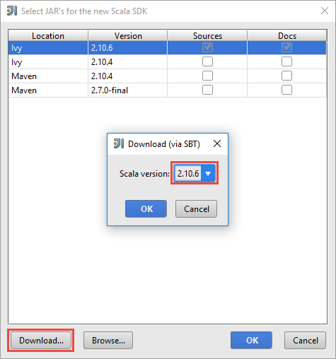

	* For **Spark SDK**, download and use the SDK from [here](http://go.microsoft.com/fwlink/?LinkID=723585&clcid=0x409). You can also ignore this and use the [Spark Maven repository](http://mvnrepository.com/search?q=spark) instead, however please make sure you have the right maven repository installed to develop your Spark applications. (For example, you need to make sure you have the Spark Streaming part installed if you are using Spark Streaming; Also please make sure you are using the repository marked as Scala 2.10 - do not use the repository marked as Scala 2.11.)

		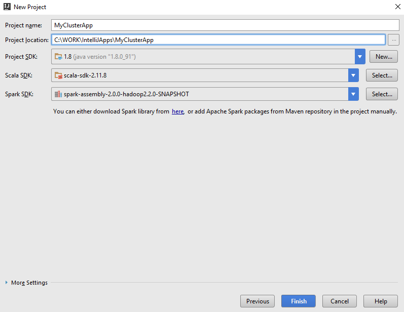

	* Click **Finish**.

3. The Spark project will automatically create an artifact for you. To see the artifact, follow these steps.

	1. From the **File** menu, click **Project Structure**.
	2. In the **Project Structure** dialog box, click **Artifacts** to see the default artifact that is created.

		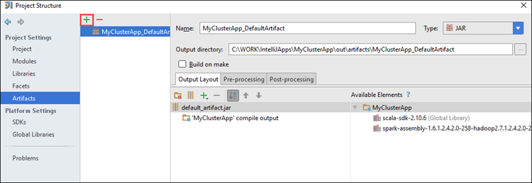

	You can also create your own artifact bly clicking on the **+** icon, highlighted in the image above.

4. In the **Project Structure** dialog box, click **Project**. If the **Project SDK** is set to 1.8, make sure the **Project language level** is set to **7 - Diamonds, ARM, multi-catch, etc**.

	

5. Add your application source code.

	1. From the **Project Explorer**, right-click **src**, point to **New**, and then click **Scala class**.

		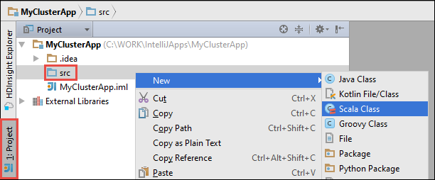

	2. In the **Create New Scala Class** dialog box, provide a name, for **Kind** select **Object**, and then click **OK**.

		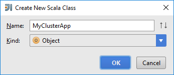

	3. In the **MyClusterApp.scala** file, paste the following code. This code reads the data from the HVAC.csv (available on all HDInsight Spark clusters), retrieves the rows that only have one digit in the seventh column in the CSV, and writes the output to **/HVACOut** under the default storage container for the cluster.

			import org.apache.spark.SparkConf
			import org.apache.spark.SparkContext

			object MyClusterApp{
			  def main (arg: Array[String]): Unit = {
			    val conf = new SparkConf().setAppName("MyClusterApp")
			    val sc = new SparkContext(conf)

			    val rdd = sc.textFile("wasbs:///HdiSamples/HdiSamples/SensorSampleData/hvac/HVAC.csv")

			    //find the rows which have only one digit in the 7th column in the CSV
				val rdd1 =  rdd.filter(s => s.split(",")(6).length() == 1)

			    rdd1.saveAsTextFile("wasbs:///HVACOut")
			  }

			}

5. Run the application on an HDInsight Spark cluster.

	1. From the **Project Explorer**, right-click the project name, and then select **Submit Spark Application to HDInsight**.

		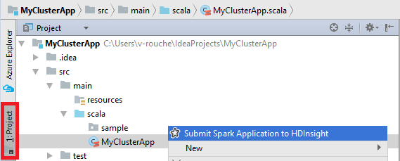

	2. You will be prompted to enter your Azure subscription credentials. In the **Spark Submission** dialog box, provide the following values.

		* For **Spark clusters (Linux only)**, select the HDInsight Spark cluster on which you want to run your application.

		* You need either select an Artifact from the IntelliJ project, or select one from hard disk.

		* Against the **Main class name** text box, click the ellipsis ( ), select the main class in your application source code, and then click **OK**.

			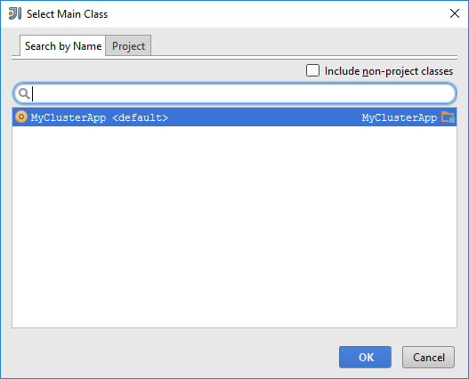

		* Because the application code in this example does not require any command line arguments or reference JARs or files, you can leave the remaining text boxes empty.

		* After providing all the inputs, the dialog box should resemble the following.

			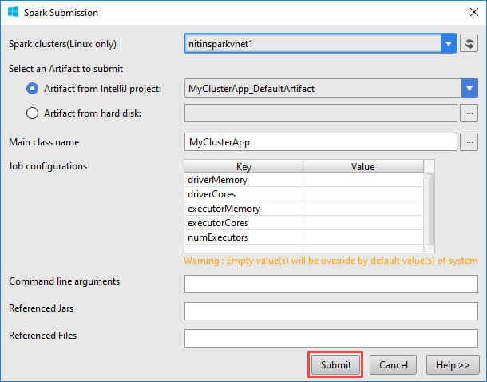

		* Click **Submit**.

	3. The **Spark Submission** tab at the bottom of the window should start displaying the progress. You can also stop the application by clicking the red button in the "Spark Submission" window.

        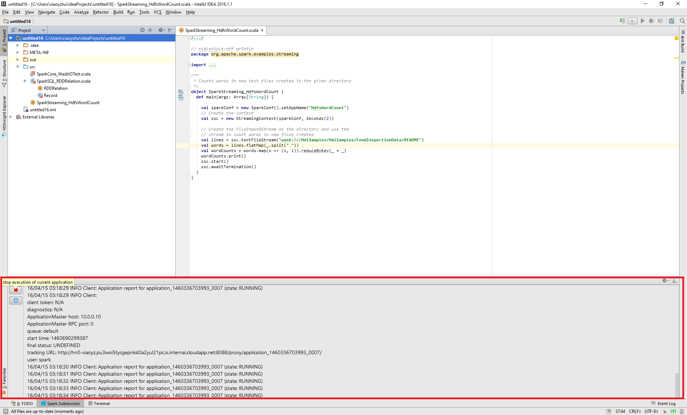

    In the next section, you learn how to access the job output using the HDInsight plugin for IntelliJ IDEA.

## Access and manage HDInsight Spark clusters using the HDInsight plugin for IntelliJ

You can perform a variety of operations using the HDInsight plugin.

### Access the storage container for the cluster

1. From the **View** menu, point to **Tool Windows**, and then click **HDInsight Explorer**. If prompted, enter the credentials to access your Azure subscription.

2. Expand **HDInsight** root node to see a list of HDInsight Spark clusters that are available.

3. Expand the cluster name to see the storage account and the default storage container for the cluster.

	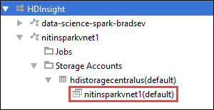

4. Click the storage container name associated with the cluster. In the right-pane, you should see a folder called **HVACOut**. Double-click to open the folder and you will see **part-*** files. Open one of those files to see the output of the application.

### Access the job view directly in the plugin

1. From the **HDInsight Explorer**, expand the Spark cluster name, and then click **Jobs**.

2. In the right pane, the **Spark Job View** tab displays all the applications that were run on the cluster. Click the application name for which you want to see more details.

	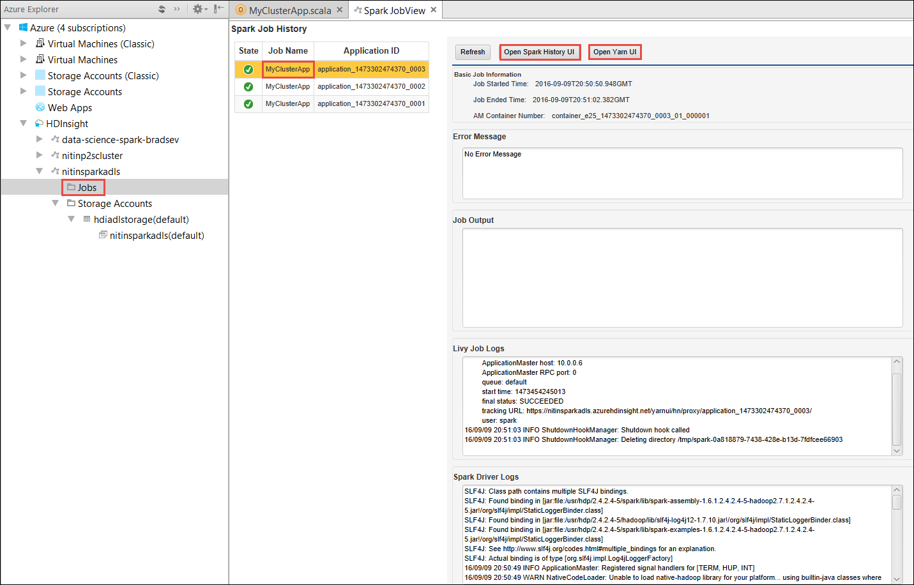

3. The boxes for **Error Message**, **Job Output**, **Livy Job Logs**, and **Spark Driver Logs** are populated based on the application you select.

4. You can also open the **Spark History UI** and the **YARN UI** (at the application level) by clicking the respective buttons at the top of the screen.

### Access the Spark History Server

1. From the **HDInsight Explorer**, right-click your Spark cluster name and then select **Open Spark History UI**. When prompted, enter the admin credentials for the cluster. You must have specified these while provisioning the cluster.

2. In the Spark History Server dashboard, you can look for the application you just finished running by using the application name. In the code above, you set the application name using `val conf = new SparkConf().setAppName("MyClusterApp")`. Hence, your Spark application name was **MyClusterApp**.

### Launch the Ambari portal

From the **HDInsight Explorer**, right-click your Spark cluster name and then select **Open Cluster Management Portal (Ambari)**. When prompted, enter the admin credentials for the cluster. You must have specified these while provisioning the cluster.

### Manage Azure subscriptions

By default, the HDInsight plugin lists the Spark clusters from all your Azure subscriptions. If required, you can specify the subscriptions for which you want to access the cluster. From the **HDInsight Explorer**, right-click the **HDInsight** root node, and then click **Manage Subscriptions**. From the dialog box, clear the check boxes against the subscription that you do not want to access and then click **Close**. You can also click **Sign Out** if you want to log off from your Azure subscription.

## Run a Spark Scala application locally

You can use the HDInsight Tools plugin for IntelliJ IDEA to run Spark Scala applications locally on your workstation. Typically, such applications do not need access to cluster resources such as storage container and can be run and tested locally.

### Prerequisite

While running the local Spark Scala application on a Windows computer, you might get an exception as explained in [SPARK-2356](https://issues.apache.org/jira/browse/SPARK-2356) that occurs due to a missing WinUtils.exe on Windows. To work around this error, you must [download the executable from here](http://public-repo-1.hortonworks.com/hdp-win-alpha/winutils.exe) to a location like **C:\WinUtils\bin**. You must then add an environment variable **HADOOP_HOME** and set the value of the variable to **C\WinUtils**.

### Run a local Spark Scala application	 

1. Launch IntelliJ IDEA and create a new project. In the new project dialog box, make the following choices, and then click **Next**.

	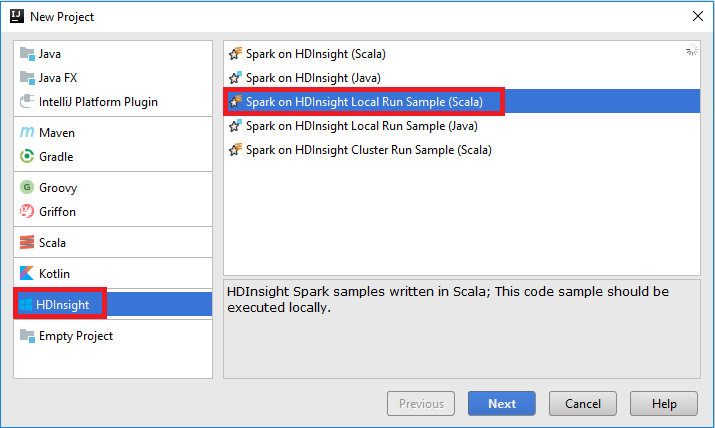

	* From the left pane, select **HDInsight**.
	* From the right pane, select **Spark on HDInsight Local Run Sample (Scala)**.
	* Click **Next**.

2. In the next window, provide the project details.

	* Provide a project name and project location.
	* For **Project SDK**, make sure you provide a Java version greater than 7.
	* For **Scala SDK**, click **Create**, click **Download**, and then select the version of Scala to use. **Make sure you do not use version 2.11.x**. This sample uses version **2.10.6**.

		

	* For **Spark SDK**, download and use the SDK from [here](http://go.microsoft.com/fwlink/?LinkID=723585&clcid=0x409). You can also ignore this and use the [Spark Maven repository](http://mvnrepository.com/search?q=spark) instead, however please make sure you have the right maven repository installed to develop your Spark applications. (For example, you need to make sure you have the Spark Streaming part installed if you are using Spark Streaming; Also please make sure you are using the repository marked as Scala 2.10 - do not use the repository marked as Scala 2.11.)

		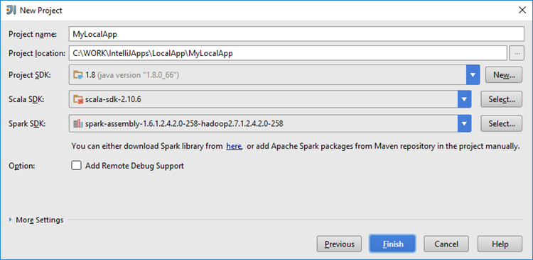

	* Click **Finish**.

3. The template adds a sample code (**LogQuery**) under the **src** folder that you can run locally on your computer.

	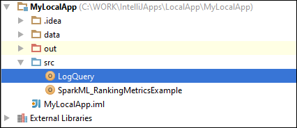

4.  Right click on the **LogQuery** application, and then click **"Run 'LogQuery'"**. You will see an output like this in the **Run** tab at the bottom.

	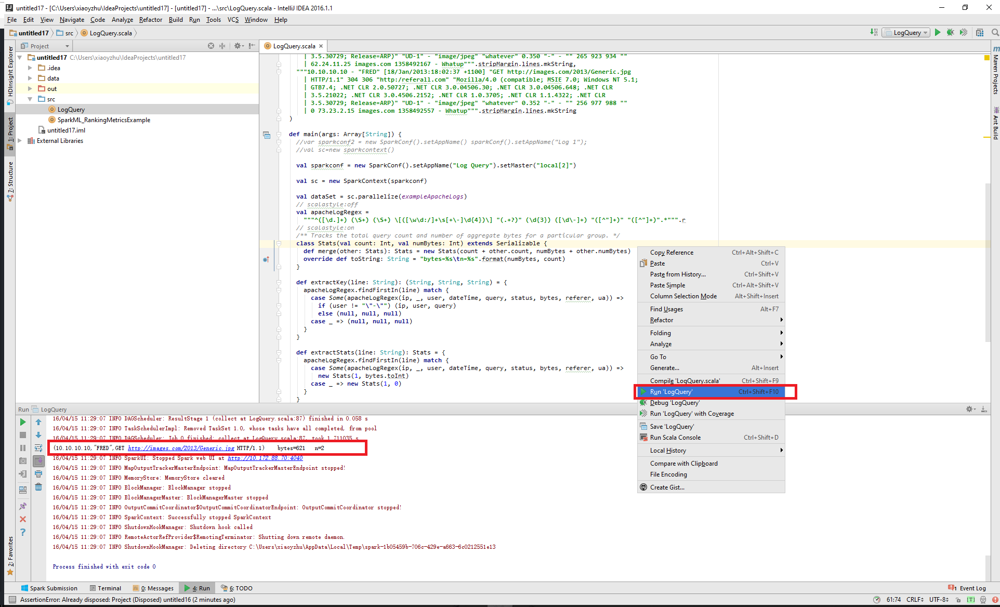

## Convert existing IntelliJ IDEA applications to use the HDInsight tool plugin

You can also convert your existing Spark Scala applications created in IntelliJ IDEA to be compatible with the HDInsight tool plugin. This will enable you to use the tool to submit the applications to an HDInsight Spark cluster. You can do so by performing the following steps:

1. For an existing Spark Scala appliction created using IntelliJ IDEA, open the associated .iml file.
2. At the root level, you will see a **module** element like this:

		<module org.jetbrains.idea.maven.project.MavenProjectsManager.isMavenModule="true" type="JAVA_MODULE" version="4">

3. Edit the element to add `UniqueKey="HDInsightTool"` so that the **module** element looks like the following:

		<module org.jetbrains.idea.maven.project.MavenProjectsManager.isMavenModule="true" type="JAVA_MODULE" version="4" UniqueKey="HDInsightTool">

4. Save the changes. Your application should now be compatible with the HDInsight tool plugin. You can test this by right-clicking on the project name in the Project Explorer. The pop-up menu should now have the option to **Submit Spark Application to HDInsight**.

## Troubleshooting

### "Please use a larger heap size" error in local run

In Spark 1.6, If you are using a 32-bit Java SDK during local run, you may encounter the following errors:

    Exception in thread "main" java.lang.IllegalArgumentException: System memory 259522560 must be at least 4.718592E8. Please use a larger heap size.
    	at org.apache.spark.memory.UnifiedMemoryManager$.getMaxMemory(UnifiedMemoryManager.scala:193)
    	at org.apache.spark.memory.UnifiedMemoryManager$.apply(UnifiedMemoryManager.scala:175)
    	at org.apache.spark.SparkEnv$.create(SparkEnv.scala:354)
    	at org.apache.spark.SparkEnv$.createDriverEnv(SparkEnv.scala:193)
    	at org.apache.spark.SparkContext.createSparkEnv(SparkContext.scala:288)
    	at org.apache.spark.SparkContext.<init>(SparkContext.scala:457)
    	at LogQuery$.main(LogQuery.scala:53)
    	at LogQuery.main(LogQuery.scala)
    	at sun.reflect.NativeMethodAccessorImpl.invoke0(Native Method)
    	at sun.reflect.NativeMethodAccessorImpl.invoke(NativeMethodAccessorImpl.java:57)
    	at sun.reflect.DelegatingMethodAccessorImpl.invoke(DelegatingMethodAccessorImpl.java:43)
    	at java.lang.reflect.Method.invoke(Method.java:606)
    	at com.intellij.rt.execution.application.AppMain.main(AppMain.java:144)

This is because the heap size is not large enough for Spark to run, since Spark requires at least 471MB (you can get more details from [SPARK-12081](https://issues.apache.org/jira/browse/SPARK-12081) if you want). One simple solution is to use a 64-bit Java SDK. You can also change the JVM settings in IntelliJ by adding the following options:

    -Xms128m -Xmx512m -XX:MaxPermSize=300m -ea

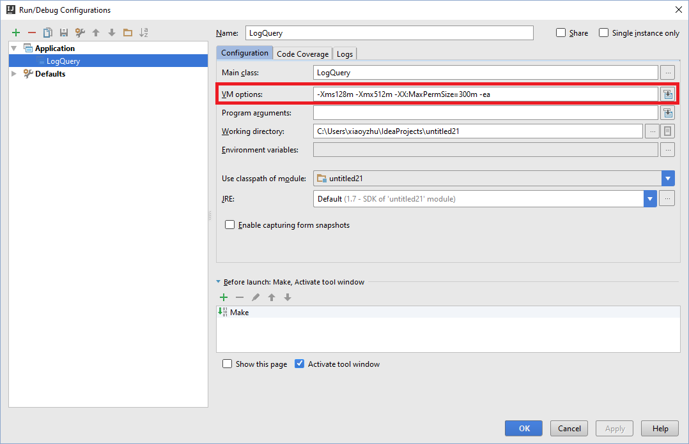

## Feedback & Known issues

Currently viewing Spark outputs directly is not supported and we are working on that.

If you have any suggestions or feedbacks, or if you encounter any problems when using this tool, feel free to drop us an email at hdivstool at microsoft dot com.

## See also

* [Overview: Apache Spark on Azure HDInsight](hdinsight-apache-spark-overview.md)

### Scenarios

* [Spark with BI: Perform interactive data analysis using Spark in HDInsight with BI tools](hdinsight-apache-spark-use-bi-tools.md)

* [Spark with Machine Learning: Use Spark in HDInsight for analyzing building temperature using HVAC data](hdinsight-apache-spark-ipython-notebook-machine-learning.md)

* [Spark with Machine Learning: Use Spark in HDInsight to predict food inspection results](hdinsight-apache-spark-machine-learning-mllib-ipython.md)

* [Spark Streaming: Use Spark in HDInsight for building real-time streaming applications](hdinsight-apache-spark-eventhub-streaming.md)

* [Website log analysis using Spark in HDInsight](hdinsight-apache-spark-custom-library-website-log-analysis.md)

### Create and run applications

* [Create a standalone application using Scala](hdinsight-apache-spark-create-standalone-application.md)

* [Run jobs remotely on a Spark cluster using Livy](hdinsight-apache-spark-livy-rest-interface.md)

### Tools and extensions

* [Use HDInsight Tools Plugin for IntelliJ IDEA to debug Spark applications remotely](hdinsight-apache-spark-intellij-tool-plugin-debug-jobs-remotely.md)

* [Use HDInsight Tools Plugin for Eclipse to create Spark applications](hdinsight-apache-spark-eclipse-tool-plugin.md)

* [Use Zeppelin notebooks with a Spark cluster on HDInsight](hdinsight-apache-spark-use-zeppelin-notebook.md)

* [Kernels available for Jupyter notebook in Spark cluster for HDInsight](hdinsight-apache-spark-jupyter-notebook-kernels.md)

* [Use external packages with Jupyter notebooks](hdinsight-apache-spark-jupyter-notebook-use-external-packages.md)

* [Install Jupyter on your computer and connect to an HDInsight Spark cluster](hdinsight-apache-spark-jupyter-notebook-install-locally.md)

### Manage resources

* [Manage resources for the Apache Spark cluster in Azure HDInsight](hdinsight-apache-spark-resource-manager.md)

* [Track and debug jobs running on an Apache Spark cluster in HDInsight](hdinsight-apache-spark-job-debugging.md)
