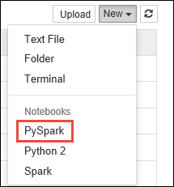

<properties 
	pageTitle="Use Apache Spark to build machine learning applications on HDInsight | Microsoft Azure" 
	description="Step-by-step instructions on how to use notebooks with Apache Spark to build machine learning applications" 
	services="hdinsight" 
	documentationCenter="" 
	authors="nitinme" 
	manager="paulettm" 
	editor="cgronlun"
	tags="azure-portal"/>

<tags 
	ms.service="hdinsight" 
	ms.workload="big-data" 
	ms.tgt_pltfrm="na" 
	ms.devlang="na" 
	ms.topic="article" 
	ms.date="07/25/2016" 
	ms.author="nitinme"/>

# Build Machine Learning applications to run on Apache Spark clusters on HDInsight Linux

Learn how to build a machine learning application using an Apache Spark cluster in HDInsight. This article shows how to use the Jupyter notebook available with the cluster to build and test our application. The application uses the sample HVAC.csv data that is available on all clusters by default.

**Prerequisites:**

You must have the following:

- An Azure subscription. See [Get Azure free trial](https://azure.microsoft.com/documentation/videos/get-azure-free-trial-for-testing-hadoop-in-hdinsight/).
- An Apache Spark cluster on HDInsight Linux. For instructions, see [Create Apache Spark clusters in Azure HDInsight](hdinsight-apache-spark-jupyter-spark-sql.md). 

##Show me the data

Before we start building the application, let us understand the structure of the data and the kind of analysis we will do on the data. 

In this article, we use the sample **HVAC.csv** data file that is available on all HDInsight clusters by default at **\HdiSamples\HdiSamples\SensorSampleData\hvac**. Download and open the CSV file to get a snapshot of the data.  

The data shows the target temperature and the actual temperature of a building that has HVAC systems installed. Let's assume the **System** column represents the system ID and the **SystemAge** column represents the number of years the HVAC system has been in place at the building.

We use this data to predict whether a building will be hotter or colder based on the target temperature, given a system ID and system age.

##Write a machine learning application using Spark MLlib

In this application we use a Spark ML pipeline to perform a document classification. In the pipeline, we split the document into words, convert the words into a numerical feature vector, and finally build a prediction model using the feature vectors and labels. Perform the following steps to create the application.

1. From the [Azure Portal](https://portal.azure.com/), from the startboard, click the tile for your Spark cluster (if you pinned it to the startboard). You can also navigate to your cluster under **Browse All** > **HDInsight Clusters**.   

2. From the Spark cluster blade, click **Quick Links**, and then from the **Cluster Dashboard** blade, click **Jupyter Notebook**. If prompted, enter the admin credentials for the cluster.

	> [AZURE.NOTE] You may also reach the Jupyter Notebook for your cluster by opening the following URL in your browser. Replace __CLUSTERNAME__ with the name of your cluster:
	>
	> `https://CLUSTERNAME.azurehdinsight.net/jupyter`

2. Create a new notebook. Click **New**, and then click **PySpark**.

	

3. A new notebook is created and opened with the name Untitled.pynb. Click the notebook name at the top, and enter a friendly name.

	

3. Because you created a notebook using the PySpark kernel, you do not need to create any contexts explicitly. The Spark and Hive contexts will be automatically created for you when you run the first code cell. You can start by importing the types that are required for this scenario. Paste the following snippet in an empty cell, and then press **SHIFT + ENTER**. 

		from pyspark.ml import Pipeline
		from pyspark.ml.classification import LogisticRegression
		from pyspark.ml.feature import HashingTF, Tokenizer
		from pyspark.sql import Row
		
		import os
		import sys
		from pyspark.sql.types import *
		
		from pyspark.mllib.classification import LogisticRegressionWithSGD
		from pyspark.mllib.regression import LabeledPoint
		from numpy import array
		
		
	 
4. You must now load the data (hvac.csv), parse it, and use it to train the model. For this, you define a function that checks whether the actual temperature of the building is greater than the target temperature. If the actual temperature is greater, the building is hot, denoted by the value **1.0**. If the actual temperature is lesser, the building is cold, denoted by the value **0.0**. 

	Paste the following snippet in an empty cell and press **SHIFT + ENTER**.

		
		# List the structure of data for better understanding. Becuase the data will be
		# loaded as an array, this structure makes it easy to understand what each element
		# in the array corresponds to

		# 0 Date
		# 1 Time
		# 2 TargetTemp
		# 3 ActualTemp
		# 4 System
		# 5 SystemAge
		# 6 BuildingID

		LabeledDocument = Row("BuildingID", "SystemInfo", "label")

		# Define a function that parses the raw CSV file and returns an object of type LabeledDocument
		
		def parseDocument(line):
    		values = [str(x) for x in line.split(',')]
    		if (values[3] > values[2]):
        		hot = 1.0
    		else:
        		hot = 0.0        
    
    		textValue = str(values[4]) + " " + str(values[5])
    
    		return LabeledDocument((values[6]), textValue, hot)

		# Load the raw HVAC.csv file, parse it using the function
		data = sc.textFile("wasbs:///HdiSamples/HdiSamples/SensorSampleData/hvac/HVAC.csv")

		documents = data.filter(lambda s: "Date" not in s).map(parseDocument)
		training = documents.toDF()

5. Configure the Spark machine learning pipeline that consists of three stages: tokenizer, hashingTF, and lr. For more information about what is a pipeline and how it works see <a href="http://spark.apache.org/docs/latest/ml-guide.html#how-it-works" target="_blank">Spark machine learning pipeline</a>.

	Paste the following snippet in an empty cell and press **SHIFT + ENTER**.

		tokenizer = Tokenizer(inputCol="SystemInfo", outputCol="words")
		hashingTF = HashingTF(inputCol=tokenizer.getOutputCol(), outputCol="features")
		lr = LogisticRegression(maxIter=10, regParam=0.01)
		pipeline = Pipeline(stages=[tokenizer, hashingTF, lr])

6. Fit the pipeline to the training document. Paste the following snippet in an empty cell and press **SHIFT + ENTER**.

		model = pipeline.fit(training)

7. Verify the training document to checkpoint your progress with the application. Paste the following snippet in an empty cell and press **SHIFT + ENTER**.

		training.show()

	This should give the output similar to the following:

		+----------+----------+-----+
		|BuildingID|SystemInfo|label|
		+----------+----------+-----+
		|         4|     13 20|  0.0|
		|        17|      3 20|  0.0|
		|        18|     17 20|  1.0|
		|        15|      2 23|  0.0|
		|         3|      16 9|  1.0|
		|         4|     13 28|  0.0|
		|         2|     12 24|  0.0|
		|        16|     20 26|  1.0|
		|         9|      16 9|  1.0|
		|        12|       6 5|  0.0|
		|        15|     10 17|  1.0|
		|         7|      2 11|  0.0|
		|        15|      14 2|  1.0|
		|         6|       3 2|  0.0|
		|        20|     19 22|  0.0|
		|         8|     19 11|  0.0|
		|         6|      15 7|  0.0|
		|        13|      12 5|  0.0|
		|         4|      8 22|  0.0|
		|         7|      17 5|  0.0|
		+----------+----------+-----+

	Go back and verify the output against the raw CSV file. For example, the first row the CSV file has this data:

	

	Notice how the actual temperature is less than the target temperature suggesting the building is cold. Hence in the training output, the value for **label** in the first row is **0.0**, which means the building is not hot.

8.  Prepare a data set to run the trained model against. To do so, we would pass on a system ID and system age (denoted as **SystemInfo** in the training output), and the model would predict whether the building with that system ID and system age would be hotter (denoted by 1.0) or cooler (denoted by 0.0).

	Paste the following snippet in an empty cell and press **SHIFT + ENTER**.
		
		# SystemInfo here is a combination of system ID followed by system age
		Document = Row("id", "SystemInfo")
		test = sc.parallelize([(1L, "20 25"),
                      (2L, "4 15"),
                      (3L, "16 9"),
                      (4L, "9 22"),
                      (5L, "17 10"),
                      (6L, "7 22")]) \
    		.map(lambda x: Document(*x)).toDF() 

9. Finally, make predictions on the test data. Paste the following snippet in an empty cell and press **SHIFT + ENTER**.

		# Make predictions on test documents and print columns of interest
		prediction = model.transform(test)
		selected = prediction.select("SystemInfo", "prediction", "probability")
		for row in selected.collect():
		    print row

10. You should see an output similar to the following:

		Row(SystemInfo=u'20 25', prediction=1.0, probability=DenseVector([0.4999, 0.5001]))
		Row(SystemInfo=u'4 15', prediction=0.0, probability=DenseVector([0.5016, 0.4984]))
		Row(SystemInfo=u'16 9', prediction=1.0, probability=DenseVector([0.4785, 0.5215]))
		Row(SystemInfo=u'9 22', prediction=1.0, probability=DenseVector([0.4549, 0.5451]))
		Row(SystemInfo=u'17 10', prediction=1.0, probability=DenseVector([0.4925, 0.5075]))
		Row(SystemInfo=u'7 22', prediction=0.0, probability=DenseVector([0.5015, 0.4985]))

	From the first row in the prediction, you can see that for an HVAC system with ID 20 and system age of 25 years, the building will be hot (**prediction=1.0**). The first value for DenseVector (0.49999) corresponds to the  prediction 0.0 and the second value (0.5001) corresponds to the prediction 1.0. In the output, even though the second value is only marginally higher, the model shows **prediction=1.0**.

11. After you have finished running the application, you should shutdown the notebook to release the resources. To do so, from the **File** menu on the notebook, click **Close and Halt**. This will shutdown and close the notebook.
	  	   

##Use Anaconda scikit-learn library for Machine Learning

Apache Spark clusters on HDInsight include Anaconda libraries. This also includes the **scikit-learn** library for machine learning. The library also includes various data sets that you can use to build sample applications directly from a Jupyter notebook. For examples on using the scikit-learn library, see [http://scikit-learn.org/stable/auto_examples/index.html](http://scikit-learn.org/stable/auto_examples/index.html).

##See also

* [Overview: Apache Spark on Azure HDInsight](hdinsight-apache-spark-overview.md)

### Scenarios

* [Spark with BI: Perform interactive data analysis using Spark in HDInsight with BI tools](hdinsight-apache-spark-use-bi-tools.md)

* [Spark with Machine Learning: Use Spark in HDInsight to predict food inspection results](hdinsight-apache-spark-machine-learning-mllib-ipython.md)

* [Spark Streaming: Use Spark in HDInsight for building real-time streaming applications](hdinsight-apache-spark-eventhub-streaming.md)

* [Website log analysis using Spark in HDInsight](hdinsight-apache-spark-custom-library-website-log-analysis.md)

### Create and run applications

* [Create a standalone application using Scala](hdinsight-apache-spark-create-standalone-application.md)

* [Run jobs remotely on a Spark cluster using Livy](hdinsight-apache-spark-livy-rest-interface.md)

### Tools and extensions

* [Use HDInsight Tools Plugin for IntelliJ IDEA to create and submit Spark Scala applicatons](hdinsight-apache-spark-intellij-tool-plugin.md)

* [Use HDInsight Tools Plugin for IntelliJ IDEA to debug Spark applications remotely](hdinsight-apache-spark-intellij-tool-plugin-debug-jobs-remotely.md)

* [Use Zeppelin notebooks with a Spark cluster on HDInsight](hdinsight-apache-spark-use-zeppelin-notebook.md)

* [Kernels available for Jupyter notebook in Spark cluster for HDInsight](hdinsight-apache-spark-jupyter-notebook-kernels.md)

* [Use external packages with Jupyter notebooks](hdinsight-apache-spark-jupyter-notebook-use-external-packages.md)

* [Install Jupyter on your computer and connect to an HDInsight Spark cluster](hdinsight-apache-spark-jupyter-notebook-install-locally.md)

### Manage resources

* [Manage resources for the Apache Spark cluster in Azure HDInsight](hdinsight-apache-spark-resource-manager.md)

* [Track and debug jobs running on an Apache Spark cluster in HDInsight](hdinsight-apache-spark-job-debugging.md)

[hdinsight-versions]: hdinsight-component-versioning.md
[hdinsight-upload-data]: hdinsight-upload-data.md
[hdinsight-storage]: hdinsight-hadoop-use-blob-storage.md

[hdinsight-weblogs-sample]: hdinsight-hive-analyze-website-log.md
[hdinsight-sensor-data-sample]: hdinsight-hive-analyze-sensor-data.md

[azure-purchase-options]: http://azure.microsoft.com/pricing/purchase-options/
[azure-member-offers]: http://azure.microsoft.com/pricing/member-offers/
[azure-free-trial]: http://azure.microsoft.com/pricing/free-trial/
[azure-management-portal]: https://manage.windowsazure.com/
[azure-create-storageaccount]: storage-create-storage-account.md
