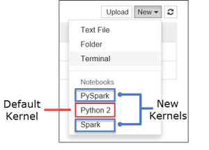

<properties 
	pageTitle="Kernels available with Jupyter notebooks on HDInsight Spark clusters on Linux| Microsoft Azure" 
	description="Learn about the additional Jupyter notebook kernels available with Spark cluster on HDInsight Linux." 
	services="hdinsight" 
	documentationCenter="" 
	authors="nitinme" 
	manager="paulettm" 
	editor="cgronlun"
	tags="azure-portal"/>

<tags 
	ms.service="hdinsight" 
	ms.workload="big-data" 
	ms.tgt_pltfrm="na" 
	ms.devlang="na" 
	ms.topic="article" 
	ms.date="07/25/2016" 
	ms.author="nitinme"/>

# Kernels available for Jupyter notebooks with Apache Spark clusters on HDInsight Linux

Apache Spark cluster on HDInsight (Linux) includes Jupyter notebooks that you can use to test your applications. A kernel is a program that runs and interprets your code. HDInsight Spark clusters provide two kernels that you can use with the Jupyter notebook. These are:

1. **PySpark** (for applications written in Python)
2. **Spark** (for applications written in Scala)

In this article, you will learn about how to use these kernels and what are the benefits you get from using them.

**Prerequisites:**

You must have the following:

- An Azure subscription. See [Get Azure free trial](https://azure.microsoft.com/documentation/videos/get-azure-free-trial-for-testing-hadoop-in-hdinsight/).
- An Apache Spark cluster on HDInsight Linux. For instructions, see [Create Apache Spark clusters in Azure HDInsight](hdinsight-apache-spark-jupyter-spark-sql.md).

## How do I use the kernels? 

1. From the [Azure Portal](https://portal.azure.com/), from the startboard, click the tile for your Spark cluster (if you pinned it to the startboard). You can also navigate to your cluster under **Browse All** > **HDInsight Clusters**.   

2. From the Spark cluster blade, click **Quick Links**, and then from the **Cluster Dashboard** blade, click **Jupyter Notebook**. If prompted, enter the admin credentials for the cluster.

	> [AZURE.NOTE] You may also reach the Jupyter Notebook for your cluster by opening the following URL in your browser. Replace __CLUSTERNAME__ with the name of your cluster:
	>
	> `https://CLUSTERNAME.azurehdinsight.net/jupyter`

2. Create a new notebook with the new kernels. Click **New**, and then click **Pyspark** or **Spark**. You should use the Spark kernel for Scala applications and PySpark kernel for Python applications.

	 

3. This should open a new notebook with the kernel you selected.

## Why should I use the PySpark or Spark kernels?

Here are a few benefits of using the new kernels.

1. **Preset contexts**. With the **PySpark** or **Spark** kernels that are provided with Jupyter notebooks, you do not need to set the Spark or Hive contexts explicitly before you can start working with the application you are developing; these are available for you by default. These contexts are:

	* **sc** - for Spark context
	* **sqlContext** - for Hive context

	So, you don't have to run statements like the following to set the contexts:

		###################################################
		# YOU DO NOT NEED TO RUN THIS WITH THE NEW KERNELS
		###################################################
		sc = SparkContext('yarn-client')
		sqlContext = HiveContext(sc)

	Instead, you can directly use the preset contexts in your application.
	
2. **Cell magics**. The PySpark kernel provides some predefined “magics”, which are special commands that you can call with `%%` (e.g. `%%MAGIC` <args>). The magic command must be the first word in a code cell and allow for multiple lines of content. The magic word should be the first word in the cell. Adding anything before the magic, even comments, will cause an error. 	For more information on magics, see [here](http://ipython.readthedocs.org/en/stable/interactive/magics.html).

	The table below lists the different magics available through the kernels.

	| Magic     | Example                         | Description  |
	|-----------|---------------------------------|--------------|
	| help      | `%%help`  						  | Generates a table of all the available magics with example and description |
	| info      | `%%info`                          | Outputs session information for the current Livy endpoint |
	| configure | `%%configure -f` `{"executorMemory": "1000M"`, `"executorCores": 4`} | Configures the parameters for creating a session. The force flag (-f) is mandatory if a session has already been created and the session will be dropped and recreated. Look at [Livy's POST /sessions Request Body](https://github.com/cloudera/livy#request-body) for a list of valid parameters. Parameters must be passed in as a JSON string and must be on the next line after the magic, as shown in the example column. |
	| sql       |  `%%sql -o <variable name>`  `SHOW TABLES`    | Executes a Hive query against the sqlContext. If the `-o` parameter is passed, the result of the query is persisted in the %%local Python context as a [Pandas](http://pandas.pydata.org/) dataframe.   |
	| local     |     `%%local` `a=1`			  | All the code in subsequent lines will be executed locally. Code must be valid Python code. |
	| logs      | `%%logs`						  | Outputs the logs for the current Livy session.  |
	| delete    | `%%delete -f -s <session number>` | Deletes a specific session of the current Livy endpoint. Note that you cannot delete the session that is initiated for the kernel itself. |
	| cleanup   | `%%cleanup -f`                    | Deletes all the sessions for the current Livy endpoint, including this notebook's session. The force flag -f is mandatory.  |

3. **Auto visualization**. The **Pyspark** kernel automatically visualizes the output of Hive and SQL queries. You have the option to choose between several different types of visualizations including Table, Pie, Line, Area, Bar.

## Parameters supported with the %%sql magic

The %%sql magic supports different parameters that you can use to control the kind of output that you receive when you run queries. The following table lists the output.

| Parameter     | Example                         | Description  |
|-----------|---------------------------------|--------------|
| -o      | `-o <VARIABLE NAME>`  						  | Use this parameter to persist the result of the query, in the %%local Python context, as a [Pandas](http://pandas.pydata.org/) dataframe. The name of the dataframe variable is the variable name you specify. |
| -q      | `-q`                          | Use this to turn off visualizations for the cell. If you don't want to auto-visualize the content of a cell and just want to capture it as a dataframe, then use `-q -o <VARIABLE>`. If you want to turn off visualizations without capturing the results (e.g. for running a SQL query with side effects, like a `CREATE TABLE` statement), just use `-q` without specifying a `-o` argument. |
| -m       |  `-m <METHOD>`    | Where **METHOD** is either **take** or **sample** (default is **take**). If the method is **take**, the kernel picks elements from the top of the result data set specified by MAXROWS (described later in this table). If the method is **sample**, the kernel will randomly sample elements of the data set according to `-r` parameter, described next in this table.   |
| -r     |     `-r <FRACTION>`			  | Here **FRACTION** is a floating-point number between 0.0 and 1.0. If the sample method for the SQL query is `sample`, then the kernel randomly samples the specified fraction of the elements of the result set for you; e.g. if you run a SQL query with the arguments `-m sample -r 0.01`, then 1% of the result rows will be randomly sampled. |
| -n      | `-n <MAXROWS>`						  | **MAXROWS** is an integer value. The kernel will limit the number of output rows to **MAXROWS**. If **MAXROWS** is a negative number such as **-1**, then the number of rows in the result set will not be limited. |

**Example:**

	%%sql -q -m sample -r 0.1 -n 500 -o query2 
	SELECT * FROM hivesampletable

The statement above does the following:

* Selects all records from **hivesampletable**.
* Because we use -q, it turns off auto-visualization.
* Because we use `-m sample -r 0.1 -n 500` it randomly samples 10% of the rows in the hivesampletable and limits the size of the result set to 500 rows.
* Finally, because we used `-o query2` it also saves the output into a dataframe called **query2**.
	

## Considerations while using the new kernels

Whichever kernel you use (PySpark or Spark), leaving the notebooks running will consume your cluster resources.  With these kernels, because the contexts are preset, simply exiting the notebooks does not kill the context and hence the the cluster resources will continue to be in use. A good practice with the PySpark and Spark kernels would be to use the **Close and Halt** option from the notebook's **File** menu. This kills the context and then exits the notebook. 	

## Show me some examples

When you open a Jupyter notebook, you will see two folders available at the root level.

* The **PySpark** folder has sample notebooks that use the new **Python** kernel.
* The **Scala** folder has sample notebooks that use the new **Spark** kernel.

You can open the **00 - [READ ME FIRST] Spark Magic Kernel Features** notebook from the **PySpark** or **Spark** folder to learn about the different magics available. You can also use the other sample notebooks available under the two folders to learn how to achieve different scenarios using Jupyter notebooks with HDInsight Spark clusters.

## Where are the notebooks stored?

Jupyter notebooks are saved to the storage account associated with the cluster under the **/HdiNotebooks** folder.  Notebooks, text files, and folders that you create from within Jupyter will be accessible from WASB.  For example, if you use Jupyter to create a folder **myfolder** and a notebook **myfolder/mynotebook.ipynb**, you can access that notebook at `wasbs:///HdiNotebooks/myfolder/mynotebook.ipynb`.  The reverse is also true, that is, if you upload a notebook directly to your storage account at `/HdiNotebooks/mynotebook1.ipynb`, the notebook will be visible from Jupyter as well.  Notebooks will remain in the storage account even after the cluster is deleted.

The way notebooks are saved to the storage account is compatible with HDFS. So, if you SSH into the cluster you can use file management commands like the following:

	hdfs dfs -ls /HdiNotebooks             				  # List everything at the root directory – everything in this directory is visible to Jupyter from the home page
	hdfs dfs –copyToLocal /HdiNotebooks    				# Download the contents of the HdiNotebooks folder
	hdfs dfs –copyFromLocal example.ipynb /HdiNotebooks   # Upload a notebook example.ipynb to the root folder so it’s visible from Jupyter

In case there are issues accessing the storage account for the cluster, the notebooks are also saved on the headnode `/var/lib/jupyter`.

## Supported browser
Jupyter notebooks running against HDInsight Spark clusters are supported only on Google Chrome.

## Feedback

The new kernels are in evolving stage and will mature over time. This could also mean that APIs could change as these kernels mature. We would appreciate any feedback that you have while using these new kernels. This will be very useful in shaping the final release of these kernels. You can leave your comments/feedback under the **Comments** section at the bottom of this article.

## See also

* [Overview: Apache Spark on Azure HDInsight](hdinsight-apache-spark-overview.md)

### Scenarios

* [Spark with BI: Perform interactive data analysis using Spark in HDInsight with BI tools](hdinsight-apache-spark-use-bi-tools.md)

* [Spark with Machine Learning: Use Spark in HDInsight for analyzing building temperature using HVAC data](hdinsight-apache-spark-ipython-notebook-machine-learning.md)

* [Spark with Machine Learning: Use Spark in HDInsight to predict food inspection results](hdinsight-apache-spark-machine-learning-mllib-ipython.md)

* [Spark Streaming: Use Spark in HDInsight for building real-time streaming applications](hdinsight-apache-spark-eventhub-streaming.md)

* [Website log analysis using Spark in HDInsight](hdinsight-apache-spark-custom-library-website-log-analysis.md)

### Create and run applications

* [Create a standalone application using Scala](hdinsight-apache-spark-create-standalone-application.md)

* [Run jobs remotely on a Spark cluster using Livy](hdinsight-apache-spark-livy-rest-interface.md)

### Tools and extensions

* [Use HDInsight Tools Plugin for IntelliJ IDEA to create and submit Spark Scala applicatons](hdinsight-apache-spark-intellij-tool-plugin.md)

* [Use HDInsight Tools Plugin for IntelliJ IDEA to debug Spark applications remotely](hdinsight-apache-spark-intellij-tool-plugin-debug-jobs-remotely.md)

* [Use Zeppelin notebooks with a Spark cluster on HDInsight](hdinsight-apache-spark-use-zeppelin-notebook.md)

* [Use external packages with Jupyter notebooks](hdinsight-apache-spark-jupyter-notebook-use-external-packages.md)

* [Install Jupyter on your computer and connect to an HDInsight Spark cluster](hdinsight-apache-spark-jupyter-notebook-install-locally.md)

### Manage resources

* [Manage resources for the Apache Spark cluster in Azure HDInsight](hdinsight-apache-spark-resource-manager.md)

* [Track and debug jobs running on an Apache Spark cluster in HDInsight](hdinsight-apache-spark-job-debugging.md)
