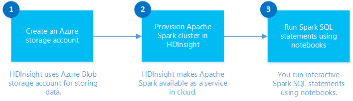
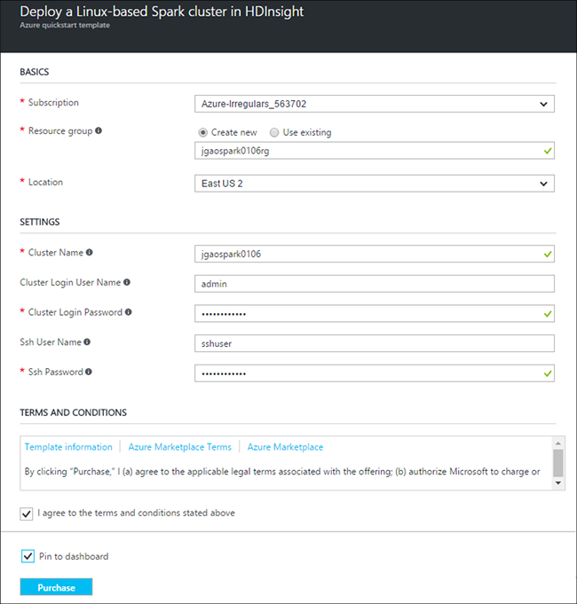

# Get started: Create an Apache Spark cluster in HDInsight and run interactive Spark SQL queries

Learn how to create an [Apache Spark](hdinsight-apache-spark-overview.md) cluster in HDInsight and run interactive Spark SQL queries using [Jupyter](https://jupyter.org) notebook.

   

## Prerequisites

* **An Azure subscription**. Before you begin this tutorial, you must have an Azure subscription. See [Create your free Azure account today](https://azure.microsoft.com/free).

## Create HDInsight Spark cluster

In this section, you create an HDInsight Spark cluster using an [Azure Resource Manager template](https://azure.microsoft.com/resources/templates/101-hdinsight-spark-linux/). For other cluster creation methods, see [Create HDInsight clusters](hdinsight-hadoop-provision-linux-clusters.md).

1. Click the following image to open the template in the Azure portal.         

    

2. Enter the following values:

    

	* **Subscription**: Select your Azure subscription for this cluster.
	* **Resource group**: Create a resource group or select an existing one. Resource group is used to manage Azure resources for your projects.
	* **Location**: Select a location for the resource group.  This location is also used for the default cluster storage and the HDInsight cluster.
	* **ClusterName**: Enter a name for the Hadoop cluster that you create.
	* **Spark version**: Select the Spark version that you want to install on the cluster.
	* **Cluster login name and password**: The default login name is admin.
	* **SSH user name and password**.

   Write down these values.  You need them later in the tutorial.

3. Select **I agree to the terms and conditions stated above**, select **Pin to dashboard**, and then click **Purchase**. You can see a new tile titled Submitting deployment for Template deployment. It takes about 20 minutes to create the cluster.

> [!NOTE]
> This article creates a Spark cluster that uses [Azure Storage Blobs as the cluster storage](hdinsight-hadoop-use-blob-storage.md). You can also create a Spark cluster that uses [Azure Data Lake Store](../data-lake-store/data-lake-store-overview.md) as additional storage, in addition to Azure Storage Blobs as the default storage. For instructions, see [Create an HDInsight cluster with Data Lake Store](../data-lake-store/data-lake-store-hdinsight-hadoop-use-portal.md).
>
>

## Run an interactive Spark SQL query

In this section, you use Jupyter notebook to run interactive Spark SQL queries against the Spark cluster you created earlier. HDInsight Spark clusters provide three kernels that you can use with the Jupyter notebook. These are:

* **PySpark** (for applications written in Python)
* **PySpark3** (for applications written in Python3)
* **Spark** (for applications written in Scala)

In this article, you use the **PySpark** kernel in the notebook from where you run the interactive Spark SQL query. For more information about the kernels, see [Use Jupyter notebook kernels with Apache Spark clusters in HDInsight](hdinsight-apache-spark-jupyter-notebook-kernels.md). Some of the key benefits of using the PySpark kernel are:

* The contexts for Spark and Hive are set automatically.
* Use cell magics, such as `%%sql`, to directly run interactive SQL or Hive queries, without any preceding code snippets.
* The output from the interactive queries is automatically visualized.

### Create Jupyter notebook with PySpark kernel

1. Open the [Azure portal](https://portal.azure.com/).

2. If you opted to pin the cluster to the dashboard, click the cluster tile from the dashboard to launch the cluster blade.

	If you did not pin the cluster to the dashboard, from the left pane, click **HDInsight clusters**, and then click the cluster you created.

3. From **Quick links**, click **Cluster dashboards**, and then click **Jupyter Notebook**. If prompted, enter the admin credentials for the cluster.

   

   > [!NOTE]
   > You may also access the Jupyter notebook for your cluster by opening the following URL in your browser. Replace **CLUSTERNAME** with the name of your cluster:
   >
   > `https://CLUSTERNAME.azurehdinsight.net/jupyter`
   >
   >
3. Create a notebook. Click **New**, and then click **PySpark**.

   

   A new notebook is created and opened with the name Untitled(Untitled.pynb).

4. Click the notebook name at the top, and enter a friendly name if you want.

    

5. Paste the following code in an empty cell, and then press **SHIFT + ENTER** to run the code. The code imports the types required for this scenario:

		from pyspark.sql.types import *

    Because you created a notebook using the PySpark kernel, you do not need to create any contexts explicitly. The Spark and Hive contexts are automatically created for you when you run the first code cell.

    

    Every time you run an interactive query in Jupyter, your web browser window title shows a **(Busy)** status along with the notebook title. You also see a solid circle next to the **PySpark** text in the top-right corner. After the job is completed, it changes to a hollow circle.

6. Register a sample data set as a temporary table (**hvac**) by running the following code.

		# Load the data
		hvacText = sc.textFile("wasbs:///HdiSamples/HdiSamples/SensorSampleData/hvac/HVAC.csv")

		# Create the schema
		hvacSchema = StructType([StructField("date", StringType(), False),StructField("time", StringType(), False),StructField("targettemp", IntegerType(), False),StructField("actualtemp", IntegerType(), False),StructField("buildingID", StringType(), False)])

		# Parse the data in hvacText
		hvac = hvacText.map(lambda s: s.split(",")).filter(lambda s: s[0] != "Date").map(lambda s:(str(s[0]), str(s[1]), int(s[2]), int(s[3]), str(s[6]) ))

		# Create a data frame
		hvacdf = sqlContext.createDataFrame(hvac,hvacSchema)

		# Register the data frame as a table to run queries against
		hvacdf.registerTempTable("hvac")

    Spark clusters in HDInsight come with a sample data file, **hvac.csv**, under **\HdiSamples\HdiSamples\SensorSampleData\hvac**.

7. To run interactive query on the data, use the following code.

		%%sql
		SELECT buildingID, (targettemp - actualtemp) AS temp_diff, date FROM hvac WHERE date = \"6/1/13\"

   Because you are using a PySpark kernel, you can now directly run an interactive SQL query on the temporary table **hvac** that you created by using the `%%sql` magic. For more information about the `%%sql` magic, and other magics available with the PySpark kernel, see [Kernels available on Jupyter notebooks with Spark HDInsight clusters](hdinsight-apache-spark-jupyter-notebook-kernels.md#parameters-supported-with-the-sql-magic).

   The following tabular output is displayed by default.

     

    You can also see the results in other visualizations as well. For example, an area graph for the same output would look like the following.

    

9. Shut down the notebook to release the cluster resources after you have finished running the application. To do so, from the **File** menu on the notebook, click **Close and Halt**.

## Delete the cluster
[!INCLUDE [delete-cluster-warning](../../includes/hdinsight-delete-cluster-warning.md)]

## Troubleshoot access control

If you run into an issue with creating HDInsight clusters, see [access control requirements](hdinsight-administer-use-portal-linux.md#create-clusters).

## See also
* [Overview: Apache Spark on Azure HDInsight](hdinsight-apache-spark-overview.md)

### Scenarios
* [Spark with BI: Perform interactive data analysis using Spark in HDInsight with BI tools](hdinsight-apache-spark-use-bi-tools.md)
* [Spark with Machine Learning: Use Spark in HDInsight for analyzing building temperature using HVAC data](hdinsight-apache-spark-ipython-notebook-machine-learning.md)
* [Spark with Machine Learning: Use Spark in HDInsight to predict food inspection results](hdinsight-apache-spark-machine-learning-mllib-ipython.md)
* [Spark Streaming: Use Spark in HDInsight for building real-time streaming applications](hdinsight-apache-spark-eventhub-streaming.md)
* [Website log analysis using Spark in HDInsight](hdinsight-apache-spark-custom-library-website-log-analysis.md)
* [Application Insight telemetry data analysis using Spark in HDInsight](hdinsight-spark-analyze-application-insight-logs.md)

### Create and run applications
* [Create a standalone application using Scala](hdinsight-apache-spark-create-standalone-application.md)
* [Run jobs remotely on a Spark cluster using Livy](hdinsight-apache-spark-livy-rest-interface.md)

### Tools and extensions
* [Use HDInsight Tools Plugin for IntelliJ IDEA to create and submit Spark Scala applications](hdinsight-apache-spark-intellij-tool-plugin.md)
* [Use HDInsight Tools Plugin for IntelliJ IDEA to debug Spark applications remotely](hdinsight-apache-spark-intellij-tool-plugin-debug-jobs-remotely.md)
* [Use Zeppelin notebooks with a Spark cluster on HDInsight](hdinsight-apache-spark-zeppelin-notebook.md)
* [Kernels available for Jupyter notebook in Spark cluster for HDInsight](hdinsight-apache-spark-jupyter-notebook-kernels.md)
* [Use external packages with Jupyter notebooks](hdinsight-apache-spark-jupyter-notebook-use-external-packages.md)
* [Install Jupyter on your computer and connect to an HDInsight Spark cluster](hdinsight-apache-spark-jupyter-notebook-install-locally.md)

### Manage resources
* [Manage resources for the Apache Spark cluster in Azure HDInsight](hdinsight-apache-spark-resource-manager.md)
* [Track and debug jobs running on an Apache Spark cluster in HDInsight](hdinsight-apache-spark-job-debugging.md)

[hdinsight-versions]: hdinsight-component-versioning.md
[hdinsight-upload-data]: hdinsight-upload-data.md
[hdinsight-storage]: hdinsight-hadoop-use-blob-storage.md

[azure-purchase-options]: http://azure.microsoft.com/pricing/purchase-options/
[azure-member-offers]: http://azure.microsoft.com/pricing/member-offers/
[azure-free-trial]: http://azure.microsoft.com/pricing/free-trial/
[azure-create-storageaccount]: storage-create-storage-account.md
