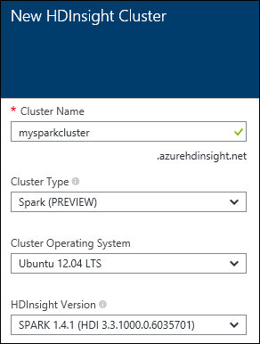
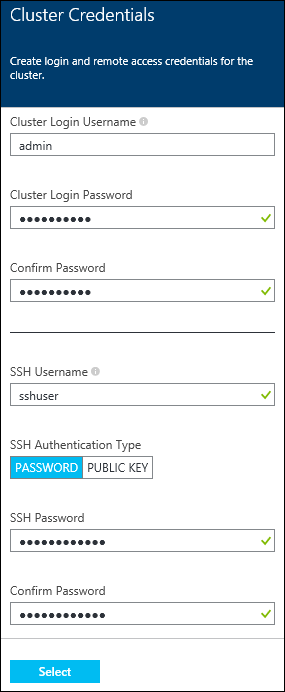
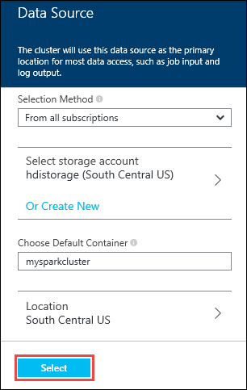
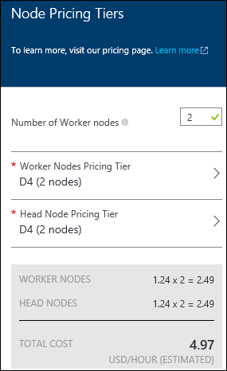
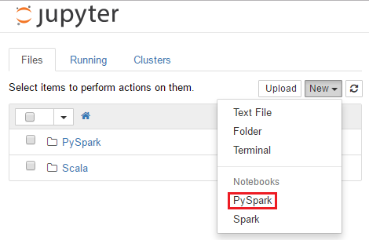
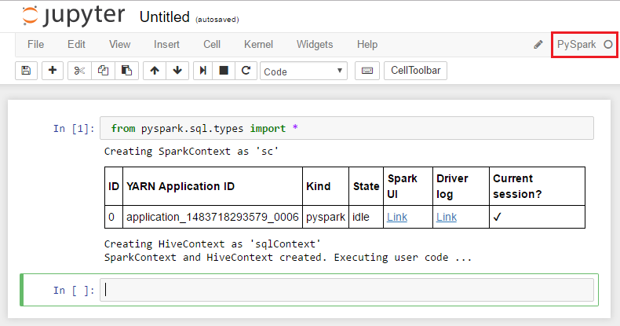

<properties
	pageTitle="Create a Spark cluster on HDInsight Linux and use Spark SQL from Jupyter for interactive analysis | Microsoft Azure"
	description="Step-by-step instructions on how to quickly create an Apache Spark cluster in HDInsight and then use Spark SQL from Jupyter notebooks to run interactive queries."
	services="hdinsight"
	documentationCenter=""
	authors="nitinme"
	manager="paulettm"
	editor="cgronlun"
	tags="azure-portal"/>

<tags
	ms.service="hdinsight"
	ms.workload="big-data"
	ms.tgt_pltfrm="na"
	ms.devlang="na"
	ms.topic="article"
	ms.date="01/13/2016"
	ms.author="nitinme"/>

# Get started: Create Apache Spark cluster on Azure HDInsight (Linux) and run interactive queries using Spark SQL

Learn how to create an Apache Spark cluster in HDInsight and then use [Jupyter](https://jupyter.org) notebook to run Spark SQL interactive queries on the Spark cluster.

   

**Prerequisites:**

- **An Azure subscription**. Before you begin this tutorial, you must have an Azure subscription. See [Get Azure free trial](http://azure.microsoft.com/documentation/videos/get-azure-free-trial-for-testing-hadoop-in-hdinsight/).

- **A Secure Shell (SSH) client**: Linux, Unix, and OS X systems provied an SSH client through the `ssh` command. For Windows systems, we recommend [PuTTY](http://www.chiark.greenend.org.uk/~sgtatham/putty/download.html).
    
- **Secure Shell (SSH) keys (optional)**: You can secure the SSH account used to connect to the cluster using either a password or a public key. Using a password gets you started quickly, and you should use this option if you want to quickly create a cluster and run some test jobs. Using a key is more secure, however it requires additional setup. You might want to use this approach when creating a production cluster. In this article, we use the password approach. For instructions on how to create and use SSH keys with HDInsight, refer to the following articles:

	-  From a Linux computer - [Use SSH with Linux-based HDInsight (Hadoop) from Linux, Unix, or OS X](hdinsight-hadoop-linux-use-ssh-unix.md).
    
	-  From a Windows computer - [Use SSH with Linux-based HDInsight (Hadoop) from Windows](hdinsight-hadoop-linux-use-ssh-windows.md).

## Create a Spark Cluster on HDInsight Linux

In this section, you create an HDInsight version 3.3 cluster, which is based on Spark version 1.5.1. For information about HDInsight versions and their SLAs, see [HDInsight component versioning](hdinsight-component-versioning.md).

>[AZURE.NOTE] The steps in this article create an Apache Spark cluster in HDInsight by using basic configuration settings. For information about other cluster configuration settings (such as using additional storage, an Azure virtual network, or a metastore for Hive), see [Create HDInsight Spark clusters using custom options](hdinsight-hadoop-provision-linux-clusters.md).

**To create a Spark cluster**

1. Sign in to the [Azure preview portal](https://ms.portal.azure.com/).

2. Click **NEW**, click **Data + Analytics**, and then click **HDInsight**.

    

3. Enter a **Cluster Name**, select **Hadoop** for the **Cluster Type**, from the **Cluster Operating System** drop-down menu, select **Ubuntu**, and then select the version of Spark. A green check appears beside the cluster name if it is available.

	

4. If you have more than one subscription, click the **Subscription** entry to select the Azure subscription to use for the cluster.

5. Click **Resource Group** to see a list of existing resource groups and select where to create the cluster. Or, you can click **Create New** and then enter the name of the new resource group. A green check appears to indicate if the new group name is available.

	> [AZURE.NOTE] This entry defaults to one of your existing resource groups, if any are available.

6. Click **Credentials** and then enter a password for the admin user. You must also enter an **SSH Username**. For **SSH Authentication Type**, click **PASSWORD** and specify a password for the SSH user. Click **Select** at the bottom to save the credentials configuration.

	

    > [AZURE.NOTE] SSH is used to remotely access the HDInsight cluster using a command-line. The user name and password you use here is used when connecting to the cluster through SSH. Also, the SSH user name must be unique, as it creates a user account on all the HDInsight cluster nodes. The following are some of the account names reserved for use by services on the cluster, and cannot be used as the SSH user name:
    >
    > root, hdiuser, storm, hbase, ubuntu, zookeeper, hdfs, yarn, mapred, hbase, hive, oozie, falcon, sqoop, admin, tez, hcat, hdinsight-zookeeper.

	For more information on using SSH with HDInsight, see one of the following articles:

	* [Use SSH with Linux-based Hadoop on HDInsight from Linux, Unix, or OS X](hdinsight-hadoop-linux-use-ssh-unix.md)
	* [Use SSH with Linux-based Hadoop on HDInsight from Windows](hdinsight-hadoop-linux-use-ssh-windows.md)

7. Click **Data Source** to choose an existing data source for the cluster, or create a new one. When you create a Hadoop cluster in HDInsight, you specify an Azure Storage account. A specific Blob storage container from that account is designated as the default file system, like in the Hadoop distributed file system (HDFS). By default, the HDInsight cluster is created in the same data center as the storage account you specify. For more information, see [Use Azure Blob storage with HDInsight][hdinsight-storage]

	

	Currently you can select an Azure Storage Account as the data source for an HDInsight cluster. Use the following to understand the entries on the **Data Source** blade.

	- **Selection Method**: Set this to **From all subscriptions** to enable browsing of storage accounts from all your subscriptions. Set this to **Access Key** if you want to enter the **Storage Name** and **Access Key** of an existing storage account.

	- **Select storage account / Create New**: Click **Select storage account** to browse and select an existing storage account you want to associate with the cluster. Or, click **Create New** to create a new storage account. Use the field that appears to enter the name of the storage account. A green check appears if the name is available.

	- **Choose Default Container**: Use this to enter the name of the default container to use for the cluster. While you can enter any name here, we recommend using the same name as the cluster so that you can easily recognize that the container is used for this specific cluster.

	- **Location**: The geographic region that the storage account is in, or will be created in.

		> [AZURE.IMPORTANT] Selecting the location for the default data source also sets the location of the HDInsight cluster. The cluster and default data source must be located in the same region.

	Click **Select** to save the data source configuration.

8. Click **Node Pricing Tiers** to display information about the nodes that will be created for this cluster. Set the number of worker nodes that you need for the cluster. The estimated cost of the cluster will be shown within the blade.

	

	Click **Select** to save the node pricing configuration.

9. On the **New HDInsight Cluster** blade, ensure that **Pin to Startboard** is selected, and then click **Create**. This creates the cluster and adds a tile for it to the Startboard of your Azure portal. The icon will indicate that the cluster is being created, and will change to display the HDInsight icon once creation has completed.

	| While creating | creation complete |
	| ------------------ | --------------------- |
	|  |  |

	> [AZURE.NOTE] It will take some time for the cluster to be created, usually around 15 minutes. Use the tile on the Startboard, or the **Notifications** entry on the left of the page to check on the creation process.

10. Once the creation is complete, click the tile for the Spark cluster from the Startboard to launch the cluster blade.

## Run Spark SQL queries using a Jupyter notebook

In this section, you use a Jupyter notebook to run Spark SQL queries against a Spark cluster.

1. From the [Azure Preview Portal](https://portal.azure.com/), from the startboard, click the tile for your Spark cluster (if you pinned it to the startboard). You can also navigate to your cluster under **Browse All** > **HDInsight Clusters**.   

2. From the Spark cluster blade, click **Quick Links**, and then from the **Cluster Dashboard** blade, click **Jupyter Notebook**. If prompted, enter the admin credentials for the cluster.

	> [AZURE.NOTE] You may also reach the Jupyter Notebook for your cluster by opening the following URL in your browser. Replace __CLUSTERNAME__ with the name of your cluster:
	>
	> `https://CLUSTERNAME.azurehdinsight.net/jupyter`

2. Create a new notebook. Click **New**, and then click **Python2**.

	

3. A new notebook is created and opened with the name Untitled.pynb. Click the notebook name at the top, and enter a friendly name.

	

4. Import the required modules and create the Spark and SQL contexts. Paste the following code example in an empty cell, and then press **SHIFT + ENTER**.

		from pyspark import SparkContext
		from pyspark.sql import SQLContext
		from pyspark.sql.types import *
		
		# Create Spark and SQL contexts
		sc = SparkContext('yarn-client')
		sqlContext = SQLContext(sc)

	Every time you run a job in Jupyter, your web browser window title will show a **(Busy)** status along with the notebook title. You will also see a solid circle next to the **Python 2** text in the top-right corner. After the job is completed, this will change to a hollow circle.

	 

4. Load sample data into a temporary table. When you create a Spark cluster in HDInsight, the sample data file, **hvac.csv**, is copied to the associated storage account under **\HdiSamples\HdiSamples\SensorSampleData\hvac**.

	In an empty cell, paste the following code example and press **SHIFT + ENTER**. This code example registers the data into a temporary table called **hvac**.

		# Load the data
		hvacText = sc.textFile("wasb:///HdiSamples/HdiSamples/SensorSampleData/hvac/HVAC.csv")
		
		# Create the schema
		hvacSchema = StructType([StructField("date", StringType(), False),StructField("time", StringType(), False),StructField("targettemp", IntegerType(), False),StructField("actualtemp", IntegerType(), False),StructField("buildingID", StringType(), False)])
		
		# Parse the data in hvacText
		hvac = hvacText.map(lambda s: s.split(",")).filter(lambda s: s[0] != "Date").map(lambda s:(str(s[0]), str(s[1]), int(s[2]), int(s[3]), str(s[6]) ))
		
		# Create a data frame
		hvacdf = sqlContext.createDataFrame(hvac,hvacSchema)
		
		# Register the data fram as a table to run queries against
		hvacdf.registerTempTable("hvac")
		
		# Run queries against the table and display the data
		data = sqlContext.sql("select buildingID, (targettemp - actualtemp) as temp_diff, date from hvac where date = \"6/1/13\"")
		data.show()

5. Once the job is completed successfully, the following output is displayed.

		+----------+---------+------+
		|buildingID|temp_diff|  date|
		+----------+---------+------+
		|         4|        8|6/1/13|
		|         3|        2|6/1/13|
		|         7|      -10|6/1/13|
		|        12|        3|6/1/13|
		|         7|        9|6/1/13|
		|         7|        5|6/1/13|
		|         3|       11|6/1/13|
		|         8|       -7|6/1/13|
		|        17|       14|6/1/13|
		|        16|       -3|6/1/13|
		|         8|       -8|6/1/13|
		|         1|       -1|6/1/13|
		|        12|       11|6/1/13|
		|         3|       14|6/1/13|
		|         6|       -4|6/1/13|
		|         1|        4|6/1/13|
		|        19|        4|6/1/13|
		|        19|       12|6/1/13|
		|         9|       -9|6/1/13|
		|        15|      -10|6/1/13|
		+----------+---------+------+

6. After you have finished running the application, you should shutdown the notebook to release the resources. To do so, from the **File** menu on the notebook, click **Close and Halt**. This will shutdown and close the notebook.

## See also

* [Overview: Apache Spark on Azure HDInsight](hdinsight-apache-spark-overview.md)

### Scenarios

* [Spark with BI: Perform interactive data analysis using Spark in HDInsight with BI tools](hdinsight-apache-spark-use-bi-tools.md)

* [Spark with Machine Learning: Use Spark in HDInsight for analyzing building temperature using HVAC data](hdinsight-apache-spark-ipython-notebook-machine-learning.md)

* [Spark with Machine Learning: Use Spark in HDInsight to predict food inspection results](hdinsight-apache-spark-machine-learning-mllib-ipython.md)

* [Spark Streaming: Use Spark in HDInsight for building real-time streaming applications](hdinsight-apache-spark-eventhub-streaming.md)

* [Website log analysis using Spark in HDInsight](hdinsight-apache-spark-custom-library-website-log-analysis.md)

### Create and run applications

* [Create a standalone application using Scala](hdinsight-apache-spark-create-standalone-application.md)

* [Run jobs remotely on a Spark cluster using Livy](hdinsight-apache-spark-livy-rest-interface.md)

### Extensions

* [Use Zeppelin notebooks with a Spark cluster on HDInsight](hdinsight-apache-spark-use-zeppelin-notebook.md)

* [Kernels available for Jupyter notebook in Spark cluster for HDInsight](hdinsight-apache-spark-jupyter-notebook-kernels.md)

### Manage resources

* [Manage resources for the Apache Spark cluster in Azure HDInsight](hdinsight-apache-spark-resource-manager.md)

### Known Issues

* [Known issues of Apache Spark in Azure HDInsight (Linux)](hdinsight-apache-spark-known-issues.md)

[hdinsight-versions]: ../hdinsight-component-versioning/
[hdinsight-upload-data]: ../hdinsight-upload-data/
[hdinsight-storage]: ../hdinsight-use-blob-storage/

[azure-purchase-options]: http://azure.microsoft.com/pricing/purchase-options/
[azure-member-offers]: http://azure.microsoft.com/pricing/member-offers/
[azure-free-trial]: http://azure.microsoft.com/pricing/free-trial/
[azure-management-portal]: https://manage.windowsazure.com/
[azure-create-storageaccount]: ../storage-create-storage-account/
