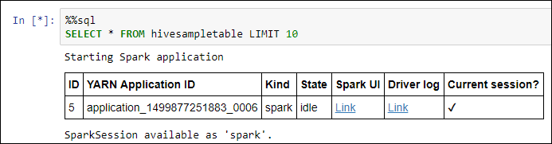

# Create an Apache Spark cluster in Azure HDInsight

In this article, you learn how to create an Apache Spark cluster in Azure HDInsight and then run a Spark SQL query on a Hive table. For information on Spark on HDInsight, see [Overview: Apache Spark on Azure HDInsight](hdinsight-apache-spark-overview.md).

   

## Prerequisites

* **An Azure subscription**. Before you begin this tutorial, you must have an Azure subscription. See [Create your free Azure account today](https://azure.microsoft.com/free).

## Create HDInsight Spark cluster

In this section, you create an HDInsight Spark cluster using an [Azure Resource Manager template](https://azure.microsoft.com/resources/templates/101-hdinsight-spark-linux/). For other cluster creation methods, see [Create HDInsight clusters](hdinsight-hadoop-provision-linux-clusters.md).

1. Click the following image to open the template in the Azure portal.         

    

2. Enter the following values:

    

	* **Subscription**: Select your Azure subscription for this cluster.
	* **Resource group**: Create a resource group or select an existing one. Resource group is used to manage Azure resources for your projects.
	* **Location**: Select a location for the resource group. The template uses this location for creating the cluster as well as for the default cluster storage.
	* **ClusterName**: Enter a name for the HDInsight cluster that you want to create.
	* **Spark version**: Select **2.0** as the version that you want to install on the cluster.
	* **Cluster login name and password**: The default login name is admin.
	* **SSH user name and password**.

   Write down these values.  You need them later in the tutorial.

3. Select **I agree to the terms and conditions stated above**, select **Pin to dashboard**, and then click **Purchase**. You can see a new tile titled Submitting deployment for Template deployment. It takes about 20 minutes to create the cluster.

If you run into an issue with creating HDInsight clusters, it could be that you do not have the right permissions to do so. For more information, see [Access control requirements](hdinsight-administer-use-portal-linux.md#create-clusters).

> [!NOTE]
> This article creates a Spark cluster that uses [Azure Storage Blobs as the cluster storage](hdinsight-hadoop-use-blob-storage.md). You can also create a Spark cluster that uses [Azure Data Lake Store](hdinsight-hadoop-use-data-lake-store.md) as the default storage. For instructions, see [Create an HDInsight cluster with Data Lake Store](../data-lake-store/data-lake-store-hdinsight-hadoop-use-portal.md).
>
>

## Run Spark SQL statements on a Hive table

SQL (Structured Query Language) is the most common and widely used language for querying and defining data. The founders of Spark sought to harness this knowledge, opening up the well-known data querying language to a wider audience of analysts who wish to work with data that lives on Hadoop Distributed File System (HDFS). Spark SQL is that offering. It functions as an extension to Apache Spark for processing structured data, using the familiar SQL syntax.

Spark SQL supports both SQL and HiveQL as query languages. Its capabilities include binding in Python, Scala, and Java. With it, you can query data stored in many locations, such as external databases, structured data files (example: JSON), and Hive tables.

### Running Spark SQL on an HDInsight cluster

When you use a Jupyter notebook configured for your HDInsight Spark cluster, you get a preset `sqlContext` that you can use to run Hive queries using Spark SQL. In this section, you learn how to start a Jupyter notebook and then run a basic Spark SQL query on an existing Hive table (**hivesampletable**) that is available on all HDInsight clusters.

1. Open the [Azure portal](https://portal.azure.com/).

2. If you opted to pin the cluster to the dashboard, click the cluster tile from the dashboard to launch the cluster blade.

	If you did not pin the cluster to the dashboard, from the left pane, click **HDInsight clusters**, and then click the cluster you created.

3. From **Quick links**, click **Cluster dashboards**, and then click **Jupyter Notebook**. If prompted, enter the admin credentials for the cluster.

   

   > [!NOTE]
   > You may also access the Jupyter notebook for your cluster by opening the following URL in your browser. Replace **CLUSTERNAME** with the name of your cluster:
   >
   > `https://CLUSTERNAME.azurehdinsight.net/jupyter`
   >
   >
3. Create a notebook. Click **New**, and then click **PySpark**.

   

   A new notebook is created and opened with the name Untitled(Untitled.pynb).

4. Click the notebook name at the top, and enter a friendly name if you want.

    

5.  Paste the following code in an empty cell, and then press **SHIFT + ENTER** to run the code. In the code below, `%%sql` (called the sql magic) tells Jupyter notebook to use the preset `sqlContext` to run the Hive query. The query retrieves the top 10 rows from a Hive table (**hivesampletable**) that is available by default on all HDInsight clusters.

		%%sql
        SELECT * FROM hivesampletable LIMIT 10

    

    For more information on the `%%sql` magic and the preset contexts, see [Jupyter kernels available for an HDInsight cluster](hdinsight-apache-spark-jupyter-notebook-kernels.md).

    > [!NOTE]
    > Every time you run a query in Jupyter, your web browser window title shows a **(Busy)** status along with the notebook title. You also see a solid circle next to the **PySpark** text in the top-right corner. After the job is completed, it changes to a hollow circle.
    >
    >
    
6. The screen should refresh to show the query output.

    

7. Shut down the notebook to release the cluster resources after you have finished running the application. To do so, from the **File** menu on the notebook, click **Close and Halt**.

8. If you plan to complete the next steps at a later time, make sure you delete the HDInsight cluster you created in this article. 

[!INCLUDE [delete-cluster-warning](../../includes/hdinsight-delete-cluster-warning.md)]

## Next step 

In this article, you learned how to create an HDInsight Spark cluster and run a basic Spark SQL query. Advance to the next article to learn how to use an HDInsight Spark cluster to run interactive queries on sample data.

> [!div class="nextstepaction"]
>[Run interactive queries on an HDInsight Spark cluster](hdinsight-apache-spark-load-data-run-query.md)

