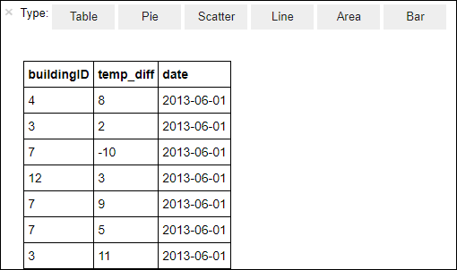
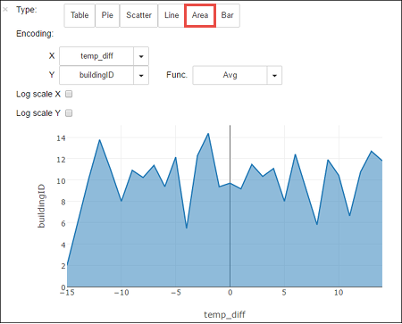

# Run interactive queries on an HDInsight Spark cluster

In this section, you use Jupyter notebook to run interactive Spark SQL queries against the Spark cluster you created earlier. HDInsight Spark clusters provide three kernels that you can use with the Jupyter notebook. These are:

* **PySpark** (for applications written in Python)
* **PySpark3** (for applications written in Python3)
* **Spark** (for applications written in Scala)

In this article, you use the **PySpark** kernel in the notebook from where you run the interactive Spark SQL query. For more information about the kernels, see [Use Jupyter notebook kernels with Apache Spark clusters in HDInsight](hdinsight-apache-spark-jupyter-notebook-kernels.md). Some of the key benefits of using the PySpark kernel are:

* The contexts for Spark and Hive are set automatically.
* Use cell magics, such as `%%sql`, to directly run interactive SQL or Hive queries, without any preceding code snippets.
* The output from the interactive queries is automatically visualized.

## Prerequisites

* **An Azure HDInsight Spark cluster**. Make sure you have already created ann HDInsight Spark cluster in Azure. For instructions, see [Create an Apache Spark cluster in Azure HDInsight](hdinsight-apache-spark-jupyter-spark-sql.md).

## Create a Jupyter notebook to run interactive queries

Before you can run queries using the Jupyter notebook, you must load some sample data against which you run the queries. In this section, you look at how to:

* Register a sample data set as a Spark dataframe.
* Run queries on the data set.

1. Open the [Azure portal](https://portal.azure.com/).

2. If you opted to pin the cluster to the dashboard, click the cluster tile from the dashboard to launch the cluster blade.

	If you did not pin the cluster to the dashboard, from the left pane, click **HDInsight clusters**, and then click the cluster you created.

3. From **Quick links**, click **Cluster dashboards**, and then click **Jupyter Notebook**. If prompted, enter the admin credentials for the cluster.

   

   > [!NOTE]
   > You may also access the Jupyter notebook for your cluster by opening the following URL in your browser. Replace **CLUSTERNAME** with the name of your cluster:
   >
   > `https://CLUSTERNAME.azurehdinsight.net/jupyter`
   >
   >
3. Create a notebook. Click **New**, and then click **PySpark**.

   

   A new notebook is created and opened with the name Untitled(Untitled.pynb).

4. Click the notebook name at the top, and enter a friendly name if you want.

    

5. Paste the following code in an empty cell, and then press **SHIFT + ENTER** to run the code. The code imports the types required for this scenario:

		from pyspark.sql.types import *

    Because you created a notebook using the PySpark kernel, you do not need to create any contexts explicitly. The Spark and Hive contexts are automatically created for you when you run the first code cell.

    

    Every time you run an interactive query in Jupyter, your web browser window title shows a **(Busy)** status along with the notebook title. You also see a solid circle next to the **PySpark** text in the top-right corner. After the job is completed, it changes to a hollow circle.

6. Register a sample data set as a temporary table (**hvac**) by running the following code.

		# Load the data
		hvacText = sc.textFile("wasbs:///HdiSamples/HdiSamples/SensorSampleData/hvac/HVAC.csv")

		# Create the schema
		hvacSchema = StructType([StructField("date", StringType(), False),StructField("time", StringType(), False),StructField("targettemp", IntegerType(), False),StructField("actualtemp", IntegerType(), False),StructField("buildingID", StringType(), False)])

		# Parse the data in hvacText
		hvac = hvacText.map(lambda s: s.split(",")).filter(lambda s: s[0] != "Date").map(lambda s:(str(s[0]), str(s[1]), int(s[2]), int(s[3]), str(s[6]) ))

		# Create a data frame
		hvacdf = sqlContext.createDataFrame(hvac,hvacSchema)

		# Register the data frame as a table to run queries against
		hvacdf.registerTempTable("hvac")

    Spark clusters in HDInsight come with a sample data file, **hvac.csv**, under **\HdiSamples\HdiSamples\SensorSampleData\hvac**.

7. To run interactive query on the data, use the following code.

		%%sql
		SELECT buildingID, (targettemp - actualtemp) AS temp_diff, date FROM hvac WHERE date = \"6/1/13\"

   Because you are using a PySpark kernel, you can now directly run an interactive SQL query on the temporary table **hvac** that you created by using the `%%sql` magic. For more information about the `%%sql` magic, and other magics available with the PySpark kernel, see [Kernels available on Jupyter notebooks with Spark HDInsight clusters](hdinsight-apache-spark-jupyter-notebook-kernels.md#parameters-supported-with-the-sql-magic).

   The following tabular output is displayed by default.

     

    You can also see the results in other visualizations as well. For example, an area graph for the same output would look like the following.

    

9. Shut down the notebook to release the cluster resources after you have finished running the application. To do so, from the **File** menu on the notebook, click **Close and Halt**.

## Next step

In this article you learned how to run interactive queries in Spark using Jupyter notebook. The data you registered in Spark can now be pulled into a BI analytics tool such as Power BI and Tableau. See [Spark BI using data visualization tools with Azure HDInsight](hdinsight-apache-spark-use-bi-tools.md).

