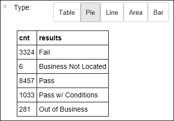
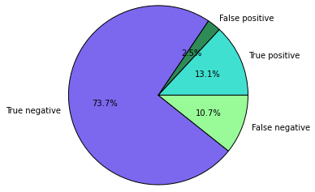

<properties 
	pageTitle="Use Apache Spark to build machine learning applications on HDInsight | Microsoft Azure" 
	description="Step-by-step instructions on how to use notebooks with Apache Spark to build machine learning applications" 
	services="hdinsight" 
	documentationCenter="" 
	authors="nitinme" 
	manager="paulettm" 
	editor="cgronlun"
	tags="azure-portal"/>

<tags 
	ms.service="hdinsight" 
	ms.workload="big-data" 
	ms.tgt_pltfrm="na" 
	ms.devlang="na" 
	ms.topic="article" 
	ms.date="07/25/2016" 
	ms.author="nitinme"/>

# Machine learning: Predictive analysis on food inspection data using MLlib with Apache Spark cluster on HDInsight Linux

> [AZURE.TIP] This tutorial is also available as a Jupyter notebook on a Spark (Linux) cluster that you create in HDInsight. The notebook experience lets you run the Python snippets from the notebook itself. To perform the tutorial from within a notebook, create a Spark cluster, launch a Jupyter notebook (`https://CLUSTERNAME.azurehdinsight.net/jupyter`), and then run the notebook **Spark Machine Learning - Predictive analysis on food inspection data using MLLib.ipynb** under the **Python** folder.

This article demonstrates how to use **MLLib**, Spark's built-in machine learning libraries, to perform a simple predictive analysis on an open dataset. MLLib is a core Spark library that provides a number of utilities that are useful for machine learning tasks, including utilities that are suitable for:

* Classification

* Regression

* Clustering

* Topic modeling

* Singular value decomposition (SVD) and principal component analysis (PCA)

* Hypothesis testing and calculating sample statistics

This article presents a simple approach to *classification* through logistic regression.

## What are classification and logistic regression?

*Classification*, a very common machine learning task, is the process of sorting input data into categories. It is the job of a classification algorithm to figure out how to assign "labels" to input data that you provide. For example, you could think of a machine learning algorithm that accepts stock information as input and divides the stock into two categories: stocks which you should sell and stocks which you should retain.

Logistic regression is the algorithm that you use for classification. Spark's logistic regression API is useful for *binary classification*, or classifying input data into one of two groups. For more information about logistic regressions, see [Wikipedia](https://en.wikipedia.org/wiki/Logistic_regression).

In summary, the process of logistic regression produces a *logistic function* that can be used to predict the probability that an input vector belongs in one group or the other.  

## What are we trying to accomplish in this article?

You will use Spark to perform some predictive analysis on food inspection data (**Food_Inspections1.csv**) that was acquired through the [City of Chicago data portal](https://data.cityofchicago.org/). This dataset contains information about food inspections that were conducted in Chicago, including information about each food establishment that was inspected, the violations that were found (if any), and the results of the inspection. The CSV data file is already available in the storage account associated with the cluster at **/HdiSamples/HdiSamples/FoodInspectionData/Food_Inspections1.csv**.

In the steps below, you develop a model to see what it takes to pass or fail a food inspection. 

## Start building a machine learning application using Spark MLlib

1. From the [Azure Portal](https://portal.azure.com/), from the startboard, click the tile for your Spark cluster (if you pinned it to the startboard). You can also navigate to your cluster under **Browse All** > **HDInsight Clusters**.   

2. From the Spark cluster blade, click **Quick Links**, and then from the **Cluster Dashboard** blade, click **Jupyter Notebook**. If prompted, enter the admin credentials for the cluster.

	> [AZURE.NOTE] You may also reach the Jupyter Notebook for your cluster by opening the following URL in your browser. Replace __CLUSTERNAME__ with the name of your cluster:
	>
	> `https://CLUSTERNAME.azurehdinsight.net/jupyter`

2. Create a new notebook. Click **New**, and then click **PySpark**.

	

3. A new notebook is created and opened with the name Untitled.pynb. Click the notebook name at the top, and enter a friendly name.

	

3. Because you created a notebook using the PySpark kernel, you do not need to create any contexts explicitly. The Spark and Hive contexts will be automatically created for you when you run the first code cell. You can start building your machine learning application by importing the types required for this scenario. To do so, place the cursor in the cell and press **SHIFT + ENTER**.

		from pyspark.ml import Pipeline
		from pyspark.ml.classification import LogisticRegression
		from pyspark.ml.feature import HashingTF, Tokenizer
		from pyspark.sql import Row
		from pyspark.sql.functions import UserDefinedFunction
		from pyspark.sql.types import *

## Construct an input dataframe

We can use `sqlContext` to perform transformations on structured data. The first task is to load the sample data ((**Food_Inspections1.csv**)) into a Spark SQL *dataframe*. 

1. Because the raw data is in a CSV format, we need to use the Spark context to pull every line of the file into memory as unstructured text; then, you use Python's CSV library to parse each line individually. 

		def csvParse(s):
		    import csv
		    from StringIO import StringIO
		    sio = StringIO(s)
		    value = csv.reader(sio).next()
		    sio.close()
		    return value
		
		inspections = sc.textFile('wasbs:///HdiSamples/HdiSamples/FoodInspectionData/Food_Inspections1.csv')\
		                .map(csvParse)

2. We now have the CSV file as an RDD. Let us retrieve one row from the RDD to understand the schema of the data.

		inspections.take(1)

	You should see an output like the following:

	    # -----------------
		# THIS IS AN OUTPUT
		# -----------------

		[['413707',
	      'LUNA PARK INC',
	      'LUNA PARK  DAY CARE',
	      '2049789',
	      "Children's Services Facility",
	      'Risk 1 (High)',
	      '3250 W FOSTER AVE ',
	      'CHICAGO',
	      'IL',
	      '60625',
	      '09/21/2010',
	      'License-Task Force',
	      'Fail',
	      '24. DISH WASHING FACILITIES: PROPERLY DESIGNED, CONSTRUCTED, MAINTAINED, INSTALLED, LOCATED AND OPERATED - Comments: All dishwashing machines must be of a type that complies with all requirements of the plumbing section of the Municipal Code of Chicago and Rules and Regulation of the Board of Health. OBSEVERD THE 3 COMPARTMENT SINK BACKING UP INTO THE 1ST AND 2ND COMPARTMENT WITH CLEAR WATER AND SLOWLY DRAINING OUT. INST NEED HAVE IT REPAIR. CITATION ISSUED, SERIOUS VIOLATION 7-38-030 H000062369-10 COURT DATE 10-28-10 TIME 1 P.M. ROOM 107 400 W. SURPERIOR. | 36. LIGHTING: REQUIRED MINIMUM FOOT-CANDLES OF LIGHT PROVIDED, FIXTURES SHIELDED - Comments: Shielding to protect against broken glass falling into food shall be provided for all artificial lighting sources in preparation, service, and display facilities. LIGHT SHIELD ARE MISSING UNDER HOOD OF  COOKING EQUIPMENT AND NEED TO REPLACE LIGHT UNDER UNIT. 4 LIGHTS ARE OUT IN THE REAR CHILDREN AREA,IN THE KINDERGARDEN CLASS ROOM. 2 LIGHT ARE OUT EAST REAR, LIGHT FRONT WEST ROOM. NEED TO REPLACE ALL LIGHT THAT ARE NOT WORKING. | 35. WALLS, CEILINGS, ATTACHED EQUIPMENT CONSTRUCTED PER CODE: GOOD REPAIR, SURFACES CLEAN AND DUST-LESS CLEANING METHODS - Comments: The walls and ceilings shall be in good repair and easily cleaned. MISSING CEILING TILES WITH STAINS IN WEST,EAST, IN FRONT AREA WEST, AND BY THE 15MOS AREA. NEED TO BE REPLACED. | 32. FOOD AND NON-FOOD CONTACT SURFACES PROPERLY DESIGNED, CONSTRUCTED AND MAINTAINED - Comments: All food and non-food contact equipment and utensils shall be smooth, easily cleanable, and durable, and shall be in good repair. SPLASH GUARDED ARE NEEDED BY THE EXPOSED HAND SINK IN THE KITCHEN AREA | 34. FLOORS: CONSTRUCTED PER CODE, CLEANED, GOOD REPAIR, COVING INSTALLED, DUST-LESS CLEANING METHODS USED - Comments: The floors shall be constructed per code, be smooth and easily cleaned, and be kept clean and in good repair. INST NEED TO ELEVATE ALL FOOD ITEMS 6INCH OFF THE FLOOR 6 INCH AWAY FORM WALL.  ',
	      '41.97583445690982',
	      '-87.7107455232781',
	      '(41.97583445690982, -87.7107455232781)']]

3. The above output gives us an idea of the schema of the input file; the file includes the name of every establishment, the type of establishment, the address, the data of the inspections, and the location, among other things. Let's select a few columns that will be useful for our predictive analysis and group the results as a dataframe, which we then use to create a temporary table.

		schema = StructType([
        StructField("id", IntegerType(), False), 
        StructField("name", StringType(), False), 
        StructField("results", StringType(), False), 
        StructField("violations", StringType(), True)])

		df = sqlContext.createDataFrame(inspections.map(lambda l: (int(l[0]), l[1], l[12], l[13])) , schema)
		df.registerTempTable('CountResults')

4. We now have a *dataframe*, `df` on which we can perform our analysis. We also have a temporary table call **CountResults**. We've included 4 columns of interest in the dataframe: **id**, **name**, **results**, and **violations**. 
	
	Let's get a small sample of the data:

		df.show(5)

	You should see an output like the following:

	    # -----------------
		# THIS IS AN OUTPUT
		# -----------------

		+------+--------------------+-------+--------------------+
	    |    id|                name|results|          violations|
	    +------+--------------------+-------+--------------------+
	    |413707|       LUNA PARK INC|   Fail|24. DISH WASHING ...|
	    |391234|       CAFE SELMARIE|   Fail|2. FACILITIES TO ...|
	    |413751|          MANCHU WOK|   Pass|33. FOOD AND NON-...|
	    |413708|BENCHMARK HOSPITA...|   Pass|                    |
	    |413722|           JJ BURGER|   Pass|                    |
	    +------+--------------------+-------+--------------------+

## Understand the data

1. Let's start to get a sense of what our dataset contains. For example, what are the different values in the **results** column?

		df.select('results').distinct().show()

	
	You should see an output like the following:

	    # -----------------
		# THIS IS AN OUTPUT
		# -----------------
	
		+--------------------+
	    |             results|
	    +--------------------+
	    |                Fail|
	    |Business Not Located|
	    |                Pass|
	    |  Pass w/ Conditions|
	    |     Out of Business|
	    +--------------------+
    
2. A quick visualization can help us reason about the distribution of these outcomes. We already have the data in a temporary table **CountResults**. You can run the following SQL query against the table to get a better understanding of how the results are distributed.

		%%sql -o countResultsdf
		SELECT results, COUNT(results) AS cnt FROM CountResults GROUP BY results

	The `%%sql` magic followed by `-o countResultsdf` ensures that the output of the query is persisted locally on the Jupyter server (typically the headnode of the cluster). The output is persisted as a [Pandas](http://pandas.pydata.org/) dataframe with the specified name **countResultsdf**.
	
	You should see an output like the following:
	
	

	For more information about the `%%sql` magic, as well as other magics available with the PySpark kernel, see [Kernels available on Jupyter notebooks with Spark HDInsight clusters](hdinsight-apache-spark-jupyter-notebook-kernels.md#why-should-i-use-the-new-kernels).

3. You can also use Matplotlib, a library used to construct visualization of data, to create a plot. Because the plot must be created from the locally persisted **countResultsdf** dataframe, the code snippet must begin with the `%%local` magic. This ensures that the code is run locally on the Jupyter server.

		%%local
		%matplotlib inline
		import matplotlib.pyplot as plt
		
		
		labels = countResultsdf['results']
		sizes = countResultsdf['cnt']
		colors = ['turquoise', 'seagreen', 'mediumslateblue', 'palegreen', 'coral']
		plt.pie(sizes, labels=labels, autopct='%1.1f%%', colors=colors)
		plt.axis('equal')

	You should see an output like the following:

	

4. You can see that there are 5 distinct results that an inspection can have:
	
	* Business not located 
	* Fail
	* Pass
	* Pss w/ conditions, and
	* Out of Business 

	Let us develop a model that can guess the outcome of a food inspection, given the violations. Since logistic regression is a binary classification method, it makes sense to group our data into two categories: **Fail** and **Pass**. A "Pass w/ Conditions" is still a Pass, so when we train the model, we will consider the two results equivalent. Data with the other results ("Business Not Located", "Out of Business") are not useful so we will remove them from our training set. This should be okay since these two categories make up a very small percentage of the results anyway.

5. Let us go ahead and convert our existing dataframe(`df`) into a new dataframe where each inspection is represented as a label-violations pair. In our case, a label of `0.0` represents a failure, a label of `1.0` represents a success, and a label of `-1.0` represents some results besides those two. We will filter those other results out when computing the new data frame.

		def labelForResults(s):
		    if s == 'Fail':
		        return 0.0
		    elif s == 'Pass w/ Conditions' or s == 'Pass':
		        return 1.0
		    else:
		        return -1.0
		label = UserDefinedFunction(labelForResults, DoubleType())
		labeledData = df.select(label(df.results).alias('label'), df.violations).where('label >= 0')

	Let's retrieve one row from the labeled data to see what it looks like.

		labeledData.take(1)

	You should see an output like the following:
	
	    # -----------------
		# THIS IS AN OUTPUT
		# -----------------
	
		[Row(label=0.0, violations=u"41. PREMISES MAINTAINED FREE OF LITTER, UNNECESSARY ARTICLES, CLEANING  EQUIPMENT PROPERLY STORED - Comments: All parts of the food establishment and all parts of the property used in connection with the operation of the establishment shall be kept neat and clean and should not produce any offensive odors.  REMOVE MATTRESS FROM SMALL DUMPSTER. | 35. WALLS, CEILINGS, ATTACHED EQUIPMENT CONSTRUCTED PER CODE: GOOD REPAIR, SURFACES CLEAN AND DUST-LESS CLEANING METHODS - Comments: The walls and ceilings shall be in good repair and easily cleaned.  REPAIR MISALIGNED DOORS AND DOOR NEAR ELEVATOR.  DETAIL CLEAN BLACK MOLD LIKE SUBSTANCE FROM WALLS BY BOTH DISH MACHINES.  REPAIR OR REMOVE BASEBOARD UNDER DISH MACHINE (LEFT REAR KITCHEN). SEAL ALL GAPS.  REPLACE MILK CRATES USED IN WALK IN COOLERS AND STORAGE AREAS WITH PROPER SHELVING AT LEAST 6' OFF THE FLOOR.  | 38. VENTILATION: ROOMS AND EQUIPMENT VENTED AS REQUIRED: PLUMBING: INSTALLED AND MAINTAINED - Comments: The flow of air discharged from kitchen fans shall always be through a duct to a point above the roofline.  REPAIR BROKEN VENTILATION IN MEN'S AND WOMEN'S WASHROOMS NEXT TO DINING AREA. | 32. FOOD AND NON-FOOD CONTACT SURFACES PROPERLY DESIGNED, CONSTRUCTED AND MAINTAINED - Comments: All food and non-food contact equipment and utensils shall be smooth, easily cleanable, and durable, and shall be in good repair.  REPAIR DAMAGED PLUG ON LEFT SIDE OF 2 COMPARTMENT SINK.  REPAIR SELF CLOSER ON BOTTOM LEFT DOOR OF 4 DOOR PREP UNIT NEXT TO OFFICE.")]

## Create a logistic regression model from the input dataframe

Our final task is to convert the labeled data into a format that can be analyzed by logistic regression. The input to a logistic regression algorithm should be a set of *label-feature vector pairs*, where the "feature vector" is a vector of numbers that represents the input point in some way. So, we need a way to convert the "violations" column, which is semi-structured and contains a lot of comments in free-text, to an array of real numbers that a machine could easily understand. 

One standard machine learning approach for processing natural language is to assign each distinct word an "index", and then pass a vector to the machine learning algorithm such that each index's value contains the relative frequency of that word in the text string. 

MLLib provides an easy way to perform this operation. First, we'll "tokenize" each violations string to get the individual words in each string, and then we'll use a `HashingTF` to convert each set of tokens into a feature vector which can then be passed to the logistic regression algorithm to construct a model. We'll conduct all of these steps in sequence using a "pipeline".

	tokenizer = Tokenizer(inputCol="violations", outputCol="words")
	hashingTF = HashingTF(inputCol=tokenizer.getOutputCol(), outputCol="features")
	lr = LogisticRegression(maxIter=10, regParam=0.01)
	pipeline = Pipeline(stages=[tokenizer, hashingTF, lr])
	
	model = pipeline.fit(labeledData)

## Evaluate the model on a separate test dataset

We can use the model we created earlier to *predict* what the results of new inspections will be, based on the violations that were observed. We trained this model on the dataset **Food_Inspections1.csv**. Let us use a second dataset, **Food_Inspections2.csv**, to *evaluate* the strength of this model on new data. This second data set (**Food_Inspections2.csv**) should already be in the default storage container associated with the cluster.

1. The snippet below creates a new dataframe, **predictionsDf** that contains the prediction generated by the model. The snippet also creates a temporary table **Predictions** based on the dataframe.

		testData = sc.textFile('wasbs:///HdiSamples/HdiSamples/FoodInspectionData/Food_Inspections2.csv')\
	             .map(csvParse) \
	             .map(lambda l: (int(l[0]), l[1], l[12], l[13]))
		testDf = sqlContext.createDataFrame(testData, schema).where("results = 'Fail' OR results = 'Pass' OR results = 'Pass w/ Conditions'")
		predictionsDf = model.transform(testDf)
		predictionsDf.registerTempTable('Predictions')
		predictionsDf.columns

	You should see an output like the following:
	
	    # -----------------
		# THIS IS AN OUTPUT
		# -----------------
		
		['id',
	     'name',
	     'results',
	     'violations',
	     'words',
	     'features',
	     'rawPrediction',
	     'probability',
	     'prediction']

2. Look at one of the predictions. Run this snippet:

		predictionsDf.take(1)

	You will see the prediction for the first entry in the test data set.

3. The `model.transform()` method will apply the same transformation to any new data with the same schema, and arrive at a prediction of how to classify the data. We can do some simple statistics to get a sense of how accurate our predictions were:

		numSuccesses = predictionsDf.where("""(prediction = 0 AND results = 'Fail') OR 
		                                      (prediction = 1 AND (results = 'Pass' OR 
		                                                           results = 'Pass w/ Conditions'))""").count()
		numInspections = predictionsDf.count()
		
		print "There were", numInspections, "inspections and there were", numSuccesses, "successful predictions"
		print "This is a", str((float(numSuccesses) / float(numInspections)) * 100) + "%", "success rate"

	The output looks like the following:
	
	    # -----------------
		# THIS IS AN OUTPUT
		# -----------------
	
		There were 9315 inspections and there were 8087 successful predictions
	    This is a 86.8169618894% success rate

	Using logistic regression with Spark gives us an accurate model of the relationship between violations descriptions in English and whether a given business would pass or fail a food inspection. 

## Create a visual representation of the prediction

We can now construct a final visualization to help us reason about the results of this test. 

1. We start by extracting the different predictions and results from the **Predictions** temporary table created earlier. The following queries separate the output as *true_positive*, *false_positive*, *true_negative*, and *false_negative*. In the queries below, we turn off visualization by using `-q` and also save the output (by using `-o`) as dataframes that can be then used with the `%%local` magic. 

		%%sql -q -o true_positive
		SELECT count(*) AS cnt FROM Predictions WHERE prediction = 0 AND results = 'Fail'

		%%sql -q -o false_positive
		SELECT count(*) AS cnt FROM Predictions WHERE prediction = 0 AND (results = 'Pass' OR results = 'Pass w/ Conditions')

		%%sql -q -o true_negative
		SELECT count(*) AS cnt FROM Predictions WHERE prediction = 1 AND results = 'Fail'

		%%sql -q -o false_negative
		SELECT count(*) AS cnt FROM Predictions WHERE prediction = 1 AND (results = 'Pass' OR results = 'Pass w/ Conditions') 

2. Finally, use the following snippet to generate the plot using **Matplotlib**.

		%%local
		%matplotlib inline
		import matplotlib.pyplot as plt
		
		labels = ['True positive', 'False positive', 'True negative', 'False negative']
		sizes = [true_positive['cnt'], false_positive['cnt'], false_negative['cnt'], true_negative['cnt']]
		colors = ['turquoise', 'seagreen', 'mediumslateblue', 'palegreen', 'coral']
		plt.pie(sizes, labels=labels, autopct='%1.1f%%', colors=colors)
		plt.axis('equal')
	
	You should see the following output.
	
	

	In this chart, a "positive" result refers to the failed food inspection, while a negative result refers to a passed inspection.

## Shut down the notebook

After you have finished running the application, you should shutdown the notebook to release the resources. To do so, from the **File** menu on the notebook, click **Close and Halt**. This will shutdown and close the notebook.

## See also

* [Overview: Apache Spark on Azure HDInsight](hdinsight-apache-spark-overview.md)

### Scenarios

* [Spark with BI: Perform interactive data analysis using Spark in HDInsight with BI tools](hdinsight-apache-spark-use-bi-tools.md)

* [Spark with Machine Learning: Use Spark in HDInsight for analyzing building temperature using HVAC data](hdinsight-apache-spark-ipython-notebook-machine-learning.md)

* [Spark Streaming: Use Spark in HDInsight for building real-time streaming applications](hdinsight-apache-spark-eventhub-streaming.md)

* [Website log analysis using Spark in HDInsight](hdinsight-apache-spark-custom-library-website-log-analysis.md)

### Create and run applications

* [Create a standalone application using Scala](hdinsight-apache-spark-create-standalone-application.md)

* [Run jobs remotely on a Spark cluster using Livy](hdinsight-apache-spark-livy-rest-interface.md)

### Tools and extensions

* [Use HDInsight Tools Plugin for IntelliJ IDEA to create and submit Spark Scala applicatons](hdinsight-apache-spark-intellij-tool-plugin.md)

* [Use HDInsight Tools Plugin for IntelliJ IDEA to debug Spark applications remotely](hdinsight-apache-spark-intellij-tool-plugin-debug-jobs-remotely.md)

* [Use Zeppelin notebooks with a Spark cluster on HDInsight](hdinsight-apache-spark-use-zeppelin-notebook.md)

* [Kernels available for Jupyter notebook in Spark cluster for HDInsight](hdinsight-apache-spark-jupyter-notebook-kernels.md)

* [Use external packages with Jupyter notebooks](hdinsight-apache-spark-jupyter-notebook-use-external-packages.md)

* [Install Jupyter on your computer and connect to an HDInsight Spark cluster](hdinsight-apache-spark-jupyter-notebook-install-locally.md)

### Manage resources

* [Manage resources for the Apache Spark cluster in Azure HDInsight](hdinsight-apache-spark-resource-manager.md)

* [Track and debug jobs running on an Apache Spark cluster in HDInsight](hdinsight-apache-spark-job-debugging.md)