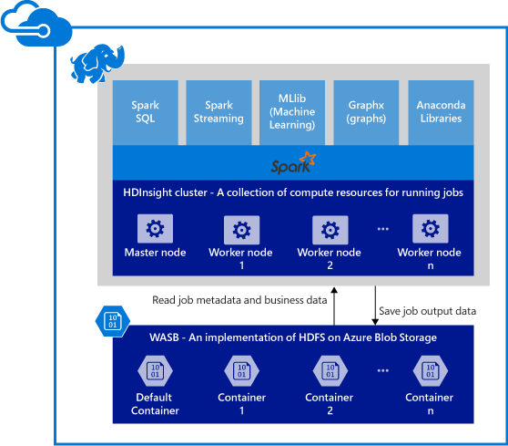

<properties 
	pageTitle="An overview of Apache Spark in HDInsight | Microsoft Azure" 
	description="An introduction to Apache Spark in HDInsight and scenarios in which to use Spark on HDInsight in your applications." 
	services="hdinsight" 
	documentationCenter="" 
	authors="nitinme" 
	manager="paulettm" 
	editor="cgronlun"
	tags="azure-portal"/>

<tags 
	ms.service="hdinsight" 
	ms.workload="big-data" 
	ms.tgt_pltfrm="na" 
	ms.devlang="na" 
	ms.topic="get-started-article" 
	ms.date="06/06/2016" 
	ms.author="nitinme"/>

# Overview: Apache Spark on HDInsight Linux
 
<a href="http://spark.apache.org/" target="_blank">Apache Spark</a> is an open-source parallel processing framework that supports in-memory processing to boost the performance of big-data analytic applications. Spark processing engine is built for speed, ease of use, and sophisticated analytics. Spark's in-memory computation capabilities make it a good choice for iterative algorithms in machine learning and graph computations. Spark is also compatible with Azure Blob storage (WASB) so your existing data stored in Azure can easily be processed via Spark.

When you create a Spark cluster in HDInsight, you create Azure compute resources with Spark installed and configured. It only takes about ten minutes to create a Spark cluster in HDInsight. The data to be processed is stored in Azure Blob storage. See [Use Azure Blob Storage with HDInsight][hdinsight-storage].

**Want to get started with Apache Spark on Azure HDInsight?** See [QuickStart: create a Spark cluster on HDInsight Linux and run sample applications using Jupyter](hdinsight-apache-spark-jupyter-spark-sql.md).

>[AZURE.NOTE] For a list of known issues and limitations with the current release, see [Known issues of Apache Spark in Azure HDInsight (Linux)](hdinsight-apache-spark-jupyter-spark-sql.md).

## Why use Spark on Azure HDInsight? 

Azure HDInsight offers a fully managed Spark service. Benefits of using Spark on HDInsight are:

| Feature                             | Description       |
|-------------------------------------|-------------------|
| Ease of creating clusters            | You can create a new Spark cluster on HDInsight in minutes using the Azure Management Portal, Azure PowerShell, or the HDInsight .NET SDK. See [Get started with Spark cluster in HDInsight](hdinsight-apache-spark-jupyter-spark-sql.md) |
| Ease of use                     | Spark in HDInsight clusters includes Jupyter notebooks pre-configured. You can use these for interactive data processing and visualization. The URLs for the is https://CLUSTERNAME.azurehdinsight.net/jupyter. Replace __CLUSTERNAME__ with the name of your Spark HDInsight cluster.|
| REST APIs                       | Spark in HDInsight includes [Livy](https://github.com/cloudera/hue/tree/master/apps/spark/java#welcome-to-livy-the-rest-spark-server), a REST-API based Spark job server to remotely submit and monitor running jobs. |
| Support for Azure Data Lake Store | Spark on HDInsight can be configured to use Azure Data Lake Store as an additional storage. For more information on Data Lake Store, see [Overview of Azure Data Lake Store](../data-lake-store/data-lake-store-overview.md).
| Integration with Azure services | Spark on HDInsight comes with a connector to Azure Event Hubs. Customers can build streaming applications using the Event Hubs, in addition to [Kafka](http://kafka.apache.org/), which is already available as part of Spark. |
| Support for R Server  | You can set up a R Server on HDInsight Spark cluster to run distributed R computations with the speeds promised with a Spark cluster. For more information, see [Get started using R Server on HDInsight](hdinsight-hadoop-r-server-get-started.md).   |
| Integration with IntelliJ IDEA  | You can use the HDInsight Plugin for IntelliJ to create and submit applications to an HDInsight Spark cluster. For more information see [Use HDInsight Tools Plugin for IntelliJ IDEA to create Spark applications for HDInsight Spark Linux cluster](hdinsight-apache-spark-intellij-tool-plugin.md). |
| Concurrent Queries              | Spark in HDInsight supports concurrent queries. This enables multiple queries from one user or multiple queries from various users and applications to share the same cluster resources. |
| Caching on SSDs                 | You can choose to cache data either in memory or in SSDs attached to the cluster nodes. Caching in memory provides the best query performance but could be expensive; caching in SSDs provides a great option for improving query performance without the need to create a cluster of a size that is required to fit the entire dataset in memory.|
| Integration with BI Tools       | Spark for HDInsight provides connectors for  BI tools such as [Power BI](http://www.powerbi.com/) and [Tableau](http://www.tableau.com/products/desktop) for data analytics.|
| Pre-loaded Anaconda libraries        | Spark clusters on HDInsight come with Anaconda libraries pre-installed. [Anaconda](http://docs.continuum.io/anaconda/) provides close to 200 libraries for machine learning, data analysis, visualization, etc.|
| Scalability                     | Although you can specify the number of nodes in your cluster during creation, you may want to grow or shrink the cluster to match workload. All HDInsight clusters allow you to change the number of nodes in the cluster. Also, Spark clusters can be dropped with no loss of data since all the data is stored in Azure Blob Storage. |
| 24/7 Support					  | Spark on HDInsight comes with  enterprise-level 24/7 support and an SLA of 99.9% up-time.|

## What are the use cases for Spark on HDInsight?

Apache Spark in HDInsight enables the following key scenarios.

### Interactive data analysis and BI

[Look at a tutorial](hdinsight-apache-spark-use-bi-tools.md)

Apache Spark in HDInsight stores data in Azure Blobs. Business experts and key decision makers can analyze and build reports over that data and use Microsoft Power BI to build interactive reports from the analyzed data. Analysts can start from unstructured/semi structured data in Azure storage, define a schema for the data using notebooks and then build data models using Microsoft Power BI. Spark in HDInsight also supports a number of third party BI tools such as Tableau, Qlikview, and SAP Lumira making it an ideal platform for data analysts, business experts, and key decision makers.

### Iterative Machine Learning

[Look at a tutorial: Predict building temperatures uisng HVAC data](hdinsight-apache-spark-ipython-notebook-machine-learning.md)

[Look at a tutorial: Predict food inspection results](hdinsight-apache-spark-machine-learning-mllib-ipython.md)

Apache Spark comes with [MLlib](http://spark.apache.org/mllib/), a machine learning library built on top of Spark. In addition to this, Spark on HDInsight also includes Anaconda, a Python distribution with a variety of packages for machine learning. Couple this with a built-in support for Jupyter notebooks, and you have a top-of-the-line environment for creating machine learning applications.  

### Streaming and real-time data analysis

[Look at a tutorial](hdinsight-apache-spark-eventhub-streaming.md)

Real-time data analysis is used for scenarios ranging from reducing time to data insight by processing data as it lands, to building a true streaming solution. Spark in HDInsight offers a rich support for building real-time analytics solutions. While Spark already has connectors to ingest data from many sources like Kafka, Flume, Twitter, ZeroMQ, or TCP sockets, Spark in HDInsight adds first-class support for ingesting data from Azure Event Hubs. Event Hubs are the most widely used queuing service on Azure. Having an out-of-the-box support for Event Hubs makes Spark in HDInsight an ideal platform for building real time analytics pipeline.

##What components are included as part of a Spark cluster?

Spark in HDInsight includes the following components that are available on the clusters by default.

- [Spark Core](https://spark.apache.org/docs/1.5.1/). Includes Spark Core, Spark SQL, Spark streaming APIs, GraphX, and MLlib.
- [Anaconda](http://docs.continuum.io/anaconda/)
- [Livy](https://github.com/cloudera/hue/tree/master/apps/spark/java#welcome-to-livy-the-rest-spark-server)
- [Jupyter Notebook](https://jupyter.org)

Spark in HDInsight also provides an [ODBC driver](http://go.microsoft.com/fwlink/?LinkId=616229) for connectivity to Spark clusters in HDInsight from BI tools such as Microsoft Power BI and Tableau.

## Where do I start?

Start with creating a Spark cluster on HDInsight Linux. See [QuickStart: create a Spark cluster on HDInsight Linux and run sample applications using Jupyter](hdinsight-apache-spark-jupyter-spark-sql.md). 

## Next Steps

### Scenarios

* [Spark with BI: Perform interactive data analysis using Spark in HDInsight with BI tools](hdinsight-apache-spark-use-bi-tools.md)

* [Spark with Machine Learning: Use Spark in HDInsight for analyzing building temperature using HVAC data](hdinsight-apache-spark-ipython-notebook-machine-learning.md)

* [Spark with Machine Learning: Use Spark in HDInsight to predict food inspection results](hdinsight-apache-spark-machine-learning-mllib-ipython.md)

* [Spark Streaming: Use Spark in HDInsight for building real-time streaming applications](hdinsight-apache-spark-eventhub-streaming.md)

* [Website log analysis using Spark in HDInsight](hdinsight-apache-spark-custom-library-website-log-analysis.md)

### Create and run applications

* [Create a standalone application using Scala](hdinsight-apache-spark-create-standalone-application.md)

* [Run jobs remotely on a Spark cluster using Livy](hdinsight-apache-spark-livy-rest-interface.md)

### Tools and extensions

* [Use HDInsight Tools Plugin for IntelliJ IDEA to create and submit Spark Scala applicatons](hdinsight-apache-spark-intellij-tool-plugin.md)

* [Use HDInsight Tools Plugin for IntelliJ IDEA to debug Spark applications remotely](hdinsight-apache-spark-intellij-tool-plugin-debug-jobs-remotely.md)

* [Use Zeppelin notebooks with a Spark cluster on HDInsight](hdinsight-apache-spark-use-zeppelin-notebook.md)

* [Kernels available for Jupyter notebook in Spark cluster for HDInsight](hdinsight-apache-spark-jupyter-notebook-kernels.md)

* [Use external packages with Jupyter notebooks](hdinsight-apache-spark-jupyter-notebook-use-external-packages.md)

* [Install Jupyter on your computer and connect to an HDInsight Spark cluster](hdinsight-apache-spark-jupyter-notebook-install-locally.md)

### Manage resources

* [Manage resources for the Apache Spark cluster in Azure HDInsight](hdinsight-apache-spark-resource-manager.md)

* [Track and debug jobs running on an Apache Spark cluster in HDInsight](hdinsight-apache-spark-job-debugging.md)

[hdinsight-storage]: hdinsight-hadoop-use-blob-storage.md
