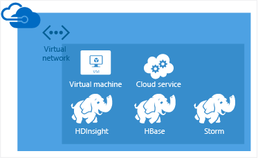
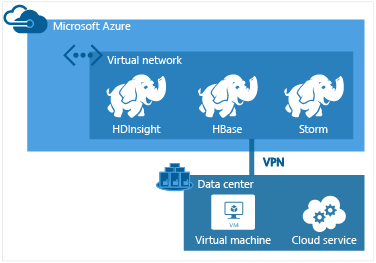
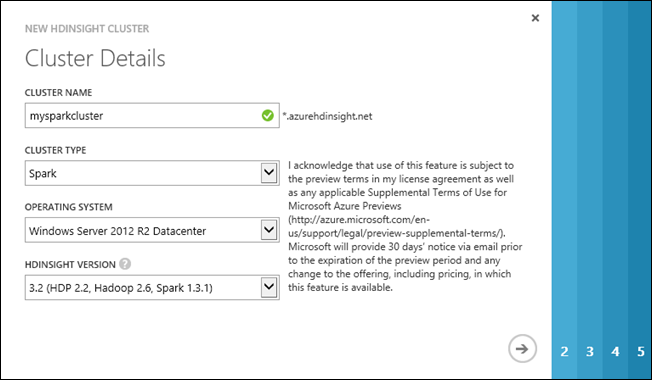
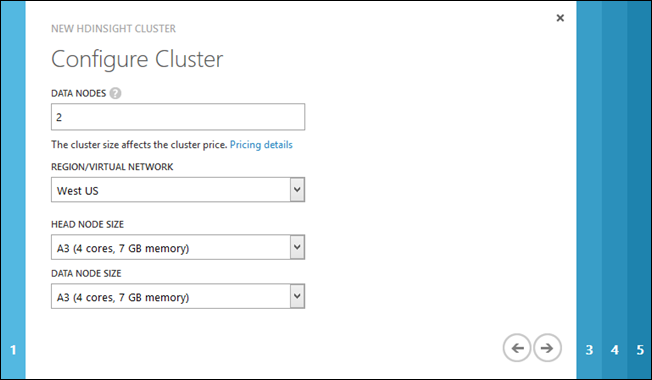
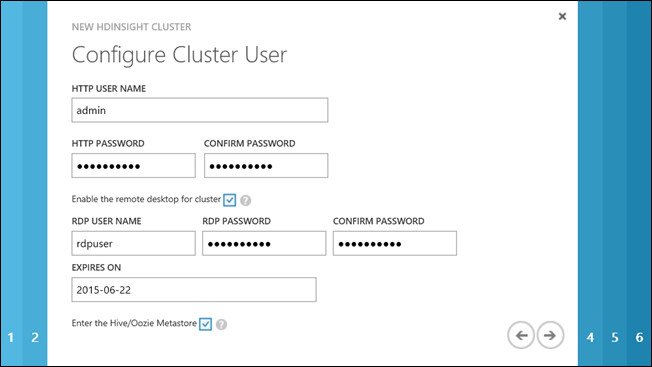
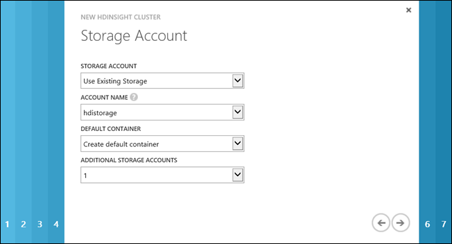
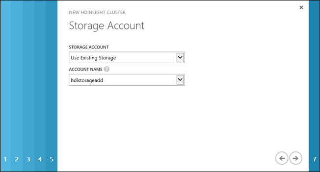
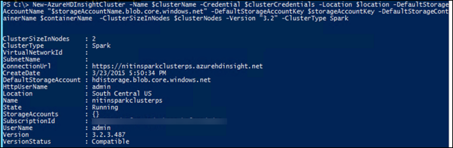

<properties 
   pageTitle="Provision Apache Spark clusters in HDInsight | Azure" 
   description="Learn how to provision Spark clusters for Azure HDInsight by using the Azure portal, Azure PowerShell, a command line, or the HDInsight .NET SDK" 
   services="hdinsight" 
   documentationCenter="" 
   authors="nitinme" 
   manager="paulettm" 
   editor="cgronlun"/>

<tags
   ms.service="hdinsight"
   ms.devlang="na"
   ms.topic="article"
   ms.tgt_pltfrm="na"
   ms.workload="big-data" 
   ms.date="07/10/2015"
   ms.author="nitinme"/>

# Provision Apache Spark clusters in HDInsight using custom options

For most scenarios, you can provision a Spark cluster using the quick create method as described in [Get Started with Apache Spark on HDInsight](hdinsight-apache-spark-zeppelin-notebook-jupyter-spark-sql.md). In certain scenarios, you might want to provision a customized cluster. For example, you might want to attach an external metadata store to keep your Hive metadata persistent beyond the lifetime of a cluster, or you might want to use additional storage with the cluster. 

For such and other scenarios, this article provides instructions on how to use the Azure portal, Azure PowerShell, or the HDInsight .NET SDK to provision a customized Spark cluster on HDInsight.  

**Prerequisites:**

Before you begin the instructions in this article, you must have an Azure subscription. See [Get Azure free trial](http://azure.microsoft.com/documentation/videos/get-azure-free-trial-for-testing-hadoop-in-hdinsight/).

##What are the different configuration options?

###Additional storage

During configuration, you must specify an Azure Blob storage account and a default container. This is used as the default storage location by the cluster. Optionally, you can specify an additional Azure Storage account that will also be associated with the cluster.   

>[AZURE.NOTE] Don't share one Blob storage container for multiple clusters. This is not supported. 

For more information on using secondary Blob stores, see [Using Azure Blob Storage with HDInsight](hdinsight-use-blob-storage.md).

###Metastore

Spark enables you to define schema and Hive tables over raw data. You can save these schemas and table metadata to external metastores. Using the metastore helps you to retain your Hive metadata, so that you don't need to re-create Hive tables when you provision a new cluster. By default, Hive uses an embedded database to store this information. The embedded database can't preserve the metadata when the cluster is deleted.

### Cluster customization

You can install additional components or customize cluster configuration by using scripts during provisioning. Such scripts are invoked via **Script Action**, which is a configuration option that can be used from the Azure portal, HDInsight Windows PowerShell cmdlets, or the HDInsight .NET SDK. For more information, see [Customize HDInsight cluster using Script Action][hdinsight-customize-cluster].

###Virtual networking

[Azure Virtual Network](http://azure.microsoft.com/documentation/services/virtual-network/) allows you to create a secure, persistent network containing the resources you need for your solution. A virtual network allows you to:

* Connect cloud resources together in a private network (cloud-only).

	

* Connect your cloud resources to your local data-center network (site-to-site or point-to-site) by using a virtual private network (VPN).

	Site-to-site configuration allows you to connect multiple resources from your data center to the Azure virtual network by using a hardware VPN or the Routing and Remote Access Service.

	

	Point-to-site configuration allows you to connect a specific resource to the Azure virtual network by using a software VPN.

	

For more information on Virtual Network features, benefits, and capabilities, see the [Azure Virtual Network overview](http://msdn.microsoft.com/library/azure/jj156007.aspx).

> [AZURE.NOTE] You must create the Azure virtual network before provisioning a cluster. For more information, see [Virtual Network configuration tasks](http://msdn.microsoft.com/library/azure/jj156206.aspx).
>
> Azure HDInsight supports only location-based virtual networks and does not currently work with affinity group-based virtual networks.
>
> It is highly recommended to designate a single subnet for one cluster.

## Using the Azure portal

Spark clusters on HDInsight use an Azure Blob storage container as the default file system. An Azure Storage account located on the same data center is required before you can create an HDInsight cluster. For more information, see [Use Azure Blob Storage with HDInsight](hdinsight-hadoop-use-blob-storage.md). For details on creating an Azure Storage account, see [How to Create a Storage Account][azure-create-storageaccount].

**To create an HDInsight cluster by using the Custom Create option**

1. Sign in to the [Azure portal][azure-management-portal].
2. Click **+ NEW** on the bottom of the page, click **DATA SERVICES**, click **HDINSIGHT**, and then click **CUSTOM CREATE**.
3. On the **Cluster Details** page, type or choose the following values:

	

    <table border='1'>
		<tr><th>Property</th><th>Value</th></tr>
		<tr><td>Cluster Name</td>
			<td>
Name the cluster. 

				<ul>
				<li>The Domain Name System (DNS) name must start and end with an alphanumeric character and may contain dashes.</li>
				<li>The field must be a string from 3 to 63 characters.</li>
				</ul></td></tr>
		<tr><td>Cluster Type</td>
			<td>For cluster type, select <strong>Spark</strong>.</td></tr>
		<tr><td>Operating System</td>
			<td>Select <b>Windows Server 2012 R2 Data Center</b> to provision a Spark cluster running on Windows. </td></tr>
		<tr><td>HDInsight Version</td>
			<td>Choose the version. For Spark, the only available version option is <b>HDInsight 3.2</b>, which uses Spark 1.3.1.</td></tr>
		</table>

	Enter or select the values as shown in the table and then click the right arrow.

4. On the **Configure Cluster** page, enter or select the following values:

	

	<table border="1">
	<tr><th>Name</th><th>Value</th></tr>
	<tr><td>Data Nodes</td><td>Number of data nodes you want to deploy. For testing purposes, create a single-node cluster.  The cluster size limit varies for Azure subscriptions. Contact Azure billing support to increase the limit.</td></tr>
	<tr><td>Region/Virtual Network</td><td>
Choose the same region as the Storage account you created in the last procedure. HDInsight requires the Storage account to be located in the same region. Later in the configuration, you can choose only a Storage account that is in the same region that you specified here.
. If you have created an Azure virtual network, you can select the network that the HDInsight cluster will be configured to use.

For more information on creating an Azure virtual network, see <a href="http://msdn.microsoft.com/library/azure/jj156206.aspx">Virtual Network configuration tasks</a>.
</td></tr>
	<tr><td>Head Node Size</td><td>
Select a virtual machine (VM) size for the head node.
</td></tr>
	<tr><td>Data Node Size</td><td>
Select a VM size for the data nodes.
</td></tr>
	</table>

	>[AZURE.NOTE] Based on the choice of VMs, your cost might vary. HDInsight uses all standard-tier VMs for cluster nodes. For information on how VM sizes affect your prices, see <a href="http://azure.microsoft.com/pricing/details/hdinsight/" target="_blank">HDInsight Pricing</a>.	

5. On the **Configure Cluster User** page, provide the following values:

    

    <table border='1'>
		<tr><th>Property</th><th>Value</th></tr>
		<tr><td>HTTP User Name</td>
			<td>Specify the HDInsight cluster user name.</td></tr>
		<tr><td>HTTP Password/Confirm Password</td>
			<td>Specify the HDInsight cluster user password.</td></tr>
		<tr><td>Enable remote desktop for cluster</td>
			<td>Select this check box to specify a username, password, and expiry date for a remote desktop user that can remote into the cluster nodes, once it is provisioned. You can also enable remote desktop later, after the cluster is provisioned. For instructions, see <a href="hdinsight-administer-use-management-portal/#rdp" target="_blank">Connect to HDInsight clusters using RDP</a>.</td></tr>
		<tr><td>Enter the Hive/Oozie Metastore</td>
			<td>Select this check box to specify a SQL database on the same data center as the cluster, to be used as the Hive/Oozie metastore. If you select this checkbox, you must spcecify details about the Azure SQL database in the subsequent pages of the wizard. This is useful if you want to retain the metadata about Hive/Oozie jobs even after a cluster has been deleted. For instructions on how to create a metastore, see <a href="https://azure.microsoft.com/en-us/documentation/articles/sql-database-get-started/" target="_blank">Create your first Azure SQL Database</a>.</td></tr>
		</td></tr>
	</table>

	>[AZURE.NOTE] The Azure SQL database used for the metastore must allow connectivity to other Azure services, including Azure HDInsight. On the Azure SQL database dashboard, on the right side, click the server name. This is the server on which the SQL database instance is running. Once you are on the server view, click **Configure**, and then for **Windows** **Azure Services**, click **Yes**, and then click **Save**.

    Click the right arrow.

6. On the **Configure Hive/Oozie Metastore** page, provide the following values:

    

	Specify an Azure SQL database that will be used as the Hive/Oozie metastore. You can specify the same database for both Hive and Oozie metastores. This SQL database must be in the same data center as the HDInsight cluster. The list box lists only the SQL databases in the same data center that you specified on the <strong>Cluster Details</strong> page. Also specify the username and password to connect to the Azure SQL database you selected.

    >[AZURE.NOTE] The Azure SQL database used for the metastore must allow connectivity to other Azure services, including Azure HDInsight. On the Azure SQL database dashboard, on the right side, click the server name. This is the server on which the SQL database instance is running. Once you are on the server view, click **Configure**, and then for **Azure Services**, click **Yes**, and then click **Save**.

    Click the right arrow.

7. On the **Storage Account** page, provide the following values:

    

	<table border='1'>
		<tr><th>Property</th><th>Value</th></tr>
		<tr><td>Storage Account</td>
			<td>Specify the Azure Storage account that will be used as the default file system for the HDInsight cluster. You can choose one of the three options:
			<ul>
				<li><strong>Use Existing Storage</strong></li>
				<li><strong>Create New Storage</strong></li>
				<li><strong>Use Storage from Another Subscription</strong></li>
			</ul>
			</td></tr>
		<tr><td>Account Name</td>
			<td><ul>
				<li>If you chose to use existing storage, for <strong>Account Name</strong>, select an existing Storage account. The drop-down lists only the Storage accounts located in the same data center where you chose to provision the cluster.</li>
				<li>If you chose the <strong>Create New Storage</strong> or <strong>Use Storage from Another Subscription</strong> option, you must provide the Storage account name.</li>
			</ul></td></tr>
		<tr><td>Account Key</td>
			<td>If you chose the <strong>Use Storage from Another Subscription</strong> option, specify the account key for that Storage account.</td></tr>
		<tr><td>Default Container</td>
			<td>
Specify the default container on the Storage account that is used as the default file system for the HDInsight cluster. If you chose <strong>Use Existing Storage</strong> for the <strong>Storage Account</strong> field, and there are no existing containers in that account, the container is created by default with the same name as the cluster name. If a container with the name of the cluster already exists, a sequence number will be appended to the container name. For example, mycontainer1, mycontainer2, and so on. However, if the existing Storage account has a container with a name different from the cluster name you specified, you can use that container as well.

            
If you chose to create new storage or use storage from another Azure subscription, you must specify the default container name.

        </td></tr>
		<tr><td>Additional Storage Accounts</td>
			<td>HDInsight supports multiple Storage accounts. There is no limit on the additional Storage accounts that can be used by a cluster. However, if you create a cluster by using the Azure portal, you have a limit of seven due to the UI constraints. Each additional Storage account you specify adds an extra **Storage Account** page to the wizard where you can specify the account information. For example, in the screenshot above, one additional Storage account is selected, and hence page 5 is added to the dialog.</td></tr>
	</table>

	Click the right arrow.

8. If you chose to configure additional storage for the cluster, on the **Storage Account** page, enter the account information for the additional Storage account:

	

    Here again, you have the option to choose from existing storage, create new storage, or use storage from another Azure subscription. The procedure to provide the values is similar to the previous step.

    > [AZURE.NOTE] Once an Azure Storage account is chosen for your HDInsight cluster, you can neither delete the account nor change the account to a different account.

8. On the **Script Actions** page, click **add script action** and provide details about the custom script that you want to run to customize a cluster, as the cluster is being created. For more information, see [Customize HDInsight clusters using Script Action][hdinsight-customize-cluster].

	If you need to use a script action, you must provide the following inputs. 
	
	<table border='1'>
		<tr><th>Property</th><th>Value</th></tr>
		<tr><td>Name</td>
			<td>Specify a name for the script action.</td></tr>
		<tr><td>Script URI</td>
			<td>Specify the Uniform Resource Identifier (URI) to the script that is invoked to customize the cluster.</td></tr>
		<tr><td>Node Type</td>
			<td>Specify the nodes on which the customization script is run. You can choose <b>All Nodes</b>, <b>Head nodes only</b>, or <b>Worker nodes only</b>.
		<tr><td>Parameters</td>
			<td>Specify the parameters, if required by the script.</td></tr>
	</table>

	You can add more than one script action to install multiple components on the cluster. After you have added the scripts, click the check mark to start provisioning the cluster. 

## Using Azure PowerShell

This section provides instructions on how to provision an Apache Spark cluster in Azure HDInsight by using Azure PowerShell. For information on configuring a workstation to run HDInsight Windows PowerShell cmdlets, see [Install and configure Azure PowerShell][powershell-install-configure]. For more information on using Azure PowerShell with HDInsight, see [Administer HDInsight using PowerShell][hdinsight-admin-powershell]. For the list of the HDInsight Windows PowerShell cmdlets, see [HDInsight cmdlet reference][hdinsight-powershell-reference].

> [AZURE.NOTE] While the scripts in this section can be used to configure an HDInsight cluster on an Azure virtual network, they will not create an Azure virtual network. For information on creating an Azure virtual network, see [Virtual Network configuration tasks](http://msdn.microsoft.com/library/azure/jj156206.aspx).

The following procedures are needed to provision an HDInsight cluster by using Azure PowerShell:

- Create an Azure Storage account
- Create an Azure Blob container
- Create an HDInsight cluster

You can use either the Windows PowerShell console or the Windows PowerShell Integrated Scripting Environment (ISE) to run the scripts.
 
HDInsight uses an Azure Blob storage container as the default file system. An Azure Storage account and storage container are required before you can create an HDInsight cluster. The Storage account must be located in the same data center as the HDInsight cluster.

**To connect to your Azure account**

		Add-AzureAccount 

You will be prompted to enter your Azure account credentials.

**To create an Azure Storage account**

		$storageAccountName = "<StorageAcccountName>"	# Provide a Storage account name
		$location = "<MicrosoftDataCenter>"				# For example, "West US"

		# Create an Azure Storage account
		New-AzureStorageAccount -StorageAccountName $storageAccountName -Location $location

If you already have a Storage account but do not know the account name and account key, you can use the following Windows PowerShell commands to retrieve the information:

		# List Storage accounts for the current subscription
		Get-AzureStorageAccount

		# List the keys for a Storage account
		Get-AzureStorageKey "<StorageAccountName>"

**To create Azure Blob storage container**

		$storageAccountName = "<StorageAccountName>"	# Provide the Storage account name
		$containerName="<ContainerName>"				# Provide a container name

		# Create a storage context object
		$storageAccountKey = Get-AzureStorageKey $storageAccountName | %{ $_.Primary }
		$destContext = New-AzureStorageContext -StorageAccountName $storageAccountName
		                                       -StorageAccountKey $storageAccountKey  

		# Create a Blob storage container
		New-AzureStorageContainer -Name $containerName -Context $destContext

Once you have the Storage account and the Blob container prepared, you are ready to create a cluster.

**To provision an HDInsight cluster**

- Run the following commands from an Azure PowerShell console window:

		$subscriptionName = "<AzureSubscriptionName>"	  # The Azure subscription used for the HDInsight cluster to be created

		$storageAccountName = "<AzureStorageAccountName>" # HDInsight cluster requires an existing Azure Storage account to be used as the default file system

		$clusterName = "<HDInsightClusterName>"			  # The name for the HDInsight cluster to be created
		$clusterNodes = <ClusterSizeInNodes>              # The number of nodes in the HDInsight cluster
        $credentials = Get-Credential		              # User name and password for the Hadoop account. You will use this account to connect to the cluster and run jobs.
           
        # Get the storage primary key based on the account name
		Select-AzureSubscription $subscriptionName
		$storageAccountKey = Get-AzureStorageKey $storageAccountName | %{ $_.Primary }
		$containerName = $clusterName				# Azure Blob container that is used as the default file system for the HDInsight cluster

        # The location of the HDInsight cluster. It must be in the same data center as the Storage account.
        $location = Get-AzureStorageAccount -StorageAccountName $storageAccountName | %{$_.Location} 

		# Create a new HDInsight cluster
		New-AzureHDInsightCluster -Name $clusterName -Credential $credentials -Location $location -DefaultStorageAccountName "$storageAccountName.blob.core.windows.net" -DefaultStorageAccountKey $storageAccountKey -DefaultStorageContainerName $containerName -ClusterSizeInNodes $clusterNodes -Version "3.2" -ClusterType Spark

	>[AZURE.NOTE] The credentials you specify are used to create the Hadoop user account for the cluster. You will use this account to connect to the cluster and run jobs. If you use the Quick Create option from the Azure portal to provision a cluster, the default Hadoop user name is "admin". Don't confuse this account with the Remote Desktop Protocol (RDP) user account. The RDP user account has to be different from the Hadoop user account. For more information, see [Manage Hadoop clusters in HDInsight using the Azure Management Portal][hdinsight-admin-portal].

	It can take several minutes before the cluster provisioning finishes.

	

**To provision an HDInsight cluster by using custom configuration options**

While provisioning a cluster, you can use the other configuration options such as connecting to more than one Azure Blob storage container or using an Azure SQL database for Hive and Oozie metastores. This allows you to separate the lifetime of your data and metadata from the lifetime of the cluster.

> [AZURE.NOTE] The Windows PowerShell cmdlets are the only recommended way to change configuration variables in an HDInsight cluster. Changes made to Hadoop configuration files while connected to the cluster via Remote Desktop may be overwritten in the event of cluster patching. Configuration values set via Azure PowerShell will be preserved if the cluster is patched.

- Run the following commands from a Windows PowerShell window:

		$subscriptionName = "<Azure subscription>"
		$clusterName = "<cluster name>"
		$clusterNodes = <cluster size in nodes>
		                
		# Get credentials for Hadoop user and Hive/Oozie metastores
		$clusterCredentials = Get-Credential
		$oozieCreds = Get-Credential -Message "Oozie metastore"
		$hiveCreds = Get-Credential -Message "Hive metastore"
		
		# Get default storage account, storage container, and add-on storage account
		$storageAccountName_Default = "<Default storage account name>"
		$containerName_Default = $clusterName
		$storageAccountName_Add1 = "<Add-on storage account name>"
		
		# Get information about Hive and Oozie metastores
		$hiveSQLDatabaseServerName = "<SQLDatabaseServerNameForHiveMetastore>"
		$hiveSQLDatabaseName = "<SQLDatabaseNameForHiveMetastore>"
		$oozieSQLDatabaseServerName = "<SQLDatabaseServerNameForOozieMetastore>""
		$oozieSQLDatabaseName = "<SQLDatabaseNameForOozieMetastore>"

		# Get the virtual network ID and subnet name
		$vnetID = "<AzureVirtualNetworkID>"
		$subNetName = "<AzureVirtualNetworkSubNetName>"

		# Retrieve storage account keys and storage account location
		Select-AzureSubscription $subscriptionName
		$storageAccountKey_Default = Get-AzureStorageKey $storageAccountName_Default | %{ $_.Primary }
		$storageAccountKey_Add1 = Get-AzureStorageKey $storageAccountName_Add1 | %{ $_.Primary }
		$location = Get-AzureStorageAccount -StorageAccountName $storageAccountName_Default | %{$_.Location}
		
		# Specify custom configuration and cluster type
		$config = New-AzureHDInsightClusterConfig -ClusterSizeInNodes $clusterNodes -ClusterType Spark -VirtualNetworkId $vnetID -SubnetName $subNetName | Set-AzureHDInsightDefaultStorage -StorageAccountName "$storageAccountName_Default.blob.core.windows.net" -StorageAccountKey $storageAccountKey_Default -StorageContainerName $containerName_Default | Add-AzureHDInsightStorage -StorageAccountName "$storageAccountName_Add1.blob.core.windows.net" -StorageAccountKey $storageAccountKey_Add1 | Add-AzureHDInsightMetastore -SqlAzureServerName "$hiveSQLDatabaseServerName.database.windows.net" -DatabaseName $hiveSQLDatabaseName -Credential $hiveCreds -MetastoreType HiveMetastore | Add-AzureHDInsightMetastore -SqlAzureServerName "$oozieSQLDatabaseServerName.database.windows.net" -DatabaseName $oozieSQLDatabaseName -Credential $oozieCreds -MetastoreType OozieMetastore
		
		# Provision the cluster with custom configuration                
		New-AzureHDInsightCluster -Name $clusterName -Config $config -Credential $clusterCredentials -Location $location -Version "3.2"

	>[AZURE.NOTE] The Azure SQL database used for the metastore must allow connectivity to other Azure services, including Azure HDInsight. On the Azure SQL database dashboard, on the right side, click the server name. This is the server on which the SQL database instance is running. Once you are on the server view, click **Configure**, and then for **Windows** **Azure Services**, click **Yes**, and then click **Save**.

	It can take several minutes before the cluster provisioning finishes.	

**To list HDInsight clusters**

- Run the following command from an Azure PowerShell console window to list the HDInsight cluster and verify that the cluster was successfully provisioned:

		Get-AzureHDInsightCluster -Name <ClusterName>

## Using the HDInsight .NET SDK
The HDInsight .NET SDK provides .NET client libraries that make it easier to work with HDInsight from a .NET Framework application.

The following procedures must be performed to provision an HDInsight cluster by using the SDK:

- Install the HDInsight .NET SDK
- Create a self-signed certificate
- Create a console application
- Run the application

**To install the HDInsight .NET SDK**

You can install the latest published build of the SDK from [NuGet](http://nuget.codeplex.com/wikipage?title=Getting%20Started). The instructions will be shown in the next procedure.

**To create a self-signed certificate**

Create a self-signed certificate, install it on your workstation, and upload it to your Azure subscription. For instructions, see [Create a self-signed certificate](http://go.microsoft.com/fwlink/?LinkId=511138).

**To create a Visual Studio console application**

1. Open Visual Studio 2013.

2. From the **File** menu, click **New**, and then click **Project**.

3. From **New Project**, type or select the following values:

	<table style="border-color: #c6c6c6; border-width: 2px; border-style: solid; border-collapse: collapse;">
	<tr>
	<th style="border-color: #c6c6c6; border-width: 2px; border-style: solid; border-collapse: collapse; width:90px; padding-left:5px; padding-right:5px;">Property</th>
	<th style="border-color: #c6c6c6; border-width: 2px; border-style: solid; border-collapse: collapse; width:90px; padding-left:5px; padding-right:5px;">Value</th></tr>
	<tr>
	<td style="border-color: #c6c6c6; border-width: 2px; border-style: solid; border-collapse: collapse; padding-left:5px;">Category</td>
	<td style="border-color: #c6c6c6; border-width: 2px; border-style: solid; border-collapse: collapse; padding-left:5px; padding-right:5px;">Templates/Visual C#/Windows</td></tr>
	<tr>
	<td style="border-color: #c6c6c6; border-width: 2px; border-style: solid; border-collapse: collapse; padding-left:5px;">Template</td>
	<td style="border-color: #c6c6c6; border-width: 2px; border-style: solid; border-collapse: collapse; padding-left:5px;">Console Application</td></tr>
	<tr>
	<td style="border-color: #c6c6c6; border-width: 2px; border-style: solid; border-collapse: collapse; padding-left:5px;">Name</td>
	<td style="border-color: #c6c6c6; border-width: 2px; border-style: solid; border-collapse: collapse; padding-left:5px;">CreateHDICluster</td></tr>
	</table>

4. Click **OK** to create the project.

5. From the **Tools** menu, click **Nuget Package Manager**, and then click **Package Manager Console**.

6. Run the following command in the console to install the packages:

		Install-Package Microsoft.WindowsAzure.Management.HDInsight

	This command adds .NET libraries and references to them to the current Visual Studio project.

7. From Solution Explorer, double-click **Program.cs** to open it.

8. Add the following using statements to the top of the file:

		using System.Security.Cryptography.X509Certificates;
		using Microsoft.WindowsAzure.Management.HDInsight;
		using Microsoft.WindowsAzure.Management.HDInsight.ClusterProvisioning;
		using Microsoft.WindowsAzure.Management.HDInsight.ClusterProvisioning.Data;

9. In the main() function, copy and paste the following code:

        string thumbprint = "<CertificateFriendlyName>";  
        string subscriptionid = "<AzureSubscriptionID>";
        string clustername = "<HDInsightClusterName>";
        string location = "<MicrosoftDataCenter>";
        string storageaccountname = "<AzureStorageAccountName>.blob.core.windows.net";
        string storageaccountkey = "<AzureStorageAccountKey>";
        string containername = "<HDInsightDefaultContainerName>";
        string username = "<HDInsightUsername>";
        string password = "<HDInsightUserPassword>";
        int clustersize = <NumberOfNodesInTheCluster>;

        // Get the certificate object from certificate store by using the friendly name to identify it
        X509Store store = new X509Store();
        store.Open(OpenFlags.ReadOnly);
        X509Certificate2 cert = store.Certificates.Cast<X509Certificate2>().First(item => item.Thumbprint == thumbprint);

        // Create the Storage account if it doesn't exist

        // Create the container if it doesn't exist.

		// Create an HDInsightClient object
        HDInsightCertificateCredential creds = new HDInsightCertificateCredential(new Guid(subscriptionid), cert);
        var client = HDInsightClient.Connect(creds);

		// Supply the cluster information
        ClusterCreateParametersV2 clusterInfo = new ClusterCreateParametersV2()
		{
		    Name = clustername,
		    Location = location,
		    DefaultStorageAccountName = storageaccountname,
		    DefaultStorageAccountKey = storageaccountkey,
		    DefaultStorageContainer = containername,
		    UserName = username,
		    Password = password,
		    ClusterSizeInNodes = clustersize,
		    Version = "3.2",
		    OSType = OSType.Windows,
			ClusterType = ClusterType.Spark		    
		};

		// Create the cluster
        Console.WriteLine("Creating the HDInsight cluster ...");

        ClusterDetails cluster = client.CreateCluster(clusterInfo);

        Console.WriteLine("Created cluster: {0}.", cluster.ConnectionUrl);
        Console.WriteLine("Press ENTER to continue ...");
        Console.ReadKey();

10. Replace the variables at the beginning of the main() function.

**To run the application**

While the application is open in Visual Studio, press **F5** to run the application. A console window should open and display the status of the application. It can take several minutes to create an HDInsight cluster.

## Next steps

* See [Perform interactive data analysis using Spark in HDInsight with BI tools](hdinsight-apache-spark-use-bi-tools.md) to learn how to use Apache Spark in HDInsight with BI tools like Power BI and Tableau. 
* See [Use Spark in HDInsight for building machine learning applications](hdinsight-apache-spark-ipython-notebook-machine-learning.md) to learn how to build machine learning applications using Apache Spark on HDInsight.
* See [Use Spark in HDInsight for building real-time streaming applications](hdinsight-apache-spark-csharp-apache-zeppelin-eventhub-streaming.md) to learn how to build streaming applications using Apache Spark on HDInsight.
* See [Manage resources for the Apache Spark cluster in Azure HDInsight](hdinsight-apache-spark-resource-manager.md) to learn how to use the Resource Manager to manage resources allocated to the Spark cluster.

[hdinsight-sdk-documentation]: http://msdn.microsoft.com/library/dn479185.aspx
[hdinsight-hbase-custom-provision]: http://azure.microsoft.com/documentation/articles/hdinsight-hbase-get-started/

[hdinsight-customize-cluster]: ../hdinsight-hadoop-customize-cluster/
[hdinsight-get-started]: ../hdinsight-get-started/

[hdinsight-admin-powershell]: ../hdinsight-administer-use-powershell/
[hdinsight-admin-portal]: ../hdinsight-administer-use-management-portal/
[hadoop-hdinsight-intro]: ../hdinsight-hadoop-introduction/
[hdinsight-submit-jobs]: ../hdinsight-submit-hadoop-jobs-programmatically/
[hdinsight-powershell-reference]: https://msdn.microsoft.com/library/dn858087.aspx
[hdinsight-storm-get-started]: ../hdinsight-storm-getting-started/

[azure-management-portal]: https://manage.windowsazure.com/

[azure-command-line-tools]: ../xplat-cli/

[azure-create-storageaccount]: ../storage-create-storage-account/

[apache-hadoop]: http://go.microsoft.com/fwlink/?LinkId=510084
[azure-purchase-options]: http://azure.microsoft.com/pricing/purchase-options/
[azure-member-offers]: http://azure.microsoft.com/pricing/member-offers/
[azure-free-trial]: http://azure.microsoft.com/pricing/free-trial/
[hdi-remote]: http://azure.microsoft.com/documentation/articles/hdinsight-administer-use-management-portal/#rdp

[powershell-install-configure]: ../install-configure-powershell/

[89e2276a]: /documentation/articles/hdinsight-use-sqoop/ "Use Sqoop with HDInsight"
