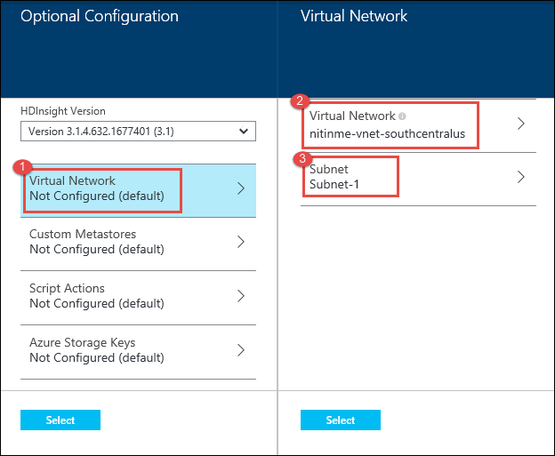
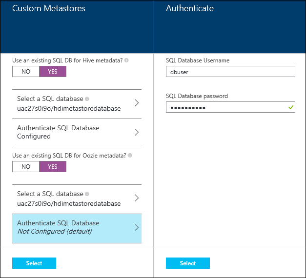
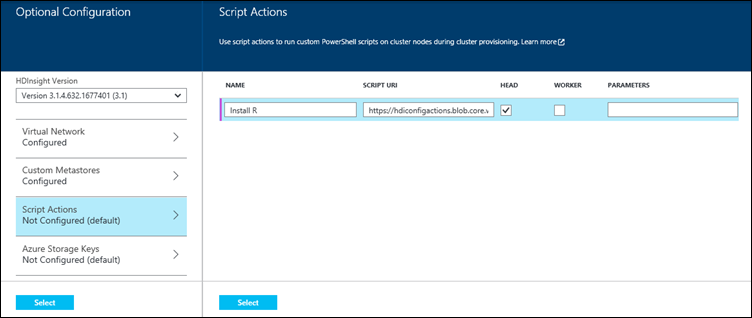
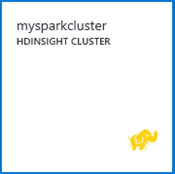
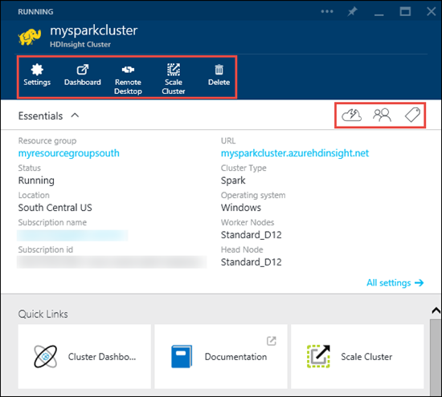
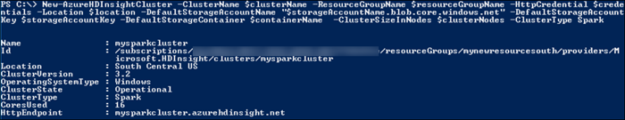

<properties
   pageTitle="Provision Apache Spark clusters in HDInsight | Microsoft Azure"
   description="Learn how to provision Spark clusters for Azure HDInsight by using the Azure portal, Azure PowerShell, a command line, or the HDInsight .NET SDK."
   services="hdinsight"
   documentationCenter=""
   authors="nitinme"
   manager="paulettm"
   editor="cgronlun"
   tags="azure-portal"/>

<tags
    ms.service="hdinsight"
    ms.devlang="na"
    ms.topic="article"
    ms.tgt_pltfrm="na"
    ms.workload="big-data"
    ms.date="09/22/2015"
    ms.author="nitinme"/>

# Provision Apache Spark clusters in HDInsight using custom options

For most scenarios, you can provision a Spark cluster using the quick create method as described in [Get Started with Apache Spark on HDInsight](hdinsight-apache-spark-zeppelin-notebook-jupyter-spark-sql.md). In certain scenarios, you might want to provision a customized cluster. For example, you might want to attach an external metadata store to keep your Hive metadata persistent beyond the lifetime of a cluster, or you might want to use additional storage with the cluster.

For such and other scenarios, this article provides instructions on how to use the Azure portal, Azure PowerShell, or the HDInsight .NET SDK to provision a customized Spark cluster on HDInsight.  

**Prerequisites:**

Before you begin the instructions in this article, you must have an Azure subscription. See [Get Azure free trial](http://azure.microsoft.com/documentation/videos/get-azure-free-trial-for-testing-hadoop-in-hdinsight/).

##What are the different configuration options?

###Additional storage

During configuration, you must specify an Azure Blob storage account and a default container. This is used as the default storage location by the cluster. Optionally, you can specify an additional Azure Storage account that will also be associated with the cluster.

>[AZURE.NOTE] Don't share one Blob storage container for multiple clusters. This is not supported.

For more information on using secondary Blob stores, see [Using Azure Blob Storage with HDInsight](hdinsight-use-blob-storage.md).

###Metastore

Spark enables you to define schema and Hive tables over raw data. You can save these schemas and table metadata to external metastores. Using the metastore helps you to retain your Hive metadata, so that you don't need to re-create Hive tables when you provision a new cluster. By default, Hive uses an embedded database to store this information. The embedded database can't preserve the metadata when the cluster is deleted.

For instructions on how to create a SQL database in Azure, see [Create your first Azure SQL Database](sql-database-get-started.md).

### Cluster customization

You can install additional components or customize cluster configuration by using scripts during provisioning. Such scripts are invoked via **Script Action**, which is a configuration option that can be used from the Azure portal, HDInsight Windows PowerShell cmdlets, or the HDInsight .NET SDK. For more information, see [Customize HDInsight cluster using Script Action][hdinsight-customize-cluster].

###Virtual networking

[Azure Virtual Network](http://azure.microsoft.com/documentation/services/virtual-network/) allows you to create a secure, persistent network containing the resources you need for your solution. A virtual network allows you to:

* Connect cloud resources together in a private network (cloud-only).

	

* Connect your cloud resources to your local data-center network (site-to-site or point-to-site) by using a virtual private network (VPN).

	Site-to-site configuration allows you to connect multiple resources from your data center to the Azure virtual network by using a hardware VPN or the Routing and Remote Access Service.

	

	Point-to-site configuration allows you to connect a specific resource to the Azure virtual network by using a software VPN.

	

For more information on Virtual Network features, benefits, and capabilities, see the [Azure Virtual Network overview](../virtual-network/virtual-networks-overview.md).

> [AZURE.NOTE] You must create the Azure virtual network before provisioning a cluster. For more information, see [How to create a Virtual Network](virtual-networks-create-vnet.md).
>
> Azure HDInsight supports only location-based virtual networks and does not currently work with affinity group-based virtual networks.
>
> It is highly recommended to designate a single subnet for one cluster.

## Using the Azure Preview Portal

Spark clusters on HDInsight use an Azure Blob storage container as the default file system. An Azure Storage account located on the same data center is required before you can create an HDInsight cluster. For more information, see [Use Azure Blob Storage with HDInsight](hdinsight-hadoop-use-blob-storage.md). For details on creating an Azure Storage account, see [How to Create a Storage Account][azure-create-storageaccount].

**To create an HDInsight cluster by using the Custom Create option**

1. Sign in to the [Azure Preview Portal](https://portal.azure.com).
2. Click **NEW**, Click **Data Analytics**, and then click **HDInsight**.

    

3. Enter a **Cluster Name**, select **Spark** for the **Cluster Type**, and from the **Cluster Operating System** drop-down, select **Windows Server 2012 R2 Datacenter**. A green check will appear beside the cluster name if it is available.

	

4. If you have more than one subscription, click the **Subscription** entry to select the Azure subscription that will be used for the cluster.

5. Click **Resource Group** to see a list of existing resource groups and then select the one to create the cluster in. Or, you can click **Create New** and then enter the name of the new resource group. A green check will appear to indicate if the new group name is available.

	> [AZURE.NOTE] This entry will default to one of your existing resource groups, if any are available.

6. Click **Credentials**, then enter a **Cluster Login Username** and **Cluster Login Password**. If you want to enable remote desktop on the cluster node, for **Enable Remote Desktop**, click **Yes**. Select a date when remote desktop access to the cluster expires, and provide the username/password for the remote desktop user. Click **Select** at the bottom to save the credentials configuration.

	

7. Click **Data Source** to choose an existing data source for the cluster, or create a new one.

	

	Currently you can select an Azure Storage Account as the data source for an HDInsight cluster. Use the following to understand the entries on the **Data Source** blade.

	- **Selection Method**: Set this to **From all subscriptions** to enable browsing of storage accounts from all your subscriptions. Set this to **Access Key** if you want to enter the **Storage Name** and **Access Key** of an existing storage account.

	- **Select storage account / Create New**: Click **Select storage account** to browse and select an existing storage account you want to associate with the cluster. Or, click **Create New** to create a new storage account. Use the field that appears to enter the name of the storage account. A green check will appear if the name is available.

	- **Choose Default Container**: Use this to enter the name of the default container to use for the cluster. While you can enter any name here, we recommend using the same name as the cluster so that you can easily recognize that the container is used for this specific cluster.

	- **Location**: The geographic region that the storage account is in, or will be created in.

		> [AZURE.IMPORTANT] Selecting the location for the default data source will also set the location of the HDInsight cluster. The cluster and default data source must be located in the same region.

	Click **Select** to save the data source configuration.

8. Click **Node Pricing Tiers** to display information about the nodes that will be created for this cluster. Set the number of worker nodes that you need for the cluster. The estimated cost of the cluster will be shown within the blade.

	

	Click **Select** to save the node pricing configuration.

9. Click **Optional Configuration** to select the cluster version, as well as configure other optional settings such as joining a **Virtual Network**, setting up an **External Metastore** to hold data for Hive and Oozie, use Script Actions to customize a cluster to install custom components, or use additional storage accounts with the cluster.

	* Click the **HDInsight Version** drop-down and select the version you want to use for the cluster. For more information, see [HDInsight cluster versions](hdinsight-component-versioning.md).

	* Click **Virtual Network** to provide configuration details to configure the cluster as part of a virtual network. In the **Virtual Network** blade, click **Virtual Network** and then click a network you want to use. Similarly, select a **Subnet** for the network, and then click **Select** to save the virtual network configuration.

		

	* Click **External Metastores** to specify SQL database that you want to use to save Hive and Oozie metadata associated with the cluster.

		

		For **Use an existing SQL DB for Hive** metadata, click **Yes**, select a SQL database, and then provide the username/password for the database. Repeat these steps if you want to **Use an existing SQL DB for Oozie metadata**. Click **Select** till you are back on the **Optional Configuration** blade.

		>[AZURE.NOTE] The Azure SQL database used for the metastore must allow connectivity to other Azure services, including Azure HDInsight. On the Azure SQL database dashboard, on the right side, click the server name. This is the server on which the SQL database instance is running. Once you are on the server view, click **Configure**, and then for **Azure Services**, click **Yes**, and then click **Save**.

	* Click **Script Actions** if you want to use a custom script to customize a cluster, as the cluster is being created. For more information about script actions, see [Customize HDInsight clusters using Script Action](hdinsight-hadoop-customize-cluster.md). On the Script Actions blade provide the details as shown in the screen capture.

		

		Click **Select** to save the script action configuration changes.

	* Click **Azure Storage Keys** to specify additional storage accounts to associate with the cluster. In the **Azure Storage Keys** blade, click **Add a storage key**, and then select an existing storage account or create a new account.

		

		Click **Select** till you are back on the **New HDInsight cluster** blade.

10. On the **New HDInsight Cluster** blade, ensure that **Pin to Startboard** is selected, and then click **Create**. This will create the cluster and add a tile for it to the Startboard of your Azure Portal. The icon will indicate that the cluster is provisioning, and will change to display the HDInsight icon once provisioning has completed.

	| While provisioning | Provisioning complete |
	| ------------------ | --------------------- |
	|  |  |

	> [AZURE.NOTE] It will take some time for the cluster to be created, usually around 15 minutes. Use the tile on the Startboard, or the **Notifications** entry on the left of the page to check on the provisioning process.

11. Once the provisioning completes, click the tile for the cluster from the Startboard to launch the cluster blade. The cluster blade provides essential information about the cluser such as the name, the resource group it belongs to, the location, the operating system, URL for the cluster dashboard, etc.

	

	Use the following to understand the icons at the top of this blade, and in the **Essentials** and **Quick Links** section:

	* **Settings** and **All Settings**: Displays the **Settings** blade for the cluster, which allows you to access detailed configuration information for the cluster.

	* **Dashboard** and **URL**: These are all ways to access the cluster dashboard, which is a Web portal to run jobs on the cluster.

	* **Remote Desktop**: Enables you to enable/disable remote desktop on the cluster nodes.

	* **Scale Cluster**: Allows you to change the number of worker nodes for this cluster.

	* **Delete**: Deletes the HDInsight cluster.

	* **Quickstart** (): Displays information that will help you get started using HDInsight.

	* **Users** (): Allows you to set permissions for _portal management_ of this cluster for other users on your Azure subscription.

		> [AZURE.IMPORTANT] This _only_ affects access and permissions to this cluster in the Azure preview portal, and has no effect on who can connect to or submit jobs to the HDInsight cluster.

	* **Tags** (): Tags allows you to set key/value pairs to define a custom taxonomy of your cloud services. For example, you may create a key named __project__, and then use a common value for all services associated with a specific project.

	* **Cluster Dashboard**: Launches the Cluster Dashboard blade from where you can either launch the cluster dashboard itself, or launch Zeppelin and Jupyter notebooks.

## Using Azure PowerShell

Azure PowerShell is a powerful scripting environment that you can use to control and automate the deployment and management of your workloads in Azure. This section provides instructions on how to provision an HDInsight cluster by using Azure PowerShell. For information on configuring a workstation to run HDInsight Windows PowerShell cmdlets, see [Install and configure Azure PowerShell](../install-configure-powershell.md). For more information on using Azure PowerShell with HDInsight, see [Administer HDInsight using PowerShell](hdinsight-administer-use-powershell.md). For the list of the HDInsight Windows PowerShell cmdlets, see [HDInsight cmdlet reference](https://msdn.microsoft.com/library/azure/dn858087.aspx).

The following procedures are needed to provision an HDInsight cluster by using Azure PowerShell:

- Create an Azure resource group
- Create an Azure Storage account
- Create an Azure Blob container
- Create an HDInsight cluster

		# Use the new Azure Resource Manager mode
		Switch-AzureMode AzureResourceManager

		###########################################
		# Create required items, if none exist
		###########################################

		# Sign in
		Add-AzureAccount

		# Select the subscription to use
		$subscriptionName = "<SubscriptionName>"        # Provide your Subscription Name
		Select-AzureSubscription -SubscriptionName $subscriptionName

		# Register your subscription to use HDInsight
		Register-AzureProvider -ProviderNamespace "Microsoft.HDInsight" -Force

		# Create an Azure Resource Group
		$resourceGroupName = "<ResourceGroupName>"      # Provide a Resource Group name
		$location = "<Location>"                        # For example, "West US"
		New-AzureResourceGroup -Name $resourceGroupName -Location $location

		# Create an Azure Storage account
		$storageAccountName = "<StorageAcccountName>"   # Provide a Storage account name
		New-AzureStorageAccount -ResourceGroupName $resourceGroupName -StorageAccountName $storageAccountName -Location $location -Type Standard_GRS

		# Create an Azure Blob Storage container
		$containerName = "<ContainerName>"              # Provide a container name
		$storageAccountKey = Get-AzureStorageAccountKey -Name $storageAccountName -ResourceGroupName $resourceGroupName | %{ $_.Key1 }
		$destContext = New-AzureStorageContext -StorageAccountName $storageAccountName -StorageAccountKey $storageAccountKey
		New-AzureStorageContainer -Name $containerName -Context $destContext

		###########################################
		# Create an HDInsight Cluster
		###########################################

		# Skip these variables if you just created them
		$resourceGroupName = "<ResourceGroupName>"      # Provide the Resource Group name
		$storageAccountName = "<StorageAcccountName>"   # Provide the Storage account name
		$containerName = "<ContainerName>"              # Provide the container name
		$storageAccountKey = Get-AzureStorageAccountKey -Name $storageAccountName -ResourceGroupName $resourceGroupName | %{ $_.Key1 }

		# Set these variables
		$clusterName = $containerName           		# As a best practice, have the same name for the cluster and container
		$clusterNodes = <ClusterSizeInNodes>    		# The number of nodes in the HDInsight cluster
		$credentials = Get-Credential

		# The location of the HDInsight cluster. It must be in the same data center as the Storage account.
		$location = Get-AzureStorageAccount -ResourceGroupName $resourceGroupName -StorageAccountName $storageAccountName | %{$_.Location}

		# Create a new HDInsight cluster
		New-AzureHDInsightCluster -ClusterName $clusterName -ResourceGroupName $resourceGroupName -HttpCredential $credentials -Location $location -DefaultStorageAccountName "$storageAccountName.blob.core.windows.net" -DefaultStorageAccountKey $storageAccountKey -DefaultStorageContainer $containerName  -ClusterSizeInNodes $clusterNodes -ClusterType Spark

	

## Using the ARM-based HDInsight .NET SDK
The HDInsight .NET SDK provides .NET client libraries that make it easier to work with HDInsight from a .NET Framework application. Follow the instructions below to create a Visual Studio console application and paste the code for creating a cluster.

**To create a Visual Studio console application**

1. Open Visual Studio 2013.

2. From the **File** menu, click **New**, and then click **Project**.

3. From **New Project**, type or select the following values:

	<table style="border-color: #c6c6c6; border-width: 2px; border-style: solid; border-collapse: collapse;">
	<tr>
	<th style="border-color: #c6c6c6; border-width: 2px; border-style: solid; border-collapse: collapse; width:90px; padding-left:5px; padding-right:5px;">Property</th>
	<th style="border-color: #c6c6c6; border-width: 2px; border-style: solid; border-collapse: collapse; width:90px; padding-left:5px; padding-right:5px;">Value</th></tr>
	<tr>
	<td style="border-color: #c6c6c6; border-width: 2px; border-style: solid; border-collapse: collapse; padding-left:5px;">Category</td>
	<td style="border-color: #c6c6c6; border-width: 2px; border-style: solid; border-collapse: collapse; padding-left:5px; padding-right:5px;">Templates/Visual C#/Windows</td></tr>
	<tr>
	<td style="border-color: #c6c6c6; border-width: 2px; border-style: solid; border-collapse: collapse; padding-left:5px;">Template</td>
	<td style="border-color: #c6c6c6; border-width: 2px; border-style: solid; border-collapse: collapse; padding-left:5px;">Console Application</td></tr>
	<tr>
	<td style="border-color: #c6c6c6; border-width: 2px; border-style: solid; border-collapse: collapse; padding-left:5px;">Name</td>
	<td style="border-color: #c6c6c6; border-width: 2px; border-style: solid; border-collapse: collapse; padding-left:5px;">CreateHDICluster</td></tr>
	</table>

4. Click **OK** to create the project.

5. From the **Tools** menu, click **Nuget Package Manager**, and then click **Manage Nuget Packages for Solutions**. In the Search text box within the dialog box, search for **HDInsight**. From the results that show up, install the following:

	 * Microsoft.Azure.Management.HDInsight
	 * Microsoft.Azure.Management.HDInsight.Job

	Search for Azure Authentication and from the results that show up, install **Microsoft.Azure.Common.Authentication**.

6. From Solution Explorer, double-click **Program.cs** to open it, paste the following code, and provide values for the variables:

        using System;
		using System.Collections.Generic;
		using System.Diagnostics;
		using System.Linq;
		using System.Security;
		using System.Text;
		using System.Threading.Tasks;
		using Hyak.Common;
		using Microsoft.Azure;
		using Microsoft.Azure.Common.Authentication;
		using Microsoft.Azure.Common.Authentication.Models;
		using Microsoft.Azure.Management.HDInsight;
		using Microsoft.Azure.Management.HDInsight.Job;
		using Microsoft.Azure.Management.HDInsight.Job.Models;
		using Microsoft.Azure.Management.HDInsight.Models;
		using Newtonsoft.Json;

		namespace CreateHDICluster
		{
		    internal class Program
		    {
		        private static ProfileClient _profileClient;
		        private static SubscriptionCloudCredentials _cloudCredentials;
		        private static HDInsightManagementClient _hdiManagementClient;

		        private static Guid SubscriptionId = new Guid("<SubscriptionID>");
		        private const string ResourceGroupName = "<ResourceGroupName>";
		        private const string ExistingStorageName = "<storageaccountname>.blob.core.windows.net";
		        private const string ExistingStorageKey = "<account key>";
		        private const string ExistingContainer = "<container name>";
		        private const string NewClusterName = "<cluster name>";
		        private const int NewClusterNumNodes = <number of nodes>;
		        private const string NewClusterLocation = "<location>";		//should be same as the storage account
		        private const OSType NewClusterOsType = OSType.Windows;
		        private const HDInsightClusterType NewClusterType = HDInsightClusterType.Spark;
		        private const string NewClusterVersion = "3.2";
		        private const string NewClusterUsername = "admin";
		        private const string NewClusterPassword = "<password>";

		        private static void Main(string[] args)
		        {
		            System.Console.WriteLine("Start cluster provisioning");

		            _profileClient = GetProfile();
		            _cloudCredentials = GetCloudCredentials();
		            _hdiManagementClient = new HDInsightManagementClient(_cloudCredentials);

		            System.Console.WriteLine(String.Format("Creating the cluster {0}...", NewClusterName));
		            CreateCluster();
		            System.Console.WriteLine("Done. Press any key to continue.");
		            System.Console.ReadKey(true);
		        }

		        private static void CreateCluster()
		        {
		            var parameters = new ClusterCreateParameters
		            {
		                ClusterSizeInNodes = NewClusterNumNodes,
		                UserName = NewClusterUsername,
		                Password = NewClusterPassword,
		                Location = NewClusterLocation,
		                DefaultStorageAccountName = ExistingStorageName,
		                DefaultStorageAccountKey = ExistingStorageKey,
		                DefaultStorageContainer = ExistingContainer,
		                ClusterType = NewClusterType,
		                OSType = NewClusterOsType
		            };

		            _hdiManagementClient.Clusters.Create(ResourceGroupName, NewClusterName, parameters);
		        }

		        private static ProfileClient GetProfile(string username = null, SecureString password = null)
		        {
		            var profileClient = new ProfileClient(new AzureProfile());
		            var env = profileClient.GetEnvironmentOrDefault(EnvironmentName.AzureCloud);
		            var acct = new AzureAccount { Type = AzureAccount.AccountType.User };

		            if (username != null && password != null)
		                acct.Id = username;

		            profileClient.AddAccountAndLoadSubscriptions(acct, env, password);

		            return profileClient;
		        }

		        private static SubscriptionCloudCredentials GetCloudCredentials()
		        {
		            var sub = _profileClient.Profile.Subscriptions.Values.FirstOrDefault(s => s.Id.Equals(SubscriptionId));

		            Debug.Assert(sub != null, "subscription != null");
		            _profileClient.SetSubscriptionAsDefault(sub.Id, sub.Account);

		            return AzureSession.AuthenticationFactory.GetSubscriptionCloudCredentials(_profileClient.Profile.Context);
		        }

		    }
		}

7. Press **F5** to run the application. A console window should open and display the status of the application. You will also be prompted to enter your Azure account credentials. It can take several minutes to create an HDInsight cluster.

## Next steps

* See [Perform interactive data analysis using Spark in HDInsight with BI tools](hdinsight-apache-spark-use-bi-tools.md) to learn how to use Apache Spark in HDInsight with BI tools like Power BI and Tableau.
* See [Use Spark in HDInsight for building machine learning applications](hdinsight-apache-spark-ipython-notebook-machine-learning.md) to learn how to build machine learning applications using Apache Spark on HDInsight.
* See [Use Spark in HDInsight for building real-time streaming applications](hdinsight-apache-spark-csharp-apache-zeppelin-eventhub-streaming.md) to learn how to build streaming applications using Apache Spark on HDInsight.
* See [Manage resources for the Apache Spark cluster in Azure HDInsight](hdinsight-apache-spark-resource-manager.md) to learn how to use the Resource Manager to manage resources allocated to the Spark cluster.

[hdinsight-sdk-documentation]: http://msdn.microsoft.com/library/dn479185.aspx
[hdinsight-hbase-custom-provision]: http://azure.microsoft.com/documentation/articles/hdinsight-hbase-get-started/

[hdinsight-customize-cluster]: ../hdinsight-hadoop-customize-cluster/
[hdinsight-get-started]: ../hdinsight-get-started/

[hdinsight-admin-powershell]: ../hdinsight-administer-use-powershell/
[hdinsight-admin-portal]: ../hdinsight-administer-use-management-portal/
[hadoop-hdinsight-intro]: ../hdinsight-hadoop-introduction/
[hdinsight-submit-jobs]: ../hdinsight-submit-hadoop-jobs-programmatically/
[hdinsight-powershell-reference]: https://msdn.microsoft.com/library/dn858087.aspx
[hdinsight-storm-get-started]: ../hdinsight-storm-getting-started/

[azure-management-portal]: https://manage.windowsazure.com/

[azure-command-line-tools]: ../xplat-cli/

[azure-create-storageaccount]: ../storage-create-storage-account/

[apache-hadoop]: http://go.microsoft.com/fwlink/?LinkId=510084
[azure-purchase-options]: http://azure.microsoft.com/pricing/purchase-options/
[azure-member-offers]: http://azure.microsoft.com/pricing/member-offers/
[azure-free-trial]: http://azure.microsoft.com/pricing/free-trial/
[hdi-remote]: http://azure.microsoft.com/documentation/articles/hdinsight-administer-use-management-portal/#rdp

[powershell-install-configure]: ../install-configure-powershell/

[azure-preview-portal]: https://portal.azure.com

[89e2276a]: /documentation/articles/hdinsight-use-sqoop/ "Use Sqoop with HDInsight"
