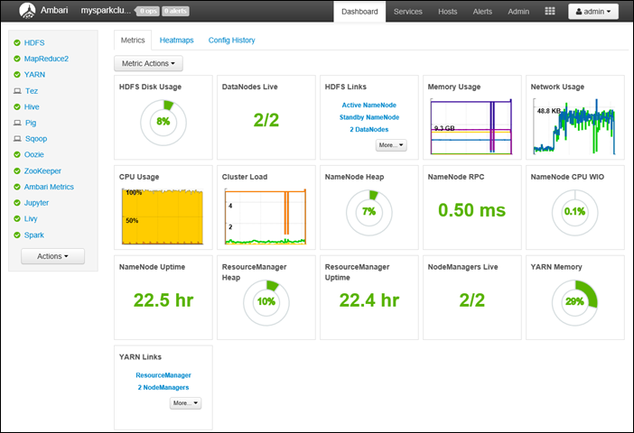
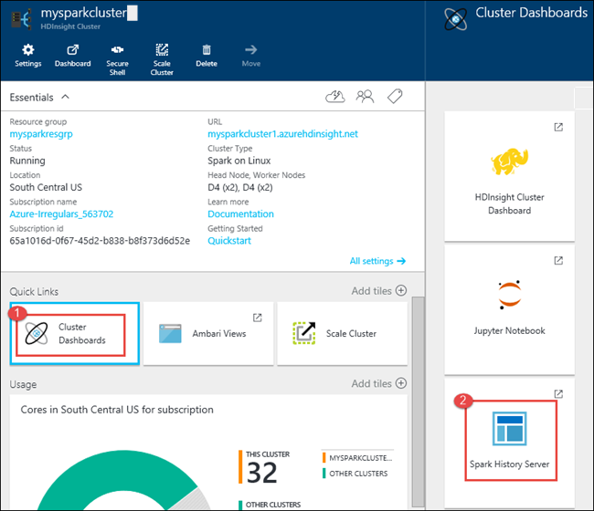
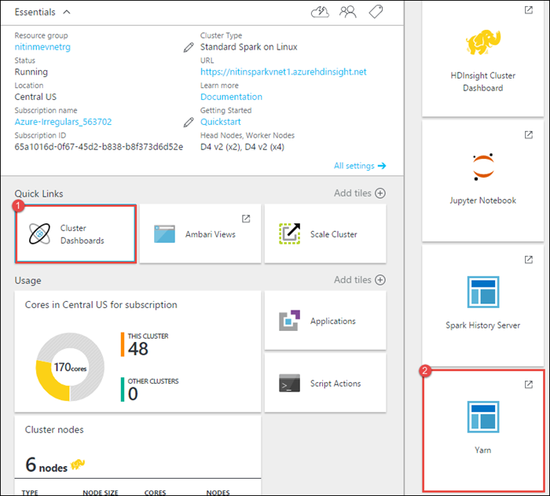
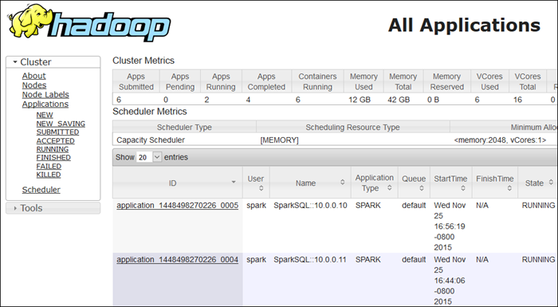
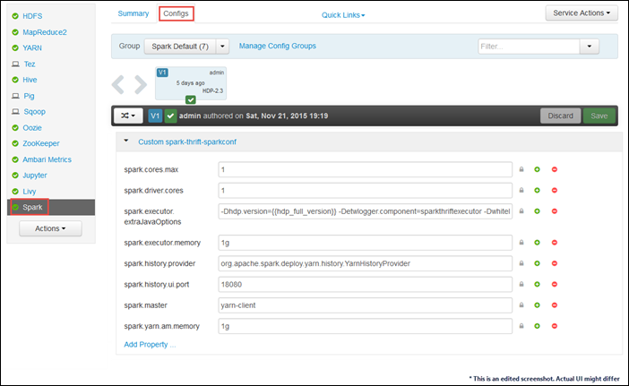

<properties 
	pageTitle="Use Resource Manager to allocate resources to the Apache Spark cluster in HDInsight| Microsoft Azure" 
	description="Learn how to use the Resource Manager for Spark clusters on HDInsight for better performance." 
	services="hdinsight" 
	documentationCenter="" 
	authors="nitinme" 
	manager="paulettm" 
	editor="cgronlun"
	tags="azure-portal"/>

<tags 
	ms.service="hdinsight" 
	ms.workload="big-data" 
	ms.tgt_pltfrm="na" 
	ms.devlang="na" 
	ms.topic="article" 
	ms.date="04/14/2016" 
	ms.author="nitinme"/>

# Manage resources for the Apache Spark cluster on HDInsight Linux (Preview)

Spark on Azure HDInsight (Linux) provides the Ambari Web UI to manage the cluster resources and monitor the health of the cluster. You can also use the Spark History Server to track applications that have finished running on the cluster. You can use the YARN UI to monitor that are currently running on the cluster. This article provides instructions on how to access these UIs and how to perform some basic resource management tasks using these interfaces.

**Prerequisites:**

You must have the following:

- An Azure subscription. See [Get Azure free trial](https://azure.microsoft.com/documentation/videos/get-azure-free-trial-for-testing-hadoop-in-hdinsight/).
- An Apache Spark cluster on HDInsight Linux. For instructions, see [Create Apache Spark clusters in Azure HDInsight](hdinsight-apache-spark-jupyter-spark-sql.md).

## How do I launch the Ambari Web UI?

1. From the [Azure Portal](https://ms.portal.azure.com/), from the startboard, click the tile for your Spark cluster (if you pinned it to the startboard). You can also navigate to your cluster under **Browse All** > **HDInsight Clusters**. 
 
2. From the Spark cluster blade, click **Dashboard**. When prompted, enter the admin credentials for the Spark cluster.

	

3. This should launch the Ambari Web UI, as shown below.

	   

## How do I launch the Spark History Server?

1. From the [Azure Portal](https://ms.portal.azure.com/), from the startboard, click the tile for your Spark cluster (if you pinned it to the startboard).

2. From the cluster blade, under **Quick Links**, click **Cluster Dashboard**. In the **Cluster Dashboard** blade, click **Spark History Server**.

	

	When prompted, enter the admin credentials for the Spark cluster.

## How do I launch the Yarn UI?

You can use the YARN UI to monitor applications that are currently running on the Spark cluster. Before accessing the YARN UI, you should have enabled SSH tunneling to the cluster. For instructions, see [Use SSH Tunneling to access Ambari web UI](hdinsight-linux-ambari-ssh-tunnel.md)

1. Launch the Ambari Web UI as shown in the section above.

2. From the Ambari Web UI, select YARN from the list on the left of the page.

3. 3.When the YARN service information is displayed, select **Quick Links**. A list of the cluster head nodes will appear. Select one of the head nodes, and then select **ResourceManager UI**.

	

4. This should launch the YARN UI and you should see a page similar to the following:

	

##How do I manage resources using the Ambari Web UI?

Here are some common scenarios that you might run into with your Spark cluster, and the instructions on how to address those using the Ambari Web UI.

### I do not use BI with Spark cluster. How do I take the resources back?

1. Launch the Ambari Web UI as shown above. From the left navigation pane, click **Spark**, and then click **Configs**.

2. In the list of configurations available, look for **Custom spark-thrift-sparkconf** and change the values for **spark.executor.memory** and **spark.drivers.core** to **0**.

	

3. Click **Save**. Enter a description for the changes you made and then click **Save** again.

4. At the top of the page, you should see a prompt to restart the Spark service. Click **Restart** for the changes to take affect.

### My Jupyter notebooks are not running as expected. How can I restart the service?

1. Launch the Ambari Web UI as shown above. From the left navigation pane, click **Jupyter**, click **Service Actions**, and then click **Restart All**. This will start the Jupyter service on all the headnodes.

	

	

## See also

* [Overview: Apache Spark on Azure HDInsight](hdinsight-apache-spark-overview.md)

### Scenarios

* [Spark with BI: Perform interactive data analysis using Spark in HDInsight with BI tools](hdinsight-apache-spark-use-bi-tools.md)

* [Spark with Machine Learning: Use Spark in HDInsight for analyzing building temperature using HVAC data](hdinsight-apache-spark-ipython-notebook-machine-learning.md)

* [Spark with Machine Learning: Use Spark in HDInsight to predict food inspection results](hdinsight-apache-spark-machine-learning-mllib-ipython.md)

* [Spark Streaming: Use Spark in HDInsight for building real-time streaming applications](hdinsight-apache-spark-eventhub-streaming.md)

* [Website log analysis using Spark in HDInsight](hdinsight-apache-spark-custom-library-website-log-analysis.md)

### Create and run applications

* [Create a standalone application using Scala](hdinsight-apache-spark-create-standalone-application.md)

* [Run jobs remotely on a Spark cluster using Livy](hdinsight-apache-spark-livy-rest-interface.md)

### Tools and extensions

* [Use HDInsight Tools Plugin for IntelliJ IDEA to create and submit Spark Scala applicatons](hdinsight-apache-spark-intellij-tool-plugin.md)

* [Use Zeppelin notebooks with a Spark cluster on HDInsight](hdinsight-apache-spark-use-zeppelin-notebook.md)

* [Kernels available for Jupyter notebook in Spark cluster for HDInsight](hdinsight-apache-spark-jupyter-notebook-kernels.md)

[hdinsight-versions]: hdinsight-component-versioning.md
[hdinsight-upload-data]: hdinsight-upload-data.md
[hdinsight-storage]: hdinsight-hadoop-use-blob-storage.md

[azure-purchase-options]: http://azure.microsoft.com/pricing/purchase-options/
[azure-member-offers]: http://azure.microsoft.com/pricing/member-offers/
[azure-free-trial]: http://azure.microsoft.com/pricing/free-trial/
[azure-management-portal]: https://manage.windowsazure.com/
[azure-create-storageaccount]: storage-create-storage-account.md 
