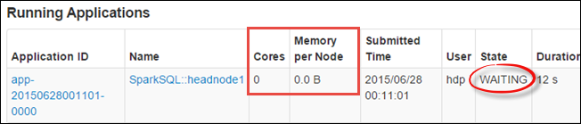

<properties 
	pageTitle="Use Resource Manager to allocate resources to the Apache Spark cluster in HDInsight| Azure" 
	description="Learn how to use the Resource Manager for Spark clusters on HDInsight for better performance." 
	services="hdinsight" 
	documentationCenter="" 
	authors="nitinme" 
	manager="paulettm" 
	editor="cgronlun"/>

<tags 
	ms.service="hdinsight" 
	ms.workload="big-data" 
	ms.tgt_pltfrm="na" 
	ms.devlang="na" 
	ms.topic="article" 
	ms.date="07/10/2015" 
	ms.author="nitinme"/>

# Manage resources for the Apache Spark cluster in Azure HDInsight

Resource manager is a component of the Spark cluster dashboard that enables you to manage resources such as cores and RAM used by each application running on the cluster.

## How do I launch the Resource Manager?

1. Select your Spark cluster on the Azure portal, and from the portal task bar at the bottom, click **Spark Dashboard**.

2. From the top pane in the dashboard, click the **Resource Manager** tab.  

##How do I fix these issues using the Resource Manager?

Here are some common scenarios that you might run into with your Spark cluster, and the instructions on how to address those using the Resource Manager.

### My Spark cluster on HDInsight is slow

Apache Spark cluster in HDInsight is designed for multi-tenancy, so resources are split across multiple components (notebooks, job server, etc). This allows you to use all Spark components concurrently without worrying about any component not able to get resources to run, but each component will be slower since resources are fragmented.  This can be adjusted based on your needs. 

### I only use IPython with the Spark cluster. How can I allocate all resources to it?

1. From the **Spark Dashboard**, click the **Spark UI** tab to find out the maximum number of cores and the maximum RAM that you can allocate to the applications.

	

	Going by the screen capture above, the maximum cores that you can allocate is 7 (total 8 cores of which 1 is in use), and the maximum RAM that you can alloacate is 9GB (total 12GB RAM, of which 2GB must be set aside for system use and 1GB that is in use by other applications).

	You should also factor any applications that are running. You can look at the running applications from the **Spark UI** tab.

	

	
2. From the HDInsight Spark Dashboard, click the **Resource Manager** tab and specify the values for **Default application core count** and **Default executor memory per worker node**. Set other properties to 0.

	

### I do not use BI tools with the Spark cluster. How can I take resources back? 

Specify thrift server core Count and thrift Server executor memory as 0. With no core or memory allocated, the thrift server will go into a **WAITING** state.

##See also

* [Overview: Apache Spark on Azure HDInsight](hdinsight-apache-spark-overview.md)
* [Provision a Spark on HDInsight cluster](hdinsight-apache-spark-provision-clusters.md)
* [Perform interactive data analysis using Spark in HDInsight with BI tools](hdinsight-apache-spark-use-bi-tools.md)
* [Use Spark in HDInsight for building machine learning applications](hdinsight-apache-spark-ipython-notebook-machine-learning.md)
* [Use Spark in HDInsight for building real-time streaming applications](hdinsight-apache-spark-csharp-apache-zeppelin-eventhub-streaming.md)

[hdinsight-versions]: ../hdinsight-component-versioning/
[hdinsight-upload-data]: ../hdinsight-upload-data/
[hdinsight-storage]: ../hdinsight-use-blob-storage/

[azure-purchase-options]: http://azure.microsoft.com/pricing/purchase-options/
[azure-member-offers]: http://azure.microsoft.com/pricing/member-offers/
[azure-free-trial]: http://azure.microsoft.com/pricing/free-trial/
[azure-management-portal]: https://manage.windowsazure.com/
[azure-create-storageaccount]: ../storage-create-storage-account/ 

