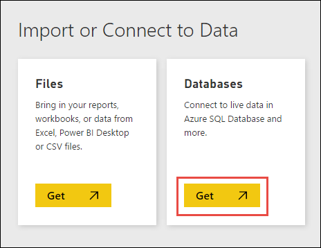
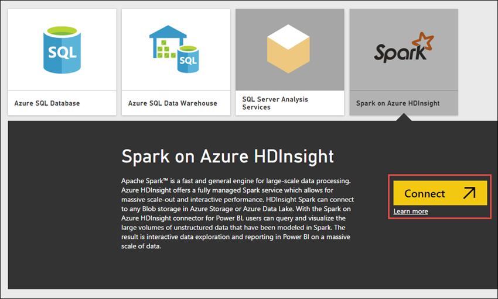

# Apache Spark BI using data visualization tools with Azure HDInsight

Learn how to use data visualization tools such as Power BI and Tableau to analyze a raw sample data set using Apache Spark BI on HDInsight clusters.

> [!NOTE]
> Connectivity with BI tools described in this article is not supported on Spark 2.1 on Azure HDInsight 3.6 Preview. Only Spark versions 1.6 and 2.0 (HDInsight 3.4, 3.5 respectively) are supported.
>

This tutorial is also available as a Jupyter notebook on an HDInsight Spark cluster. The notebook experience lets you run the Python snippets from the notebook itself. To perform the tutorial from within a notebook, create a Spark cluster, launch a Jupyter notebook (`https://CLUSTERNAME.azurehdinsight.net/jupyter`), and then run the notebook **Use BI tools with Apache Spark on HDInsight.ipynb** under the **Python** folder.

## Prerequisites

* An Apache Spark cluster on HDInsight. For instructions, see [Create Apache Spark clusters in Azure HDInsight](hdinsight-apache-spark-jupyter-spark-sql.md).

## Prepare data for Spark data visualization

In this section, we use the [Jupyter](https://jupyter.org) notebook from an HDInsight Spark cluster to run jobs that process your raw sample data and save it as a table. The sample data is a .csv file (hvac.csv) available on all clusters by default.

Once your data is saved as a table, in the next section we use BI tools to connect to the table and perform data visualizations.

1. From the [Azure portal](https://portal.azure.com/), from the startboard, click the tile for your Spark cluster (if you pinned it to the startboard). You can also navigate to your cluster under **Browse All** > **HDInsight Clusters**.   

2. From the Spark cluster blade, click **Cluster Dashboard**, and then click **Jupyter Notebook**. If prompted, enter the admin credentials for the cluster.

   > [!NOTE]
   > You may also reach the Jupyter Notebook for your cluster by opening the following URL in your browser. Replace **CLUSTERNAME** with the name of your cluster:
   >
   > `https://CLUSTERNAME.azurehdinsight.net/jupyter`
   >
   >

3. Create a notebook. Click **New**, and then click **PySpark**.

    

4. A new notebook is created and opened with the name Untitled.pynb. Click the notebook name at the top, and enter a friendly name.

    

5. Because you created a notebook using the PySpark kernel, you do not need to create any contexts explicitly. The Spark and Hive contexts are automatically created for you when you run the first code cell. You can start by importing the types required for this scenario. To do so, place the cursor in the cell and press **SHIFT + ENTER**.

        from pyspark.sql import *

6. Load sample data into a temporary table. When you create a Spark cluster in HDInsight, the sample data file, **hvac.csv**, is copied to the associated storage account under **\HdiSamples\HdiSamples\SensorSampleData\hvac**.

    In an empty cell, paste the following snippet and press **SHIFT + ENTER**. This snippet registers the data into a table called **hvac**.

        # Create an RDD from sample data
        hvacText = sc.textFile("wasbs:///HdiSamples/HdiSamples/SensorSampleData/hvac/HVAC.csv")

        # Create a schema for our data
        Entry = Row('Date', 'Time', 'TargetTemp', 'ActualTemp', 'BuildingID')

        # Parse the data and create a schema
        hvacParts = hvacText.map(lambda s: s.split(',')).filter(lambda s: s[0] != 'Date')
        hvac = hvacParts.map(lambda p: Entry(str(p[0]), str(p[1]), int(p[2]), int(p[3]), int(p[6])))

        # Infer the schema and create a table       
        hvacTable = sqlContext.createDataFrame(hvac)
        hvacTable.registerTempTable('hvactemptable')
        dfw = DataFrameWriter(hvacTable)
        dfw.saveAsTable('hvac')

7. Verify that the table was successfully created. You can use the `%%sql` magic to run Hive queries directly. For more information about the `%%sql` magic, and other magics available with the PySpark kernel, see [Kernels available on Jupyter notebooks with Spark HDInsight clusters](hdinsight-apache-spark-jupyter-notebook-kernels.md#parameters-supported-with-the-sql-magic).

        %%sql
        SHOW TABLES

    You see an output like shown below:

        +---------------+-------------+
        |tableName      |isTemporary  |
        +---------------+-------------+
        |hvactemptable  |true		 |
        |hivesampletable|false  	  |
        |hvac           |false  	  |
        +---------------+-------------+

    Only the tables that have false under the **isTemporary** column are hive tables that are stored in the metastore and can be accessed from the BI tools. In this tutorial, we connect to the **hvac** table we created.

8. Verify that the table contains the intended data. In an empty cell in the notebook, copy the following snippet and press **SHIFT + ENTER**.

        %%sql
        SELECT * FROM hvac LIMIT 10

9. Shut down the notebook to release the resources. To do so, from the **File** menu on the notebook, click **Close and Halt**.

## Use Power BI for Spark data visualization

> [!NOTE]
> This section is applicable only for Spark 1.6 on HDInsight 3.4 and Spark 2.0 on HDInsight 3.5.
>
>

Once you have saved the data as a table, you can use Power BI to connect to the data and visualize it to create reports, dashboards, etc.

1. Make sure you have access to Power BI. You can get a free preview subscription of Power BI from [http://www.powerbi.com/](http://www.powerbi.com/).

2. Sign in to [Power BI](http://www.powerbi.com/).

3. From the bottom of the left pane, click **Get Data**.

4. On the **Get Data** page, under **Import or Connect to Data**, for **Databases**, click **Get**.

    

5. On the next screen, click **Spark on Azure HDInsight** and then click **Connect**. When prompted, enter the cluster URL (`mysparkcluster.azurehdinsight.net`) and the credentials to connect to the cluster.

	

    After the connection is established, Power BI starts importing data from the Spark cluster on HDInsight.

6. Power BI imports the data and adds a **Spark** dataset under the **Datasets** heading. Click the data set to open a new worksheet to visualize the data. You can also save the worksheet as a report. To save a worksheet, from the **File** menu, click **Save**.

    
7. Notice that the **Fields** list on the right lists the **hvac** table you created earlier. Expand the table to see the fields in the table, as you defined in notebook earlier.

      

8. Build a visualization to show the variance between target temperature and actual temperature for each building. To visualize yoru data, select **Area Chart** (shown in red box). To define the axis, drag-and-drop the **BuildingID** field under **Axis**, and **ActualTemp**/**TargetTemp** fields under **Value**.

    

9. By default the visualization shows the sum for **ActualTemp** and **TargetTemp**. For both the fields, from the drop-down, select **Average** to get an average of actual and target temperatures for both buildings.

    

10. Your data visualization should be similar to the one in the screenshot. Move your cursor over the visualization to get tool tips with relevant data.

    

11. Click **Save** from the top menu and provide a report name. You can also pin the visual. When you pin a visualization, it is stored on your dashboard so you can track the latest value at a glance.

   You can add as many visualizations as you want for the same dataset and pin them to the dashboard for a snapshot of your data. Also, Spark clusters on HDInsight are connected to Power BI with direct connect. This ensures that Power BI always has the most up-to-date data from your cluster so you do not need to schedule refreshes for the dataset.

## Use Tableau Desktop for Spark data visualization

> [!NOTE]
> This section is applicable only for Spark 1.5.2 clusters created in Azure HDInsight.
>
>

1. Install [Tableau Desktop](http://www.tableau.com/products/desktop) on the computer where you are running this Apache Spark BI tutorial.

2. Make sure that computer also has Microsoft Spark ODBC driver installed. You can install the driver from [here](http://go.microsoft.com/fwlink/?LinkId=616229).

1. Launch Tableau Desktop. In the left pane, from the list of server to connect to, click **Spark SQL**. If Spark SQL is not listed by default in the left pane, you can find it by click **More Servers**.
2. In the Spark SQL connection dialog box, provide the values as shown in the screenshot, and then click **OK**.

    

    The authentication drop-down lists **Microsoft Azure HDInsight Service** as an option, only if you installed the [Microsoft Spark ODBC Driver](http://go.microsoft.com/fwlink/?LinkId=616229) on the computer.
3. On the next screen, from the **Schema** drop-down, click the **Find** icon, and then click **default**.

    
4. For the **Table** field, click the **Find** icon again to list all the Hive tables available in the cluster. You should see the **hvac** table you created earlier using the notebook.

    
5. Drag and drop the table to the top box on the right. Tableau imports the data and displays the schema as highlighted by the red box.

    
6. Click the **Sheet1** tab at the bottom left. Make a visualization that shows the average target and actual temperatures for all buildings for each date. Drag **Date** and **Building ID** to **Columns** and **Actual Temp**/**Target Temp** to **Rows**. Under **Marks**, select **Area** to use an area map for Spark data visualization.

     
7. By default, the temperature fields are shown as aggregate. If you want to show the average temperatures instead, you can do so from the drop-down, as shown below.

    

8. You can also super-impose one temperature map over the other to get a better feel of difference between target and actual temperatures. Move the mouse to the corner of the lower area map till you see the handle shape highlighted in a red circle. Drag the map to the other map on the top and release the mouse when you see the shape highlighted in red rectangle.

    

     Your data visualization should change as shown in the screenshot:

    
9. Click **Save** to save the worksheet. You can create dashboards and add one or more sheets to it.

## See also
* [Overview: Apache Spark on Azure HDInsight](hdinsight-apache-spark-overview.md)

### Scenarios
* [Spark with Machine Learning: Use Spark in HDInsight for analyzing building temperature using HVAC data](hdinsight-apache-spark-ipython-notebook-machine-learning.md)
* [Spark with Machine Learning: Use Spark in HDInsight to predict food inspection results](hdinsight-apache-spark-machine-learning-mllib-ipython.md)
* [Spark Streaming: Use Spark in HDInsight for building real-time streaming applications](hdinsight-apache-spark-eventhub-streaming.md)
* [Website log analysis using Spark in HDInsight](hdinsight-apache-spark-custom-library-website-log-analysis.md)

### Create and run applications
* [Create a standalone application using Scala](hdinsight-apache-spark-create-standalone-application.md)
* [Run jobs remotely on a Spark cluster using Livy](hdinsight-apache-spark-livy-rest-interface.md)

### Tools and extensions
* [Use HDInsight Tools Plugin for IntelliJ IDEA to create and submit Spark Scala applications](hdinsight-apache-spark-intellij-tool-plugin.md)
* [Use HDInsight Tools Plugin for IntelliJ IDEA to debug Spark applications remotely](hdinsight-apache-spark-intellij-tool-plugin-debug-jobs-remotely.md)
* [Use Zeppelin notebooks with a Spark cluster on HDInsight](hdinsight-apache-spark-zeppelin-notebook.md)
* [Kernels available for Jupyter notebook in Spark cluster for HDInsight](hdinsight-apache-spark-jupyter-notebook-kernels.md)
* [Use external packages with Jupyter notebooks](hdinsight-apache-spark-jupyter-notebook-use-external-packages.md)
* [Install Jupyter on your computer and connect to an HDInsight Spark cluster](hdinsight-apache-spark-jupyter-notebook-install-locally.md)

### Manage resources
* [Manage resources for the Apache Spark cluster in Azure HDInsight](hdinsight-apache-spark-resource-manager.md)
* [Track and debug jobs running on an Apache Spark cluster in HDInsight](hdinsight-apache-spark-job-debugging.md)

[hdinsight-versions]: hdinsight-component-versioning.md
[hdinsight-upload-data]: hdinsight-upload-data.md
[hdinsight-storage]: hdinsight-hadoop-use-blob-storage.md

[azure-purchase-options]: http://azure.microsoft.com/pricing/purchase-options/
[azure-member-offers]: http://azure.microsoft.com/pricing/member-offers/
[azure-free-trial]: http://azure.microsoft.com/pricing/free-trial/
[azure-create-storageaccount]: storage-create-storage-account.md
