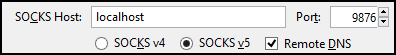
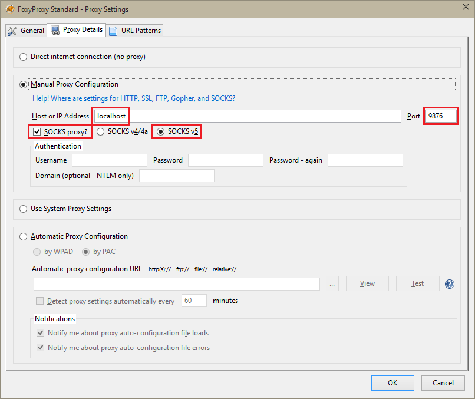
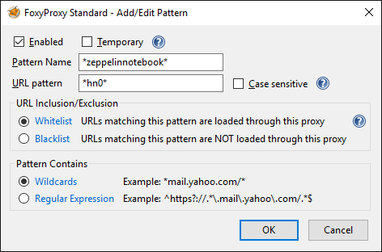
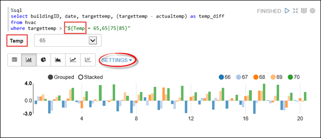
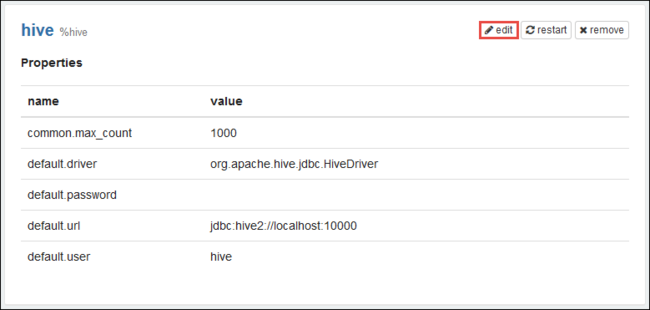
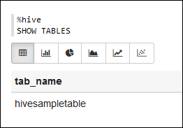
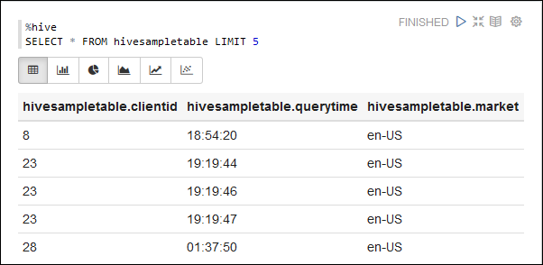

<properties 
	pageTitle="Use Zeppelin notebooks with Spark cluster on HDInsight Linux | Azure" 
	description="Step-by-step instructions on how to use Zeppelin notebooks with Spark clusters on HDInsight Linux." 
	services="hdinsight" 
	documentationCenter="" 
	authors="nitinme" 
	manager="paulettm" 
	editor="cgronlun"/>

<tags 
	ms.service="hdinsight" 
	ms.workload="big-data" 
	ms.tgt_pltfrm="na" 
	ms.devlang="na" 
	ms.topic="article" 
	ms.date="07/25/2016" 
	ms.author="nitinme"/>

# Use Zeppelin notebooks with Apache Spark cluster on HDInsight Linux

Learn how to install Zeppelin notebooks on Apache Spark clusters and how to use the Zeppelin notebooks to run Spark jobs.

> [AZURE.IMPORTANT] Zeppelin notebook for HDInsight Spark cluster is an offering just to showcase how to use Zeppelin in an Azure HDInsight Spark environment. If you want to use notebooks to work with HDInsight Spark, we recommend that you use Jupyter notebooks instead. Jupyter notebooks also provide different kernel options, such as Scala, and will continue to have feature improvements. For instructions on how to use Jupyter notebooks with HDInsight spark, see [Run Spark SQL queries using a Jupyter notebook](hdinsight-apache-spark-jupyter-spark-sql.md#jupyter). 

**Prerequisites:**

* Before you begin this tutorial, you must have an Azure subscription. See [Get Azure free trial](https://azure.microsoft.com/documentation/videos/get-azure-free-trial-for-testing-hadoop-in-hdinsight/).
* An Apache Spark cluster. For instructions, see [Create Apache Spark clusters in Azure HDInsight](hdinsight-apache-spark-jupyter-spark-sql.md).
* An SSH client. For Linux and Unix distributions or Macintosh OS X, the `ssh` command is provided with the operating system. For Windows, we recommend [PuTTY](http://www.chiark.greenend.org.uk/~sgtatham/putty/download.html)

	> [AZURE.NOTE] If you want to use an SSH client other than `ssh` or PuTTY, please consult the documentation for your client on how to establish an SSH tunnel.

* A web browser that can be configured to use a SOCKS proxy

* __(optional)__: A plugin such as [FoxyProxy](http://getfoxyproxy.org/,) that can apply rules that only route specific requests through the tunnel.

	> [AZURE.WARNING] Without a plugin such as FoxyProxy, all requests made through the browser may be routed through the tunnel. This can result in slower loading of web pages in your browser.

## Install Zeppelin on a Spark cluster

You can install Zeppelin on a Spark cluster using script action. Script action uses custom scripts to install components on the cluster that are not available by default. You can use the custom script to install Zeppelin from the Azure Portal, by using HDInsight .NET SDK, or by using Azure PowerShell. You can use the script to install Zeppelin either as part of cluster creation, or after the cluster is up and running. Links in the sections below provide the instructions on how to do so. 

### Using the Azure Portal

For instructions on how to use the Azure Portal to run script action to install Zeppelin, see [Customize HDInsight clusters using Script Action](hdinsight-hadoop-customize-cluster-linux.md#use-a-script-action-from-the-azure-portal). You must make a couple of changes to the instructions in that article.

* You must use the script to install Zeppelin. The custom script to install Zeppelin on a Spark cluster on HDInsight is available from the following links:
	* For Spark 1.6.0 clusters - `https://hdiconfigactions.blob.core.windows.net/linuxincubatorzeppelinv01/install-zeppelin-spark160-v01.sh`
	* For Spark 1.5.2 clusters - `https://hdiconfigactions.blob.core.windows.net/linuxincubatorzeppelinv01/install-zeppelin-spark151-v01.sh`

* You must run the script action only on the headnode.

* The script does not need any parameters. 

### Using HDInsight .NET SDK

For instructions on how to use HDInsight .NET SDK to run script action to install Zeppelin, see [Customize HDInsight clusters using Script Action](hdinsight-hadoop-customize-cluster-linux.md#use-a-script-action-from-the-hdinsight-net-sdk). You must make a couple of changes to the instructions in that article.

* You must use the script to install Zeppelin. The custom script to install Zeppelin on a Spark cluster on HDInsight is available from the following links:
	* For Spark 1.6.0 clusters - `https://hdiconfigactions.blob.core.windows.net/linuxincubatorzeppelinv01/install-zeppelin-spark160-v01.sh`
	* For Spark 1.5.2 clusters - `https://hdiconfigactions.blob.core.windows.net/linuxincubatorzeppelinv01/install-zeppelin-spark151-v01.sh`

* The script does not need any parameters. 

* Set the cluster type you are creating to Spark.

### Using Azure PowerShell

Use the following PowerShell snippet to create a Spark cluster on HDInsight Linux with Zeppelin installed. Depending on which version of Spark cluster you have, you must update the PowerShell snippet below to include the link to the corresponding custom script. 

* For Spark 1.6.0 clusters - `https://hdiconfigactions.blob.core.windows.net/linuxincubatorzeppelinv01/install-zeppelin-spark160-v01.sh`
* For Spark 1.5.2 clusters - `https://hdiconfigactions.blob.core.windows.net/linuxincubatorzeppelinv01/install-zeppelin-spark151-v01.sh`

[AZURE.INCLUDE [upgrade-powershell](../../includes/hdinsight-use-latest-powershell.md)]

	Login-AzureRMAccount
	
	# PROVIDE VALUES FOR THE VARIABLES
	$clusterAdminUsername="admin"
	$clusterAdminPassword="<<password>>"
	$clusterSshUsername="adminssh"
	$clusterSshPassword="<<password>>"
	$clusterName="<<clustername>>"
	$clusterContainerName=$clusterName
	$resourceGroupName="<<resourceGroupName>>"
	$location="<<region>>"
	$storage1Name="<<storagename>>"
	$storage1Key="<<storagekey>>"
	$subscriptionId="<<subscriptionId>>"
	
	Select-AzureRmSubscription -SubscriptionId $subscriptionId
	
	$passwordAsSecureString=ConvertTo-SecureString $clusterAdminPassword -AsPlainText -Force
	$clusterCredential=New-Object System.Management.Automation.PSCredential ($clusterAdminUsername, $passwordAsSecureString)
	$passwordAsSecureString=ConvertTo-SecureString $clusterSshPassword -AsPlainText -Force
	$clusterSshCredential=New-Object System.Management.Automation.PSCredential ($clusterSshUsername, $passwordAsSecureString)
	
	$azureHDInsightConfigs= New-AzureRmHDInsightClusterConfig -ClusterType Spark
	$azureHDInsightConfigs.DefaultStorageAccountKey = $storage1Key
	$azureHDInsightConfigs.DefaultStorageAccountName = "$storage1Name.blob.core.windows.net"
	
	Add-AzureRMHDInsightScriptAction -Config $azureHDInsightConfigs -Name "Install Zeppelin" -NodeType HeadNode -Parameters "void" -Uri "https://hdiconfigactions.blob.core.windows.net/linuxincubatorzeppelinv01/install-zeppelin-spark151-v01.sh"
	
	New-AzureRMHDInsightCluster -Config $azureHDInsightConfigs -OSType Linux -HeadNodeSize "Standard_D12" -WorkerNodeSize "Standard_D12" -ClusterSizeInNodes 2 -Location $location -ResourceGroupName $resourceGroupName -ClusterName $clusterName -HttpCredential $clusterCredential -DefaultStorageContainer $clusterContainerName -SshCredential $clusterSshCredential -Version "3.3"
 
## Set up SSH tunneling to access a Zeppelin notebook

You will use SSH tunnels to access the Zeppelin notebooks running on Spark cluster on HDInsight Linux. The steps below demonstrate how to create an SSH tunnel using ssh command line (Linux) and PuTTY (Windows).

### Create a tunnel using the SSH command (Linux)

Use the following command to create an SSH tunnel using the `ssh` command. Replace __USERNAME__ with an SSH user for your HDInsight cluster, and replace __CLUSTERNAME__ with the name of your HDInsight cluster

	ssh -C2qTnNf -D 9876 USERNAME@CLUSTERNAME-ssh.azurehdinsight.net

This creates a connection that routes traffic to local port 9876 to the cluster over SSH. The options are:

* **D 9876** - The local port that will route traffic through the tunnel.

* **C** - Compress all data, because web traffic is mostly text.

* **2** - Force SSH to try protocol version 2 only.

* **q** - Quiet mode.

* **T** - Disable pseudo-tty allocation, since we are just forwarding a port.

* **n** - Prevent reading of STDIN, since we are just forwarding a port.

* **N** - Do not execute a remote command, since we are just forwarding a port.

* **f** - Run in the background.

If you configured the cluster with an SSH key, you may need use the `-i` parameter and specify the path to the private SSH key.

Once the command finishes, traffic sent to port 9876 on the local computer will be routed over Secure Sockets Layer (SSL) to the cluster head node and appear to originate there.

### Create a tunnel using PuTTY (Windows)

Use the following steps to create an SSH tunnel using PuTTY.

1. Open PuTTY, and enter your connection information. If you are not familiar with PuTTY, see [Use SSH with Linux-based Hadoop on HDInsight from Windows](hdinsight-hadoop-linux-use-ssh-windows.md) for information on how to use it with HDInsight.

2. In the **Category** section to the left of the dialog, expand **Connection**, expand **SSH**, and then select **Tunnels**.

3. Provide the following information on the **Options controlling SSH port forwarding** form:

	* **Source port** - The port on the client that you wish to forward. For example, **9876**.

	* **Destination** - The SSH address for the Linux-based HDInsight cluster. For example, **mycluster-ssh.azurehdinsight.net**.

	* **Dynamic** - Enables dynamic SOCKS proxy routing.

	

4. Click **Add** to add the settings, and then click **Open** to open an SSH connection.

5. When prompted, log in to the server. This will establish an SSH session and enable the tunnel.

### Use the tunnel from your browser

> [AZURE.NOTE] The steps in this section use the FireFox browser, as it is freely available for Linux, Unix, Macintosh OS X and Windows systems. Other modern browsers such as Google Chrome, Microsoft Edge, or Apple Safari should work as well; however, the FoxyProxy plugin used in some steps may not be available for all browsers.

1. Configure the browser to use **localhost:9876** as a **SOCKS v5** proxy. Here's what the Firefox settings look like. If you used a different port than 9876, change the port to the one you used:

	

	> [AZURE.NOTE] Selecting **Remote DNS** will resolve Domain Name System (DNS) requests by using the HDInsight cluster. If this is unselected, DNS will be resolved locally.

2. Verify that traffic is being routed through the tunnel by vising a site such as [http://www.whatismyip.com/](http://www.whatismyip.com/) with the proxy settings enabled and disabled in Firefox. While the settings are enabled, the IP address will be for a machine in the Microsoft Azure datacenter.

### Browser extensions

While configuring the browser to use the tunnel works, you don't usually want to route all traffic over the tunnel. Browser extensions such as [FoxyProxy](http://getfoxyproxy.org/) support pattern matching for URL requests (FoxyProxy Standard or Plus only), so that only requests for specific URLs will be sent over the tunnel.

If you have installed FoxyProxy Standard, use the following steps to configure it to only forward traffic for HDInsight over the tunnel.

1. Open the FoxyProxy extension in your browser. For example, in Firefox, select the FoxyProxy icon next to the address field.

	

2. Select **Add New Proxy**, select the **General** tab, and then enter a proxy name of **HDInsightProxy**.

	

3. Select the **Proxy Details** tab and populate the following fields:

	* **Host or IP Address** - This is localhost, since we are using an SSH tunnel on the local machine.

	* **Port** - This is the port you used for the SSH tunnel.

	* **SOCKS proxy** - Select this to enable the browser to use the tunnel as a proxy.

	* **SOCKS v5** - Select this to set the required version for the proxy.

	

4. Select the **URL Patterns** tab, and then select **Add New Pattern**. Use the following to define the pattern, and then click **OK**:

	* **Pattern Name** - **zeppelinnotebook** - This is just a friendly name for the pattern.

	* **URL pattern** - **\*hn0*** - This defines a pattern that matches the internal fully qualified domain name of endpoint where the Zeppelin notebooks are hosted. Because Zeppelin notebooks are available only on the headnode0 of the cluster, and the endpoint is typically `http://hn0-<string>.internal.cloudapp.net`, using the pattern **hn0** would ensure that the request is redirected to the Zeppelin endpoint.

		

4. Click **OK** to add the proxy and close **Proxy Settings**.

5. At the top of the FoxyProxy dialog, change **Select Mode** to **Use proxies based on their pre-defined patterns and priorities**, and then click **Close**.

	

After following these steps, only requests for URLs that contain the string __hn0__ will be routed over the SSL tunnel. 

## Access the Zeppelin notebook

Once you have SSH tunneling setup, you can use the following steps to access Zeppelin notebook on the Spark cluster by following the steps below. In this section, you will see how to run %sql and %hive statements.

1. From the web browser, open the following endpoint:

		http://hn0-myspar:9995

	* **hn0** denotes headnode0
	* **myspar** is the first six letters of the Spark cluster name.
	* **9995** is the port where Zeppelin notebook is accessible.

2. Create a new notebook. From the header pane, click **Notebook**, and then click **Create New Note**.

	

	On the same page, under the **Notebook** heading, you should see a new notebook with the name starting with **Note XXXXXXXXX**. Click the new notebook.

3. On the web page for the new notebook, click the heading, and change the name of the notebook if you want to. Press ENTER to save the name change. Also, make sure the notebook header shows a **Connected** status in the top-right corner.

	

### Run SQL statements

4. Load sample data into a temporary table. When you create a Spark cluster in HDInsight, the sample data file, **hvac.csv**, is copied to the associated storage account under **\HdiSamples\SensorSampleData\hvac**.

	In the empty paragraph that is created by default in the new notebook, paste the following snippet.

		// Create an RDD using the default Spark context, sc
		val hvacText = sc.textFile("wasbs:///HdiSamples/HdiSamples/SensorSampleData/hvac/HVAC.csv")
		
		// Define a schema
		case class Hvac(date: String, time: String, targettemp: Integer, actualtemp: Integer, buildingID: String)
		
		// Map the values in the .csv file to the schema
		val hvac = hvacText.map(s => s.split(",")).filter(s => s(0) != "Date").map(
    		s => Hvac(s(0), 
            		s(1),
            		s(2).toInt,
            		s(3).toInt,
            		s(6)
        	)
		).toDF()
		
		// Register as a temporary table called "hvac"
		hvac.registerTempTable("hvac")
		
	Press **SHIFT + ENTER** or click the **Play** button for the paragraph to run the snippet. The status on the right-corner of the paragraph should progress from READY, PENDING, RUNNING to FINISHED. The output shows up at the bottom of the same paragraph. The screenshot looks like the following:

	

	You can also provide a title to each paragraph. From the right-hand corner, click the **Settings** icon, and then click **Show title**.

5. You can now run Spark SQL statements on the **hvac** table. Paste the following query in a new paragraph. The query retrieves the building ID and the difference between the target and actual temperatures for each building on a given date. Press **SHIFT + ENTER**.

		%sql
		select buildingID, (targettemp - actualtemp) as temp_diff, date 
		from hvac
		where date = "6/1/13" 

	The **%sql** statement at the beginning tells the notebook to use the Spark  SQL interpreter. You can look at the defined interpreters from the **Interpreter** tab in the notebook header.

	The following screenshot shows the output.

	

	 Click the display options (highlighted in rectangle) to switch between different representations for the same output. Click **Settings** to choose what consitutes the key and values in the output. The screen capture above uses **buildingID** as the key and the average of **temp_diff** as the value.

	
6. You can also run Spark SQL statements using variables in the query. The next snippet shows how to define a variable, **Temp**, in the query with the possible values you want to query with. When you first run the query, a drop-down is automatically populated with the values you specified for the variable.

		%sql
		select buildingID, date, targettemp, (targettemp - actualtemp) as temp_diff
		from hvac
		where targettemp > "${Temp = 65,65|75|85}" 

	Paste this snippet in a new paragraph and press **SHIFT + ENTER**. The following screenshot shows the output.

	

	For subsequent queries, you can select a new value from the drop-down and run the query again. Click **Settings** to choose what consitutes the key and values in the output. The screen capture above uses **buildingID** as the key, the average of **temp_diff** as the value, and **targettemp** as the group.

7. Restart the Spark SQL interpreter to exit the application. Click the **Interpreter** tab at the top, and for the Spark interpreter, click **Restart**.

	

### Run hive statements

1. From the Zeppelin notebook, click the **Interpreter** button.

	

2. For the **hive** interpreter, click **edit**.

	

	Update the following properties.

	* Set **default.password** to the password you specified for the admin user while creating the HDInsight Spark cluster.
	* Set **default.url** to `jdbc:hive2://<spark_cluster_name>.azurehdinsight.net:443/default;ssl=true?hive.server2.transport.mode=http;hive.server2.thrift.http.path=/hive2`. Replace **\<spark_cluster_name>** with the name of your Spark cluster.
	* Set **default.user** to the name of the admin user you specified while creating the cluster. For example, *admin*.

3. Click **Save** and when prompted to restart the hive interpreter, click **OK**.

4. Create a new notebook and run the following statement to list all the hive tables on the cluster.

		%hive
		SHOW TABLES

	By default, an HDInsight cluster has a sample table called **hivesampletable** so you should see the following output.

	

5. Run the following statement to list the records in the table.

		%hive
		SELECT * FROM hivesampletable LIMIT 5

	You should an output like the following.

	

## See also

* [Overview: Apache Spark on Azure HDInsight](hdinsight-apache-spark-overview.md)

### Scenarios

* [Spark with BI: Perform interactive data analysis using Spark in HDInsight with BI tools](hdinsight-apache-spark-use-bi-tools.md)

* [Spark with Machine Learning: Use Spark in HDInsight for analyzing building temperature using HVAC data](hdinsight-apache-spark-ipython-notebook-machine-learning.md)

* [Spark with Machine Learning: Use Spark in HDInsight to predict food inspection results](hdinsight-apache-spark-machine-learning-mllib-ipython.md)

* [Spark Streaming: Use Spark in HDInsight for building real-time streaming applications](hdinsight-apache-spark-eventhub-streaming.md)

* [Website log analysis using Spark in HDInsight](hdinsight-apache-spark-custom-library-website-log-analysis.md)

### Create and run applications

* [Create a standalone application using Scala](hdinsight-apache-spark-create-standalone-application.md)

* [Run jobs remotely on a Spark cluster using Livy](hdinsight-apache-spark-livy-rest-interface.md)

### Tools and extensions

* [Use HDInsight Tools Plugin for IntelliJ IDEA to create and submit Spark Scala applicatons](hdinsight-apache-spark-intellij-tool-plugin.md)

* [Use HDInsight Tools Plugin for IntelliJ IDEA to debug Spark applications remotely](hdinsight-apache-spark-intellij-tool-plugin-debug-jobs-remotely.md)

* [Kernels available for Jupyter notebook in Spark cluster for HDInsight](hdinsight-apache-spark-jupyter-notebook-kernels.md)

* [Use external packages with Jupyter notebooks](hdinsight-apache-spark-jupyter-notebook-use-external-packages.md)

* [Install Jupyter on your computer and connect to an HDInsight Spark cluster](hdinsight-apache-spark-jupyter-notebook-install-locally.md)

### Manage resources

* [Manage resources for the Apache Spark cluster in Azure HDInsight](hdinsight-apache-spark-resource-manager.md)

* [Track and debug jobs running on an Apache Spark cluster in HDInsight](hdinsight-apache-spark-job-debugging.md)

[hdinsight-versions]: hdinsight-component-versioning.md
[hdinsight-upload-data]: hdinsight-upload-data.md
[hdinsight-storage]: hdinsight-hadoop-use-blob-storage.md

[azure-purchase-options]: http://azure.microsoft.com/pricing/purchase-options/
[azure-member-offers]: http://azure.microsoft.com/pricing/member-offers/
[azure-free-trial]: http://azure.microsoft.com/pricing/free-trial/
[azure-management-portal]: https://manage.windowsazure.com/
[azure-create-storageaccount]: storage-create-storage-account.md 

