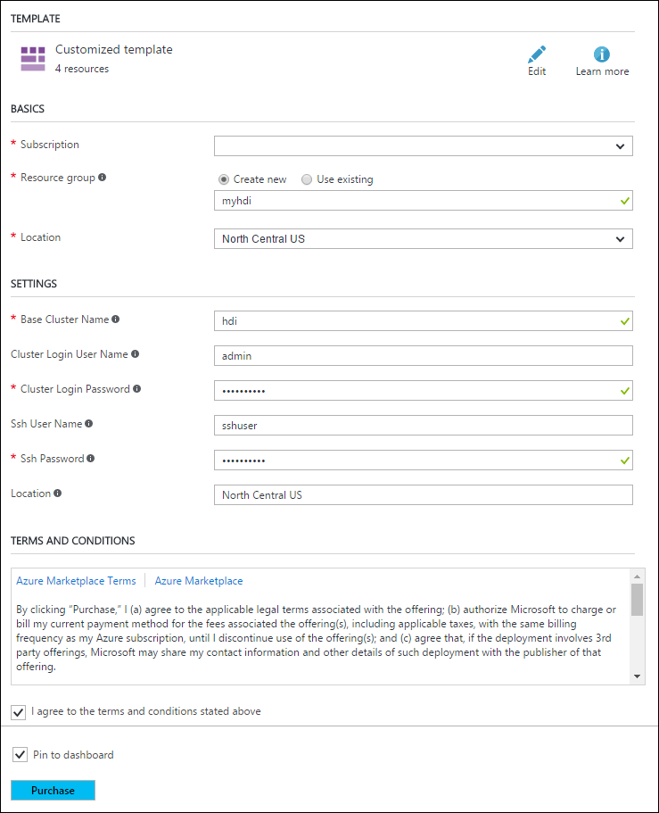
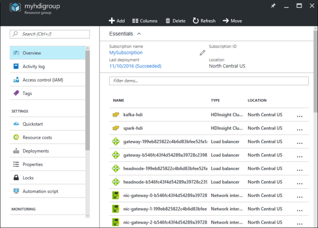

# Apache Spark streaming (DStream) example with Apache Kafka on HDInsight

Learn how to use [Apache Spark](https://spark.apache.org/) to stream data into or out of [Apache Kafka](https://kafka.apache.org/) on HDInsight using [DStreams](https://spark.apache.org/docs/latest/api/java/org/apache/spark/streaming/dstream/DStream.html). This example uses a [Jupyter Notebook](https://jupyter.org/) that runs on the Spark cluster.

> [!NOTE]  
> The steps in this document create an Azure resource group that contains both a Spark on HDInsight and a Kafka on HDInsight cluster. These clusters are both located within an Azure Virtual Network, which allows the Spark cluster to directly communicate with the Kafka cluster.
>
> When you are done with the steps in this document, remember to delete the clusters to avoid excess charges.

> [!IMPORTANT]  
> This example uses DStreams, which is an older Spark streaming technology. For an example that uses newer Spark streaming features, see the [Spark Structured Streaming with Apache Kafka](hdinsight-apache-kafka-spark-structured-streaming.md) document.

## Create the clusters

Apache Kafka on HDInsight does not provide access to the Kafka brokers over the public internet. Anything that talks to Kafka must be in the same Azure virtual network as the nodes in the Kafka cluster. For this example, both the Kafka and Spark clusters are located in an Azure virtual network. The following diagram shows how communication flows between the clusters:

> [!NOTE]  
> Though Kafka itself is limited to communication within the virtual network, other services on the cluster such as SSH and Ambari can be accessed over the internet. For more information on the public ports available with HDInsight, see [Ports and URIs used by HDInsight](hdinsight-hadoop-port-settings-for-services.md).

While you can create an Azure virtual network, Kafka, and Spark clusters manually, it's easier to use an Azure Resource Manager template. Use the following steps to deploy an Azure virtual network, Kafka, and Spark clusters to your Azure subscription.

1. Use the following button to sign in to Azure and open the template in the Azure portal.
    
    
    
    The Azure Resource Manager template is located at **https://hditutorialdata.blob.core.windows.net/armtemplates/create-linux-based-kafka-spark-cluster-in-vnet-v4.1.json**.

    > [!WARNING]  
    > To guarantee availability of Kafka on HDInsight, your cluster must contain at least three worker nodes. This template creates a Kafka cluster that contains three worker nodes.

    This template creates an HDInsight 3.6 cluster for both Kafka and Spark.

2. Use the following information to populate the entries on the **Custom deployment** section:
   
    
   
    * **Resource group**: Create a group or select an existing one. This group contains the HDInsight cluster.

    * **Location**: Select a location geographically close to you.

    * **Base Cluster Name**: This value is used as the base name for the Spark and Kafka clusters. For example, entering **hdistreaming** creates a Spark cluster named __spark-hdistreaming__ and a Kafka cluster named **kafka-hdistreaming**.

    * **Cluster Login User Name**: The admin user name for the Spark and Kafka clusters.

    * **Cluster Login Password**: The admin user password for the Spark and Kafka clusters.

    * **SSH User Name**: The SSH user to create for the Spark and Kafka clusters.

    * **SSH Password**: The password for the SSH user for the Spark and Kafka clusters.

3. Read the **Terms and Conditions**, and then select **I agree to the terms and conditions stated above**.

4. Finally, select **Purchase**. It takes about 20 minutes to create the clusters.

Once the resources have been created, a summary page appears.

> [!IMPORTANT]  
> Notice that the names of the HDInsight clusters are **spark-BASENAME** and **kafka-BASENAME**, where BASENAME is the name you provided to the template. You use these names in later steps when connecting to the clusters.

## Use the notebooks

The code for the example described in this document is available at [https://github.com/Azure-Samples/hdinsight-spark-scala-kafka](https://github.com/Azure-Samples/hdinsight-spark-scala-kafka).

To complete this example, follow the steps in the `README.md`.

## Delete the cluster

[!INCLUDE [delete-cluster-warning](../../includes/hdinsight-delete-cluster-warning.md)]

Since the steps in this document create both clusters in the same Azure resource group, you can delete the resource group in the Azure portal. Deleting the group removes all resources created by following this document, the Azure Virtual Network, and storage account used by the clusters.

## Next steps

In this example, you learned how to use Spark to read and write to Kafka. Use the following links to discover other ways to work with Kafka:

* [Get started with Apache Kafka on HDInsight](kafka/apache-kafka-get-started.md)
* [Use MirrorMaker to create a replica of Apache Kafka on HDInsight](kafka/apache-kafka-mirroring.md)
* [Use Apache Storm with Apache Kafka on HDInsight](hdinsight-apache-storm-with-kafka.md)

