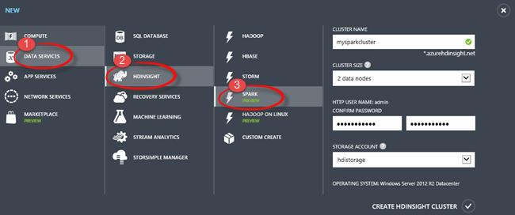
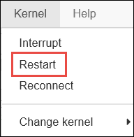

<properties 
	pageTitle="Create a Spark cluster on HDInsight and use Spark SQL from Zeppelin and Jupyter for interactive analysis | Azure" 
	description="Step-by-step instructions on how to quickly create an Apache Spark cluster in HDInsight and then use Spark SQL from Zeppelin and Jupyter notebooks to run interactive queries." 
	services="hdinsight" 
	documentationCenter="" 
	authors="nitinme" 
	manager="paulettm" 
	editor="cgronlun"/>

<tags 
	ms.service="hdinsight" 
	ms.workload="big-data" 
	ms.tgt_pltfrm="na" 
	ms.devlang="na" 
	ms.topic="article" 
	ms.date="03/07/2016" 
	ms.author="nitinme"/>

# Quick Start: Create Apache Spark on HDInsight Windows and run interactive queries using Spark SQL (Preview)

[AZURE.INCLUDE [hdinsight-azure-portal](../../includes/hdinsight-azure-portal.md)]

* [Create Apache Spark on HDInsight and run interactive queries using Spark SQL](hdinsight-apache-spark-jupyter-spark-sql.md)

Learn how to create an Apache Spark cluster in HDInsight using the Quick Create option and then use the web-based [Zeppelin](https://zeppelin.incubator.apache.org) and [Jupyter](https://jupyter.org) notebooks to run Spark SQL interactive queries on the Spark cluster.

   

[AZURE.INCLUDE [delete-cluster-warning](../../includes/hdinsight-delete-cluster-warning.md)]

**Prerequisites:**

Before you begin this tutorial, you must have an Azure subscription. See [Get Azure free trial](https://azure.microsoft.com/documentation/videos/get-azure-free-trial-for-testing-hadoop-in-hdinsight/).

##Create an Azure Storage account

When you create an HDInsight cluster in HDInsight, you specify an Azure Storage account. A specific Blob storage container from that account is designated as the default file system. By default, the HDInsight cluster is created in the same data center as the storage account you specify. For more information, see [Use Azure Blob storage with HDInsight][hdinsight-storage].

**To create an Azure Storage account**

1. Sign in to the [Azure Portal][azure-management-portal].
2. Click **NEW** in the lower-left corner and then enter the values as shown in the image.

	

>[AZURE.NOTE]  Make sure you create the storage account in a location that is supported for the cluster.

Select the new storage account from the list and click **MANAGE ACCESS KEYS** at the bottom of the page. Make a note of the **PRIMARY ACCESS KEY** (or the **SECONDARY ACCESS KEY**—either of the keys work).  You will need this later in the tutorial. For more information, see [How to Create a Storage Account][azure-create-storageaccount] .
	
##Create an HDInsight Spark cluster

In this section, you create an HDInsight version 3.2 cluster, which is based on Spark version 1.3.1. For information about HDInsight versions and their SLAs, see [HDInsight component versioning](hdinsight-component-versioning.md).

>[AZURE.NOTE] The steps in this article create an Apache Spark cluster in HDInsight by using basic configuration settings. For information about other cluster configuration settings (such as using additional storage, Azure virtual network, or a metastore for Hive), see [Create HDInsight clusters using custom options](hdinsight-apache-spark-provision-clusters.md).

**To create a Spark cluster** 

1. Sign in to the [Azure Portal][azure-management-portal]. 

2. Click **NEW** in the lower-left corner and then enter the values as shown in the image.

	

##Run interactive Spark SQL queries using a Zeppelin notebook

After you have created a cluster, you can use a web-based Zeppelin notebook to run Spark SQL interactive queries against the Spark HDInsight cluster. In this section, we will use a sample data file (hvac.csv) available by default on the cluster to run some interactive Spark SQL queries.

>[AZURE.NOTE] The notebook you create following the instructions below is also available by default on the cluster. After you have launched Zeppelin, you will find this notebook by the name **Zeppelin HVAC tutorial**.

1. From the [Azure Portal][azure-management-portal] left pane, click **HDInsight**, and then click the Spark cluster you created. From the Spark cluster page, from the bottom pane, click **Zeppelin Notebook**. If prompted, enter the admin credentials for the cluster.

	> [AZURE.NOTE] You may also reach the Zeppelin Notebook for your cluster by opening the following URL in your browser. Replace __CLUSTERNAME__ with the name of your cluster:
	>
	> `https://CLUSTERNAME.azurehdinsight.net/zeppelin`

2. Create a new notebook. From the header pane, click **Notebook**, and then click **Create New Note**.

	

	On the same page, under the **Notebook** heading, you should see a new notebook with the name starting with **Note XXXXXXXXX**. Click the new notebook.

3. On the web page for the new notebook, click the heading, and change the name of the notebook if you want to. Press ENTER to save the name change. Also, make sure the notebook header shows a **Connected** status in the top-right corner.

	

4. Load sample data into a temporary table. When you create a Spark cluster in HDInsight, the sample data file, **hvac.csv**, is copied to the associated storage account under **\HdiSamples\SensorSampleData\hvac**.

	In the empty paragraph that is created by default in the new notebook, paste the following snippet.

		// Create an RDD using the default Spark context, sc
		val hvacText = sc.textFile("wasb:///HdiSamples/SensorSampleData/hvac/HVAC.csv")
		
		// Define a schema
		case class Hvac(date: String, time: String, targettemp: Integer, actualtemp: Integer, buildingID: String)
		
		// Map the values in the .csv file to the schema
		val hvac = hvacText.map(s => s.split(",")).filter(s => s(0) != "Date").map(
    		s => Hvac(s(0), 
            		s(1),
            		s(2).toInt,
            		s(3).toInt,
            		s(6)
        	)
		).toDF()
		
		// Register as a temporary table called "hvac"
		hvac.registerTempTable("hvac")
		
	Press **SHIFT + ENTER** or click the **Play** button for the paragraph to run the snippet. The status on the right-corner of the paragraph should progress from READY, PENDING, RUNNING to FINISHED. The output shows up at the bottom of the same paragraph. The screenshot looks like the following:

	

	You can also provide a title to each paragraph. From the right-hand corner, click the **Settings** icon, and then click **Show title**.

5. You can now run Spark SQL statements on the **hvac** table. Paste the following query in a new paragraph. The query retrieves the building ID and the difference between the target and actual temperatures for each building on a given date. Press **SHIFT + ENTER**.

		%sql
		select buildingID, (targettemp - actualtemp) as temp_diff, date 
		from hvac
		where date = "6/1/13" 

	The **%sql** statement at the beginning tells the notebook to use the Spark  SQL interpreter. You can look at the defined interpreters from the **Interpreter** tab in the notebook header.

	The following screenshot shows the output.

	

	 Click the display options (highlighted in rectangle) to switch between different representations for the same output. Click **Settings** to choose what consitutes the key and values in the output. The screen capture above uses **buildingID** as the key and the average of **temp_diff** as the value.

	
6. You can also run Spark SQL statements using variables in the query. The next snippet shows how to define a variable, **Temp**, in the query with the possible values you want to query with. When you first run the query, a drop-down is automatically populated with the values you specified for the variable.

		%sql
		select buildingID, date, targettemp, (targettemp - actualtemp) as temp_diff
		from hvac
		where targettemp > "${Temp = 65,65|75|85}" 

	Paste this snippet in a new paragraph and press **SHIFT + ENTER**. The following screenshot shows the output.

	

	For subsequent queries, you can select a new value from the drop-down and run the query again. Click **Settings** to choose what consitutes the key and values in the output. The screen capture above uses **buildingID** as the key, the average of **temp_diff** as the value, and **targettemp** as the group.

7. Restart the Spark SQL interpreter to exit the application. Click the **Interpreter** tab at the top, and for the Spark interpreter, click **Restart**.

	

##Run Spark SQL queries using a Jupyter notebook

In this section, you use a Jupyter notebook to run Spark SQL queries against a Spark cluster.

>[AZURE.NOTE] The notebook you create following the instructions below is also available by default on the cluster. After you have launched Jupyter, you will find this notebook by the name **HVACTutorial.ipynb**.

1. From the [Azure Portal][azure-management-portal] left pane, click **HDInsight**, and then click the Spark cluster you created. From the Spark cluster page, from the bottom pane, click **Zeppelin Notebook**. If prompted, enter the admin credentials for the cluster.

	> [AZURE.NOTE] You may also reach the Jupyter Notebook for your cluster by opening the following URL in your browser. Replace __CLUSTERNAME__ with the name of your cluster:
	>
	> `https://CLUSTERNAME.azurehdinsight.net/jupyter`

2. Create a new notebook. Click **New**, and then click **Python2**.

	

3. A new notebook is created and opened with the name Untitled.pynb. Click the notebook name at the top, and enter a friendly name.

	

4. Import the required modules and create the Spark and SQL contexts. Paste the following snippet in an empty cell, and then press **SHIFT + ENTER**.

		from pyspark import SparkContext
		from pyspark.sql import SQLContext
		from pyspark.sql.types import *

		# Create Spark and SQL contexts
		sc = SparkContext('spark://headnodehost:7077', 'pyspark')
		sqlContext = SQLContext(sc)

	Everytime you run a job in Jupyter, your web browser window title will show a **(Busy)** status along with the notebook title. You will also see a solid circle next to the **Python 2** text in the top-right corner. After the job completes, this will change to a hollow circle.

	 

4. Load sample data into a temporary table. When you create a Spark cluster in HDInsight, the sample data file, **hvac.csv**, is copied to the associated storage account under **\HdiSamples\SensorSampleData\hvac**.

	In an empty cell, paste the following snippet and press **SHIFT + ENTER**. This snippet registers the data into a temporary table called **hvac**.

		# Load the data
		hvacText = sc.textFile("wasb:///HdiSamples/SensorSampleData/hvac/HVAC.csv")
		
		# Create the schema
		hvacSchema = StructType([StructField("date", StringType(), False),StructField("time", StringType(), False),StructField("targettemp", IntegerType(), False),StructField("actualtemp", IntegerType(), False),StructField("buildingID", StringType(), False)])
		
		# Parse the data in hvacText
		hvac = hvacText.map(lambda s: s.split(",")).filter(lambda s: s[0] != "Date").map(lambda s:(str(s[0]), str(s[1]), int(s[2]), int(s[3]), str(s[6]) ))
		
		# Create a data frame
		hvacdf = sqlContext.createDataFrame(hvac,hvacSchema)
		
		# Register the data fram as a table to run queries against
		hvacdf.registerAsTable("hvac")
		
		# Run queries against the table and display the data
		data = sqlContext.sql("select buildingID, (targettemp - actualtemp) as temp_diff, date from hvac where date = \"6/1/13\"")
		data.show()

5. Once the job completes successfully, the following output is displayed.

		buildingID temp_diff date  
		4          8         6/1/13
		3          2         6/1/13
		7          -10       6/1/13
		12         3         6/1/13
		7          9         6/1/13
		7          5         6/1/13
		3          11        6/1/13
		8          -7        6/1/13
		17         14        6/1/13
		16         -3        6/1/13
		8          -8        6/1/13
		1          -1        6/1/13
		12         11        6/1/13
		3          14        6/1/13
		6          -4        6/1/13
		1          4         6/1/13
		19         4         6/1/13
		19         12        6/1/13
		9          -9        6/1/13
		15         -10       6/1/13

6. Restart the kernel to exit the application. From the top menu bar, click **Kernel**, click **Restart**, and then click **Restart** again at the prompt.

	

##Delete the cluster

[AZURE.INCLUDE [delete-cluster-warning](../../includes/hdinsight-delete-cluster-warning.md)]

##See also

* [Overview: Apache Spark on Azure HDInsight](hdinsight-apache-spark-overview-v1.md)
* [Create a Spark on HDInsight cluster](hdinsight-apache-spark-provision-clusters.md)
* [Perform interactive data analysis using Spark in HDInsight with BI tools](hdinsight-apache-spark-use-bi-tools-v1.md)
* [Use Spark in HDInsight for building machine learning applications](hdinsight-apache-spark-ipython-notebook-machine-learning-v1.md)
* [Use Spark in HDInsight for building real-time streaming applications](hdinsight-apache-spark-csharp-apache-zeppelin-eventhub-streaming.md)
* [Manage resources for the Apache Spark cluster in Azure HDInsight](hdinsight-apache-spark-resource-manager-v1.md)

[hdinsight-versions]: hdinsight-component-versioning.md
[hdinsight-upload-data]: hdinsight-upload-data.md
[hdinsight-storage]: hdinsight-hadoop-use-blob-storage.md

[azure-purchase-options]: http://azure.microsoft.com/pricing/purchase-options/
[azure-member-offers]: http://azure.microsoft.com/pricing/member-offers/
[azure-free-trial]: http://azure.microsoft.com/pricing/free-trial/
[azure-management-portal]: https://manage.windowsazure.com/
[azure-create-storageaccount]: storage-create-storage-account.md

