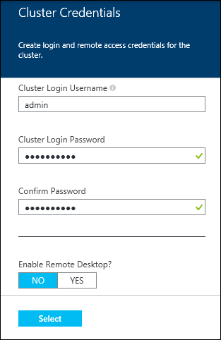
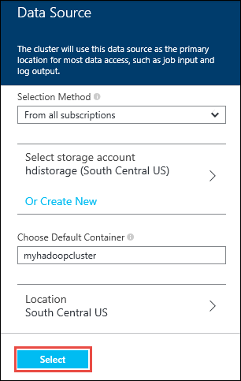
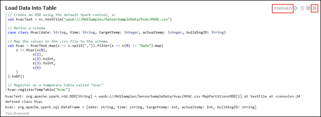

<properties
	pageTitle="Provision a Spark cluster on Azure HDInsight and use Spark SQL from Zeppelin and Jupyter for interactive analysis | Microsoft Azure"
	description="Step-by-step instructions on how to quickly provision an Apache Spark cluster in HDInsight and then use Spark SQL from Zeppelin and Jupyter notebooks to run interactive queries."
	services="hdinsight"
	documentationCenter=""
	authors="nitinme"
	manager="paulettm"
	editor="cgronlun"
	tags="azure-portal"/>

<tags
	ms.service="hdinsight"
	ms.workload="big-data"
	ms.tgt_pltfrm="na"
	ms.devlang="na"
	ms.topic="article"
	ms.date="08/07/2015"
	ms.author="nitinme"/>

# Get started: Provision Apache Spark on Azure HDInsight and run interactive queries using Spark SQL

[AZURE.INCLUDE [hdinsight-azure-preview-portal](../../includes/hdinsight-azure-preview-portal.md)]

* [Provision Apache Spark on HDInsight and run interactive queries using Spark SQL](hdinsight-apache-spark-zeppelin-notebook-jupyter-spark-sql-v1.md)

Learn how to provision an Apache Spark cluster in HDInsight using the Quick Create option and then use the web-based [Zeppelin](https://zeppelin.incubator.apache.org) and [Jupyter](https://jupyter.org) notebooks to run Spark SQL interactive queries on the Spark cluster.

   

**Prerequisites:**

Before you begin this tutorial, you must have an Azure subscription. See [Get Azure free trial](http://azure.microsoft.com/documentation/videos/get-azure-free-trial-for-testing-hadoop-in-hdinsight/).

## Provision an HDInsight Spark cluster

In this section, you provision an HDInsight version 3.2 cluster, which is based on Spark version 1.3.1. For information about HDInsight versions and their SLAs, see [HDInsight component versioning](hdinsight-component-versioning.md).

>[AZURE.NOTE] The steps in this article create an Apache Spark cluster in HDInsight by using basic configuration settings. For information about other cluster configuration settings (such as using additional storage, an Azure virtual network, or a metastore for Hive), see [Provision HDInsight clusters using custom options](hdinsight-apache-spark-provision-clusters.md).

**To provision a Spark cluster**

1. Sign in to the [Azure preview portal](https://ms.portal.azure.com/).

2. Click **NEW**, click **Data + Analytics**, and then click **HDInsight**.

    

3. Enter a **Cluster Name**, select **Hadoop** for the **Cluster Type**, and from the **Cluster Operating System** drop-down menu, select **Windows Server 2012 R2 Datacenter**. A green check appears beside the cluster name if it is available.

	

4. If you have more than one subscription, click the **Subscription** entry to select the Azure subscription to use for the cluster.

5. Click **Resource Group** to see a list of existing resource groups and select where to create the cluster. Or, you can click **Create New** and then enter the name of the new resource group. A green check appears to indicate if the new group name is available.

	> [AZURE.NOTE] This entry defaults to one of your existing resource groups, if any are available.

6. Click **Credentials**, and then enter a **Cluster Login Username** and **Cluster Login Password**. If you want to enable Remote Desktop on the cluster node, for **Enable Remote Desktop**, click **Yes**, and then specify the required values. This tutorial does not require remote desktop so you can skip this. Click **Select** at the bottom to save the credentials configuration.

	

7. Click **Data Source** to choose an existing data source for the cluster, or create a new one. When you provision a Hadoop cluster in HDInsight, you specify an Azure Storage account. A specific Blob storage container from that account is designated as the default file system, like in the Hadoop distributed file system (HDFS). By default, the HDInsight cluster is provisioned in the same data center as the storage account you specify. For more information, see [Use Azure Blob storage with HDInsight][hdinsight-storage]

	

	Currently you can select an Azure Storage Account as the data source for an HDInsight cluster. Use the following to understand the entries on the **Data Source** blade.

	- **Selection Method**: Set this to **From all subscriptions** to enable browsing of storage accounts from all your subscriptions. Set this to **Access Key** if you want to enter the **Storage Name** and **Access Key** of an existing storage account.

	- **Select storage account / Create New**: Click **Select storage account** to browse and select an existing storage account you want to associate with the cluster. Or, click **Create New** to create a new storage account. Use the field that appears to enter the name of the storage account. A green check appears if the name is available.

	- **Choose Default Container**: Use this to enter the name of the default container to use for the cluster. While you can enter any name here, we recommend using the same name as the cluster so that you can easily recognize that the container is used for this specific cluster.

	- **Location**: The geographic region that the storage account is in, or will be created in.

		> [AZURE.IMPORTANT] Selecting the location for the default data source also sets the location of the HDInsight cluster. The cluster and default data source must be located in the same region.

	Click **Select** to save the data source configuration.

8. Click **Node Pricing Tiers** to display information about the nodes that will be created for this cluster. Set the number of worker nodes that you need for the cluster. The estimated cost of the cluster will be shown within the blade.

	

	Click **Select** to save the node pricing configuration.

9. On the **New HDInsight Cluster** blade, ensure that **Pin to Startboard** is selected, and then click **Create**. This creates the cluster and adds a tile for it to the Startboard of your Azure portal. The icon will indicate that the cluster is provisioning, and will change to display the HDInsight icon once provisioning has completed.

	| While provisioning | Provisioning complete |
	| ------------------ | --------------------- |
	|  |  |

	> [AZURE.NOTE] It will take some time for the cluster to be created, usually around 15 minutes. Use the tile on the Startboard, or the **Notifications** entry on the left of the page to check on the provisioning process.

10. Once the provisioning is complete, click the tile for the Spark cluster from the Startboard to launch the cluster blade.

## Run interactive Spark SQL queries using a Zeppelin notebook

After you have provisioned a cluster, you can use a web-based Zeppelin notebook to run Spark SQL interactive queries against the Spark HDInsight cluster. In this section, we will use a sample data file (hvac.csv) available by default on the cluster to run some interactive Spark SQL queries.

>[AZURE.NOTE] The notebook you create by following the instructions below is also available by default on the cluster. After you have launched Zeppelin, you will find this notebook by the name **Zeppelin HVAC tutorial**.

1. Launch the Zeppelin notebook. From the Spark cluster blade, click **Quick Links**, and then from the **Cluster Dashboard** blade, click **Zeppelin Notebook**. When prompted, enter the admin credentials for the cluster. Follow the instructions on the page that opens up to launch the notebook.

2. Create a new notebook. From the header pane, click **Notebook**, and then click **Create New Note**.

	

	On the same page, under the **Notebook** heading, you should see a new notebook with the name starting with **Note XXXXXXXXX**. Click the new notebook.

3. On the webpage for the new notebook, click the heading, and change the name of the notebook if you want to. Press ENTER to save the name change. Also, make sure the notebook header shows a **Connected** status in the top-right corner.

	

4. Load sample data into a temporary table. When you provision a Spark cluster in HDInsight, the sample data file, **hvac.csv**, is copied to the associated storage account under **\HdiSamples\SensorSampleData\hvac**.

	In the empty paragraph that is created by default in the new notebook, paste the following code:

		// Create an RDD using the default Spark context, sc
		val hvacText = sc.textFile("wasb:///HdiSamples/SensorSampleData/hvac/HVAC.csv")

		// Define a schema
		case class Hvac(date: String, time: String, targettemp: Integer, actualtemp: Integer, buildingID: String)

		// Map the values in the .csv file to the schema
		val hvac = hvacText.map(s => s.split(",")).filter(s => s(0) != "Date").map(
    		s => Hvac(s(0),
            		s(1),
            		s(2).toInt,
            		s(3).toInt,
            		s(6)
        	)
		).toDF()

		// Register as a temporary table called "hvac"
		hvac.registerTempTable("hvac")

	Press **SHIFT + ENTER** on the keyboard or click the **Play** button for the paragraph to run the code. The status in the upper right corner of the paragraph should progress from READY, PENDING, RUNNING to FINISHED. The output appears at the bottom of the same paragraph. The screenshot looks like the following:

	

	You can also provide a title to each paragraph. From the right-hand corner, click the **Settings** icon, and then click **Show title**.

5. You can now run Spark SQL statements on the **hvac** table. Paste the following query in a new paragraph. The query retrieves the building ID and the difference between the target and actual temperatures for each building on a given date. Press **SHIFT + ENTER**.

		%sql
		select buildingID, (targettemp - actualtemp) as temp_diff, date
		from hvac
		where date = "6/1/13"

	The **%sql** statement at the beginning tells the notebook to use the Spark  SQL interpreter. You can look at the defined interpreters from the **Interpreter** tab in the notebook header.

	The following screenshot shows the output.

	

	Click the display options (highlighted in rectangle) to switch between different representations for the same output. Click **Settings** to choose what consitutes the key and values in the output. The screen capture above uses **buildingID** as the key and the average of **temp_diff** as the value.

6. You can also run Spark SQL statements using variables in the query. The next code example shows how to define a variable, **Temp**, in the query with the possible values you want to query with. When you first run the query, a drop-down is automatically populated with the values you specified for the variable.

		%sql
		select buildingID, date, targettemp, (targettemp - actualtemp) as temp_diff
		from hvac
		where targettemp > "${Temp = 65,65|75|85}"

	Paste this code example in a new paragraph and press **SHIFT + ENTER**. The following screenshot shows the output.

	

	For subsequent queries, you can select a new value from the drop-down and run the query again. Click **Settings** to choose what consitutes the key and values in the output. The screen capture above uses **buildingID** as the key, the average of **temp_diff** as the value, and **targettemp** as the group.

7. Restart the Spark SQL interpreter to exit the application. Click the **Interpreter** tab at the top, and for the Spark interpreter, click **Restart**.

	

## Run Spark SQL queries using a Jupyter notebook

In this section, you use a Jupyter notebook to run Spark SQL queries against a Spark cluster.

>[AZURE.NOTE] The notebook you create by following the instructions below is also available by default on the cluster. After you have launched Jupyter, you will find this notebook by the name **HVACTutorial.ipynb**.

1. Launch the Jupyter notebook. From the Spark cluster blade, click **Quick Links**, and then from the **Cluster Dashboard** blade, click **Jupyter Notebook**. When prompted, enter the admin credentials for the Spark cluster.

2. Create a new notebook. Click **New**, and then click **Python2**.

	

3. A new notebook is created and opened with the name Untitled.pynb. Click the notebook name at the top, and enter a friendly name.

	

4. Import the required modules and create the Spark and SQL contexts. Paste the following code example in an empty cell, and then press **SHIFT + ENTER**.

		from pyspark import SparkContext
		from pyspark.sql import SQLContext
		from pyspark.sql.types import *

		# Create Spark and SQL contexts
		sc = SparkContext('spark://headnodehost:7077', 'pyspark')
		sqlContext = SQLContext(sc)

	Every time you run a job in Jupyter, your web browser window title will show a **(Busy)** status along with the notebook title. You will also see a solid circle next to the **Python 2** text in the top-right corner. After the job is completed, this will change to a hollow circle.

	 

4. Load sample data into a temporary table. When you provision a Spark cluster in HDInsight, the sample data file, **hvac.csv**, is copied to the associated storage account under **\HdiSamples\SensorSampleData\hvac**.

	In an empty cell, paste the following code example and press **SHIFT + ENTER**. This code example registers the data into a temporary table called **hvac**.

		# Load the data
		hvacText = sc.textFile("wasb:///HdiSamples/SensorSampleData/hvac/HVAC.csv")

		# Create the schema
		hvacSchema = StructType([StructField("date", StringType(), False),StructField("time", StringType(), False),StructField("targettemp", IntegerType(), False),StructField("actualtemp", IntegerType(), False),StructField("buildingID", StringType(), False)])

		# Parse the data in hvacText
		hvac = hvacText.map(lambda s: s.split(",")).filter(lambda s: s[0] != "Date").map(lambda s:(str(s[0]), str(s[1]), int(s[2]), int(s[3]), str(s[6]) ))

		# Create a data frame
		hvacdf = sqlContext.createDataFrame(hvac,hvacSchema)

		# Register the data fram as a table to run queries against
		hvacdf.registerAsTable("hvac")

		# Run queries against the table and display the data
		data = sqlContext.sql("select buildingID, (targettemp - actualtemp) as temp_diff, date from hvac where date = \"6/1/13\"")
		data.show()

5. Once the job is completed successfully, the following output is displayed.

		buildingID temp_diff date  
		4          8         6/1/13
		3          2         6/1/13
		7          -10       6/1/13
		12         3         6/1/13
		7          9         6/1/13
		7          5         6/1/13
		3          11        6/1/13
		8          -7        6/1/13
		17         14        6/1/13
		16         -3        6/1/13
		8          -8        6/1/13
		1          -1        6/1/13
		12         11        6/1/13
		3          14        6/1/13
		6          -4        6/1/13
		1          4         6/1/13
		19         4         6/1/13
		19         12        6/1/13
		9          -9        6/1/13
		15         -10       6/1/13

6. Restart the kernel to exit the application. From the top menu bar, click **Kernel**, click **Restart**, and then click **Restart** again at the prompt.

	

## See also

* [Overview: Apache Spark on Azure HDInsight](hdinsight-apache-spark-overview.md)
* [Provision a Spark on HDInsight cluster](hdinsight-apache-spark-provision-clusters.md)
* [Perform interactive data analysis using Spark in HDInsight with BI tools](hdinsight-apache-spark-use-bi-tools.md)
* [Use Spark in HDInsight for building machine learning applications](hdinsight-apache-spark-ipython-notebook-machine-learning.md)
* [Use Spark in HDInsight for building real-time streaming applications](hdinsight-apache-spark-csharp-apache-zeppelin-eventhub-streaming.md)
* [Manage resources for the Apache Spark cluster in Azure HDInsight](hdinsight-apache-spark-resource-manager.md)

[hdinsight-versions]: ../hdinsight-component-versioning/
[hdinsight-upload-data]: ../hdinsight-upload-data/
[hdinsight-storage]: ../hdinsight-use-blob-storage/

[azure-purchase-options]: http://azure.microsoft.com/pricing/purchase-options/
[azure-member-offers]: http://azure.microsoft.com/pricing/member-offers/
[azure-free-trial]: http://azure.microsoft.com/pricing/free-trial/
[azure-management-portal]: https://manage.windowsazure.com/
[azure-create-storageaccount]: ../storage-create-storage-account/
