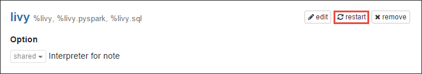

# Use Zeppelin notebooks with Apache Spark cluster on Azure HDInsight

HDInsight Spark clusters include Zeppelin notebooks that you can use to run Spark jobs. In this article, you learn how to use the Zeppelin notebook on an HDInsight cluster.

> [!NOTE]
> Zeppelin notebooks are available only for Spark 1.6.3 on HDInsight 3.5 and Spark 2.1.0 on HDInsight 3.6.
>

**Prerequisites:**

* An Azure subscription. See [Get Azure free trial](https://azure.microsoft.com/documentation/videos/get-azure-free-trial-for-testing-hadoop-in-hdinsight/).
* An Apache Spark cluster on HDInsight. For instructions, see [Create Apache Spark clusters in Azure HDInsight](hdinsight-apache-spark-jupyter-spark-sql.md).

## Launch a Zeppelin notebook
1. From the Spark cluster blade, click **Cluster Dashboard**, and then click **Zeppelin Notebook**. If prompted, enter the admin credentials for the cluster.
   
   > [!NOTE]
   > You may also reach the Zeppelin Notebook for your cluster by opening the following URL in your browser. Replace **CLUSTERNAME** with the name of your cluster:
   > 
   > `https://CLUSTERNAME.azurehdinsight.net/zeppelin`
   > 
   > 
2. Create a new notebook. From the header pane, click **Notebook**, and then click **Create New Note**.
   
    
   
    Enter a name for the notebook, and then click **Create Note**.
3. Also, make sure the notebook header shows a connected status. It is denoted by a green dot in the top-right corner.
   
    
4. Load sample data into a temporary table. When you create a Spark cluster in HDInsight, the sample data file, **hvac.csv**, is copied to the associated storage account under **\HdiSamples\SensorSampleData\hvac**.
   
    In the empty paragraph that is created by default in the new notebook, paste the following snippet.
   
        %livy.spark
        //The above magic instructs Zeppelin to use the Livy Scala interpreter
   
        // Create an RDD using the default Spark context, sc
        val hvacText = sc.textFile("wasb:///HdiSamples/HdiSamples/SensorSampleData/hvac/HVAC.csv")
   
        // Define a schema
        case class Hvac(date: String, time: String, targettemp: Integer, actualtemp: Integer, buildingID: String)
   
        // Map the values in the .csv file to the schema
        val hvac = hvacText.map(s => s.split(",")).filter(s => s(0) != "Date").map(
            s => Hvac(s(0), 
                    s(1),
                    s(2).toInt,
                    s(3).toInt,
                    s(6)
            )
        ).toDF()
   
        // Register as a temporary table called "hvac"
        hvac.registerTempTable("hvac")
   
    Press **SHIFT + ENTER** or click the **Play** button for the paragraph to run the snippet. The status on the right-corner of the paragraph should progress from READY, PENDING, RUNNING to FINISHED. The output shows up at the bottom of the same paragraph. The screenshot looks like the following:
   
    
   
    You can also provide a title to each paragraph. From the right-hand corner, click the **Settings** icon, and then click **Show title**.
5. You can now run Spark SQL statements on the **hvac** table. Paste the following query in a new paragraph. The query retrieves the building ID and the difference between the target and actual temperatures for each building on a given date. Press **SHIFT + ENTER**.
   
        %sql
        select buildingID, (targettemp - actualtemp) as temp_diff, date from hvac where date = "6/1/13" 
   
    The **%sql** statement at the beginning tells the notebook to use the Livy Scala interpreter.
   
    The following screenshot shows the output.
   
    
   
     Click the display options (highlighted in rectangle) to switch between different representations for the same output. Click **Settings** to choose what consitutes the key and values in the output. The screen capture above uses **buildingID** as the key and the average of **temp_diff** as the value.
6. You can also run Spark SQL statements using variables in the query. The next snippet shows how to define a variable, **Temp**, in the query with the possible values you want to query with. When you first run the query, a drop-down is automatically populated with the values you specified for the variable.
   
        %sql
        select buildingID, date, targettemp, (targettemp - actualtemp) as temp_diff from hvac where targettemp > "${Temp = 65,65|75|85}" 
   
    Paste this snippet in a new paragraph and press **SHIFT + ENTER**. The following screenshot shows the output.
   
    
   
    For subsequent queries, you can select a new value from the drop-down and run the query again. Click **Settings** to choose what consitutes the key and values in the output. The screen capture above uses **buildingID** as the key, the average of **temp_diff** as the value, and **targettemp** as the group.
7. Restart the Livy interpreter to exit the application. To do so, open interpreter settings by clicking the logged in user name from the top-right corner, and then click **Interpreter**.
   
    
8. Scroll to Livy interpreter settings and then click **Restart**.
   
    

## How do I use external packages with the notebook?
You can configure the Zeppelin notebook in Apache Spark cluster on HDInsight (Linux) to use external, community-contributed packages that are not included out-of-the-box in the cluster. You can search the [Maven repository](http://search.maven.org/) for the complete list of packages that are available. You can also get a list of available packages from other sources. For example, a complete list of community-contributed packages is available at [Spark Packages](http://spark-packages.org/).

In this article, you will see how to use the [spark-csv](http://search.maven.org/#artifactdetails%7Ccom.databricks%7Cspark-csv_2.10%7C1.4.0%7Cjar) package with the Jupyter notebook.

1. Open interpreter settings. From the top-right corner, click the logged in user name, and then click **Interpreter**.
   
    
2. Scroll to Livy interpreter settings and then click **Edit**.
   
    
3. Add a new key, called **livy.spark.jars.packages** and set its value in the format `group:id:version`. So, if you want to use the [spark-csv](http://search.maven.org/#artifactdetails%7Ccom.databricks%7Cspark-csv_2.10%7C1.4.0%7Cjar) package, you must set the value of the key to `com.databricks:spark-csv_2.10:1.4.0`.
   
    
   
    Click **Save** and then restart the Livy interpreter.
4. **Tip**: If you want to understand how to arrive at the value of the key entered above, here's how.
   
    a. Locate the package in the Maven Repository. For this tutorial, we used [spark-csv](http://search.maven.org/#artifactdetails%7Ccom.databricks%7Cspark-csv_2.10%7C1.4.0%7Cjar).
   
    b. From the repository, gather the values for **GroupId**, **ArtifactId**, and **Version**.
   
    
   
    c. Concatenate the three values, separated by a colon (**:**).
   
        com.databricks:spark-csv_2.10:1.4.0

## Where are the Zeppelin notebooks saved?
The Zeppelin notebooks are saved to the cluster headnodes. So, if you delete the cluster, the notebooks will be deleted as well. If you want to preserve your notebooks for later use on other clusters, you must export them after you have finished running the jobs. To export a notebook, click the **Export** icon as shown in the image below.

This saves the notebook as a JSON file in your download location.

## Livy session management
When you run the first code paragraph in your Zeppelin notebook, a new Livy session is created in your HDInsight Spark cluster. This session is shared across all Zeppelin notebooks that you subsequently create. If for some reason the Livy session is killed (cluster reboot, etc.), you will not be able to run jobs from the Zeppelin notebook.

In such a case, you must perform the following steps before you can start running jobs from a Zeppelin notebook. 

1. Restart the Livy interpreter from the Zeppelin notebook. To do so, open interpreter settings by clicking the logged in user name from the top-right corner, and then click **Interpreter**.
   
    
2. Scroll to Livy interpreter settings and then click **Restart**.
   
    
3. Run a code cell from an existing Zeppelin notebook. This creates a new Livy session in the HDInsight cluster.

## See also
* [Overview: Apache Spark on Azure HDInsight](hdinsight-apache-spark-overview.md)

### Scenarios
* [Spark with BI: Perform interactive data analysis using Spark in HDInsight with BI tools](hdinsight-apache-spark-use-bi-tools.md)
* [Spark with Machine Learning: Use Spark in HDInsight for analyzing building temperature using HVAC data](hdinsight-apache-spark-ipython-notebook-machine-learning.md)
* [Spark with Machine Learning: Use Spark in HDInsight to predict food inspection results](hdinsight-apache-spark-machine-learning-mllib-ipython.md)
* [Spark Streaming: Use Spark in HDInsight for building real-time streaming applications](hdinsight-apache-spark-eventhub-streaming.md)
* [Website log analysis using Spark in HDInsight](hdinsight-apache-spark-custom-library-website-log-analysis.md)

### Create and run applications
* [Create a standalone application using Scala](hdinsight-apache-spark-create-standalone-application.md)
* [Run jobs remotely on a Spark cluster using Livy](hdinsight-apache-spark-livy-rest-interface.md)

### Tools and extensions
* [Use HDInsight Tools Plugin for IntelliJ IDEA to create and submit Spark Scala applicatons](hdinsight-apache-spark-intellij-tool-plugin.md)
* [Use HDInsight Tools Plugin for IntelliJ IDEA to debug Spark applications remotely](hdinsight-apache-spark-intellij-tool-plugin-debug-jobs-remotely.md)
* [Kernels available for Jupyter notebook in Spark cluster for HDInsight](hdinsight-apache-spark-jupyter-notebook-kernels.md)
* [Use external packages with Jupyter notebooks](hdinsight-apache-spark-jupyter-notebook-use-external-packages.md)
* [Install Jupyter on your computer and connect to an HDInsight Spark cluster](hdinsight-apache-spark-jupyter-notebook-install-locally.md)

### Manage resources
* [Manage resources for the Apache Spark cluster in Azure HDInsight](hdinsight-apache-spark-resource-manager.md)
* [Track and debug jobs running on an Apache Spark cluster in HDInsight](hdinsight-apache-spark-job-debugging.md)

[hdinsight-versions]: hdinsight-component-versioning.md
[hdinsight-upload-data]: hdinsight-upload-data.md
[hdinsight-storage]: hdinsight-hadoop-use-blob-storage.md

[azure-purchase-options]: http://azure.microsoft.com/pricing/purchase-options/
[azure-member-offers]: http://azure.microsoft.com/pricing/member-offers/
[azure-free-trial]: http://azure.microsoft.com/pricing/free-trial/
[azure-create-storageaccount]: storage-create-storage-account.md 

