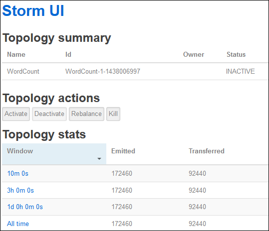
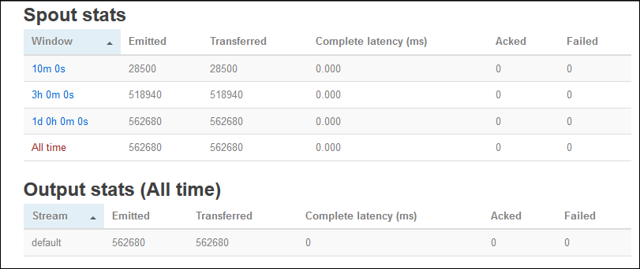

<properties
	pageTitle="Apache Storm tutorial: Get started with Linux-based Storm on HDInsight | Microsoft Azure"
	description="Get started with big data analytics using Apache Storm and the Storm Starter samples on Linux-based HDInsight. Learn how to use Storm to process data real-time."
	keywords="apache storm,apache storm tutorial,big data analytics,storm starter"
	services="hdinsight"
	documentationCenter=""
	authors="Blackmist"
	manager="paulettm"
	editor="cgronlun"/>

<tags
   ms.service="hdinsight"
   ms.devlang="java"
   ms.topic="get-started-article"
   ms.tgt_pltfrm="na"
   ms.workload="big-data"
   ms.date="05/31/2016"
   ms.author="larryfr"/>

# Apache Storm tutorial: Get started with the Storm Starter samples for big data analytics on HDInsight

Apache Storm is a scalable, fault-tolerant, distributed, real-time computation system for processing streams of data. With Storm on Azure HDInsight, you can create a cloud-based Storm cluster that performs big data analytics in real time.

> [AZURE.NOTE] The steps in this article create a Linux-based HDInsight cluster. For steps to create a Windows-based Storm on HDInsight cluster, see [Apache Storm tutorial: Get started with the Storm Starter sample using data analytics on HDInsight](hdinsight-apache-storm-tutorial-get-started.md)

## Before you begin

[AZURE.INCLUDE [delete-cluster-warning](../../includes/hdinsight-delete-cluster-warning.md)]

You must have the following to successfully complete this Apache Storm tutorial:

- **An Azure subscription**. See [Get Azure free trial](https://azure.microsoft.com/documentation/videos/get-azure-free-trial-for-testing-hadoop-in-hdinsight/).

- **Familiarity with SSH and SCP**. For more information on using SSH and SCP with HDInsight, see the following:

    - **Linux, Unix or OS X clients**: See [Use SSH with Linux-based Hadoop on HDInsight from Linux, OS X or Unix](hdinsight-hadoop-linux-use-ssh-unix.md)

	- **Windows clients**: See [Use SSH with Linux-based Hadoop on HDInsight from Windows](hdinsight-hadoop-linux-use-ssh-windows.md)

## Create a Storm cluster

In this section, you create an HDInsight version 3.2 cluster (Storm version 0.9.3) using an Azure ARM template. For information about HDInsight versions and their SLAs, see [HDInsight component versioning](hdinsight-component-versioning.md). For other cluster creation methods, see [Create HDInsight clusters](hdinsight-hadoop-provision-linux-clusters.md).

1. Click the following image to open an ARM template in the Azure Portal.         

    
    
    The ARM template is located in a public blob container, *https://hditutorialdata.blob.core.windows.net/armtemplates/create-linux-based-storm-cluster-in-hdinsight.json*. 
   
2. From the Parameters blade, enter the following:

    - **ClusterName**: Enter a name for the Hadoop cluster that you will create.
    - **Cluster login name and password**: The default login name is admin.
    - **SSH user name and password**.
    
    Please write down these values.  You will need them later in the tutorial.

    > [AZURE.NOTE] SSH is used to remotely access the HDInsight cluster using a command-line. The user name and password you use here is used when connecting to the cluster through SSH. Also, the SSH user name must be unique, as it creates a user account on all the HDInsight cluster nodes. The following are some of the account names reserved for use by services on the cluster, and cannot be used as the SSH user name:
    >
    > root, hdiuser, storm, hbase, ubuntu, zookeeper, hdfs, yarn, mapred, hbase, hive, oozie, falcon, sqoop, admin, tez, hcat, hdinsight-zookeeper.

	> For more information on using SSH with HDInsight, see one of the following articles:

	> * [Use SSH with Linux-based Hadoop on HDInsight from Linux, Unix, or OS X](hdinsight-hadoop-linux-use-ssh-unix.md)
	> * [Use SSH with Linux-based Hadoop on HDInsight from Windows](hdinsight-hadoop-linux-use-ssh-windows.md)

    
3.Click **OK** to save the parameters.

4.From the **Custom deployment** blade, click **Resource group** dropdown box, and then click **New** to create a new resource group. The resource group is a container that groups the cluster, the dependent storage account and other linked resource.

5.Click **Legal terms**, and then click **Create**.

6.Click **Create**. You will see a new tile titled Submitting deployment for Template deployment. It takes about around 20 minutes to create the cluster and SQL database.

##Run a Storm Starter sample on HDInsight

The [storm-starter](https://github.com/apache/storm/tree/master/examples/storm-starter) examples are included on the HDInsight cluster. In the following steps, you will run the WordCount example.

1. Connect to the HDInsight cluster using SSH:

		ssh USERNAME@CLUSTERNAME-ssh.azurehdinsight.net
		
	If you used a password to secure your SSH user account, you will be prompted to enter it. If you used a public key, you may have to use the `-i` parameter to specify the matching private key. For example, `ssh -i ~/.ssh/id_rsa USERNAME@CLUSTERNAME-ssh.azurehdinsight.net`.
		
	For more information on using SSH with Linux-based HDInsight, see the following articles:
	
	* [Use SSH with Linux-based Hadoop on HDInsight from Linux, Unix, or OS X](hdinsight-hadoop-linux-use-ssh-unix.md)

	* [Use SSH with Linux-based Hadoop on HDInsight from Windows](hdinsight-hadoop-linux-use-ssh-windows)

2. Use the following command to start an example topology:

        storm jar /usr/hdp/current/storm-client/contrib/storm-starter/storm-starter-topologies-0.9.3.2.2.4.9-1.jar storm.starter.WordCountTopology wordcount
		
	> [AZURE.NOTE] The `0.9.3.2.2.4.9-1` portion of the file name may change as HDinsight is updated with newer versions of Storm.

    This will start the example WordCount topology on the cluster, with a friendly name of 'wordcount'. It will randomly generate sentences and count the occurrance of each word in the sentences.

    > [AZURE.NOTE] When submitting topology to the cluster, you must first copy the jar file containing the cluster before using the `storm` command. This can be accomplished using the `scp` command from the client where the file exists. For example, `scp FILENAME.jar USERNAME@CLUSTERNAME-ssh.azurehdinsight.net:FILENAME.jar`
    >
    > The WordCount example, and other storm starter examples, are already included on your cluster at `/usr/hdp/current/storm-client/contrib/storm-starter/`.

##Monitor the topology

The Storm UI provides a web interface for working with running topologies, and is included on your HDInsight cluster.

Use the following steps to monitor the topology using the Storm UI:

1. Open a web browser to https://CLUSTERNAME.azurehdinsight.net/stormui, where __CLUSTERNAME__ is the name of your cluster. This will open the Storm UI.

	> [AZURE.NOTE] If asked to provide a user name and password, enter the cluster administrator (admin) and password that you used when creating the cluster.

2. Under **Topology summary**, select the **wordcount** entry in the **Name** column. This will display more information about the topology.

	

	This page provides the following information:

	* **Topology stats** - Basic information on the topology performance, organized into time windows.

		> [AZURE.NOTE] Selecting a specific time window changes the time window for information displayed in other sections of the page.

	* **Spouts** - Basic information about spouts, including the last error returned by each spout.

	* **Bolts** - Basic information about bolts.

	* **Topology configuration** - Detailed information about the topology configuration.

	This page also provides actions that can be taken on the topology:

	* **Activate** - Resumes processing of a deactivated topology.

	* **Deactivate** - Pauses a running topology.

	* **Rebalance** - Adjusts the parallelism of the topology. You should rebalance running topologies after you have changed the number of nodes in the cluster. This allows the topology to adjust parallelism to compensate for the increased/decreased number of nodes in the cluster. For more information, see [Understanding the parallelism of a Storm topology](http://storm.apache.org/documentation/Understanding-the-parallelism-of-a-Storm-topology.html).

	* **Kill** - Terminates a Storm topology after the specified timeout.

3. From this page, select an entry from the **Spouts** or **Bolts** section. This will display information about the selected component.

	

	This page displays the following information:

	* **Spout/Bolt stats** - Basic information on the component performance, organized into time windows.

		> [AZURE.NOTE] Selecting a specific time window changes the time window for information displayed in other sections of the page.

	* **Input stats** (bolt only) - Information on components that produce data consumed by the bolt.

	* **Output stats** - Information on data emitted by this bolt.

	* **Executors** - Information on instances of this component.

	* **Errors** - Errors produced by this component.

4. When viewing the details of a spout or bolt, select an entry from the **Port** column in the **Executors** section to view details for a specific instance of the component.

		2015-01-27 14:18:02 b.s.d.task [INFO] Emitting: split default ["with"]
		2015-01-27 14:18:02 b.s.d.task [INFO] Emitting: split default ["nature"]
		2015-01-27 14:18:02 b.s.d.executor [INFO] Processing received message source: split:21, stream: default, id: {}, [snow]
		2015-01-27 14:18:02 b.s.d.task [INFO] Emitting: count default [snow, 747293]
		2015-01-27 14:18:02 b.s.d.executor [INFO] Processing received message source: split:21, stream: default, id: {}, [white]
		2015-01-27 14:18:02 b.s.d.task [INFO] Emitting: count default [white, 747293]
		2015-01-27 14:18:02 b.s.d.executor [INFO] Processing received message source: split:21, stream: default, id: {}, [seven]
		2015-01-27 14:18:02 b.s.d.task [INFO] Emitting: count default [seven, 1493957]

	From this data you can see that the word **seven** has occurred 1493957 times. That is how many times it has been encountered since this topology was started.

##Stop the topology

Return to the **Topology summary** page for the word-count topology, and then select the **Kill** button from the **Topology actions** section. When prompted, enter 10 for the seconds to wait before stopping the topology. After the timeout period, the topology will no longer appear when you visit the **Storm UI** section of the dashboard.

##Delete the cluster

[AZURE.INCLUDE [delete-cluster-warning](../../includes/hdinsight-delete-cluster-warning.md)]

##Next steps

In this Apache Storm tutorial, you used the Storm Starter to learn how to create a Storm on HDInsight cluster and use the Storm Dashboard to deploy, monitor, and manage Storm topologies. Next, learn how to [Develop Java-based topologies using Maven](hdinsight-storm-develop-java-topology.md).

If you're already familiar with developing Java-based topologies and want to deploy an existing topology to HDInsight, see [Deploy and manage Apache Storm topologies on HDInsight](hdinsight-storm-deploy-monitor-topology-linux.md).

[apachestorm]: https://storm.incubator.apache.org
[stormdocs]: http://storm.incubator.apache.org/documentation/Documentation.html
[stormstarter]: https://github.com/apache/storm/tree/master/examples/storm-starter
[stormjavadocs]: https://storm.incubator.apache.org/apidocs/
[azureportal]: https://manage.windowsazure.com/
[hdinsight-provision]: hdinsight-provision-clusters.md
[preview-portal]: https://portal.azure.com/