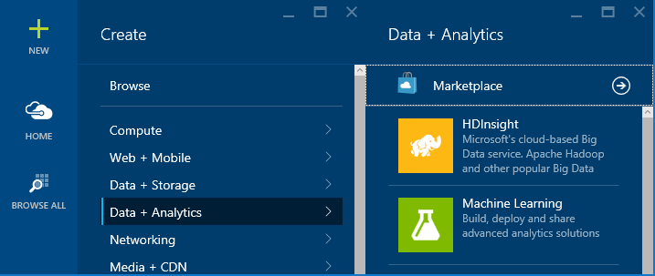
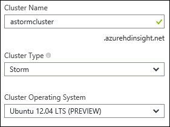
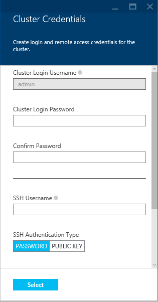
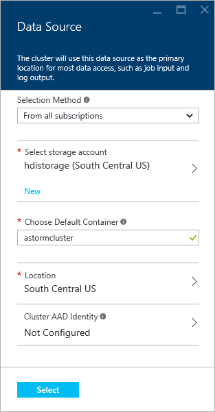
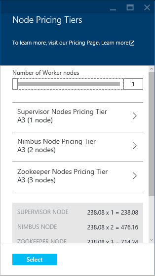
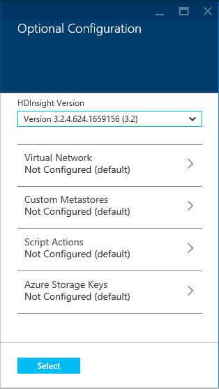
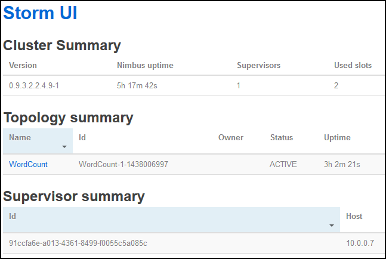

<properties
	pageTitle="Apache Storm tutorial: Get started with Storm | Microsoft Azure"
	description="Get started with big data analytics using Apache Storm and the Storm Starter samples on HDInsight. Learn how to use Storm to process data real-time."
	keywords="apache storm,apache storm tutorial,big data analytics,storm starter"
	services="hdinsight"
	documentationCenter=""
	authors="Blackmist"
	manager="paulettm"
	editor="cgronlun"/>

<tags
   ms.service="hdinsight"
   ms.devlang="java"
   ms.topic="get-started-article"
   ms.tgt_pltfrm="na"
   ms.workload="big-data"
   ms.date="08/18/2015"
   ms.author="larryfr"/>

# Apache Storm tutorial: Get started with the Storm Starter samples for big data analytics on HDInsight

Apache Storm is a scalable, fault-tolerant, distributed, real-time computation system for processing streams of data. With Storm on Azure HDInsight, you can create a cloud-based Storm cluster that performs big data analytics in real time.

> [AZURE.NOTE] The steps in this article create a Linux-based HDInsight cluster. For steps to create a Windows-based Storm on HDInsight cluster, see [Apache Storm tutorial: Get started with the Storm Starter sample using data analytics on HDInsight](hdinsight-apache-storm-tutorial-get-started.md)

## Before you begin

You must have the following to successfully complete this Apache Storm tutorial:

- **An Azure subscription**. See [Get Azure free trial](http://azure.microsoft.com/documentation/videos/get-azure-free-trial-for-testing-hadoop-in-hdinsight/).

- **Familiarity with SSH and SCP**. For more information on using SSH and SCP with HDInsight, see the following:

    - **Linux, Unix or OS X clients**: See [Use SSH with Linux-based Hadoop on HDInsight from Linux, OS X or Unix](hdinsight-hadoop-linux-use-ssh-unix.md)

	- **Windows clients**: See [Use SSH with Linux-based Hadoop on HDInsight from Windows](hdinsight-hadoop-linux-use-ssh-windows.md)

## Create a Storm cluster

Storm on HDInsight uses Azure Blob storage for storing log files and topologies submitted to the cluster. Use the following steps to create an Azure Storage account for use with your cluster:

1. Sign in to the [Azure Preview Portal][preview-portal].

2. Select **NEW**, select __Data Analytics__, and then select __HDInsight__

	

3. Enter a __Cluster Name__, then select __Storm__ for the __Cluster Type__. A green check will appear beside the __Cluster Name__ if it is available.

	

	Select __Ubuntu__ to create a Linux-based HDInsight cluster.
	
4. If you have more than one subscription, select the __Subscription__ entry to select the Azure subscription that will be used for the cluster.

5. For __Resource Group__, you can select the entry to see a list of existing resource groups and then select the one to create the cluster in. Or you can select __Create New__ and then enter the name of the new resource group. A green check will appear to indicate if the new group name is available.

	> [AZURE.NOTE] This entry will default to one of your existing resource groups, if any are available.

6. Select __Credentials__, then enter a __Cluster Login Password__ for the __Cluster Login Username__. You must also enter an __SSH Username__ and either a __PASSWORD__ or __PUBLIC KEY__, which will be used to authenticate the SSH user. Finally, use the __Select__ button to set the credentials.

	

	For more information on using SSH with HDInsight, see one of the following articles:

	* [Use SSH with Linux-based Hadoop on HDInsight from Linux, Unix, or OS X](hdinsight-hadoop-linux-use-ssh-unix.md)

	* [Use SSH with Linux-based Hadoop on HDInsight from Windows](hdinsight-hadoop-linux-use-ssh-windows) 

6. For __Data Source__, you can select the entry to choose an existing data source, or create a new one.

	
	
	Currently you can select an Azure Storage Account as the data source for an HDInsight cluster. Use the following to understand the entries on the __Data Source__ blade.
	
	- __Selection Method__: Set this to __From all subscriptions__ to enable browsing of storage accounts on your subscriptions. Set to __Access Key__ if you want to enter the __Storage Name__ and __Access Key__ of an existing storage account.
	
	- __Create New__: Use this to create a new storage account. Use the field that appears to enter the name of the storage account. A green check will appear if the name is available.
	
	- __Choose Default Container__: Use this to enter the name of the default container to use for the cluster. While you can enter any name here, we recommend using the same name as the cluster so that you can easily recognize that the container is used for this specific cluster.
	
	- __Location__: The geographic region that the storage account will be is in, or will be created in.
	
		> [AZURE.IMPORTANT] Selecting the location for the default data source will also set the location of the HDInsight cluster. The cluster and default data source must be located in the same region.
		
	- __Select__: Use this to save the data source configuration.
	
7. Select __Node Pricing Tiers__ to display information about the nodes that will be created for this cluster. By default, the number of worker nodes will be set to __4__. The estimated cost of the cluster will be shown at the bottom of this blade.

	
	
	Use the __Select__ button to save the __Node Pricing Tiers__ information.

8. Select __Optional Configuration__. This blade allows you to select the cluster version, as well as configure other optional settings such as joining a __Virtual Network__ or setting up a __Custom Metastore__ to hold data for Hive and Oozie.

	

9. Ensure that __Pin to Startboard__ is selected, and then select __Create__. This will create the cluster and add a tile for it to the Startboard of your Azure Portal. The icon will indicate that the cluster is provisioning, and will change to display the HDInsight icon once provisioning has completed.

	| While provisioning | Provisioning complete |
	| ------------------ | --------------------- |
	|  |  |

	> [AZURE.NOTE] It will take some time for the cluster to be created, usually around 15 minutes. Use the tile on the Startboard, or the __Notifications__ entry on the left of the page to check on the provisioning process.

##Run a Storm Starter sample on HDInsight

The [storm-starter](https://github.com/apache/storm/tree/master/examples/storm-starter) examples are included on the HDInsight cluster. In the following steps, you will run the WordCount example.

1. Connect to the HDInsight cluster using SSH:

		ssh USERNAME@CLUSTERNAME-ssh.azurehdinsight.net
		
	If you used a password to secure your SSH user account, you will be prompted to enter it. If you used a public key, you may have to use the `-i` parameter to specify the matching private key. For example, `ssh -i ~/.ssh/id_rsa USERNAME@CLUSTERNAME-ssh.azurehdinsight.net`.
		
	For more information on using SSH with Linux-based HDInsight, see the following articles:
	
	* [Use SSH with Linux-based Hadoop on HDInsight from Linux, Unix, or OS X](hdinsight-hadoop-linux-use-ssh-unix.md)

	* [Use SSH with Linux-based Hadoop on HDInsight from Windows](hdinsight-hadoop-linux-use-ssh-windows)

2. Use the following command to start an example topology:

        storm jar storm jar /usr/hdp/current/storm-client/contrib/storm-starter/storm-starter-topologies-0.9.3.2.2.4.9-1.jar storm.starter.WordCountTopology wordcount
		
	> [AZURE.NOTE] The `0.9.3.2.2.4.9-1` portion of the file name may change as HDinsight is updated with newer versions of Storm.

    This will start the example WordCount topology on the cluster, with a friendly name of 'wordcount'. It will randomly generate sentences and count the occurrance of each word in the sentences.

    > [AZURE.NOTE] When submitting topology to the cluster, you must first copy the jar file containing the cluster before using the `storm` command. This can be accomplished using the `scp` command from the client where the file exists. For example, `scp FILENAME.jar USERNAME@CLUSTERNAME-ssh.azurehdinsight.net:FILENAME.jar`
    >
    > The WordCount example, and other storm starter examples, are already included on your cluster at `/usr/hdp/current/storm-client/contrib/storm-starter/`.

##Monitor the topology

The Storm UI provides a web interface for working with running topologies, and is included on your HDInsight cluster.

> [AZURE.IMPORTANT] The Storm UI is not publicly available over the internet, and must be accessed using an SSH tunnel to the HDInsight cluster head node. For more information, see [Use SSH Tunneling to access ResourceManager, JobHistory, NameNode, Oozie, and other web UI's](hdinsight-linux-ambari-ssh-tunnel.md).

Use the following steps to view the Storm UI:

1. Once you have created an SSH tunnel to the cluster, open a web browser to https://CLUSTERNAME.azurehdinsight.net, where __CLUSTERNAME__ is the name of your cluster. This will open the Ambari web UI.

	> [AZURE.NOTE] If asked to provide a user name and password, enter the cluster administrator (admin) and password that you used when creating the cluster. You may be asked to authenticate twice, once by the browser and a second time by the Ambari web UI; use the same credentials for both.

2. From the list of services on the left of the page, select __Storm__. Then select __Storm UI__ from __Quick Links__.

    

    This will display the Storm UI:

    
	
	> [AZURE.NOTE] If you receive an error that the server cannot be found, you may not have established an SSH tunnel to the cluster. See [Use SSH Tunneling to access ResourceManager, JobHistory, NameNode, Oozie, and other web UI's](hdinsight-linux-ambari-ssh-tunnel.md) for more information.

4. Under **Topology summary**, select the **wordcount** entry in the **Name** column. This will display more information about the topology.

	

	This page provides the following information:

	* **Topology stats** - Basic information on the topology performance, organized into time windows.

		> [AZURE.NOTE] Selecting a specific time window changes the time window for information displayed in other sections of the page.

	* **Spouts** - Basic information about spouts, including the last error returned by each spout.

	* **Bolts** - Basic information about bolts.

	* **Topology configuration** - Detailed information about the topology configuration.

	This page also provides actions that can be taken on the topology:

	* **Activate** - Resumes processing of a deactivated topology.

	* **Deactivate** - Pauses a running topology.

	* **Rebalance** - Adjusts the parallelism of the topology. You should rebalance running topologies after you have changed the number of nodes in the cluster. This allows the topology to adjust parallelism to compensate for the increased/decreased number of nodes in the cluster. For more information, see [Understanding the parallelism of a Storm topology](http://storm.apache.org/documentation/Understanding-the-parallelism-of-a-Storm-topology.html).

	* **Kill** - Terminates a Storm topology after the specified timeout.

5. From this page, select an entry from the **Spouts** or **Bolts** section. This will display information about the selected component.

	

	This page displays the following information:

	* **Spout/Bolt stats** - Basic information on the component performance, organized into time windows.

		> [AZURE.NOTE] Selecting a specific time window changes the time window for information displayed in other sections of the page.

	* **Input stats** (bolt only) - Information on components that produce data consumed by the bolt.

	* **Output stats** - Information on data emitted by this bolt.

	* **Executors** - Information on instances of this component.

	* **Errors** - Errors produced by this component.

5. When viewing the details of a spout or bolt, select an entry from the **Port** column in the **Executors** section to view details for a specific instance of the component.

		2015-01-27 14:18:02 b.s.d.task [INFO] Emitting: split default ["with"]
		2015-01-27 14:18:02 b.s.d.task [INFO] Emitting: split default ["nature"]
		2015-01-27 14:18:02 b.s.d.executor [INFO] Processing received message source: split:21, stream: default, id: {}, [snow]
		2015-01-27 14:18:02 b.s.d.task [INFO] Emitting: count default [snow, 747293]
		2015-01-27 14:18:02 b.s.d.executor [INFO] Processing received message source: split:21, stream: default, id: {}, [white]
		2015-01-27 14:18:02 b.s.d.task [INFO] Emitting: count default [white, 747293]
		2015-01-27 14:18:02 b.s.d.executor [INFO] Processing received message source: split:21, stream: default, id: {}, [seven]
		2015-01-27 14:18:02 b.s.d.task [INFO] Emitting: count default [seven, 1493957]

	From this data you can see that the word **seven** has occurred 1493957 times. That is how many times it has been encountered since this topology was started.

##Stop the topology

Return to the **Topology summary** page for the word-count topology, and then select the **Kill** button from the **Topology actions** section. When prompted, enter 10 for the seconds to wait before stopping the topology. After the timeout period, the topology will no longer appear when you visit the **Storm UI** section of the dashboard.

##Summary

In this Apache Storm tutorial, you used the Storm Starter to learn how to create a Storm on HDInsight cluster and use the Storm Dashboard to deploy, monitor, and manage Storm topologies.

##Next steps

* The following document contains a list of other examples that can be used with Storm on HDInsight:

	* [Example topologies for Storm on HDInsight](hdinsight-storm-example-topology.md)

[apachestorm]: https://storm.incubator.apache.org
[stormdocs]: http://storm.incubator.apache.org/documentation/Documentation.html
[stormstarter]: https://github.com/apache/storm/tree/master/examples/storm-starter
[stormjavadocs]: https://storm.incubator.apache.org/apidocs/
[azureportal]: https://manage.windowsazure.com/
[hdinsight-provision]: hdinsight-provision-clusters.md
[preview-portal]: https://portal.azure.com/