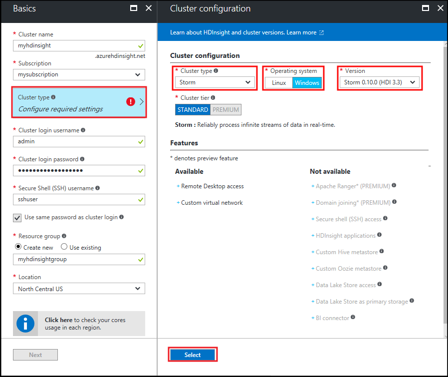
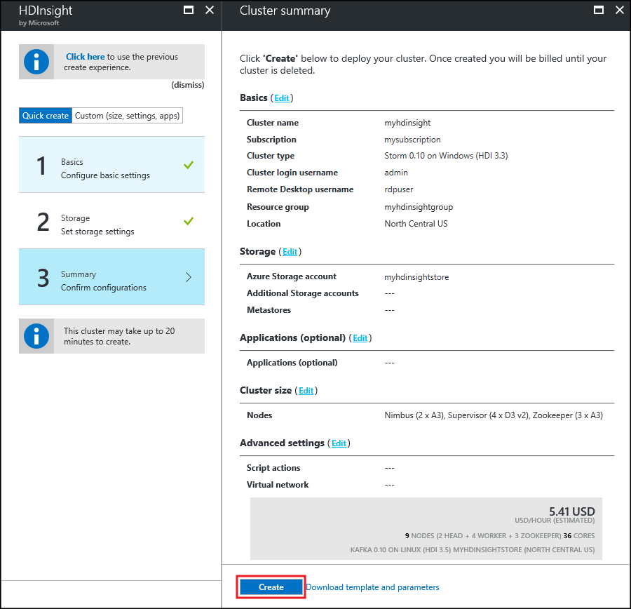
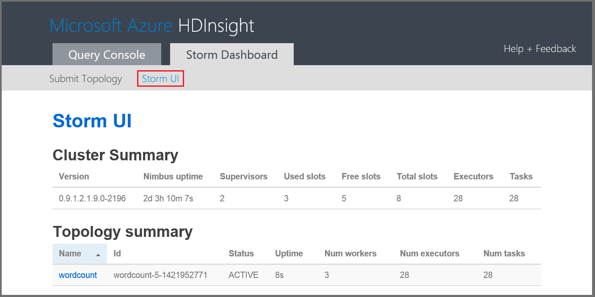

# Get started with the Storm Starter samples for big data analytics on HDInsight

Apache Storm is a scalable, fault-tolerant, distributed, real-time computation system for processing streams of data. With Storm on Microsoft Azure HDInsight, you can create a cloud-based Storm cluster that performs big data analytics in real time. 

> [!IMPORTANT]
> The steps in this article create a Windows-based HDInsight cluster. HDInsight is only available on Windows for versions lower than HDInsight 3.4. Linux is the only operating system used on HDInsight version 3.4 or greater. For more information, see [HDInsight Deprecation on Windows](hdinsight-component-versioning.md#hdi-version-32-and-33-nearing-deprecation-date).
>
> For steps to create a Linux-based Storm on HDInsight cluster, see [Apache Storm tutorial: Get started with the Storm Starter sample using data analytics on HDInsight](hdinsight-apache-storm-tutorial-get-started-linux.md)

## Prerequisites
[!INCLUDE [delete-cluster-warning](../../includes/hdinsight-delete-cluster-warning.md)]

You must have the following to successfully complete this Apache Storm tutorial:

* **An Azure subscription**. See [Get Azure free trial](https://azure.microsoft.com/documentation/videos/get-azure-free-trial-for-testing-hadoop-in-hdinsight/).

### Access control requirements
[!INCLUDE [access-control](../../includes/hdinsight-access-control-requirements.md)]

## Create a Storm cluster

Use the following steps to create a Storm on HDInsight cluster:

1. From the [Azure portal](https://portal.azure.com), select **+ NEW**, **Intelligence + Analytics**, and then select **HDInsight**.
   
    

2. From the **Basics** blade, enter the following information:

    * **Cluster Name**: The name of the HDInsight cluster.
    * **Subscription**: Select the subscription to use.
    * **Cluster login username** and **Cluster login password**: The login when accessing the cluster over HTTPS. You use these credentials to access services such as the Ambari Web UI or REST API.
    * **Secure Shell (SSH) username**: Leave these fields as default. They are not used for Windows-based HDInsight clusters.
    * **Resource Group**: The resource group to create the cluster in.
    * **Location**: The Azure region to create the cluster in.
   
    

3. Select **Cluster type**, and then set the following values on the **Cluster configuration** blade:
   
    * **Cluster Type**: Storm

    * **Operating system**: Windows

    * **Version**: Storm 0.10.0 (HDI 3.3)

        > [!NOTE]
        > HDInsight version 3.4 and higher are only available with the Linux operating system.

    * **Cluster Tier**: Standard
     
    Finally, use the **Select** button to save settings.
     
    

4. After selecting the cluster type, use the __Select__ button to set the cluster type. Next, use the __Next__ button to finish basic configuration.

5. From the **Storage** blade, select or create a Storage account. For the steps in this document, leave the other fields on this blade at the default values. Use the __Next__ button to save storage configuration.

    

6. From the **Summary** blade, review the configuration for the cluster. Use the __Edit__ links to change any settings that are incorrect. Finally, use the__Create__ button to create the cluster.
   
    
   
    > [!NOTE]
    > It can take up to 20 minutes to create the cluster.

## Run a Storm Starter sample on HDInsight
This Apache Storm tutorial introduces you to big data analytics using the Storm Starter samples on GitHub.

Each Storm on HDInsight cluster comes with the Storm Dashboard, which can be used to upload and run Storm topologies on the cluster. Each cluster also comes with sample topologies that can be run directly from the Storm Dashboard.

### Connect to the dashboard
The dashboard is located at **https://&lt;clustername>.azurehdinsight.net//**, where **clustername** is the name of the cluster. You can also find a link to the dashboard by selecting the cluster from the Startboard and selecting the **Dashboard** link at the top of the blade.

> [!NOTE]
> When connecting to the dashboard, you are prompted to enter a user name and password. This is the administrator name (**admin**) and password used when you created the cluster.
> 
> 

Once the Storm Dashboard has loaded, you will see the **Submit Topology** form.

The **Submit Topology** form can be used to upload and run .jar files that contain Storm topologies. It also includes several basic samples that are provided with the cluster.

### Run the word-count sample from the Storm Starter project in GitHub
The samples provided with the cluster include several variations of a word-counting topology. These samples include a **spout** that randomly emits sentences, and **bolts** that break each sentence into individual words, then count how many times each word has occurred. These samples are from the [Storm Starter samples](https://github.com/apache/storm/tree/master/examples/storm-starter), which are a part of Apache Storm.

Perform the following steps to run a Storm Starter sample:

1. Select **StormStarter - WordCount** from the **Jar File** drop-down. This populates the **Class Name** and **Additional Parameters** fields with the parameters for this sample.
   
    
   
   * **Class Name** - The class in the .jar file that submits the topology.
   * **Additional Parameters** - Any parameters required by the topology. In this example, the field is used to provide a friendly name for the submitted topology.
2. Click  **Submit**. After a moment, the **Result** field displays the command used to submit the job, as well as the results of the command. The **Error** field displays any errors that occur in submitting the topology.
   
    
   
   > [!NOTE]
   > The results do not indicate that the topology has finished - **a Storm topology, once started, runs until you stop it.** The word-count topology generates random sentences, and keeps a count of how many times it encounters each word, until you stop it.
   > 
   > 

### Monitor the topology
The Storm UI can be used to monitor the topology.

1. Select **Storm UI** from the top of the Storm Dashboard. This displays summary information for the cluster and all running topologies.
   
    
   
    From the page above, you can see the time the topology has been active, as well as the number of workers, executors, and tasks being used.
   
   > [!NOTE]
   > The **Name** column contains the friendly name supplied earlier via the **Additional Parameters** field.
   > 
   > 
2. Under **Topology summary**, select the **wordcount** entry in the **Name** column. This displays more information about the topology.
   
    
   
    This page provides the following information:
   
   * **Topology stats** - Basic information on the topology performance, organized into time windows.
     
     > [!NOTE]
     > Selecting a specific time window changes the time window for information displayed in other sections of the page.
     > 
     > 
   * **Spouts** - Basic information about spouts, including the last error returned by each spout.
   * **Bolts** - Basic information about bolts.
   * **Topology configuration** - Detailed information about the topology configuration.
     
     This page also provides actions that can be taken on the topology:
   * **Activate** - Resumes processing of a deactivated topology.
   * **Deactivate** - Pauses a running topology.
   * **Rebalance** - Adjusts the parallelism of the topology. You should rebalance running topologies after you have changed the number of nodes in the cluster. This allows the topology to adjust parallelism to compensate for the increased/decreased number of nodes in the cluster. For more information, see [Understanding the parallelism of a Storm topology](http://storm.apache.org/documentation/Understanding-the-parallelism-of-a-Storm-topology.html).
   * **Kill** - Terminates a Storm topology after the specified timeout.
3. From this page, select an entry from the **Spouts** or **Bolts** section. This displays information about the selected component.
   
    
   
    This page displays the following information:
   
   * **Spout/Bolt stats** - Basic information on the component performance, organized into time windows.
     
     > [!NOTE]
     > Selecting a specific time window changes the time window for information displayed in other sections of the page.
     > 
     > 
   * **Input stats** (bolt only) - Information on components that produce data consumed by the bolt.
   * **Output stats** - Information on data emitted by this bolt.
   * **Executors** - Information on instances of this component.
   * **Errors** - Errors produced by this component.
4. When viewing the details of a spout or bolt, select an entry from the **Port** column in the **Executors** section to view details for a specific instance of the component.
   
        2015-01-27 14:18:02 b.s.d.task [INFO] Emitting: split default ["with"]
        2015-01-27 14:18:02 b.s.d.task [INFO] Emitting: split default ["nature"]
        2015-01-27 14:18:02 b.s.d.executor [INFO] Processing received message source: split:21, stream: default, id: {}, [snow]
        2015-01-27 14:18:02 b.s.d.task [INFO] Emitting: count default [snow, 747293]
        2015-01-27 14:18:02 b.s.d.executor [INFO] Processing received message source: split:21, stream: default, id: {}, [white]
        2015-01-27 14:18:02 b.s.d.task [INFO] Emitting: count default [white, 747293]
        2015-01-27 14:18:02 b.s.d.executor [INFO] Processing received message source: split:21, stream: default, id: {}, [seven]
        2015-01-27 14:18:02 b.s.d.task [INFO] Emitting: count default [seven, 1493957]
   
    From this data, you can see that the word **seven** has occurred 1,493,957 times. That is how many times it has been encountered since this topology was started.

### Stop the topology
Return to the **Topology summary** page for the word-count topology, and then select **Kill** from the **Topology actions** section. When prompted, enter 10 for the seconds to wait before stopping the topology. After the timeout period, the topology no longer appears when you visit the **Storm UI** section of the dashboard.

## Delete the cluster
[!INCLUDE [delete-cluster-warning](../../includes/hdinsight-delete-cluster-warning.md)]

## Summary
In this Apache Storm tutorial, you used the Storm Starter to learn how to create a Storm on HDInsight cluster and use the Storm Dashboard to deploy, monitor, and manage Storm topologies.

## Next steps
* **HDInsight Tools for Visual Studio** - HDInsight Tools allows you to use Visual Studio to submit, monitor, and manage Storm topologies similar to the Storm Dashboard mentioned earlier. HDInsight Tools also provides the ability to create C# Storm topologies, and includes sample topologies that you can deploy and run on your cluster.
  
    For more information, see [Get Started using the HDInsight Tools for Visual Studio](hdinsight-hadoop-visual-studio-tools-get-started.md).
* **Sample files** - The HDInsight Storm cluster provides several examples in the **%STORM_HOME%\contrib** directory. Each example should contain the following:
  
  * The source code - for example, storm-starter-0.9.1.2.1.5.0-2057-sources.jar
  * The Java docs - for example, storm-starter-0.9.1.2.1.5.0-2057-javadoc.jar
  * The example - for example, storm-starter-0.9.1.2.1.5.0-2057-jar-with-dependencies.jar
    
    Use the 'jar' command to extract the source code or Java docs. For example, 'jar -xvf storm-starter-0.9.1.2.1.5.0.2057-javadoc.jar'.
    
    > [!NOTE]
    > Java docs consist of webpages. Once extracted, use a browser to view the **index.html** file.
    > 
    > 
    
    To access these samples, you must enable Remote Desktop for the Storm on HDInsight cluster, and then copy the files from **%STORM_HOME%\contrib**.
* The following document contains a list of other examples that can be used with Storm on HDInsight:
  
  * [Example topologies for Storm on HDInsight](hdinsight-storm-example-topology.md)

[apachestorm]: https://storm.incubator.apache.org
[stormdocs]: http://storm.incubator.apache.org/documentation/Documentation.html
[stormstarter]: https://github.com/apache/storm/tree/master/examples/storm-starter
[stormjavadocs]: https://storm.incubator.apache.org/apidocs/
[azureportal]: https://manage.windowsazure.com/
[hdinsight-provision]: hdinsight-provision-clusters.md
[preview-portal]: https://portal.azure.com/
