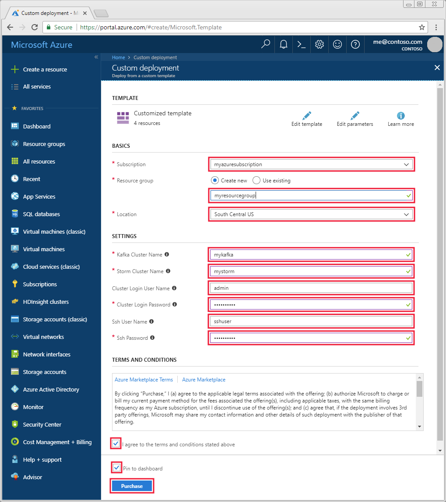

# topology definition
# name to be used when submitting
name: "kafka-writer"

# Components - constructors, property setters, and builder arguments.
# Currently, components must be declared in the order they are referenced
components:
  # Topic selector for KafkaBolt
  - id: "topicSelector"
    className: "org.apache.storm.kafka.bolt.selector.DefaultTopicSelector"
    constructorArgs:
      - "${kafka.topic}"

  # Mapper for KafkaBolt
  - id: "kafkaMapper"
    className: "org.apache.storm.kafka.bolt.mapper.FieldNameBasedTupleToKafkaMapper"
    constructorArgs:
      - "key"
      - "message"

  # Producer properties for KafkaBolt
  - id: "producerProperties"
    className: "java.util.Properties"
    configMethods:
      - name: "put"
        args:
          - "bootstrap.servers"
          - "${kafka.broker.hosts}"
      - name: "put"
        args:
          - "acks"
          - "1"
      - name: "put"
        args:
          - "key.serializer"
          - "org.apache.kafka.common.serialization.StringSerializer"
      - name: "put"
        args:
          - "value.serializer"
          - "org.apache.kafka.common.serialization.StringSerializer"
 

# Topology configuration
config:
  topology.workers: 2

# Spout definitions
spouts:
  - id: "sentence-spout"
    className: "com.microsoft.example.SentenceSpout"
    parallelism: 8

# Bolt definitions
bolts:
  - id: "kafka-bolt"
    className: "org.apache.storm.kafka.bolt.KafkaBolt"
    parallelism: 8
    configMethods:
    - name: "withProducerProperties"
      args: [ref: "producerProperties"]
    - name: "withTopicSelector"
      args: [ref: "topicSelector"]
    - name: "withTupleToKafkaMapper"
      args: [ref: "kafkaMapper"]

# Stream definitions

streams:
  - name: "spout --> kafka" # Streams data from the sentence spout to the Kafka bolt
    from: "sentence-spout"
    to: "kafka-bolt"
    grouping:
      type: SHUFFLE
```

### Kafka-reader

In the Kafka-reader topology, the spout component reads data from Kafka as string values. The data is then written the Storm log by the logging component and to the HDFS compatible file system for the Storm cluster by the HDFS bolt component.

```yaml
# kafka-reader
---

# topology definition
# name to be used when submitting
name: "kafka-reader"

# Components - constructors, property setters, and builder arguments.
# Currently, components must be declared in the order they are referenced
components:
  # Convert data from Kafka into string tuples in storm
  - id: "stringScheme"
    className: "org.apache.storm.kafka.StringScheme"
  - id: "stringMultiScheme"
    className: "org.apache.storm.spout.SchemeAsMultiScheme"
    constructorArgs:
      - ref: "stringScheme"

  - id: "zkHosts"
    className: "org.apache.storm.kafka.ZkHosts"
    constructorArgs:
      - "${kafka.zookeeper.hosts}"

  # Spout configuration
  - id: "spoutConfig"
    className: "org.apache.storm.kafka.SpoutConfig"
    constructorArgs:
      # brokerHosts
      - ref: "zkHosts"
      # topic
      - "${kafka.topic}"
      # zkRoot
      - ""
      # id
      - "readerid"
    properties:
      - name: "scheme"
        ref: "stringMultiScheme"

    # How often to sync files to HDFS; every 1000 tuples.
  - id: "syncPolicy"
    className: "org.apache.storm.hdfs.bolt.sync.CountSyncPolicy"
    constructorArgs:
      - 1

  # Rotate files when they hit 5 MB
  - id: "rotationPolicy"
    className: "org.apache.storm.hdfs.bolt.rotation.FileSizeRotationPolicy"
    constructorArgs:
      - 5
      - "KB"

  # File format; read the directory from filters at run time, and use a .txt extension when writing.
  - id: "fileNameFormat"
    className: "org.apache.storm.hdfs.bolt.format.DefaultFileNameFormat"
    configMethods:
      - name: "withPath"
        args: ["${hdfs.write.dir}"]
      - name: "withExtension"
        args: [".txt"]

  # Internal file format; fields delimited by `|`.
  - id: "recordFormat"
    className: "org.apache.storm.hdfs.bolt.format.DelimitedRecordFormat"
    configMethods:
      - name: "withFieldDelimiter"
        args: ["|"]

# Topology configuration
config:
  topology.workers: 2

# Spout definitions
spouts:
  - id: "kafka-spout"
    className: "org.apache.storm.kafka.KafkaSpout"
    constructorArgs:
      - ref: "spoutConfig"
    # Set to the number of partitions for the topic
    parallelism: 8

# Bolt definitions
bolts:
  - id: "logger-bolt"
    className: "com.microsoft.example.LoggerBolt"
    parallelism: 1
  
  - id: "hdfs-bolt"
    className: "org.apache.storm.hdfs.bolt.HdfsBolt"
    configMethods:
      - name: "withConfigKey"
        args: ["hdfs.config"]
      - name: "withFsUrl"
        args: ["${hdfs.url}"]
      - name: "withFileNameFormat"
        args: [ref: "fileNameFormat"]
      - name: "withRecordFormat"
        args: [ref: "recordFormat"]
      - name: "withRotationPolicy"
        args: [ref: "rotationPolicy"]
      - name: "withSyncPolicy"
        args: [ref: "syncPolicy"]
    parallelism: 1

# Stream definitions

streams:
  # Stream data to log
  - name: "kafka --> log" # name isn't used (placeholder for logging, UI, etc.)
    from: "kafka-spout"
    to: "logger-bolt"
    grouping:
      type: SHUFFLE
  
  # stream data to file
  - name: "kafka --> hdfs"
    from: "kafka-spout"
    to: "hdfs-bolt"
    grouping:
      type: SHUFFLE
```

### Property substitutions

The project contains a file named `dev.properties` that is used to pass parameters used by the topologies. It defines the following properties:

| dev.properties file | Description |
| --- | --- |
| `kafka.zookeeper.hosts` | The [Apache ZooKeeper](https://zookeeper.apache.org/) hosts for the Kafka cluster. |
| `kafka.broker.hosts` | The Kafka broker hosts (worker nodes). |
| `kafka.topic` | The Kafka topic that the topologies use. |
| `hdfs.write.dir` | The directory that the Kafka-reader topology writes to. |
| `hdfs.url` | The file system used by the Storm cluster. For Azure Storage accounts, use a value of `wasb:///`. For Azure Data Lake Storage Gen2, use a value of `abfs:///`. For Azure Data Lake Storage Gen1, use a value of `adl:///`. |

## Create the clusters

Apache Kafka on HDInsight does not provide access to the Kafka brokers over the public internet. Anything that uses Kafka must be in the same Azure virtual network. In this tutorial, both the Kafka and Storm clusters are located in the same Azure virtual network. 

The following diagram shows how communication flows between Storm and Kafka:


> [!NOTE]  
> Other services on the cluster such as SSH and [Apache Ambari](https://ambari.apache.org/) can be accessed over the internet. For more information on the public ports available with HDInsight, see [Ports and URIs used by HDInsight](hdinsight-hadoop-port-settings-for-services.md).

To create an Azure Virtual Network, and then create the Kafka and Storm clusters within it, use the following steps:

1. Use the following button to sign in to Azure and open the template in the Azure portal.
   
    <a href="https://portal.azure.com/#create/Microsoft.Template/uri/https%3A%2F%2Fraw.githubusercontent.com%2FAzure-Samples%2Fhdinsight-storm-java-kafka%2Fmaster%2Fcreate-kafka-storm-clusters-in-vnet.json" target="_blank"></a>
   
    The Azure Resource Manager template is located at **https://github.com/Azure-Samples/hdinsight-storm-java-kafka/blob/master/create-kafka-storm-clusters-in-vnet.json**. It creates the following resources:
    
    * Azure resource group
    * Azure Virtual Network
    * Azure Storage account
    * Kafka on HDInsight version 3.6 (three worker nodes)
    * Storm on HDInsight version 3.6 (three worker nodes)

   > [!WARNING]  
   > To guarantee availability of Kafka on HDInsight, your cluster must contain at least three worker nodes. This template creates a Kafka cluster that contains three worker nodes.

2. Use the following guidance to populate the entries on the **Custom deployment** section:

   1. Use the following information to populate the entries on the **Customized template** section:

      | Setting | Value |
      | --- | --- |
      | Subscription | Your Azure subscription |
      | Resource group | The resource group that contains the resources. |
      | Location | The Azure region that the resources are created in. |
      | Kafka Cluster Name | The name of the Kafka cluster. |
      | Storm Cluster Name | The name of the Storm cluster. |
      | Cluster Login User Name | The admin user name for the clusters. |
      | Cluster Login Password | The admin user password for the clusters. |
      | SSH User Name | The SSH user to create for the clusters. |
      | SSH Password | The password for the SSH user. |
   
      

3. Read the **Terms and Conditions**, and then select **I agree to the terms and conditions stated above**.

4. Finally, check **Pin to dashboard** and then select **Purchase**.

> [!NOTE]  
> It can take up to 20 minutes to create the clusters.

## Build the topology

1. On your development environment, download the project from [https://github.com/Azure-Samples/hdinsight-storm-java-kafka](https://github.com/Azure-Samples/hdinsight-storm-java-kafka), open a command-line, and change directories to the location that you downloaded the project.

2. From the **hdinsight-storm-java-kafka** directory, use the following command to compile the project and create a package for deployment:

   ```bash
   mvn clean package
   ```

    The package process creates a file named `KafkaTopology-1.0-SNAPSHOT.jar` in the `target` directory.

3. Use the following commands to copy the package to your Storm on HDInsight cluster. Replace `sshuser` with the SSH user name for the cluster. Replace `stormclustername` with the name of the __Storm__ cluster.

   ```bash
   scp ./target/KafkaTopology-1.0-SNAPSHOT.jar sshuser@stormclustername-ssh.azurehdinsight.net:KafkaTopology-1.0-SNAPSHOT.jar
   ```

    When prompted, enter the password you used when creating the clusters.

## Configure the topology

1. Use one of the following methods to discover the Kafka broker hosts for the **Kafka** on HDInsight cluster:

    ```powershell
    $creds = Get-Credential -UserName "admin" -Message "Enter the HDInsight login"
    $clusterName = Read-Host -Prompt "Enter the Kafka cluster name"
    $resp = Invoke-WebRequest -Uri "https://$clusterName.azurehdinsight.net/api/v1/clusters/$clusterName/services/KAFKA/components/KAFKA_BROKER" `
        -Credential $creds `
        -UseBasicParsing
    $respObj = ConvertFrom-Json $resp.Content
    $brokerHosts = $respObj.host_components.HostRoles.host_name[0..1]
    ($brokerHosts -join ":9092,") + ":9092"
    ```

    > [!IMPORTANT]  
    > The following Bash example assumes that `$CLUSTERNAME` contains the name of the __Kafka__ cluster name. It also assumes that [jq](https://stedolan.github.io/jq/) version 1.5 or greater is installed. When prompted, enter the password for the cluster login account.

    ```bash
    curl -su admin -G "https://$CLUSTERNAME.azurehdinsight.net/api/v1/clusters/$CLUSTERNAME/services/KAFKA/components/KAFKA_BROKER" | jq -r '["\(.host_components[].HostRoles.host_name):9092"] | join(",")' | cut -d',' -f1,2
    ```

    The value returned is similar to the following text:

        wn0-kafka.53qqkiavjsoeloiq3y1naf4hzc.ex.internal.cloudapp.net:9092,wn1-kafka.53qqkiavjsoeloiq3y1naf4hzc.ex.internal.cloudapp.net:9092

    > [!IMPORTANT]  
    > While there may be more than two broker hosts for your cluster, you do not need to provide a full list of all hosts to clients. One or two is enough.

2. Use one of the following methods to discover the Zookeeper hosts for the __Kafka__ on HDInsight cluster:

    ```powershell
    $creds = Get-Credential -UserName "admin" -Message "Enter the HDInsight login"
    $clusterName = Read-Host -Prompt "Enter the Kafka cluster name"
    $resp = Invoke-WebRequest -Uri "https://$clusterName.azurehdinsight.net/api/v1/clusters/$clusterName/services/ZOOKEEPER/components/ZOOKEEPER_SERVER" `
        -Credential $creds `
        -UseBasicParsing
    $respObj = ConvertFrom-Json $resp.Content
    $zookeeperHosts = $respObj.host_components.HostRoles.host_name[0..1]
    ($zookeeperHosts -join ":2181,") + ":2181"
    ```

    > [!IMPORTANT]  
    > The following Bash example assumes that `$CLUSTERNAME` contains the name of the __Kafka__ cluster. It also assumes that [jq](https://stedolan.github.io/jq/) is installed. When prompted, enter the password for the cluster login account.

    ```bash
    curl -su admin -G "https://$CLUSTERNAME.azurehdinsight.net/api/v1/clusters/$CLUSTERNAME/services/ZOOKEEPER/components/ZOOKEEPER_SERVER" | jq -r '["\(.host_components[].HostRoles.host_name):2181"] | join(",")' | cut -d',' -f1,2
    ```

    The value returned is similar to the following text:

        zk0-kafka.53qqkiavjsoeloiq3y1naf4hzc.ex.internal.cloudapp.net:2181,zk2-kafka.53qqkiavjsoeloiq3y1naf4hzc.ex.internal.cloudapp.net:2181

    > [!IMPORTANT]  
    > While there are more than two Zookeeper nodes, you do not need to provide a full list of all hosts to clients. One or two is enough.

    Save this value, as it is used later.

3. Edit the `dev.properties` file in the root of the project. Add the Broker and Zookeeper hosts information for the __Kafka__ cluster to the matching lines in this file. The following example is configured using the sample values from the previous steps:

        kafka.zookeeper.hosts: zk0-kafka.53qqkiavjsoeloiq3y1naf4hzc.ex.internal.cloudapp.net:2181,zk2-kafka.53qqkiavjsoeloiq3y1naf4hzc.ex.internal.cloudapp.net:2181
        kafka.broker.hosts: wn0-kafka.53qqkiavjsoeloiq3y1naf4hzc.ex.internal.cloudapp.net:9092,wn1-kafka.53qqkiavjsoeloiq3y1naf4hzc.ex.internal.cloudapp.net:9092
        kafka.topic: stormtopic

    > [!IMPORTANT]  
    > The `hdfs.url` entry is configured for a cluster that uses an Azure Storage account. To use this topology with a Storm cluster that uses Data Lake Storage, change this value from `wasb` to `adl`.

4. Save the `dev.properties` file and then use the following command to upload it to the **Storm** cluster:

     ```bash
    scp dev.properties USERNAME@BASENAME-ssh.azurehdinsight.net:dev.properties
    ```

    Replace **USERNAME** with the SSH user name for the cluster. Replace **BASENAME** with the base name you used when creating the cluster.

## Create the Kafka topic

Kafka stores data into a _topic_. You must create the topic before starting the Storm topologies. To create the topology, use the following steps:

1. Connect to the __Kafka__ cluster through SSH by using the following command. Replace `sshuser` with the SSH user name used when creating the cluster. Replace `kafkaclustername` with the name of the Kafka cluster:

    ```bash
    ssh sshuser@kafkaclustername-ssh.azurehdinsight.net
    ```

    When prompted, enter the password you used when creating the clusters.
   
    For information, see [Use SSH with HDInsight](hdinsight-hadoop-linux-use-ssh-unix.md).

2. To create the Kafka topic, use the following command. Replace `$KAFKAZKHOSTS` with the Zookeeper host information you used when configuring the topology:

    ```bash
    /usr/hdp/current/kafka-broker/bin/kafka-topics.sh --create --replication-factor 3 --partitions 8 --topic stormtopic --zookeeper $KAFKAZKHOSTS
    ```

    This command connects to Zookeeper for the Kafka cluster and creates a new topic named `stormtopic`. This topic is used by the Storm topologies.

## Start the writer

1. Use the following to connect to the **Storm** cluster using SSH. Replace `sshuser` with the SSH user name used when creating the cluster. Replace `stormclustername` with the name the Storm cluster:

    ```bash
    ssh sshuser@stormclustername-ssh.azurehdinsight.net
    ```

    When prompted, enter the password you used when creating the clusters.
   
    For information, see [Use SSH with HDInsight](hdinsight-hadoop-linux-use-ssh-unix.md).

2. From the SSH connection to the Storm cluster, use the following command to start the writer topology:

    ```bash
    storm jar KafkaTopology-1.0-SNAPSHOT.jar org.apache.storm.flux.Flux --remote -R /writer.yaml --filter dev.properties
    ```

    The parameters used with this command are:

    * `org.apache.storm.flux.Flux`: Use Flux to configure and run this topology.

    * `--remote`: Submit the topology to Nimbus. The topology is distributed across the worker nodes in the cluster.

    * `-R /writer.yaml`: Use the `writer.yaml` file to configure the topology. `-R` indicates that this resource is included in the jar file. It's in the root of the jar, so `/writer.yaml` is the path to it.

    * `--filter`: Populate entries in the `writer.yaml` topology using values in the `dev.properties` file. For example, the value of the `kafka.topic` entry in the file is used to replace the `${kafka.topic}` entry in the topology definition.

## Start the reader

1. From the SSH session to the Storm cluster, use the following command to start the reader topology:

   ```bash
   storm jar KafkaTopology-1.0-SNAPSHOT.jar org.apache.storm.flux.Flux --remote -R /reader.yaml --filter dev.properties
   ```

2. Wait a minute and then use the following command to view the files created by the reader topology:

    ```bash
    hdfs dfs -ls /stormdata
    ```

    The output is similar to the following text:

        Found 173 items
        -rw-r--r--   1 storm supergroup       5137 2018-04-09 19:00 /stormdata/hdfs-bolt-4-0-1523300453088.txt
        -rw-r--r--   1 storm supergroup       5128 2018-04-09 19:00 /stormdata/hdfs-bolt-4-1-1523300453624.txt
        -rw-r--r--   1 storm supergroup       5131 2018-04-09 19:00 /stormdata/hdfs-bolt-4-10-1523300455170.txt
        ...

3. To view the contents of the file, use the following command. Replace `filename.txt` with the name of a file:

    ```bash
    hdfs dfs -cat /stormdata/filename.txt
    ```

    The following text is an example of the file contents:

        four score and seven years ago
        snow white and the seven dwarfs
        i am at two with nature
        snow white and the seven dwarfs
        i am at two with nature
        four score and seven years ago
        an apple a day keeps the doctor away

## Stop the topologies

From an SSH session to the Storm cluster, use the following commands to stop the Storm topologies:

  ```bash
  storm kill kafka-writer
  storm kill kafka-reader
  ```

## Clean up resources

To clean up the resources created by this tutorial, you can delete the resource group. Deleting the resource group also deletes the associated HDInsight cluster, and any other resources associated with the resource group.

To remove the resource group using the Azure portal:

1. In the Azure portal, expand the menu on the left side to open the menu of services, and then choose __Resource Groups__ to display the list of your resource groups.
2. Locate the resource group to delete, and then right-click the __More__ button (...) on the right side of the listing.
3. Select __Delete resource group__, and then confirm.

## Next steps

In this tutorial, you learned how to use an [Apache Storm](https://storm.apache.org/) topology to write to and read from [Apache Kafka](https://kafka.apache.org/) on HDInsight. You also learned how to store data to the [Apache Hadoop HDFS](https://hadoop.apache.org/docs/r1.2.1/hdfs_design.html) compatible storage used by HDInsight.

> [!div class="nextstepaction"]
> [Use Apache Kafka Producer and Consumer API](kafka/apache-kafka-producer-consumer-api.md)