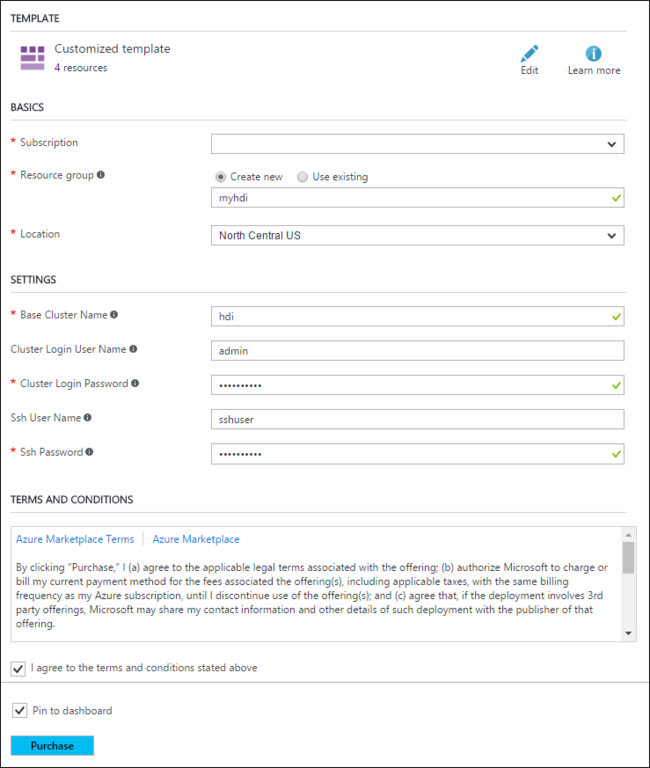
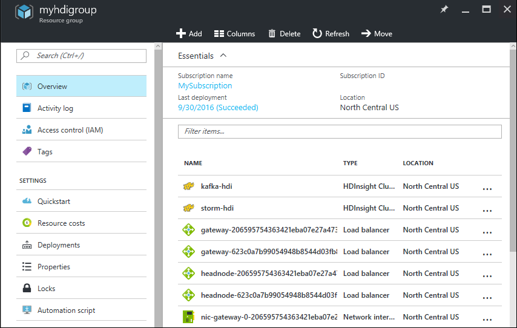
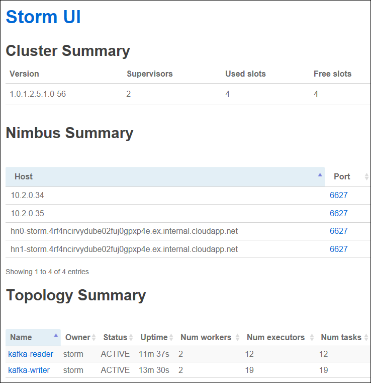
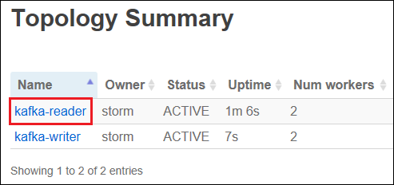
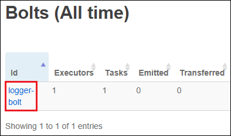
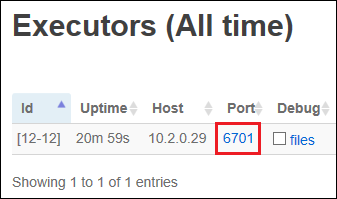

# Use Apache Kafka (preview) with Storm on HDInsight

Apache Kafka is a publish-subscribe messaging solution that is available with HDInsight. Apache Storm is a distributed system that can be used to analyze data in real-time. This document demonstrates how you can use Storm on HDInsight to read and process data from Kafka on HDInsight. The example in this document uses a Java-based Storm topology that relies on the Kafka spout and bolt components available with Apache Storm.

> [!NOTE]
> The steps in this document create an Azure resource group that contains both a Storm on HDInsight and a Kafka on HDInsight cluster. These clusters are both located within an Azure Virtual Network, which allows the Storm cluster to directly communicate with the Kafka cluster.
> 
> When you are done with the steps in this document, remember to delete the clusters to avoid excess charges.

## Prerequisites

* [Java JDK](http://www.oracle.com/technetwork/java/javase/downloads/index.html) 1.8 or higher. Or an equivalent such as [OpenJDK](http://openjdk.java.net/).
  
    > [!NOTE]
    > The steps in this document use an HDInsight 3.5 cluster, which uses Java 8.

* [Maven 3.x](http://maven.apache.org/) - A build management package for Java applications.

* A text editor or Java IDE

* An SSH client (you need the `ssh` and `scp` commands) - For information, see [Use SSH with HDInsight](hdinsight-hadoop-linux-use-ssh-unix.md).

## Create the clusters

Apache Kafka on HDInsight does not provide access to the Kafka brokers over the public internet. Anything that talks to Kafka must be in the same Azure virtual network as the nodes in the Kafka cluster. For this example, both the Kafka and Storm clusters are located in an Azure virtual network. The following diagram shows how communication flows between the clusters:


> [!NOTE]
> Though Kafka itself is limited to communication within the virtual network, other services on the cluster such as SSH and Ambari can be accessed over the internet. For more information on the public ports available with HDInsight, see [Ports and URIs used by HDInsight](hdinsight-hadoop-port-settings-for-services.md).


While you can create an Azure virtual network, Kafka, and Storm clusters manually, it's easier to use an Azure Resource Manager template. Use the following steps to deploy an Azure virtual network, Kafka, and Storm clusters to your Azure subscription.

1. Use the following button to sign in to Azure and open the template in the Azure portal.
   
    <a href="https://portal.azure.com/#create/Microsoft.Template/uri/https%3A%2F%2Fhditutorialdata.blob.core.windows.net%2Farmtemplates%2Fcreate-linux-based-kafka-storm-cluster-in-vnet.1.json" target="_blank"></a>
   
    The Azure Resource Manager template is located at **https://hditutorialdata.blob.core.windows.net/armtemplates/create-linux-based-kafka-storm-cluster-in-vnet.json**.

    > [!WARNING]
    > To guarantee availability of Kafka on HDInsight, your cluster must contain at least three worker nodes. This template creates a Kafka cluster that contains three worker nodes.

2. Use the following guidance to populate the entries on the **Custom deployment** blade:
   
    

    * **Resource group**: Create a group or select an existing one. This group contains the HDInsight cluster.
   
    * **Location**: Select a location geographically close to you. This location must match the location in the __SETTINGS__ section.

    * **Base Cluster Name**: This value is used as the base name for the Storm and Kafka clusters. For example, entering **hdi** creates a Storm cluster named **storm-hdi** and a Kafka cluster named **kafka-hdi**.
   
    * **Cluster Login User Name**: The admin user name for the Storm and Kafka clusters.
   
    * **Cluster Login Password**: The admin user password for the Storm and Kafka clusters.
    
    * **SSH User Name**: The SSH user to create for the Storm and Kafka clusters.
    
    * **SSH Password**: The password for the SSH user for the Storm and Kafka clusters.
    
    * **Location**: The region that the clusters are created in.

3. Read the **Terms and Conditions**, and then select **I agree to the terms and conditions stated above**.

4. Finally, check **Pin to dashboard** and then select **Purchase**. It takes about 20 minutes to create the clusters.

Once the resources have been created, you are redirected to a blade for the resource group that contains the clusters and web dashboard.



> [!IMPORTANT]
> Notice that the names of the HDInsight clusters are **storm-BASENAME** and **kafka-BASENAME**, where BASENAME is the name you provided to the template. You use these names in later steps when connecting to the clusters.

## Get the code

The code for the example described in this document is available at [https://github.com/Azure-Samples/hdinsight-storm-java-kafka](https://github.com/Azure-Samples/hdinsight-storm-java-kafka).

## Understanding the code

This project contains two topologies:

* **KafkaWriter**: Defined by the **writer.yaml** file, this topology writes random sentences to Kafka using the KafkaBolt provided with Apache Storm.

    This topology uses a custom **SentenceSpout** component to generate random sentences.

* **KafkaReader**: Defined by the **reader.yaml** file, this topology reads data from Kafka using the KafkaSpout provided with Apache Storm, then logs the data to stdout.

    This topology uses a custom **PrinterBolt** component to log data read from Kafka.

### Flux

The topologies are defined using [Flux](https://storm.apache.org/releases/1.0.1/flux.html). Flux was introduced in Storm 0.10.x and allows you to separate the topology configuration from the code. For Topologies that use the Flux framework, the topology is defined in a YAML file. The YAML file can be included as part of the topology, or can be specified when you submit the topology to the Storm server. Flux also supports variable substitution at run-time, which is used in this example.

Both topologies expect the following environment variables:

* **KAFKATOPIC**: The name of the Kafka topic that the topologies read/write to.

* **KAFKABROKERS**: The hosts that the Kafka brokers run on. The broker information is used by the KafkaBolt when writing to Kafka.

* **KAFKAZKHOSTS**: The hosts that Zookeeper runs on.

The steps in this document demonstrate how to set these environment variables.

## Create a Kafka topic

1. Connect to the Kafka cluster using SSH. Replace `USERNAME` with the SSH user name used when creating the cluster. Replace `BASENAME` with the base name used when creating the cluster.

    ```bash
    ssh USERNAME@kafka-BASENAME-ssh.azurehdinsight.net
    ```

    When prompted, enter the password you used when creating the clusters.

    For information, see [Use SSH with HDInsight](hdinsight-hadoop-linux-use-ssh-unix.md).

2. From the SSH connection to the Kafka cluster, use the following commands to set variables for the HTTP login and cluster name. These values are used by other steps in this section.

  ```bash
  ADMIN='admin' #replace with the name of the admin account for the cluster
  PASSWORD='password' #replace with the password for the admin account
  ```

3. Use the following commands to install the `jq` utility, retrieve the cluster name, and set the `KAFKAZKHOSTS` variable:

  ```bash
  sudo apt -y install jq
  CLUSTERNAME=`curl -u $ADMIN:$PASSWORD -G "http://headnodehost:8080/api/v1/clusters" | jq -r '.items[].Clusters.cluster_name'`
  KAFKAZKHOSTS=`curl -u $ADMIN:$PASSWORD -G "http://headnodehost:8080/api/v1/clusters/$CLUSTERNAME/services/ZOOKEEPER/components/ZOOKEEPER_SERVER" | jq -r '["\(.host_components[].HostRoles.host_name):2181"] | join(",")'`
  ```

    Use the following command to retrieve the cluster name:

  ```bash
  echo $CLUSTERNAME
  ```

    The output of this command is similar to the following example:

  ```bash
  kafka-myhdi
  ```

    Use the following command to verify that `KAFKAZKHOSTS` is set correctly:

  ```bash
  echo $KAFKAZKHOSTS
  ```

    The output of this command is similar to the following example:

  ```bash
  zk0-kafka.eahjefxxp1netdbyklgqj5y1ud.ex.internal.cloudapp.net:2181,zk2-kafka.eahjefxxp1netdbyklgqj5y1ud.ex.internal.cloudapp.net:2181,zk3-kafka.eahjefxxp1netdbyklgqj5y1ud.ex.internal.cloudapp.net:2181
  ```

    Save the Kafka cluster name and the Zookeeper host information, as these values are used when starting the topology on the Storm cluster.

    > [!NOTE]
    > The previous commands use __http://headnodehost:8080/__, which connects to Ambari directly. If you need to retrieve this information from outside the cluster, over the internet, you must use __https://kafka-BASENAME.azurehdinsight.net/__ instead.

4. Use the following command to create a topic in Kafka:

  ```bash
  /usr/hdp/current/kafka-broker/bin/kafka-topics.sh --create --replication-factor 2 --partitions 8 --topic stormtest --zookeeper $KAFKAZKHOSTS
  ```

    This command connects to Zookeeper using the host information stored in `$KAFKAZKHOSTS`, and then creates a Kafka topic named **stormtest**. You can verify that the topic was created by using the following command to list topics:

  ```bash
  /usr/hdp/current/kafka-broker/bin/kafka-topics.sh --list --zookeeper $KAFKAZKHOSTS
  ```

    The output of this command lists Kafka topics, which should contain the new **stormtest** topic.

Leave the SSH connection to the Kafka cluster active, as you can use it to verify that the Storm topology is writing messages to the topic.

## Download and compile the project

1. On your development environment, download the project from [https://github.com/Azure-Samples/hdinsight-storm-java-kafka](https://github.com/Azure-Samples/hdinsight-storm-java-kafka), open a command-line, and change directories to the location that you downloaded the project.

2. From the **hdinsight-storm-java-kafka** directory, use the following command to compile the project and create a package for deployment:

  ```bash
  mvn clean package
  ```

    The package process creates a file named `KafkaTopology-1.0-SNAPSHOT.jar` in the `target` directory.

3. Use the following commands to copy the package to your Storm on HDInsight cluster. Replace **USERNAME** with the SSH user name for the cluster. Replace **BASENAME** with the base name you used when creating the cluster.

  ```bash
  scp ./target/KafkaTopology-1.0-SNAPSHOT.jar USERNAME@storm-BASENAME-ssh.azurehdinsight.net:KafkaTopology-1.0-SNAPSHOT.jar
  ```

    When prompted, enter the password you used when creating the clusters.

4. Use the following command to copy the `set-env-variables.sh` file from the `scripts` directory of the project to the Storm cluster:

  ```bash
  scp ./scripts/set-env-variables.sh USERNAME@storm-BASENAME-ssh.azurehdinsight.net:set-env-variables.sh
  ```

    This script is used to set the environment variables that the Storm topologies use to communicate with the Kafka cluster.

## Start the writer

1. Use the following to connect to the Storm cluster using SSH. Replace **USERNAME** with the SSH user name used when creating the cluster. Replace **BASENAME** with the base name used when creating the cluster.

  ```bash
  ssh USERNAME@storm-BASENAME-ssh.azurehdinsight.net
  ```

    When prompted, enter the password you used when creating the clusters.
   
    For information, see [Use SSH with HDInsight](hdinsight-hadoop-linux-use-ssh-unix.md).

2. From the SSH connection to the Storm cluster, use the following commands to run the `set-env-variables.sh` script:

  ```bash
  chmod +x set-env-variables.sh
  . ./set-env-variables.sh KAFKACLUSTERNAME PASSWORD
  ```

    Replace __KAFKACLUSTERNAME__ with the name of the Kafka cluster. Replace __PASSWORD__ with the admin login password for the Kafka cluster.

    The script connects to the Kafka cluster and retrieves a list of the Kafka broker and Zookeeper hosts. The information is then stored in environment variables that are used by the Storm topologies.

    The output of the script is similar to the following example:

        Checking for jq: install ok installed
        Exporting variables:
        $KAFKATOPIC=stormtest
        $KAFKABROKERS=wn0-storm.4rf4ncirvydube02fuj0gpxp4e.ex.internal.cloudapp.net:9092,wn1-storm.4rf4ncirvydube02fuj0gpxp4e.ex.internal.cloudapp.net:9092
        $KAFKAZKHOSTS=zk1-storm.4rf4ncirvydube02fuj0gpxp4e.ex.internal.cloudapp.net:2181,zk3-storm.4rf4ncirvydube02fuj0gpxp4e.ex.internal.cloudapp.net:2181,zk5-storm.4rf4ncirvydube02fuj0gpxp4e.ex.internal.cloudapp.net:2181

3. From the SSH connection to the Storm cluster, use the following command to start the writer topology:

        storm jar KafkaTopology-1.0-SNAPSHOT.jar org.apache.storm.flux.Flux --remote -R /writer.yaml -e

    The parameters used with this command are:

    * `org.apache.storm.flux.Flux`: Use Flux to configure and run this topology.

    * `--remote`: Submit the topology to Nimbus. The topology is distributed across the worker nodes in the cluster.

    * `-R /writer.yaml`: Use the `writer.yaml` file to configure the topology. `-R` indicates that this resource is included in the jar file. It's in the root of the jar, so `/writer.yaml` is the path to it.

    * `-e`: Use environment variable substitution. Flux picks up the $KAFKABROKERS and $KAFKATOPIC values you set previously, and uses them in the reader.yaml file in place of the `${ENV-KAFKABROKER}` and `${ENV-KAFKATOPIC}` entries.

5. Once the topology has started, switch to the SSH connection to the Kafka cluster and use the following command to view messages written to the **stormtest** topic:

  ```bash
  /usr/hdp/current/kafka-broker/bin/kafka-console-consumer.sh --zookeeper $KAFKAZKHOSTS --from-beginning --topic stormtest
  ```

    This command uses a script shipped with Kafka to monitor the topic. After a moment, it should start returning random sentences that have been written to the topic. The output is similar to the following example:

        i am at two with nature             
        an apple a day keeps the doctor away
        snow white and the seven dwarfs     
        the cow jumped over the moon        
        an apple a day keeps the doctor away
        an apple a day keeps the doctor away
        the cow jumped over the moon        
        an apple a day keeps the doctor away
        an apple a day keeps the doctor away
        four score and seven years ago      
        snow white and the seven dwarfs     
        snow white and the seven dwarfs     
        i am at two with nature             
        an apple a day keeps the doctor away

    Use Ctrl+c to stop the script.

## Start the reader

1. From the SSH session to the Storm cluster, use the following command to start the reader topology:

  ```bash
  storm jar KafkaTopology-1.0-SNAPSHOT.jar org.apache.storm.flux.Flux --remote -R /reader.yaml -e
  ```

2. Once the topology starts, open the Storm UI. This web UI is located at https://storm-BASENAME.azurehdinsight.net/stormui. Replace __BASENAME__ with the base name used when the cluster was created. 

    When prompted, use the admin login name (default, `admin`) and password used when the cluster was created. You will see a web page similar to the following image:

    

3. From the Storm UI, select the __kafka-reader__ link in the __Topology Summary__ section to display information about the __kafka-reader__ topology.

    

4. Select the __logger-bolt__ link in the __Bolts (All time)__ section to display information about the instances of the logger-bolt component.

    

5. In the __Executors__ section, select a link in the __Port__ column to display logging information about this instance of the component.

    

    The log contains a log of the data read from the Kafka topic. The information in the log is similar to the following text:

        2016-11-04 17:47:14.907 c.m.e.LoggerBolt [INFO] Received data: four score and seven years ago
        2016-11-04 17:47:14.907 STDIO [INFO] the cow jumped over the moon
        2016-11-04 17:47:14.908 c.m.e.LoggerBolt [INFO] Received data: the cow jumped over the moon
        2016-11-04 17:47:14.911 STDIO [INFO] snow white and the seven dwarfs
        2016-11-04 17:47:14.911 c.m.e.LoggerBolt [INFO] Received data: snow white and the seven dwarfs
        2016-11-04 17:47:14.932 STDIO [INFO] snow white and the seven dwarfs
        2016-11-04 17:47:14.932 c.m.e.LoggerBolt [INFO] Received data: snow white and the seven dwarfs
        2016-11-04 17:47:14.969 STDIO [INFO] an apple a day keeps the doctor away
        2016-11-04 17:47:14.970 c.m.e.LoggerBolt [INFO] Received data: an apple a day keeps the doctor away

## Stop the topologies

From an SSH session to the Storm cluster, use the following commands to stop the Storm topologies:

  ```bash
  storm kill kafka-writer
  storm kill kafka-reader
  ```

## Delete the cluster

[!INCLUDE [delete-cluster-warning](../../includes/hdinsight-delete-cluster-warning.md)]

Since the steps in this document create both clusters in the same Azure resource group, you can delete the resource group in the Azure portal. This removes all resources created by following this document, the Azure Virtual Network, and storage account used by the clusters.

## Next steps

For more example topologies that can be used with Storm on HDInsight, see [Example Storm topologies and components](hdinsight-storm-example-topology.md).

For information on deploying and monitoring topologies on Linux-based HDInsight, see [Deploy and manage Apache Storm topologies on Linux-based HDInsight](hdinsight-storm-deploy-monitor-topology-linux.md)