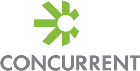
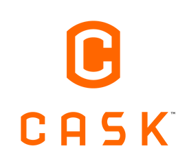

<properties
	pageTitle="HDInsight Application Partners | Microsoft Azure" 
	description="Customers can now easily discovery and deploy big data application alongside their HDInsight clusters right from within the provisioning portal."
	services="hdinsight" 
	documentationCenter="na" 
	authors="pablissima" 
	manager="paulettm="" 
	tags=""/>
<tags
	ms.service="hdinsight"
	ms.devlang="na"
	ms.topic="article"
	ms.tgt_pltfrm="na"
	ms.workload="na"
	ms.date="02/16/2016"
	ms.author="paulettm"/>
# HDInsight Application Partners

  
Dataguise delivers data privacy protection and risk assessment analytics
that allow organizations to safely leverage and share enterprise data.
Our solutions simplify governance as they proactively locate sensitive
data, automatically protect it with appropriate remediation polices, and
provide actionable compliance intelligence to decision makers, in
real-time. In Hadoop deployments, our solutions inspect incoming data
and protect it before it is stored. These capabilities simplify risk
management, improve operational efficiencies, and reduce regulatory
compliance costs.

  
As a native Hadoop solution, DataTorrent enables you to leverage your
existing Hadoop environment for real-time stream analytics on a massive
scale. Processing billions of events per second with sub-second latency,
DataTorrent supports today’s most demanding, mission-critical, big-data
applications.

Common use cases include processing machine-data for the Internet of
Things, fraud detection in financial services, log analysis and IT
operations, Geo-location services, Social apps, and more.

  
Datameer’s end-to-end Big Data Discovery solution enables business users
to discover insights in any data via wizard-based data integration,
iterative point-and-click analytics, and drag-and-drop visualizations,
regardless of the data type, size, or source.

Optimized for big data analytical workloads characterized by multiple
data sources of varying types, Datameer uses Hortonworks Data Platform
for both storage and compute, and is a fully extensible solution that
can integrate with existing DW or BI solutions. Datameer users can also
gain instant insights via the Datameer App Market, which offers dozens
of pre-built analytic applications across a variety of use cases and
data types.

  
Concurrent, Inc.’s vision is to become the \#1 software platform choice
for Big Data applications. Concurrent builds application infrastructure
products that are designed to help enterprises create, deploy, run and
manage data processing applications at scale on Apache Hadoop.
Concurrent is the mind behind Cascading™, the most widely used and
deployed technology for Big Data applications with more than 75,000+
user downloads a month. Used by thousands of data driven businesses
including Twitter, eBay, The Climate Corp and Etsy, Cascading is the
de-facto standard in open source application infrastructure technology.

http://www.concurrentinc.com/

  
Today’s businesses collect more and more data and need to explicitly
define the scope of access that users should have to that data. Any
disconnect between what data users have access to and what they actually
need to do their job can leave companies exposed to unnecessary risks.
As enterprises build big data environments, they must redefine how they
control their data. BlueTalon delivers the best data control technology
for today’s data challenge and keeps you in control of your data.

http://bluetalon.com/

  
For organizations eager to make Hadoop part of their data ecosystem, but
struggling to find people with MapReduce skills, RedPoint has a
solution. RedPoint’s top-rated data quality and data integration
capabilities are now available for Hadoop.

With RedPoint, the same data analysts and database administrators
already working with traditional databases can now work just as easily
with data stored in Hadoop. No new skills are required. No MapReduce, no
Hive, no Pig – thanks to RedPoint’s graphical user interface and pure
YARN architecture (certified on Hadoop 2.0 by Hortonworks).

With RedPoint:  
-  All data quality and data integration functions can be performed in the
Hadoop cluster – ELT, cleanse, match, de-dupe, merge/purge,
householding, parsing, partitioning, appending, address standardization,
key creation and maintenance, automation, monitoring, notification  
-  No MapReduce is involved, and no MapReduce skills are needed  
-  Data quality and integration processes execute as efficiently – and in
many cases more efficiently – with RedPoint as with MapReduce-based
solutions  
-  Data doesn’t need to be moved out of Hadoop for processing, analytics,
reporting or other action  
-  No software needs to be installed in the cluster itself, and RedPoint
respects YARN’s task prioritization rather than competing for computing
resources in the cluster  
-  Users can manage data in both traditional and Hadoop repositories with a single product, even bringing together data from separate environments
or migrate data from one to the other

For more information, see the resources on the right-hand side of this
page.

RedPoint has been rated \#1 in user surveys for speed, match quality and
ease of use, and generally for customer and third party data
management. [Contact
us](http://www.redpoint.net/Products/BigData.aspx) to see how RedPoint
can make managing data quality and data integration in your Hadoop
environment easier, faster, lower-cost and more effective.

  
Cask is an open source big data software company focused on developers.
The Cask Data Application Platform (CDAP), our flagship product, makes
it easy for any Java developer to build, debug, test, scale, and manage
Apache Hadoop applications and then deploy them instantly to a
Hortonworks Data Platform Hadoop cluster. CDAP includes both a
development framework and runtime services that cover the entire
lifecycle of building and running big data applications – both
on-premise and in the cloud. Based in Palo Alto, California, the company
is backed by leading investors including Battery Ventures, Andreessen
Horowitz, and Ignition Partners. The team has built and operated some of
the largest Big Data apps in the world.

  
Kyvos is committed to unlock the power of Big Data Analytics with its
unique “OLAP on Hadoop” technology. This allows you to build cubes
in-place on Hadoop with linear scalability, eliminating the limitations
of traditional OLAP solutions, and enabling interactive
multi-dimensional analytics on your Big Data. Users can visualize,
explore and analyze their data interactively on Hadoop with no
programming required.
