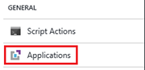
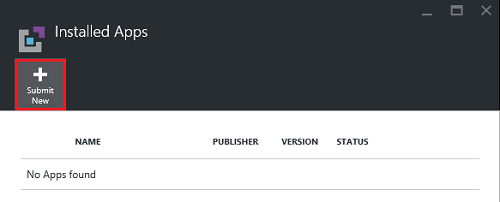
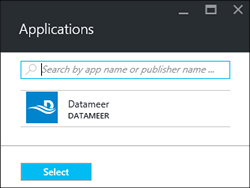
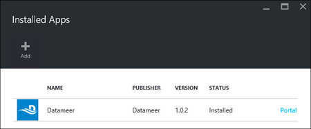

<properties
   	pageTitle="Install Hadoop applications on HDInsight | Microsoft Azure"
   	description="Learn how to install HDInsight applications on HDInsight applications."
   	services="hdinsight"
   	documentationCenter=""
   	authors="mumian"
   	manager="paulettm"
   	editor="cgronlun"
	tags="azure-portal"/>

<tags
   	ms.service="hdinsight"
   	ms.devlang="na"
   	ms.topic="hero-article"
   	ms.tgt_pltfrm="na"
   	ms.workload="big-data"
   	ms.date="06/29/2016"
   	ms.author="jgao"/>

# Install HDInsight applications

An HDInsight application is an application that users can install on a Linux-based HDInsight cluster. These applications can be developed by Microsoft, independent software vendors (ISV) or by yourself. In this article, you will learn how to install a published application. For installing your own application, see [Install custom HDInsight applications](hdinsight-apps-install-custom-applications.md). 

Currently there is one published application:

- **Datameer**: [Datameer](http://www.datameer.com/documentation/display/DAS50/Home?ls=Partners&lsd=Microsoft&c=Partners&cd=Microsoft) offers analysts an interactive way to discover, analyze, and visualize the results on Big Data. Pull in additional data sources easily to discover new relationships and get the answers you need quickly.

>[AZURE.NOTE] Datameer is currently only supported in Azure HDInsight version 3.2 clusters.

The instructions provided in this article use Azure Portal. You can also export the Azure Resouce Manager template from the portal or obtain a copy of the Resouce Manager template from vendors, and use Azure PowerShell and Azure CLI to deploy the template.  See [Create Linux-based Hadoop clusters in HDInsight using Resource Manager templates](hdinsight-hadoop-create-linux-clusters-arm-templates.md).

## Prerequisites

If you want to install HDInsight applications on an existing HDInsight cluster, you must have an HDInsight cluster. To create one, see [Create clusters](hdinsight-hadoop-linux-tutorial-get-started.md#create-cluster). You can also install HDInsight applications when you create an HDInsight cluster.

## Install applications to existing clusters

The following procedure shows you how to install HDInsight applications to an existing HDInsight cluster.

**To install an HDInsight application**

1. Sign in to the [Azure portal](https://portal.azure.com).
2. Click **HDInsight Clusters** in the left menu.  If you don't see it, click **Browse**, and then click **HDInsight Clusters**.
3. Click an HDInsight cluster.  If you don't have one, you must create one first.  see [Create clusters](hdinsight-hadoop-linux-tutorial-get-started.md#create-cluster).
4. From the **Settings** blade, click **Applications** under the **General** category. The **Installed Apps** blade lists all the installed applications. 

    

5. Click **Add** from the blade menu. 

    

	You shall see a list of existing HDInsight applications.

	

6. Click one of the applications, accept the legal terms, and then click **Select**.

You can see the installation status from the portal notifications (click the bell icon on the top of the portal). After the application is installed, the application will appear on the Installed Apps blade.

## Install applications during cluster creation

You have the option to install HDInsight applications when you create a cluster. During the process, HDInsight applications are installed after the cluster is created and is in the running state. The following procedure shows you how to install HDInsight applications when you create a cluster.

**To install an HDInsight application**

1. Sign in to the [Azure  portal](https://portal.azure.com).
2. Click **NEW**, Click **Data + Analytics**, and then click **HDInsight**.
3. Enter **Cluster Name**: This name must be globally unique.
4. Click **Subscription** to select the Azure subscription that will be used for the cluster.
5. Click **Select cluster Type**, and then select:

    - **Cluster Type**: If you don't know what to choose, select **Hadoop**. It is the most popular cluster type.
    - **Operating System**: Select **Linux**.
    - **Version**: Use the default version if you don't know what to choose. For more information, see [HDInsight cluster versions](hdinsight-component-versioning.md).
    - **Cluster Tier**: Azure HDInsight provides the big data cloud offerings in two categories: Standard tier and Premium tier. For more information, see [Cluster tiers](hdinsight-hadoop-provision-linux-clusters.md#cluster-tiers).
6. Click **Applications**, click one of the published applications, and then click **Select**.
6. Click **Credentials** and then enter a password for the admin user. You must also enter an **SSH Username** and either a **PASSWORD** or **PUBLIC KEY**, which will be used to authenticate the SSH user. Using a public key is the recommended approach. Click **Select** at the bottom to save the credentials configuration.
8. Click **Data Source**, select one of the existing storage account or create a new storage account to be used as the default storage account for the cluster.
9. Click **Resource Group** to select an existing resource group, or click **New** to create a new resource group

10. On the **New HDInsight Cluster** blade, ensure that **Pin to Startboard** is selected, and then click **Create**. 

## List installed HDInsight apps and properties

The portal shows a list of the installed HDInsight applications for a cluster, and the properties of each installed application.

**To list HDInsight application and display properties**

1. Sign in to the [Azure portal](https://portal.azure.com).
2. Click **HDInsight Clusters** in the left menu.  If you don't see it, click **Browse**, and then click **HDInsight Clusters**.
3. Click an HDInsight cluster.
4. From the **Settings** blade, click **Applications** under the **General** category. The Installed Apps blade lists all the installed applications. 

	

5. Click one of the installed applications to show the property. The property blade lists:

    - App name: application name.
    - Status: application status. 
    - Webpage: The URL of the web application that you have deployed to the edge node if there is any. The credential is the same as the HTTP user credentials that you have configured for the cluster.
    - HTTP endpoint: The credential is the same as the HTTP user credentials that you have configured for the cluster. 
    - SSH endpoint: You can use [SSH](hdinsight-hadoop-linux-use-ssh-unix.md) to connect to the edge node. The SSH credentials are the same as the SSH user credentials that you have configured for the cluster.

6. To delete a application, right-click the application, and then click **Delete** from the context menu.

## Connect to the edge node

You can connect to the edge node using HTTP and SSH. The endpoint information can be found from the [portal](#list-installed-hdinsight-apps-and-properties). For more information on using SSH, see [Use SSH with Linux-based Hadoop on HDInsight from Linux, Unix, or OS X](hdinsight-hadoop-linux-use-ssh-unix.md). 

The HTTP endpoint credentials are the HTTP user credentials that you have configured for the HDInsight cluster; the SSH endpoint credentials are the SSH credentials that you have configured for the HDInsight cluster.

## Troubleshoot

See [Troubleshoot the installation](hdinsight-apps-install-custom-applications.md#troubleshoot-the-installation).

## Next steps

- [Install custom HDInsight applications](hdinsight-apps-install-custom-applications.md): learn how to deploy an un-published HDInsight application to HDInsight.
- [Publish HDInsight applications](hdinsight-apps-publish-applications.md): Learn how to publish your custom HDInsight applications to Azure Marketplace.
- [MSDN: Install an HDInsight application](https://msdn.microsoft.com/library/mt706515.aspx): Learn how to define HDInsight applications.
- [Customize Linux-based HDInsight clusters using Script Action](hdinsight-hadoop-customize-cluster-linux.md): learn how to use Script Action to install additional applications.
- [Create Linux-based Hadoop clusters in HDInsight using Resource Manager templates](hdinsight-hadoop-create-linux-clusters-arm-templates.md): learn how to call Resource Manager templates to create HDInsight clusters.