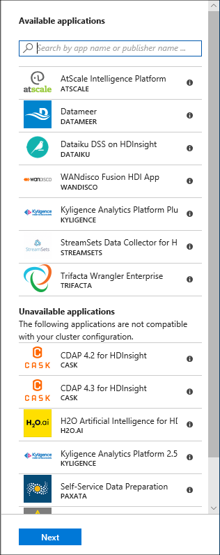
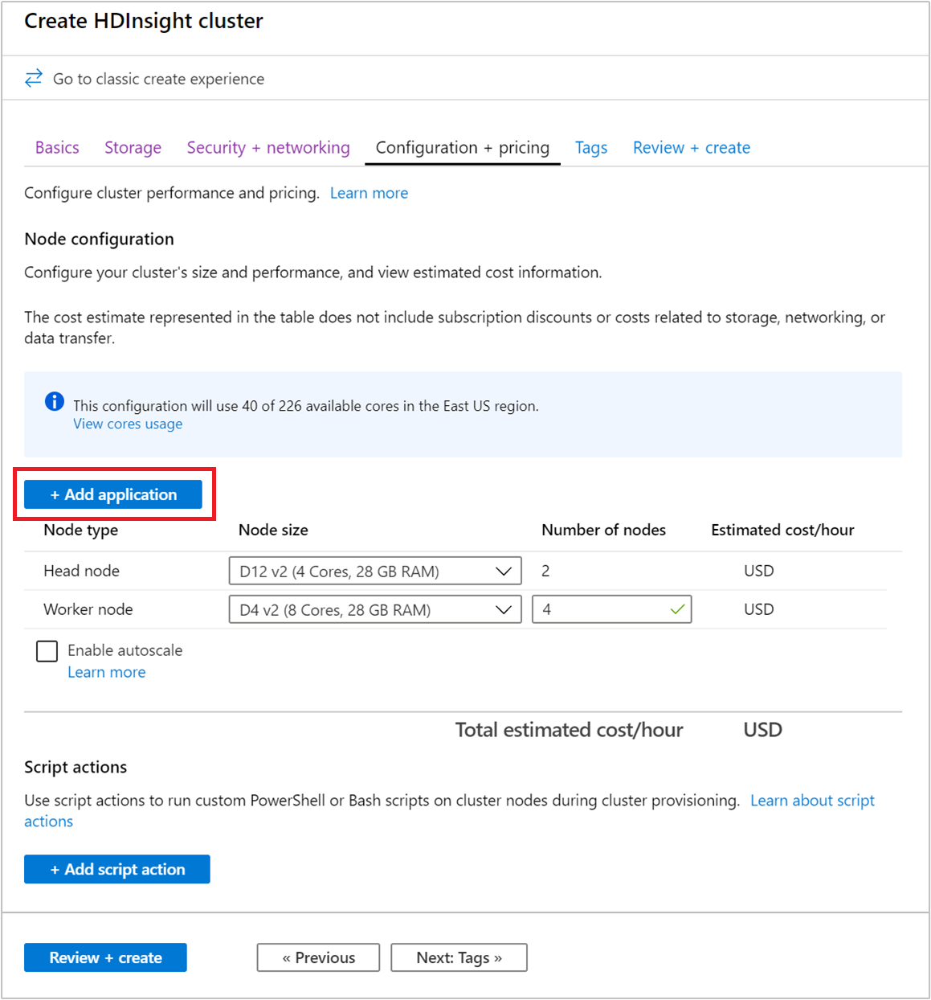

# Install third-party Apache Hadoop applications on Azure HDInsight

Learn how to install a third-party [Apache Hadoop](https://hadoop.apache.org/) application on Azure HDInsight. For instructions on installing your own application, see [Install custom HDInsight applications](hdinsight-apps-install-custom-applications.md).

An HDInsight application is an application that users can install on an HDInsight cluster. These applications can be developed by Microsoft, independent software vendors (ISV) or by yourself.  

The following list shows the published applications:

|Application |Cluster type(s) | Description |
|---|---|---|
|[AtScale Intelligence Platform](https://azuremarketplace.microsoft.com/marketplace/apps/atscaleinc.atscale) |Hadoop |AtScale turns your HDInsight cluster into a scale-out OLAP server, allowing you to query billions of rows of data interactively using the BI tools you already know, own, and love – from Microsoft Excel, Power BI, Tableau Software to QlikView. |
|[CDAP for HDInsight](https://azuremarketplace.microsoft.com/marketplace/apps/cask.cdap-for-hdinsight) |HBase |CDAP is the first unified integration platform for big data that accelerates time to value for Hadoop and enables IT to provide self-service data. Open source and extensible, CDAP removes barriers to innovation. Requirements: 4 Region nodes, min D3 v2. |
|[Datameer](https://azuremarketplace.microsoft.com/marketplace/apps/datameer.datameer) |Hadoop |Datameer's self-service scalable platform for preparing, exploring, and governing your data for analytics accelerates turning complex multisource data into valuable business-ready information, delivering faster, smarter insights at an enterprise-scale. |
|[Dataiku DSS on HDInsight](https://azuremarketplace.microsoft.com/marketplace/apps/dataiku.dss-on-hdi) |Hadoop, Spark |Dataiku DSS in an enterprise data science platform that lets data scientists and data analysts collaborate to design and run new data products and services more efficiently, turning raw data into impactful predictions. |
|[WANdisco Fusion HDI App](https://azuremarketplace.microsoft.com/marketplace/apps/wandisco.fusion-hdi-app) |Hadoop, Spark,HBase,Storm,Kafka |Keeping data consistent in a distributed environment is a massive data operations challenge. WANdisco Fusion, an enterprise-class software platform, solves this problem by enabling unstructured data consistency across any environment. |
|[H2O SparklingWater for HDInsight](https://azuremarketplace.microsoft.com/marketplace/apps/h2o-ai.h2o-sparklingwater) |Spark |H2O Sparkling Water supports the following distributed algorithms: GLM, Naïve Bayes, Distributed Random Forest, Gradient Boosting Machine, Deep Neural Networks, Deep learning, K-means, PCA, Generalized Low Rank Models, Anomaly Detection, Autoencoders. |
|[Striim for Real-Time Data Integration to HDInsight](https://azuremarketplace.microsoft.com/marketplace/apps/striim.striimbyol) |Hadoop,HBase,Storm,Spark,Kafka |Striim (pronounced "stream") is an end-to-end streaming data integration + intelligence platform, enabling continuous ingestion, processing, and analytics of disparate data streams. |
|[Jumbune Enterprise-Accelerating BigData Analytics](https://azuremarketplace.microsoft.com/marketplace/apps/impetus-infotech-india-pvt-ltd.impetus_jumbune) |Hadoop, Spark |At a high level, Jumbune assists enterprises by, 1. Accelerating Tez, MapReduce & Spark engine based Hive, Java, Scala workload performance. 2. Proactive Hadoop Cluster Monitoring, 3. Establishing Data Quality management on distributed file system. |
|[Kyligence Enterprise](https://azuremarketplace.microsoft.com/marketplace/apps/kyligence.kyligence) |Hadoop,HBase,Spark |Powered by Apache Kylin, Kyligence Enterprise Enables BI on Big Data. As an enterprise OLAP engine on Hadoop, Kyligence Enterprise empowers business analyst to architect BI on Hadoop with industry-standard data warehouse and BI methodology. |
|[Starburst Presto for Azure HDInsight](https://azuremarketplace.microsoft.com/marketplace/apps/starburst.starburst-presto) |Hadoop |Presto is a fast and scalable distributed SQL query engine. Architected for the separation of storage and compute, Presto is perfect for querying data in Azure Data Lake Storage, Azure Blob Storage, SQL and NoSQL databases, and other data sources. |
|[StreamSets Data Collector for HDInsight Cloud](https://azuremarketplace.microsoft.com/marketplace/apps/streamsets.streamsets-data-collector-hdinsight) |Hadoop,HBase,Spark,Kafka |StreamSets Data Collector is a lightweight, powerful engine that streams data in real time. Use Data Collector to route and process data in your data streams. It comes with a 30 day trial license. |
|[Trifacta Wrangler Enterprise](https://azuremarketplace.microsoft.com/marketplace/apps/trifacta.tr01) |Hadoop, Spark,HBase |Trifacta Wrangler Enterprise for HDInsight supports enterprise-wide data wrangling for any scale of data. The cost of running Trifacta on Azure is a combination of Trifacta subscription costs plus the Azure infrastructure costs for the virtual machines. |
|[Unifi Data Platform](https://unifisoftware.com/platform/) |Hadoop,HBase,Storm,Spark |The Unifi Data Platform is a seamlessly integrated suite of self-service data tools designed to empower the business user to tackle data challenges that drive incremental revenue, reduce costs or operational complexity. |
|[Unraveldata APM](https://azuremarketplace.microsoft.com/marketplace/apps/unravel-data.unravel-app) |Spark |Unravel Data app for HDInsight Spark cluster. |
|[Waterline AI-Driven Data Catalog](https://azuremarketplace.microsoft.com/marketplace/apps/waterline_data.waterline_data) |Spark |Waterline catalogs, organizes, and governs data using AI to auto-tag data with business terms. Waterline's business literate catalog is a critical, success component for self-service analytics, compliance and governance, and IT management initiatives. |

The instructions provided in this article use Azure portal. You can also export the Azure Resource Manager template from the portal or obtain a copy of the Resource Manager template from vendors, and use Azure PowerShell and Azure Classic CLI to deploy the template.  See [Create Apache Hadoop clusters on HDInsight using Resource Manager templates](hdinsight-hadoop-create-linux-clusters-arm-templates.md).

## Prerequisites
If you want to install HDInsight applications on an existing HDInsight cluster, you must have an HDInsight cluster. To create one, see [Create clusters](hadoop/apache-hadoop-linux-tutorial-get-started.md). You can also install HDInsight applications when you create an HDInsight cluster.

## Install applications to existing clusters
The following procedure shows you how to install HDInsight applications to an existing HDInsight cluster.

**Install an HDInsight application**

1. Sign in to the [Azure portal](https://portal.azure.com).
2. From the left menu, navigate to **All services** > **Analytics** > **HDInsight clusters**.
3. Select an HDInsight cluster from the list.  If you don't have one, you must create one first.  see [Create clusters](hadoop/apache-hadoop-linux-tutorial-get-started.md).
4. Under the **Settings** category, select **Applications**. You can see a list of installed applications in the main window. 
   
    
5. Select **+Add** from the menu. You can see a list of available applications.  If **+Add** is greyed out, that means there are no applications for this version of the HDInsight cluster.
   
    
6. Select one of the available applications, and then follow the instructions to accept the legal terms.

You can see the installation status from the portal notifications (select the bell icon on the top of the portal). After the application is installed, the application  appears on the Installed Apps list.

## Install applications during cluster creation

You have the option to install HDInsight applications when you create a cluster. During the process, HDInsight applications are installed after the cluster is created and is in the running state. To install applications during cluster creation using the Azure portal, from the **Configuration + pricing** tab, select **+ Add application**.

## List installed HDInsight apps and properties
The portal shows a list of the installed HDInsight applications for a cluster, and the properties of each installed application.

**List HDInsight application and display properties**

1. Sign in to the [Azure portal](https://portal.azure.com).
2. From the left menu, navigate to **All services** > **Analytics** > **HDInsight clusters**.
3. Select an HDInsight cluster from the list.
4. Under the **Settings** category, select **Applications**. You can see a list of installed applications in the main window. 
   
    
5. Select one of the installed applications to show the property. The property lists:

    |Property | Description |
    |---|---|
    |App name |Application name. |
    |Status |Application status. |
    |Webpage |The URL of the web application that you have deployed to the edge node. The credential is the same as the HTTP user credentials that you have configured for the cluster. |
    |SSH endpoint |You can use SSH to connect to the edge node. The SSH credentials are the same as the SSH user credentials that you have configured for the cluster. For information, see [Use SSH with HDInsight](hdinsight-hadoop-linux-use-ssh-unix.md). |
    |Description | Application description. |

6. To delete an application, right-click the application, and then click **Delete** from the context menu.

## Connect to the edge node
You can connect to the edge node using HTTP and SSH. The endpoint information can be found from the [portal](#list-installed-hdinsight-apps-and-properties). For information, see [Use SSH with HDInsight](hdinsight-hadoop-linux-use-ssh-unix.md).

The HTTP endpoint credentials are the HTTP user credentials that you have configured for the HDInsight cluster; the SSH endpoint credentials are the SSH credentials that you have configured for the HDInsight cluster.

## Troubleshoot
See [Troubleshoot the installation](hdinsight-apps-install-custom-applications.md#troubleshoot-the-installation).

## Next steps
* [Install custom HDInsight applications](hdinsight-apps-install-custom-applications.md): learn how to deploy an unpublished HDInsight application to HDInsight.
* [Publish HDInsight applications](hdinsight-apps-publish-applications.md): Learn how to publish your custom HDInsight applications to Azure Marketplace.
* [MSDN: Install an HDInsight application](https://msdn.microsoft.com/library/mt706515.aspx): Learn how to define HDInsight applications.
* [Customize Linux-based HDInsight clusters using Script Action](hdinsight-hadoop-customize-cluster-linux.md): learn how to use Script Action to install additional applications.
* [Create Linux-based Apache Hadoop clusters in HDInsight using Resource Manager templates](hdinsight-hadoop-create-linux-clusters-arm-templates.md): learn how to call Resource Manager templates to create HDInsight clusters.
* [Use empty edge nodes in HDInsight](hdinsight-apps-use-edge-node.md): learn how to use an empty edge node for accessing HDInsight cluster, testing HDInsight applications, and hosting HDInsight applications.

