# Install published application - Cask Data Application Platform (CDAP)

This article describes how to install and run the [CDAP](http://cask.co/products/cdap/) published Hadoop application on Azure HDInsight. For an overview of the HDInsight application platform, and a list of available Independent Software Vendor (ISV) published applications, see [Install third-party Hadoop applications](hdinsight-apps-install-applications.md). For instructions on installing your own application, see [Install custom HDInsight applications](hdinsight-apps-install-custom-applications.md).

## About CDAP

Developing applications in Hadoop can be challenging.  There is a large and growing number of Hadoop technology extensions, which can take some time to integrate. Monitoring data flow and collecting metrics can require building a separate solution.

### How does CDAP help?

The Cask Data Application Platform (CDAP) is an integration platform for Big Data. CDAP enables you to focus on building applications rather than on the underlying infrastructure.

CDAP uses high-level concepts and abstractions that are familiar to developers. These abstractions hide the complexities of internal systems and encourage reusability of solutions.

A CDAP extension called [Cask Hydrator](http://cask.co/products/hydrator/) provides a user interface to develop and manage data pipelines. A data pipeline is composed of various *plugins that perform tasks like data acquisition, transformation, analysis, and post-run operations.

Each CDAP plugin has a well-defined interface so that evaluating different technologies is just a matter of replacing one plugin with another one, without having to touch the rest of the application.

CDAP *pipelines* provide a high-level pictorial flow of the data in your application. This visualization shows the end-to-end flow of the data from ingestion, through the data transformations and analyses, and finally into an external data store.

The following example of a data pipeline ingests twitter data in real time, then filters out some tweets based on pre-defined criteria. The data pipeline transforms raw tweet data and projects that data into a more readable format, then groups the tweets according to a set of values and writes the results into an HBase store.

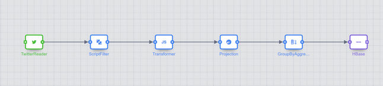

This end-to-end pipeline is built using the **Cask Hydrator UI**, using its plugin interface and drag-and-drop functionality to form connections between each stage. You can isolate and modify the functionality of each plugin independently. Using CDAP, similar pipelines can be built and validated in hours. In the typical Hadoop world, constructing such solutions might take several days.

CDAP also provides an extension called [Cask Tracker](http://cask.co/products/tracker/) to visually trace data as it flows through the application. Cask Tracker adds *data governance* to the system so that data assets are formally managed throughout the application. You can track each data point's lineage, collect relevant metrics, and audit the data trail throughout the process.

Here is an illustration of how data is flowing in the above pipeline:

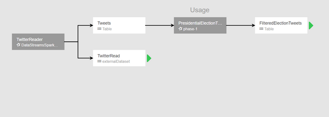

## Prerequisites

To install this app on a new HDInsight cluster, or an existing cluster, you must have the following configuration:

* Cluster tier: Standard
* Cluster type: HBase
* Cluster version: 3.4, 3.5

## Install the CDAP published application

For step-by-step instructions on installing this and other available ISV applications, read [Install third-party Hadoop applications](hdinsight-apps-install-applications.md).

## Launch CDAP

1. After installation, launch CDAP from your cluster in Azure portal by going to the **Settings** pane, then selecting **Applications** under the **General** category. The Installed Apps pane lists all the installed applications.

    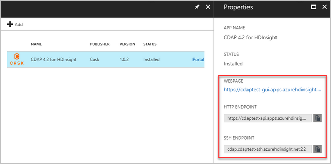

2. When you select CDAP, you see a link to the web page and HTTP Endpoint, and also the SSH endpoint path. Select the WEBPAGE link.

3. When prompted, enter your cluster administrator credentials.

    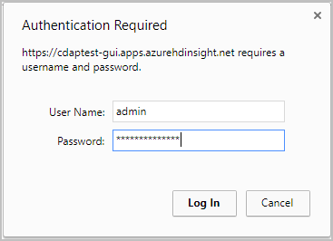

4. After signing in, you see the Cask CDAP GUI home page.

    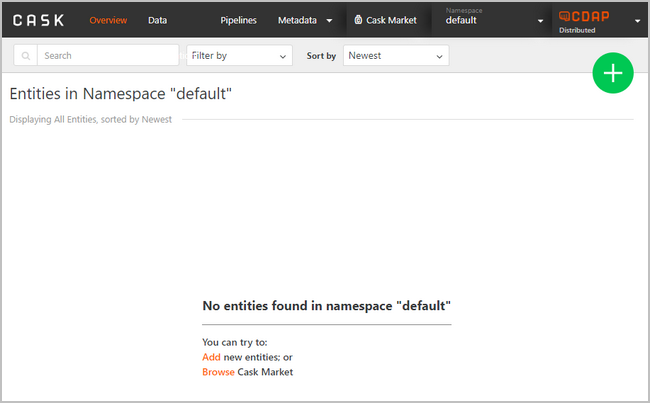

5. To explore the CDAP interface, click the **Cask Market** menu link on top of the page.

    

6. Select **Access Log Sample** from the list.

    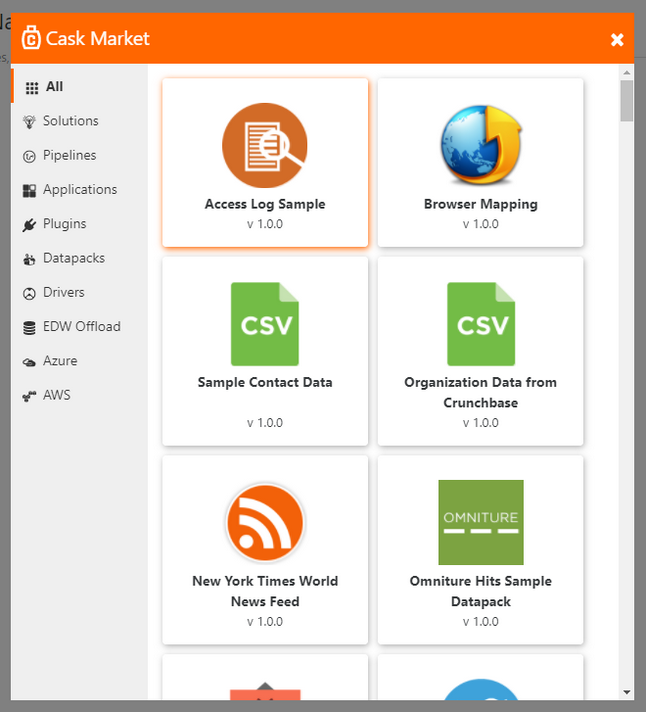

7. Click **Load** to confirm.

    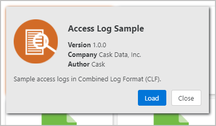

8. A view of the included sample data is displayed. select **Next**.

    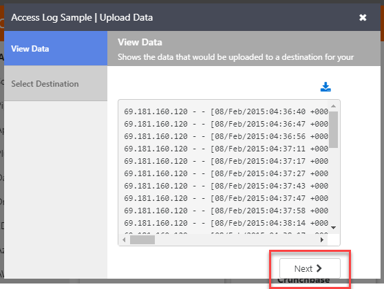

9. Select **Stream** as the Destination Type, enter a Destination Name, then select **Finish**.

    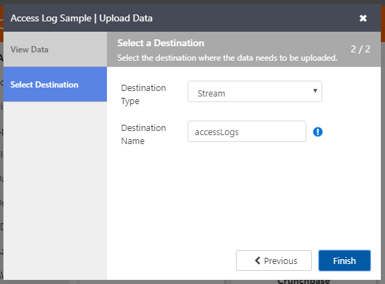

10. After the datapack has been successfully loaded, select **View Stream Details**.

    

11. To enable metadata for the namespace, select **Enable** in the Usage tab on the Access Log details page.

    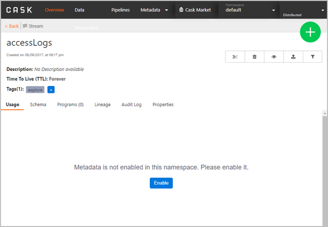

12. After metadata is enabled, you see a graph displaying audit message information.

    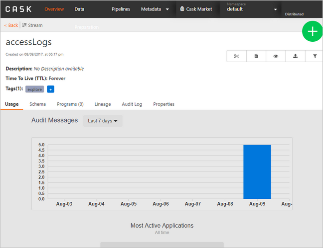

13. To explore the log data, select the **Explore** icon on top of the page.

    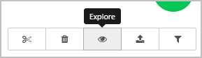

14. You see a sample SQL query. Feel free to modify it as desired, then select **Execute**.

    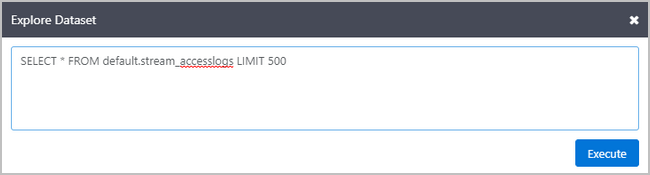

15. After the query has finished, select the **View** icon under the Actions column.

    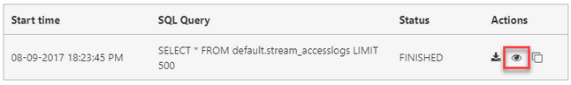

16. You see the query results.

    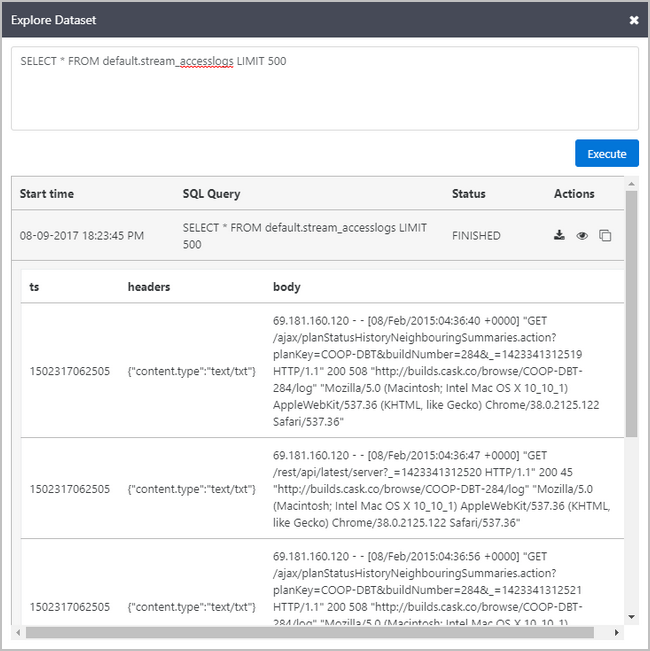

## Next steps

* [Cask documentation](http://cask.co/resources/documentation/).
* [Install custom HDInsight applications](hdinsight-apps-install-custom-applications.md): Learn how to deploy an unpublished HDInsight application to HDInsight.
* [Publish HDInsight applications](hdinsight-apps-publish-applications.md): Learn how to publish your custom HDInsight applications to Azure Marketplace.
* [MSDN: Install an HDInsight application](https://msdn.microsoft.com/library/mt706515.aspx): Learn how to define HDInsight applications.
* [Customize Linux-based HDInsight clusters using Script Action](hdinsight-hadoop-customize-cluster-linux.md): Learn how to use Script Action to install additional applications.
* [Use empty edge nodes in HDInsight](hdinsight-apps-use-edge-node.md): Learn how to use an empty edge node for accessing HDInsight clusters, and for testing and hosting HDInsight applications.
